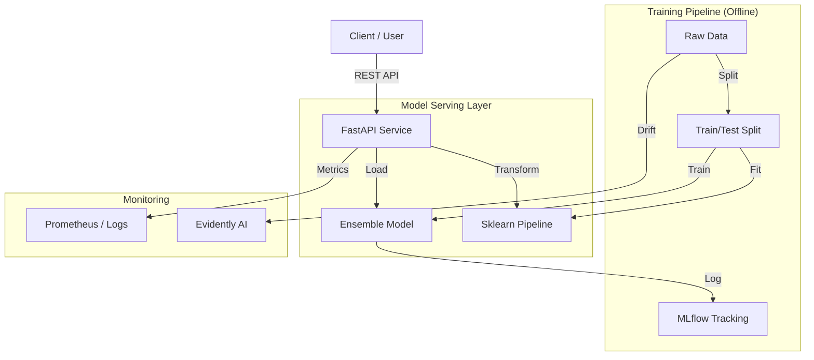

# Architecture Documentation

**Project:** BankChurn-Predictor  
**Version:** 1.0.0  
**Status:** Production-Ready

---

## 1. System Overview

The BankChurn-Predictor is a machine learning system designed to predict customer attrition in the banking sector. It employs a Voting Classifier ensemble (Logistic Regression + Random Forest) to balance interpretability and performance. The system is deployed as a RESTful API using FastAPI, containerized with Docker, and monitored via MLflow and Evidently.

### 1.1 Business Goal
Predict `Exited` status (binary classification) for customers to enable proactive retention strategies.

### 1.2 Success Metrics
- **Model Performance**: F1-Score > 0.60 (on minority class), ROC-AUC > 0.85.
- **Latency**: p95 prediction time < 100ms.
- **Availability**: 99.9% uptime for API.

---

## 2. Architectural Design

### 2.1 High-Level Component Diagram

### 2.2 Data Flow
1.  **Ingestion**: Data is ingested as CSV files into `data/raw/`.
2.  **Preprocessing**: 
    -   Missing values imputed (Median for numerical, "missing" for categorical).
    -   Categorical features One-Hot Encoded.
    -   Numerical features Standard Scaled.
    -   **CRITICAL**: Split happens *before* fitting to prevent leakage.
3.  **Training**: 
    -   VotingClassifier (Soft Voting).
    -   Hyperparameter tuning via Optuna (planned).
4.  **Serving**: 
    -   FastAPI receives JSON payload.
    -   Input validation via Pydantic.
    -   Model inference (Preprocessing -> Prediction).
    -   Response includes probability and risk level.

---

## 3. Technology Stack & Decisions

| Component | Technology | Rationale |
|-----------|------------|-----------|
| **Language** | Python 3.13 | Modern, type-safe, performance improvements. |
| **Framework** | FastAPI | High performance (Starlette), automatic docs (Swagger), type safety. |
| **Model** | Sklearn Ensemble | Robust baseline, handles non-linearities (RF) and provides calibration (LR). |
| **Imbalance** | SMOTE / Class Weight | Essential for churn data (typically 80/20 imbalance). |
| **Tracking** | MLflow | Industry standard for experiment tracking and model registry. |
| **Container** | Docker | Reproducibility across environments. |
| **Orchestration** | Make / DVC | Simple, effective local pipeline management. |

### 3.1 Trade-offs
-   **Ensemble vs Deep Learning**: Chosen ensemble for interpretability and training speed on tabular data over DL, which requires more data and is black-box.
-   **FastAPI vs Flask**: FastAPI chosen for async capabilities and built-in validation, though Flask has a larger legacy ecosystem.
-   **CSV vs Feature Store**: CSV used for simplicity in this portfolio scope. A Feature Store (Feast) would be added for larger scale.

---

## 4. DevOps & CI/CD

### 4.1 CI Pipeline (`.github/workflows/ci-mlops.yml`)
Triggered on Push/PR to `main`.
1.  **Linting**: Black, Flake8, MyPy.
2.  **Testing**: Pytest (Unit & Integration).
3.  **Security**: Gitleaks (if configured) or basic dependency checks.
4.  **Build**: Docker image build verification.

### 4.2 Deployment Strategy
-   **Containerization**: Application packaged as a Docker container.
-   **Registry**: GitHub Container Registry (GHCR) or Docker Hub.
-   **Runtime**: Kubernetes (Manifests in `k8s/`) or Docker Compose for lightweight deploy.

---

## 5. Security & Compliance
-   **Input Validation**: Strict Pydantic models prevent injection and bad data.
-   **Dependencies**: Pinned versions in `requirements.txt` to prevent supply chain attacks.
-   **Secrets**: Managed via `.env` (not committed) and GitHub Secrets.

---

## 6. Future Improvements
1.  Implement `dvc` for data versioning (remote storage configuration).
2.  Add `Prometheus` endpoint for real-time metric scraping.
3.  Deploy to AWS SageMaker or GCP Vertex AI for scalable serving.
