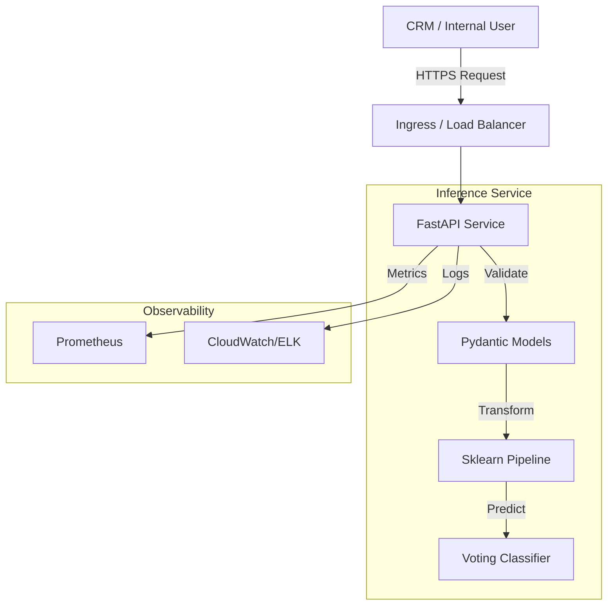
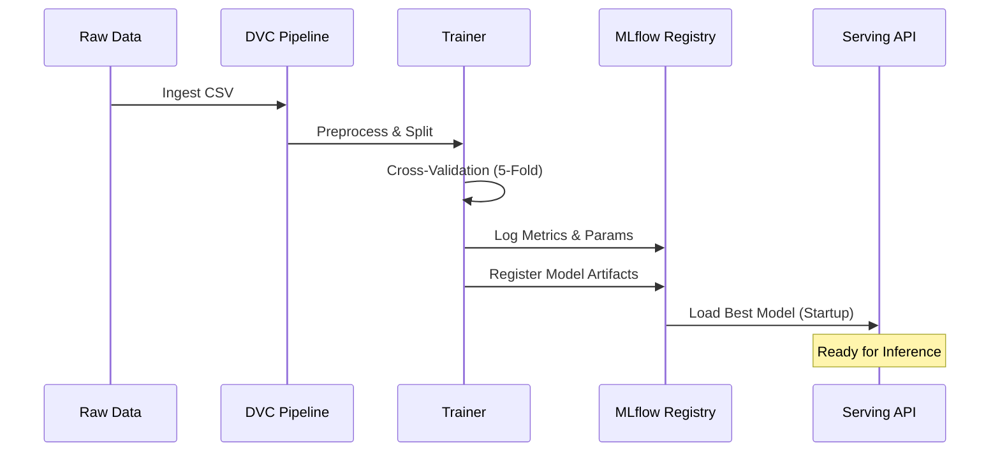

# Architecture Documentation

**Project:** BankChurn-Predictor  
**Version:** 1.0.0  
**Status:** Production-Ready  
**Maintainer:** Daniel Duque

---

## 1. System Overview

The **BankChurn-Predictor** is a production-grade machine learning system capable of identifying bank customers at risk of attrition (churn). It utilizes an ensemble of linear and non-linear models (Logistic Regression and Random Forest) to predict the probability of a customer exiting the service.

The system is designed with **MLOps best practices** in mind, featuring reproducible training pipelines, automated testing, containerized deployment, and rigorous monitoring capabilities. It serves as a critical component for the Retention Marketing team to target high-risk customers proactively.

### 1.1 Business Goals & KPIs
-   **Goal**: Minimize customer churn by identifying at-risk users early.
-   **KPI**: **F1-Score (Weighted)** > 0.80 to ensure a balance between Precision (avoiding spamming happy customers) and Recall (catching actual churners).
-   **Operational KPI**: API Latency < 100ms (P95) to support real-time integration with the CRM.

### 1.2 High-Level Component Diagram

---

## 2. Detailed Component Architecture

### 2.1 Data Pipeline (ETL & Preprocessing)
The data pipeline is managed via **DVC (Data Version Control)** to ensure lineage and reproducibility.

-   **Source**: Raw CSV exports from the core banking data warehouse.
-   **Preprocessing (`data/preprocess.py`)**:
    -   **Cleaning**: Drops PII (Personally Identifiable Information) like `Surname` and low-variance IDs (`RowNumber`, `CustomerId`).
    -   **Validation**: Checks schema constraints (e.g., `CreditScore` range 300-850).
    -   **Transformation**: 
        -   **Categorical**: One-Hot Encoding for `Geography` and `Gender`.
        -   **Numerical**: Standard Scaling for `Balance`, `EstimatedSalary`, etc.
        -   **Imputation**: Median strategy for numerical, constant for categorical.

**Key Decision**: We perform splitting *before* any learnable transformation (scaling/imputation) to strictly prevent **Data Leakage**.

### 2.2 Model Architecture
We employ a **Voting Ensemble** approach to maximize robustness:

1.  **Logistic Regression**: Provides linear decision boundaries and interpretability (coefficients).
2.  **Random Forest**: Captures non-linear relationships and interactions between features.
3.  **Resampling**: Wrapped in a custom `ResampleClassifier` that applies **SMOTE** (Synthetic Minority Over-sampling Technique) inside the cross-validation loop. This is crucial as the dataset is imbalanced (~20% churn).

**Trade-off**: Using SMOTE increases training time but significantly improves Recall on the minority class, which is the primary business objective.

### 2.3 Inference API
The serving layer is built with **FastAPI**.

-   **Serialization**: Models are serialized using `joblib` for efficiency.
-   **Validation**: Input payloads are validated against strict types defined in `app/fastapi_app.py` (e.g., `Geography` must be one of 'France', 'Spain', 'Germany').
-   **Concurrency**: The application runs on an ASGI server (`uvicorn`), allowing it to handle multiple concurrent requests efficiently.

---

## 3. Data Flow & Lineage

### 3.1 Versioning Strategy
-   **Code**: Git (GitHub).
-   **Data**: DVC (referencing S3/Local storage).
-   **Models**: MLflow (Model Registry) + DVC tracking of `.pkl` files.
-   **Containers**: Docker (GHCR) tagged with Git SHA.

---

## 4. Scalability & Reliability

### 4.1 Horizontal Scaling
The API is stateless. It can be scaled horizontally behind a load balancer (e.g., Kubernetes Service or AWS ALB). The Docker image is optimized (~200MB) for fast startup times.

### 4.2 Fault Tolerance
-   **Input Handling**: Invalid inputs return `422 Unprocessable Entity` with detailed error messages, preventing model crashes.
-   **Model Loading**: The API performs a "health check" on startup to ensure the model artifact is loaded. If failed, the service fails to start (Fail Fast pattern).

---

## 5. Security

-   **Container Security**:
    -   Runs as non-root user (`appuser`).
    -   Minimal base image (`python:3.12-slim`).
    -   Scanned for CVEs via Trivy in CI/CD.
-   **API Security**:
    -   No sensitive data returned in error messages.
    -   CORS configured to allow restricted origins.

---

## 6. Technological Decisions

| Component | Choice | Rationale | Alternatives Considered |
|-----------|--------|-----------|-------------------------|
| **Framework** | FastAPI | High performance, async support, auto-docs. | Flask (slower, less robust validation) |
| **Model** | Sklearn Ensemble | Balance of performance and interpretability. | XGBoost (higher complexity), Deep Learning (overkill for tabular data size) |
| **Packaging** | Docker | Standard unit of deployment. | VirtualEnv (harder to replicate env) |
| **Orchestration** | Make + DVC | Simplicity for single-repo MLOps. | Airflow (too complex for this scope) |

---

## 7. Future Roadmap

1.  **A/B Testing**: Implement shadow deployment capability to test new models against the champion.
2.  **Feature Store**: Integrate a Feature Store (e.g., Feast) for serving consistent features in real-time.
3.  **Explainability**: Expose SHAP values via the API for individual prediction explanation.
