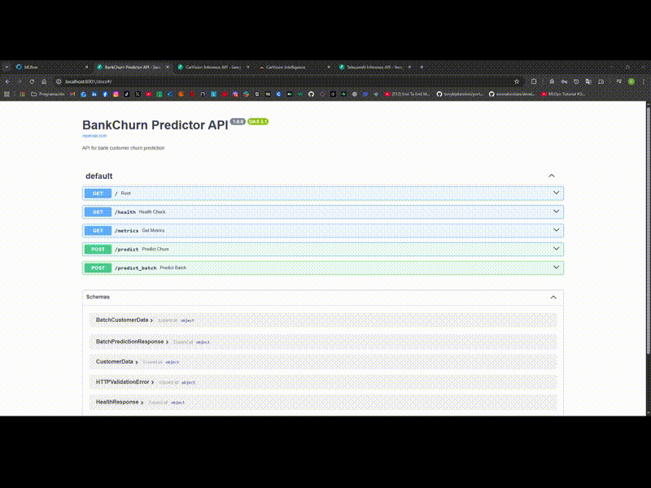

# BankChurn-Predictor

[](https://github.com/DuqueOM/ML-MLOps-Portfolio/actions/workflows/ci-mlops.yml)
[](../reports/)
[](https://python.org)
[](Dockerfile)
[](https://mlflow.org)
[](https://dvc.org)

---

<!-- 
=============================================================================
🎬 DEMO GIF PLACEHOLDER
=============================================================================
TODO: Record a 6-8 second GIF showing:
1. A curl command or Swagger UI request
2. The JSON response with churn prediction

Create GIF:
1. Record screen: prediction request → response
2. Convert: ffmpeg -i video.mp4 -vf "fps=15,scale=800:-1" bankchurn-demo.gif
3. Place in: ../media/gifs/bankchurn-preview.gif
4. Uncomment the line below
=============================================================================
-->

<div align="center">

<!--  -->
**[🎬 DEMO GIF — PENDING]** <!-- Remove this line after adding GIF -->

**[📺 Watch Full Demo Video](#)** <!-- TODO: Replace # with YouTube/Drive link -->

</div>

---

> **TL;DR**: An enterprise-grade MLOps pipeline for predicting bank customer churn. Uses a VotingClassifier ensemble (Logistic Regression + Random Forest), served via high-performance FastAPI, with full reproducibility via DVC and Make.

---

## 📋 Overview

BankChurn-Predictor is a production-grade Machine Learning service designed to identify customers at risk of leaving the bank (churn). By predicting churn probability, the bank can proactively engage high-risk customers with retention offers.

### Key Features
- **Robust Modeling**: VotingClassifier ensemble combining linear and non-linear baselines with custom resampling for class imbalance.
- **Production API**: Fast, typed, and documented REST API using FastAPI.
- **Reproducibility**: Full data and pipeline versioning with DVC and Git.
- **Observability**: Integrated MLflow tracking and drift monitoring.

### Architecture

```mermaid
graph LR
    A[Raw Data (CSV)] --> B[Preprocessing (StandardScaler/OneHot)]
    B --> C[Training Pipeline (Ensemble)]
    C --> D[Model Registry (MLflow/Local)]
    D --> E[Inference API (FastAPI)]
    E --> F[Monitoring (Prometheus/Logs)]
```

---

## 🚀 Quickstart

### Prerequisites
- Python 3.10+
- Docker & Docker Compose
- Make

### Run in 5 Minutes (Demo)

```bash
# 1. Install dependencies
make install

# 2. Start the full stack (API + Monitoring)
make docker-demo

# 3. Check health
curl localhost:8000/health
```

### Request Examples

**Single Prediction:**

```bash
curl -X POST "http://localhost:8000/predict" \
     -H "Content-Type: application/json" \
     -d '{
           "CreditScore": 600,
           "Geography": "France",
           "Gender": "Female",
           "Age": 40,
           "Tenure": 3,
           "Balance": 60000.0,
           "NumOfProducts": 2,
           "HasCrCard": 1,
           "IsActiveMember": 1,
           "EstimatedSalary": 50000.0
         }'
```

**Batch Prediction:**

```bash
# Assuming you have a json file with a list of customers
curl -X POST "http://localhost:8000/predict_batch" \
     -H "Content-Type: application/json" \
     -d @data/batch_request.json
```

---

## 💾 Data

| Column | Type | Description |
|--------|------|-------------|
| CreditScore | int | Credit score (300-850) |
| Geography | str | France, Spain, Germany |
| Gender | str | Female, Male |
| Age | int | Customer age |
| Exited | int | **Target**: 1 (Churn), 0 (Retained) |

Data is versioned using DVC. To pull the latest data:
```bash
dvc pull
```

---

## 🧠 Training

The training pipeline is reproducible and managed via `dvc.yaml` or `Makefile`.

```bash
# Run full training pipeline
make train

# Run with hyperparameter optimization
make train-hyperopt
```

**Expected Artifacts:**
- `models/best_model.pkl`: The full serialized scikit-learn pipeline (Preprocessor + Classifier).
- `models/metrics.json`: JSON file containing F1 score, AUC, and other evaluation metrics.
- `models/model_card.md`: Automated model card describing the model's provenance and performance.

---

## 📡 Serving

The API documentation (Swagger UI) is available at `http://localhost:8000/docs` when the service is running.

**Endpoints:**
- `GET /health`: Liveness probe checking model status.
- `POST /predict`: Real-time inference returning churn probability and risk level.
- `POST /predict_batch`: Bulk inference for up to 1000 records.
- `GET /metrics`: Prometheus-compatible metrics (latency, request count).

---

## 📊 MLflow Integration

This project integrates with MLflow for experiment tracking and model registry.

### Log Experiments to MLflow

```bash
# Point to the portfolio's central MLflow server
export MLFLOW_TRACKING_URI=http://localhost:5000

# Log a demo run with metrics and business impact
make mlflow-demo
```

### What Gets Logged

| Category | Items |
|----------|-------|
| **Parameters** | Model config, data config, run type |
| **Metrics** | CV metrics, test metrics (F1, AUC, Precision, Recall) |
| **Business Metrics** | Detected at-risk customers, saved revenue proxy |
| **Artifacts** | training_results.json, config.yaml, model (best-effort) |

### Full Portfolio Demo (with MLflow UI)

Run all 3 projects from the portfolio root:

```bash
cd ..  # Go to portfolio root
docker compose -f docker-compose.demo.yml up --build -d

# Access points:
# - BankChurn API: http://localhost:8001/docs
# - MLflow UI: http://localhost:5000
```

### Drift Monitoring

Periodic drift checks compare live traffic against training reference using `evidently`:

```bash
make check-drift
```

---

## 🛠 Troubleshooting

| Issue | Possible Cause | Fix |
|-------|----------------|-----|
| `ModuleNotFoundError` | PYTHONPATH not set | Run via `python -m` or use `make` commands which handle paths. |
| `Connection Refused` | Docker container down | Check `docker ps` and logs `docker logs bankchurn-demo`. |
| `Scaler mean equals global mean` | Data Leakage | Ensure `training.py` splits data *before* fitting preprocessor (Fixed in v1.0.0). |

---

## 👥 Maintainers

- **Daniel Duque** - Lead MLOps Engineer

---

## 📋 CI Notes

| Component | Details |
|-----------|---------|
| **Workflow** | `.github/workflows/ci-mlops.yml` |
| **Coverage** | 77% (threshold: 70%) |
| **Python** | 3.11, 3.12 (matrix) |

**If tests fail**: Check the `tests` job logs → expand coverage artifact.

---

## 📄 Model Card

See [models/model_card.md](models/model_card.md) for:
- Model architecture and training data
- Performance metrics (AUC, F1, Precision, Recall)
- Limitations and bias considerations
- Reproduction instructions

---

## ✅ Acceptance Checklist

- [x] Tests pass (`make test`)
- [x] API starts and responds (`make api-start`)
- [x] Docker image builds (`make docker-build`)
- [x] Security scan passes (`make security-scan`)
- [x] Model card documented
