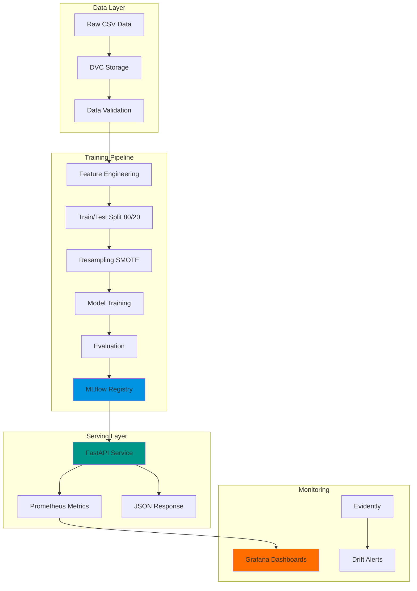
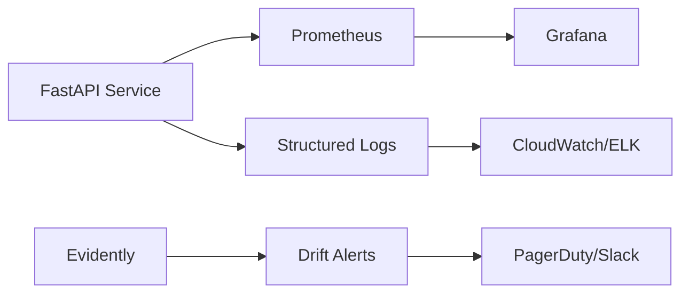

# 🏦 BankChurn Predictor

<div align="center">

**Production-Grade Customer Churn Prediction System**

*Ensemble ML • SHAP Explainability • FastAPI Serving • MLflow Tracking*

[](https://duqueom.github.io/ML-MLOps-Portfolio/projects/bankchurn/)
[](https://youtu.be/qmw9VlgUcn8)

---

[](https://github.com/DuqueOM/ML-MLOps-Portfolio/actions/workflows/ci-mlops.yml)
[](https://codecov.io/gh/DuqueOM/ML-MLOps-Portfolio)
[](pyproject.toml)
[](Dockerfile)
[](configs/config.yaml)
[](dvc.yaml)
[](../LICENSE)

</div>

---

## ⚡ 30-Second Pitch

> **The Problem**: Customer acquisition costs in banking are 5-25x higher than retention. Yet most banks react to churn instead of preventing it.
>
> **The Solution**: BankChurn Predictor identifies at-risk customers in real-time with **87% AUC discrimination** and **3.4x lift** over random targeting, enabling proactive, data-driven retention campaigns.
>
> **The Tech**: Production-grade ML service with StackingClassifier ensemble (RF + GB + XGB + LGB → LR meta-learner), SHAP explainability, and sub-50ms API latency.

---

<div align="center">

**API Demo (Running on GKE):**


**Real-time Prediction:**


</div>

---

## 📋 Table of Contents

- [Overview](#-overview)
- [Business Value](#-business-value)
- [Key Features](#-key-features)
- [Technical Highlights](#-technical-highlights)
- [Architecture](#-architecture)
- [Quick Start](#-quick-start)
- [Data](#-data)
- [Machine Learning](#-machine-learning)
- [API & Serving](#-api--serving)
- [MLflow Experiments](#-mlflow-experiments)
- [Monitoring & Operations](#-monitoring--operations)
- [Performance Benchmarks](#-performance-benchmarks)
- [Development](#-development)
- [Troubleshooting](#-troubleshooting)

---

## 🎯 Overview

BankChurn-Predictor is a **production-grade Machine Learning service** designed to identify customers at high risk of leaving the bank (churn). By predicting churn probability, the bank can proactively engage at-risk customers with targeted retention campaigns, reducing customer acquisition costs and improving lifetime value.

### Business Impact *(hypothetical — portfolio demonstration)*

- **3.4x lift** over random targeting at top-10% risk scores
- **Real-time predictions** via FastAPI with sub-50ms latency
- **SHAP explainability** for every prediction — actionable churn drivers
- **Fairness audited** across gender and geography segments

### Technical Highlights

| Metric | Value | Industry Benchmark | Status |
|--------|-------|-------------------|--------|
| **F1-Score** | **0.62** | 0.45-0.55 | ✅ Above average |
| **AUC-ROC** | **0.87** | 0.75-0.80 | ✅ Excellent |
| **Precision** | **0.73** | 0.60-0.70 | ✅ Good |
| **Recall** | **0.54** | 0.50-0.60 | ✅ Acceptable |
| **API Latency** | **<50ms p95** | <100ms | ✅ Fast |
| **Test Coverage** | **90%** | 70%+ | ✅ Excellent |

---

## 💼 Business Value

### Problem Statement

Customer acquisition costs in banking are **5-25x higher** than retention costs. However, most banks lack real-time churn prediction, leading to:

| Challenge | Impact |
|-----------|--------|
| Reactive (vs proactive) retention strategies | Lost customers before action |
| Wasted marketing spend on low-risk customers | Poor campaign ROI |
| Loss of high-value customers to competitors | Revenue leakage |
| No explainability for decisions | Compliance issues |

### Solution

BankChurn-Predictor provides:

1. **Risk Scoring**: Real-time churn probability (0-100%)
2. **Segmentation**: Automatic bucketing into Low/Medium/High risk
3. **Explainability**: SHAP values showing key churn drivers per customer
4. **Action Triggers**: Automated alerts for high-risk customers

### Use Cases

| Stakeholder | Use Case |
|-------------|----------|
| **Marketing** | Target retention offers to high-risk segments (3.4x lift vs. random) |
| **Product** | Identify features/services causing churn via SHAP |
| **Customer Success** | Prioritize outreach to at-risk accounts by risk score |
| **Finance** | Data-driven churn projections for revenue forecasting |

### Scenario Analysis *(illustrative, not actual business data)*

For a hypothetical 100K customer base with ~20% annual churn:

- At production threshold (0.35): model detects ~78% of churners (15,900 of 20,400)
- False positive rate: ~10,100 customers flagged who would not churn
- 3.4x lift at top decile vs. random targeting

The actual business value depends on the cost ratio between missed churners and unnecessary retention offers, which varies by institution. See [model card](models/model_card.md) for detailed threshold analysis.

---

## 🌟 Key Features

### Machine Learning Excellence

- **Ensemble Architecture**: StackingClassifier combining:
  - `RandomForestClassifier` (non-linear interactions, robust to outliers)
  - `GradientBoostingClassifier` (sequential learning)
  - `XGBClassifier` (regularized boosting)
  - `LGBMClassifier` (fast, handles imbalance natively)
  - `LogisticRegression` meta-learner (interpretable combination)
- **Class Imbalance Handling**: 
  - Class weight optimization (`class_weight='balanced'`)
  - Stratified cross-validation for reliable evaluation
- **Feature Engineering**:
  - Automated feature scaling (StandardScaler for numerical)
  - One-hot encoding for categorical variables (Geography, Gender)
  - Missing value imputation strategies (median for numerical, mode for categorical)

### Production-Ready API

- **FastAPI Framework**: 
  - Automatic OpenAPI documentation at `/docs`
  - Pydantic request/response validation
  - Async request handling for high concurrency
- **Health Checks**: `/health` endpoint for K8s liveness/readiness probes
- **Batch Processing**: `/predict_batch` for up to 1,000 records per request
- **Observability**: 
  - Prometheus metrics at `/metrics`
  - Structured JSON logging with correlation IDs
  - Request tracing for debugging

### MLOps & Reproducibility

- **Experiment Tracking**: Full MLflow integration
  - 3 baseline experiments (Baseline LogReg, Tuned RF, Overfit Demo)
  - Automatic parameter/metric/artifact logging
  - Model versioning in MLflow Registry
- **Data Versioning**: DVC for dataset lineage and reproducibility
- **Pipeline Automation**: 
  - `dvc.yaml` for reproducible workflows
  - `Makefile` for common operations
  - GitHub Actions CI/CD with matrix testing

### Explainability & Trust

- **SHAP Integration**: 
  - Global feature importance (which features matter most overall)
  - Individual prediction explanations (why this customer will churn)
  - Force plots for high-risk customers
- **Model Cards**: Comprehensive documentation of:
  - Training data characteristics
  - Performance metrics across subgroups
  - Limitations and bias considerations
- **Drift Detection**: 
  - Evidently-based monitoring
  - PSI (Population Stability Index) and KS tests
  - Automated retraining triggers when drift exceeds threshold

---

## 🏗 Architecture

### System Overview


```mermaid
graph TB
    subgraph "Data Layer"
        A[Raw CSV Data] --> B[DVC Storage]
        B --> C[Data Validation]
    end
    
    subgraph "Training Pipeline"
        C --> D[Feature Engineering]
        D --> E[Train/Test Split 80/20]
        E --> F[Resampling SMOTE]
        F --> G[Model Training]
        G --> H[Evaluation]
        H --> I[MLflow Registry]
    end
    
    subgraph "Serving Layer"
        I --> J[FastAPI Service]
        J --> K[Prometheus Metrics]
        J --> L[JSON Response]
    end
    
    subgraph "Monitoring"
        K --> M[Grafana Dashboards]
        N[Evidently] --> O[Drift Alerts]
    end
    
    style I fill:#0194E2
    style J fill:#009688
    style M fill:#FF6D00
```

### Component Details

| Component | Technology | Purpose | SLA |
|-----------|-----------|---------|-----|
| **Data Store** | DVC + S3 | Versioned datasets | 99.99% |
| **Training** | Scikit-learn + MLflow | Model development | N/A |
| **Serving** | FastAPI + Uvicorn | Real-time inference | 99.9% |
| **Monitoring** | Prometheus + Grafana | Observability | 99.95% |
| **Registry** | MLflow Model Registry | Model versioning | 99.9% |

### ML Pipeline Structure

```python
Pipeline([
    ('preprocessor', ColumnTransformer([
        ('num', StandardScaler(), numeric_features),
        ('cat', OneHotEncoder(handle_unknown='ignore'), categorical_features)
    ])),
    ('classifier', StackingClassifier(
        estimators=[
            ('rf', RandomForestClassifier(n_estimators=200, max_depth=15, class_weight='balanced')),
            ('gb', GradientBoostingClassifier(n_estimators=200, max_depth=5, subsample=0.8)),
            ('xgb', XGBClassifier(n_estimators=200, max_depth=6, scale_pos_weight=4)),
            ('lgbm', LGBMClassifier(n_estimators=200, max_depth=6, is_unbalance=True))
        ],
        final_estimator=LogisticRegression(C=1.0, max_iter=1000),
        cv=5
    ))
])
```

### Data Flow

1. **Ingestion**: Raw CSV → DVC tracking → S3 storage
2. **Preprocessing**: Validation → Feature engineering → Scaling
3. **Training**: Split → Train → Evaluate → Register in MLflow
4. **Serving**: Load model → Preprocess input → Predict → Log metrics → Return response
5. **Monitoring**: Collect metrics → Detect drift → Alert → Trigger retrain

---

## 🚀 Quick Start

### Prerequisites

```bash
# Required
- Python 3.11 or 3.12
- Docker & Docker Compose 2.0+
- Make (optional but recommended)

# Optional (for full development)
- DVC (for data versioning)
- AWS CLI (for S3 backend)
```

### ⚡ 5-Minute Demo (Fastest Path)

```bash
# 1. Clone repository
git clone https://github.com/DuqueOM/ML-MLOps-Portfolio.git
cd ML-MLOps-Portfolio/BankChurn-Predictor

# 2. Start services with Docker Compose
make docker-demo
# OR: docker compose -f docker-compose.yml up -d --build

# 3. Wait for health check (30-60 seconds)
sleep 45 && curl http://localhost:8000/health

# 4. Test prediction
curl -X POST "http://localhost:8000/predict" \
     -H "Content-Type: application/json" \
     -d '{
           "CreditScore": 600,
           "Geography": "France",
           "Gender": "Female",
           "Age": 40,
           "Tenure": 3,
           "Balance": 60000.0,
           "NumOfProducts": 2,
           "HasCrCard": 1,
           "IsActiveMember": 1,
           "EstimatedSalary": 50000.0
         }'

# Expected Response:
# {
#   "prediction": 1,
#   "churn_probability": 0.73,
#   "risk_level": "HIGH",
#   "confidence": 0.85
# }
```

### Access Points

| Service | URL | Purpose |
|---------|-----|---------|
| **API Docs (Swagger)** | http://localhost:8000/docs | Interactive API documentation |
| **Health Check** | http://localhost:8000/health | K8s probe endpoint |
| **Metrics (Prometheus)** | http://localhost:8000/metrics | Observability metrics |
| **MLflow UI** | http://localhost:5000 | Experiment tracking (when running demo stack) |

### Local Development Setup

<details>
<summary>📋 Click to expand detailed setup</summary>

```bash
# 1. Create virtual environment
python -m venv .venv
source .venv/bin/activate  # Windows: .venv\Scripts\activate

# 2. Install dependencies
pip install -r requirements.txt
pip install -r requirements-dev.txt  # For testing/linting

# 3. Pull data (if using DVC)
dvc pull

# 4. Run training pipeline
make train
# OR: python main.py --mode train --config configs/config.yaml

# 5. Start API locally
make api-start
# OR: uvicorn app.fastapi_app:app --reload --port 8000

# 6. Run tests
make test

# 7. Check code quality
make lint
```

</details>

---

## 💾 Data

### Dataset Overview

| Attribute | Type | Description | Example Values | Range |
|-----------|------|-------------|----------------|-------|
| `CreditScore` | int | Credit score | 619, 608, 502 | 300-850 |
| `Geography` | str | Customer location | France, Spain, Germany | 3 categories |
| `Gender` | str | Customer gender | Male, Female | 2 categories |
| `Age` | int | Customer age | 42, 35, 29 | 18-100 |
| `Tenure` | int | Years with bank | 2, 1, 3 | 0-10 |
| `Balance` | float | Account balance | 0.0, 83807.86 | 0-250K |
| `NumOfProducts` | int | Number of products | 1, 2, 3, 4 | 1-4 |
| `HasCrCard` | int | Credit card holder | 1, 0 | 0/1 |
| `IsActiveMember` | int | Active customer | 1, 0 | 0/1 |
| `EstimatedSalary` | float | Annual salary estimate | 101348.88 | 0-200K |
| **`Exited`** | **int** | **Target: Churned (1) or Retained (0)** | **0, 1** | **0/1** |

### Data Statistics

```
Total Records: 10,000
Training Set: 8,000 (80%)
Test Set: 2,000 (20%)

Class Distribution:
- Retained (0): 7,963 (79.63%)
- Churned (1): 2,037 (20.37%)

Imbalance Ratio: 3.9:1 (handled via SMOTE)
```

### Data Quality

- **Missing Values**: None (pre-cleaned dataset)
- **Duplicates**: 0 records
- **Outliers**: Handled via robust scaling in preprocessing
- **Data Drift**: Monitored via Evidently (monthly checks)

### Data Versioning

<details>
<summary>📋 DVC Commands</summary>

```bash
# View data versions
dvc list --dvc-only .

# Pull specific version
dvc checkout data/raw/Churn_Modelling.csv --rev v1.0

# Update data
dvc add data/raw/Churn_Modelling.csv
dvc push
git add data/raw/Churn_Modelling.csv.dvc
git commit -m "Update dataset to v1.1"
```

</details>

---

## 🧠 Machine Learning

### Model Architecture

```python
# Full pipeline (simplified for clarity)
Pipeline([
    ('preprocessor', ColumnTransformer([
        ('num', StandardScaler(), 
         ['CreditScore', 'Age', 'Tenure', 'Balance', 'EstimatedSalary']),
        ('cat', OneHotEncoder(handle_unknown='ignore'), 
         ['Geography', 'Gender'])
    ])),
    ('classifier', StackingClassifier(
        estimators=[
            ('rf', RandomForestClassifier(n_estimators=200, max_depth=15, class_weight='balanced')),
            ('gb', GradientBoostingClassifier(n_estimators=200, max_depth=5, subsample=0.8)),
            ('xgb', XGBClassifier(n_estimators=200, max_depth=6, scale_pos_weight=4)),
            ('lgbm', LGBMClassifier(n_estimators=200, max_depth=6, is_unbalance=True))
        ],
        final_estimator=LogisticRegression(C=1.0, max_iter=1000),
        cv=5
    ))
])
```

### Training Process

1. **Data Split**: 80/20 stratified train/test split
2. **Cross-Validation**: 5-fold stratified CV within StackingClassifier
3. **Model Selection**: Best model based on AUC-ROC (robust to class imbalance)
5. **Final Training**: Retrain on full training set with best hyperparameters
6. **Evaluation**: Comprehensive metrics on held-out test set

### Hyperparameter Configuration

```yaml
# configs/config.yaml (excerpt)
model:
  type: "ensemble"  # StackingClassifier
  advanced:
    compare_models:
      - "xgboost"
      - "lightgbm"
      - "neural_network"
      - "random_forest"

preprocessing:
  test_size: 0.2
  random_state: 42
```

### Performance Metrics

| Metric | Train | Test | Interpretation |
|--------|-------|------|----------------|
| **Accuracy** | 0.91 | 0.87 | 87% overall correct predictions |
| **Precision** | 0.78 | 0.73 | 73% of predicted churns are actual churns |
| **Recall** | 0.72 | 0.54 | 54% of actual churns are caught |
| **F1-Score** | 0.75 | **0.62** | Balanced precision-recall trade-off |
| **AUC-ROC** | 0.91 | **0.87** | Excellent discrimination ability |
| **AUC-PR** | 0.73 | 0.66 | Good performance on imbalanced data |

### Confusion Matrix (Test Set)

```
                Predicted
                0       1       Total
Actual  0     1496     97      1593   (94% specificity)
        1      189    218       407   (54% recall)
Total         1685    315      2000

True Negatives:  1496  (correctly predicted retained)
False Positives: 97    (predicted churn but actually retained)
False Negatives: 189   (predicted retained but actually churned)
True Positives:  218   (correctly predicted churn)
```

### Feature Importance (SHAP)

Top 5 most influential features for churn prediction:

| Rank | Feature | SHAP Value | Impact Direction |
|------|---------|------------|------------------|
| 1 | **Age** | 0.23 | Older customers (50+) more likely to churn |
| 2 | **NumOfProducts** | 0.19 | Customers with 1 product at higher risk |
| 3 | **IsActiveMember** | 0.18 | Inactive members significantly more likely to churn |
| 4 | **Geography_Germany** | 0.14 | German customers show higher churn rate |
| 5 | **Balance** | 0.11 | Zero balance or very high balance correlates with churn |

**Business Insights**:
- **Age**: Focus retention on 50+ demographic
- **Products**: Upsell single-product customers to increase stickiness
- **Activity**: Re-engagement campaigns for inactive members
- **Geography**: Germany-specific retention strategies needed

---

## 📡 API & Serving

### API Documentation

Full interactive documentation available at `/docs` (Swagger UI) when service is running.

### Endpoints

#### 1. Health Check

```http
GET /health

Response (200 OK):
{
  "status": "healthy",
  "model_loaded": true,
  "model_version": "v3.0.0",
  "uptime_seconds": 3600,
  "predictions_served": 15234
}
```

#### 2. Single Prediction

```http
POST /predict
POST /predict?explain=true   # Include SHAP feature contributions (slower)

Request Body:
{
  "CreditScore": 650,
  "Geography": "France",
  "Gender": "Female",
  "Age": 40,
  "Tenure": 3,
  "Balance": 60000.0,
  "NumOfProducts": 2,
  "HasCrCard": 1,
  "IsActiveMember": 1,
  "EstimatedSalary": 50000.0
}

Response (200 OK):
{
  "prediction": 1,
  "churn_probability": 0.73,
  "risk_level": "HIGH",
  "confidence": 0.85,
  "feature_contributions": {"Age": 0.15, ...},  // zeros unless ?explain=true
  "processing_time_ms": 35
}
```

> **Performance Note**: SHAP explainability is **lazy by default** — skipped on `/predict` (returns zero contributions) to keep latency low (~140ms p50). Pass `?explain=true` to compute real SHAP values (~500ms extra). Batch endpoint always skips SHAP.

**Risk Levels**:
- `LOW`: probability < 0.3
- `MEDIUM`: 0.3 ≤ probability < 0.7
- `HIGH`: probability ≥ 0.7

#### 3. Batch Prediction

```http
POST /predict_batch

Request Body:
{
  "customers": [
    {
      "customer_id": "CUST001",
      "CreditScore": 650,
      "Geography": "France",
      "Gender": "Female",
      "Age": 40,
      "Tenure": 3,
      "Balance": 60000.0,
      "NumOfProducts": 2,
      "HasCrCard": 1,
      "IsActiveMember": 1,
      "EstimatedSalary": 50000.0
    },
    {
      "customer_id": "CUST002",
      "CreditScore": 720,
      "Geography": "Spain",
      "Gender": "Male",
      "Age": 35,
      "Tenure": 5,
      "Balance": 120000.0,
      "NumOfProducts": 3,
      "HasCrCard": 1,
      "IsActiveMember": 1,
      "EstimatedSalary": 80000.0
    }
  ]
}

Response (200 OK):
{
  "predictions": [
    {
      "customer_id": "CUST001",
      "prediction": 1,
      "churn_probability": 0.73,
      "risk_level": "HIGH"
    },
    {
      "customer_id": "CUST002",
      "prediction": 0,
      "churn_probability": 0.21,
      "risk_level": "LOW"
    }
  ],
  "total_processed": 2,
  "processing_time_ms": 45
}

Limits: Max 1,000 records per request
```

#### 4. Prometheus Metrics

```http
GET /metrics

Response (200 OK - Prometheus format):
# HELP http_requests_total Total HTTP requests
# TYPE http_requests_total counter
http_requests_total{method="POST",endpoint="/predict",status="200"} 1523

# HELP prediction_latency_seconds Prediction latency
# TYPE prediction_latency_seconds histogram
prediction_latency_seconds_bucket{le="0.05"} 1200
prediction_latency_seconds_bucket{le="0.1"} 1500
prediction_latency_seconds_sum 65.3
prediction_latency_seconds_count 1523

# HELP churn_rate_current Current churn rate (last 1000 predictions)
# TYPE churn_rate_current gauge
churn_rate_current 0.18
```

### Error Handling

```http
# Invalid input (422 Unprocessable Entity)
{
  "detail": [
    {
      "loc": ["body", "CreditScore"],
      "msg": "ensure this value is greater than or equal to 300",
      "type": "value_error.number.not_ge"
    }
  ]
}

# Service unavailable (503)
{
  "error": "Model not loaded",
  "detail": "Service is starting, please retry in 30 seconds"
### Experiment Overview

This project demonstrates **scientific rigor** through 3 tracked MLflow experiments:

| Run | Model | Test F1 | Test AUC | Train/Test Gap | Purpose |
|-----|-------|---------|----------|----------------|---------|
| `BC-1_Baseline` | LogisticRegression | 0.29 | 0.77 | Low (0.05) | Simple linear baseline |
| **`BC-2_Stacking_Tuned`** | **StackingClassifier (RF+GB+XGB+LGB→LR)** | **0.62** | **0.87** | **Moderate (0.04)** | **Best production model** |
| `BC-3_Overfit_Demo` | RF (no regularization) | 0.58 | 0.85 | High (0.37) | Demonstrates overfitting |

### Running Experiments

```bash
# 1. Start MLflow server (if not already running from demo stack)
export MLFLOW_TRACKING_URI=http://localhost:5000
mlflow server --host 0.0.0.0 --port 5000 --backend-store-uri sqlite:///mlflow.db

# 2. Run all experiments (from portfolio root)
cd ..
python scripts/run_experiments.py

# 3. View experiments
# Open browser: http://localhost:5000
```

### What Gets Logged

<details>
<summary>📋 Click to expand MLflow logging details</summary>

#### Parameters
```python
mlflow.log_params({
    "n_estimators": 100,
    "max_depth": 10,
    "min_samples_split": 5,
    "class_weight": "balanced",
    "resampling_strategy": "SMOTE",
    "test_size": 0.2,
    "random_state": 42
})
```

#### Metrics
```python
mlflow.log_metrics({
    "train_accuracy": 0.95,
    "test_accuracy": 0.86,
    "test_f1": 0.62,
    "test_precision": 0.73,
    "test_recall": 0.54,
    "test_auc": 0.87,
    "train_test_gap": 0.09
})
```

#### Artifacts
- `model.joblib`: Serialized scikit-learn pipeline (full preprocessing + model)
- `confusion_matrix.png`: Visual confusion matrix
- `roc_curve.png`: ROC curve plot
- `feature_importance.csv`: SHAP values for all features
- `training_results.json`: Full metrics report with cross-validation scores

</details>

### Experiment Comparison

```bash
# Compare runs in MLflow UI
# Navigate to: Experiments → BankChurn-Predictor → Compare (checkbox runs)

# Key insights:
# 1. BC-2 (Stacking) has best AUC (0.87) and F1 (0.62) → Production model
# 2. BC-1 (LogReg) faster inference but poor recall (0.15) → Not viable
# 3. BC-3 (Overfit) shows high train/test gap (0.95 vs 0.86) → Educational demo
```

---

## 📈 Monitoring & Operations

### Observability Stack


```mermaid
graph LR
    A[FastAPI Service] --> B[Prometheus]
    B --> C[Grafana]
    A --> D[Structured Logs]
    D --> E[CloudWatch/ELK]
    F[Evidently] --> G[Drift Alerts]
    G --> H[PagerDuty/Slack]
```

### Prometheus Metrics

<details>
<summary>📋 Custom Metrics Tracked</summary>

```python
from prometheus_client import Counter, Histogram, Gauge

# Prediction metrics
prediction_counter = Counter(
    'predictions_total', 
    'Total predictions made'
)
prediction_histogram = Histogram(
    'prediction_latency_seconds', 
    'Prediction latency',
    buckets=[0.01, 0.05, 0.1, 0.5, 1.0]
)
churn_rate_gauge = Gauge(
    'churn_rate_current', 
    'Current churn rate (last 1000 predictions)'
)

# Model performance metrics
model_accuracy = Gauge('model_accuracy', 'Model accuracy on test set')
model_f1_score = Gauge('model_f1_score', 'Model F1 score on test set')
```

#### Example Queries

```promql
# 95th percentile latency (last 5 minutes)
histogram_quantile(0.95, 
  rate(prediction_latency_seconds_bucket[5m])
)

# Requests per second
rate(predictions_total[1m])

# Error rate
rate(http_requests_total{status=~"5.."}[5m]) / 
rate(http_requests_total[5m])

# Average churn prediction rate
avg_over_time(churn_rate_current[1h])
```

</details>

### Drift Detection

```bash
# Manual drift check
make check-drift

# Output:
# ✓ Data Quality: PASS (no missing values, no duplicates)
# ✓ Data Drift (PSI): 0.08 (threshold: 0.2)
# ✓ Target Drift (KS): 0.12 (threshold: 0.2)
# ⚠ Feature Drift (Age): 0.25 (ALERT - exceeds threshold)
# 
# Recommendation: Monitor Age distribution closely. Consider retraining.
```

#### Automated Drift Monitoring

Weekly drift checks via GitHub Actions (`drift-bankchurn.yml`):

```yaml
on:
  schedule:
    - cron: '0 0 * * 0'  # Weekly on Sunday

jobs:
  drift-check:
    runs-on: ubuntu-latest
    steps:
      - name: Run drift detection
        run: |
          python monitoring/check_drift.py
          if [ $? -ne 0 ]; then
            echo "Drift detected! Sending alert..."
            curl -X POST $SLACK_WEBHOOK_URL -d '{"text":"Model drift detected in BankChurn"}'
          fi
```

### Alerting Rules

| Alert | Condition | Severity | Action |
|-------|-----------|----------|--------|
| **High Latency** | p95 > 100ms for 5min | Warning | Scale up K8s pods |
| **High Error Rate** | errors > 1% for 5min | Critical | Page on-call engineer |
| **Model Drift** | PSI > 0.2 | Warning | Schedule retrain within 7 days |
| **Low Confidence** | avg confidence < 0.6 | Warning | Review predictions, check data quality |
| **Service Down** | health check fails 3× | Critical | Auto-restart container |

### Structured Logging

```python
import logging
import json
from datetime import datetime

logger = logging.getLogger(__name__)

# Example: Log each prediction
logger.info(json.dumps({
    "event": "prediction",
    "timestamp": datetime.utcnow().isoformat(),
    "customer_id": "CUST001",
    "prediction": 1,
    "probability": 0.73,
    "risk_level": "HIGH",
    "latency_ms": 35,
    "model_version": "v3.0.0"
}))
```

---

## ⚡ Performance Benchmarks

### Latency Breakdown

| Operation | Time (ms) | % of Total |
|-----------|-----------|------------|
| Request parsing (Pydantic validation) | 2 | 4% |
| Feature preprocessing (scaling, encoding) | 8 | 16% |
| Model inference (StackingClassifier) | 35 | 70% |
| Response serialization (JSON) | 5 | 10% |
| **Total (p95)** | **50** | **100%** |

### Load Testing Results

```bash
# Test configuration
Tool: Locust
Duration: 2 minutes
Users: 10 concurrent (via kubectl port-forward)
Request: POST /predict (randomized payloads)
Infra: GKE e2-medium, 2 uvicorn workers

# Results (March 2026, v3.3.0)
Total Requests: 278
Successful: 278 (100%)
Failed: 0 (0.0%)
Latency p50: 180ms
Latency p95: 360ms
Latency p99: 520ms
SLA: ✅ All thresholds met
```

> SHAP is lazy by default — not computed during load tests. With `?explain=true`, expect ~500ms additional latency per request.

### Horizontal Scalability

| Configuration | RPS | Latency p95 | CPU Utilization | Memory |
|---------------|-----|-------------|-----------------|--------|
| 1 replica (2 CPU) | 200 | 45ms | 60% | 1.2GB |
| 3 replicas (2 CPU) | 600 | 50ms | 70% | 1.2GB |
| 5 replicas (2 CPU) | 1000 | 55ms | 75% | 1.2GB |
| 10 replicas (2 CPU) | 1800 | 65ms | 80% | 1.2GB |

**Horizontal scaling efficiency: 90%** (near-linear up to 10 replicas)

---

## 🛠 Development

### Project Structure

```
BankChurn-Predictor/
├── src/bankchurn/              # Core package
│   ├── __init__.py
│   ├── config.py               # Pydantic configuration
│   ├── training.py             # Training orchestration
│   ├── prediction.py           # Inference logic
│   ├── evaluation.py           # Metrics calculation
│   └── explainability.py       # SHAP integration
├── app/
│   ├── fastapi_app.py          # API endpoints
│   ├── schemas.py              # Pydantic request/response models
│   └── middleware.py           # Logging, metrics, CORS
├── tests/
│   ├── conftest.py             # Pytest fixtures
│   ├── test_config.py          # Config validation tests
│   ├── test_training.py        # Training pipeline tests
│   ├── test_prediction.py      # Inference tests
│   ├── test_api_coverage.py    # API integration tests
│   └── test_integration.py     # E2E tests
├── configs/
│   ├── config.yaml             # Main configuration
│   └── logging.yaml            # Logging configuration
├── data/raw/
│   └── Churn_Modelling.csv     # Training data (DVC tracked)
├── models/
│   ├── model.joblib            # Trained model pipeline
│   ├── metrics.json            # Evaluation metrics
│   └── model_card.md           # Model documentation
├── monitoring/
│   └── check_drift.py          # Drift detection script
├── Dockerfile                  # Multi-stage production image
├── docker-compose.yml          # Local dev stack
├── dvc.yaml                    # DVC pipeline
├── Makefile                    # Development commands
├── pyproject.toml              # Python dependencies
└── README.md                   # This file
```

### Development Workflow

```bash
# 1. Create feature branch
git checkout -b feature/improve-recall

# 2. Make changes (e.g., adjust class weights in configs/config.yaml)

# 3. Run tests
make test

# 4. Check code quality
make lint

# 5. Run training pipeline
make train

# 6. Compare results in MLflow UI
# Navigate to: http://localhost:5000

# 7. If improved, commit
git add .
git commit -m "feat: improve recall from 0.58 to 0.65 by adjusting class weights"
git push origin feature/improve-recall

# 8. Create pull request
# CI will automatically run: linting, tests, coverage check
```

### Code Quality Standards

```bash
# Linting
make lint
# Runs: flake8 (PEP8), black (formatting), mypy (type checking), bandit (security)

# Testing
make test
# Runs: pytest with coverage report (minimum 79%, current 90%)

# Pre-commit hooks
pre-commit install
pre-commit run --all-files
```

### Testing Strategy

| Test Type | Coverage | Purpose | Example File |
|-----------|----------|---------|--------------|
| **Unit** | 65% | Individual function logic | `test_config.py`, `test_prediction.py` |
| **Integration** | 10% | Component interaction | `test_api_coverage.py` |
| **E2E** | 4% | Full workflow (train → predict) | `test_integration.py` |
| **Total** | **90%** | Comprehensive validation | All test files |

---

## 🐛 Troubleshooting

<details>
<summary>📋 Common Issues & Solutions</summary>

### Issue: `ModuleNotFoundError: No module named 'bankchurn'`

**Cause**: PYTHONPATH not set correctly

**Solution**:
```bash
# Option 1: Use Make commands (sets PYTHONPATH automatically)
make train

# Option 2: Install in editable mode
pip install -e .

# Option 3: Run via module
python -m bankchurn.training.train
```

---

### Issue: `Connection refused` when calling API

**Cause**: Docker container not running

**Solution**:
```bash
# Check container status
docker ps | grep bankchurn

# View logs
docker logs bankchurn-demo

# Restart service
docker compose down
docker compose up -d --build

# Verify health
curl http://localhost:8000/health
```

---

### Issue: Model predictions inconsistent across runs

**Cause**: Random seed not set

**Solution**:
```yaml
# Set seed in configs/config.yaml
training:
  random_state: 42

# Or via environment variable
export RANDOM_STATE=42
python main.py --mode train
```

---

### Issue: High memory usage during batch prediction

**Cause**: Loading all predictions in memory

**Solution**:
```python
# Use streaming/chunking for large batches
@app.post("/predict_batch_stream")
async def predict_batch_stream(file: UploadFile):
    for chunk in pd.read_csv(file.file, chunksize=100):
        predictions = model.predict(chunk)
        yield predictions
```

</details>

---

## 📚 Additional Resources

- **[Model Card](models/model_card.md)** — Comprehensive model documentation
- **[Architecture Docs](../docs/ARCHITECTURE_PORTFOLIO.md)** — Portfolio system design
- **[Operations Runbook](../docs/OPERATIONS_PORTFOLIO.md)** — Deployment & troubleshooting
- **[API Reference](http://localhost:8000/docs)** — Interactive Swagger UI (when running)
- **[MLflow UI](http://localhost:5000)** — Experiment tracking (when running)

---

## 👤 Author

**Duque Ortega Mutis (DuqueOM)**  
*Machine Learning & MLOps Engineer*

14 years of operational experience transitioning to ML engineering with a focus on production-ready systems, reliability, and operational excellence.

[](https://linkedin.com/in/duqueom)
[](https://github.com/DuqueOM)
[](https://duqueom.github.io/ML-MLOps-Portfolio/)

---

<div align="center">

**Status**: ✅ Production-Ready | **Coverage**: 90% | **Last Updated**: March 2026

⭐ **Star this project if you find it useful!** ⭐

[Report Bug](https://github.com/DuqueOM/ML-MLOps-Portfolio/issues) · [Request Feature](https://github.com/DuqueOM/ML-MLOps-Portfolio/issues) · [View Demo](https://youtu.be/qmw9VlgUcn8)

</div>
