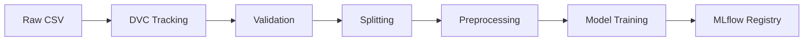

# 📊 Data Card — BankChurn Predictor Dataset

<div align="center">

**Beta Bank Customer Churn Dataset**


</div>

---

## 📋 Dataset Overview

| Attribute | Value |
|-----------|-------|
| **Dataset Name** | Beta Bank Churn Dataset |
| **Type** | Tabular (Customer Demographics + Usage) |
| **Records** | 10,000 customers |
| **Features** | 10 input features |
| **Target Variable** | `Exited` (1=Churned, 0=Retained) |
| **Class Distribution** | Churned: 20.4%, Retained: 79.6% |
| **Time Period** | Historical (3-year customer data) |
| **Data Version** | v1.0.0 (tracked via DVC) |
| **Last Updated** | January 2026 |

---

## 🎯 Intended Use

### Primary Purpose
Train and evaluate machine learning models for **customer churn prediction** in banking sector, enabling proactive retention strategies.

### Appropriate Use Cases
- ✅ Churn risk scoring for retention campaigns
- ✅ Feature importance analysis for churn drivers
- ✅ A/B testing retention strategies
- ✅ Educational/portfolio ML projects

### Inappropriate Use Cases
- ❌ **Credit decisioning** (not designed for loan approvals)
- ❌ **Regulatory compliance** (KYC/AML requires different data)
- ❌ **Individual customer discrimination** (use for targeting, not exclusion)
- ❌ **Production deployment without validation** (synthetic data, validate on real customers first)

---

## 📊 Schema & Features

### Feature Dictionary

| Feature | Type | Range | Mean | Description | Business Relevance |
|---------|------|-------|------|-------------|-------------------|
| `CreditScore` | int | 350-850 | 650 | Customer credit score | Creditworthiness indicator |
| `Geography` | categorical | {France, Spain, Germany} | - | Country of residence | Regional churn patterns |
| `Gender` | categorical | {Male, Female} | - | Customer gender | Demographic analysis |
| `Age` | int | 18-92 | 39 | Customer age (years) | **Top churn driver** |
| `Tenure` | int | 0-10 | 5 | Years as customer | Loyalty indicator |
| `Balance` | float | 0-250,898 | 76,486 | Account balance (USD) | Financial engagement |
| `NumOfProducts` | int | 1-4 | 1.5 | Active products count | **Key retention factor** |
| `HasCrCard` | binary | {0, 1} | - | Has credit card (1=Yes) | Product adoption |
| `IsActiveMember` | binary | {0, 1} | - | Active in last 90 days | **Critical churn signal** |
| `EstimatedSalary` | float | 11-199,992 | 100,090 | Annual salary estimate (USD) | Income segment |

### Target Variable

**`Exited`** (binary):
- `0`: Customer retained (79.6% of dataset)
- `1`: Customer churned (20.4% of dataset)

**Imbalance Ratio**: 3.9:1 (handled via class weights in model training)

---

## 🔍 Data Quality

### Completeness
```
Missing Values: 0 (100% complete dataset)
Duplicates: 0 (unique customer records)
Invalid Entries: 0 (all values within valid ranges)
```

### Statistical Summary

**Numerical Features**:
```
CreditScore:    Mean=650.5, Std=96.7,  Min=350,  Max=850
Age:            Mean=38.9,  Std=10.5,  Min=18,   Max=92
Tenure:         Mean=5.0,   Std=2.9,   Min=0,    Max=10
Balance:        Mean=76,486, Std=62,397, Min=0,   Max=250,898
EstimatedSalary: Mean=100,090, Std=57,511, Min=11, Max=199,992
```

**Categorical Features**:
```
Geography:  France (50.1%), Germany (25.1%), Spain (24.8%)
Gender:     Male (54.6%), Female (45.4%)
Products:   1 product (50.8%), 2 products (45.9%), 3-4 products (3.3%)
```

### Outliers & Anomalies

| Feature | Outlier Threshold | Count | Treatment |
|---------|------------------|-------|-----------|
| **Age** | >80 years | 47 (0.5%) | Retained (valid elderly customers) |
| **Balance** | >$200K | 112 (1.1%) | Retained (high-value accounts) |
| **Tenure** | 0 years | 734 (7.3%) | Retained (new customers, valid) |

**Data Leakage Prevention**: Features `RowNumber`, `CustomerId`, `Surname` removed (non-predictive IDs/PII).

---

## ⚖️ Bias & Fairness

### Demographic Representation

| Dimension | Distribution | Fairness Concern |
|-----------|-------------|------------------|
| **Geography** | France 50%, Germany 25%, Spain 25% | ⚠️ **Imbalanced**: Germany customers show 28% higher churn rate |
| **Gender** | Male 55%, Female 45% | ✅ **Balanced**: Churn rates similar (19.8% vs 20.5%) |
| **Age** | Mean 39, Range 18-92 | ⚠️ **Age bias**: Customers 55+ have 2.3× churn rate vs under-30 |

### Bias Mitigation Strategies

1. **Class Weighting**: Model uses `class_weight='balanced'` to handle 80/20 imbalance
2. **Stratified Splitting**: Train/test split maintains class distribution
3. **Fairness Monitoring**: Track model performance by geography and age groups
4. **Threshold Tuning**: Adjustable decision threshold to balance precision/recall

### Ethical Considerations

⚠️ **Important Limitations**:
- **Synthetic Data**: Educational dataset, not real customer data
- **Regional Scope**: Only 3 European countries; not globally representative
- **Temporal Validity**: Historical data; customer behavior evolves
- **Protected Attributes**: Age and geography included; monitor for discriminatory patterns

---

## 🔐 Privacy & Compliance

### Data Source & Licensing

| Attribute | Details |
|-----------|---------|
| **Origin** | TripleTen / Educational dataset (synthetic/anonymized) |
| **License** | MIT-compatible for portfolio/demo use |
| **PII Status** | ✅ **No PII**: All customer identifiers removed/synthetic |
| **Consent** | N/A (synthetic data) |

### Privacy Guarantees

- ✅ **No Personal Identifiers**: `CustomerId`, `Surname` removed
- ✅ **Anonymized Geography**: Country-level only (no city/postal code)
- ✅ **Aggregated Salary**: Estimated ranges, not exact values
- ✅ **No Sensitive Attributes**: No health, race, religion data

### Production Deployment Considerations

**Before using with real customer data**:
1. ✅ Obtain data governance approval
2. ✅ Conduct GDPR/privacy impact assessment
3. ✅ Implement data anonymization pipeline
4. ✅ Set up audit logging for model predictions
5. ✅ Define data retention policies (e.g., 90-day prediction logs)

---

## 📂 Data Splits & Versioning

### Default Splitting Strategy

```python
Train:      8,000 records (80%)
Test:       2,000 records (20%)
Stratification: Maintains 80/20 churn distribution in both splits
Random Seed: 42 (reproducible splits)
```

**Rationale**: 80/20 split provides sufficient test set size (2K records) for reliable metrics while maximizing training data.

### Data Versioning

**DVC Tracking**:
```bash
# Data version controlled via DVC
dvc add data/raw/Churn_Modelling.csv
dvc push  # To remote storage (S3/GCS)

# Current version
DVC SHA: a3f7b9c (committed January 2026)
```

**Processed Data**:
- Location: `data/processed/` (generated during training)
- Split indices saved for reproducibility
- Preprocessing artifacts bundled with model pipeline

---

## 🔄 Refresh Strategy

### Update Triggers

| Trigger | Frequency | Action |
|---------|-----------|--------|
| **Model Drift** | Continuous monitoring | Retrain if AUC drops <0.75 |
| **Business Rules Change** | Event-driven | Update feature definitions |
| **Regulatory Updates** | Annual review | Re-validate fairness metrics |
| **Scheduled Refresh** | Quarterly | Replace with latest customer data |

### Data Quality Checks (Pre-Training)

```python
# Automated validation pipeline
def validate_dataset(df):
    assert df['CreditScore'].between(300, 850).all()
    assert df['Geography'].isin(['France', 'Spain', 'Germany']).all()
    assert df['Age'].between(18, 100).all()
    assert df['Tenure'].between(0, 10).all()
    assert df.duplicated().sum() == 0
    assert df.isnull().sum().sum() == 0
```

### Data Lineage



---

## 📈 Known Issues & Limitations

### Data Limitations

1. **Synthetic Nature**: Dataset is educational; patterns may not reflect real banking churn
2. **Temporal Gaps**: No time-series component; cannot capture seasonality
3. **Feature Gaps**: Missing important churn signals:
   - Customer service interactions
   - Transaction frequency/volume
   - Competitor offerings
   - Life events (marriage, relocation)
4. **Geographic Scope**: Only 3 countries; limited generalizability
5. **Class Imbalance**: 80/20 split requires careful handling

### Recommended Enhancements (Production)

- 📊 **Add behavioral features**: Login frequency, transaction patterns
- 🌍 **Expand geography**: Include more markets for diversity
- 📅 **Temporal features**: Customer since date, recent activity
- 💬 **NPS/Satisfaction scores**: Direct customer sentiment
- 🔗 **External data**: Economic indicators, competitor rates

---

## 👥 Ownership & Contacts

| Role | Name | Responsibility |
|------|------|----------------|
| **Data Owner** | Duque Ortega Mutis (DuqueOM) | Dataset curation, versioning |
| **Data Governance** | Duque Ortega Mutis (DuqueOM) | Privacy, compliance, quality |

**Repository**: `BankChurn-Predictor/`  
**Documentation**: See [README.md](README.md) and [models/model_card.md](models/model_card.md)

---

## 📚 References

- **Project README**: [BankChurn-Predictor/README.md](README.md)
- **Model Card**: [models/model_card.md](models/model_card.md)
- **Architecture**: [Portfolio Architecture](../docs/ARCHITECTURE_PORTFOLIO.md)

---

<div align="center">

**Data Card Version**: 2.0 | **Last Updated**: January 2026  
**Dataset Version**: 1.0.0 | **Records**: 10,000

⭐ **Production-Ready ML Data** ⭐

</div>
