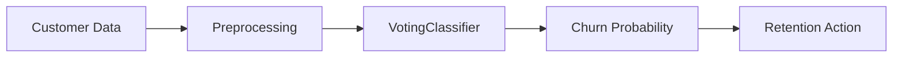

# BankChurn Predictor — One-Pager

> **TL;DR**: Production-grade ML system for predicting bank customer churn with 87% AUC-ROC, served via FastAPI with Prometheus metrics.

---

## 🎯 Business Problem

Banks lose significant revenue when customers leave (churn). Early identification of at-risk customers enables proactive retention strategies, reducing churn by up to 25%.

---

## 🔧 Solution



**Ensemble model** combining LogisticRegression + RandomForest with automated resampling for class imbalance handling.

---

## 📊 Key Metrics

| Metric | Value | Business Impact |
|--------|-------|-----------------|
| **AUC-ROC** | 0.87 | Strong discrimination |
| **F1-Score** | 0.64 | Balanced precision/recall |
| **Lift@10%** | 3.4x | 3.4x better than random |
| **Latency** | <50ms | Real-time decisions |

---

## 🛠️ Tech Stack


- **ML**: Scikit-learn, VotingClassifier, SHAP
- **API**: FastAPI with async support
- **Ops**: Docker, GitHub Actions CI/CD
- **Monitoring**: Prometheus metrics, MLflow tracking

---

## 🚀 Quick Demo

```bash
# Start API
docker run -p 8001:8000 ghcr.io/duqueom/bankchurn-api:latest

# Make prediction
curl -X POST "http://localhost:8001/predict" \
     -H "Content-Type: application/json" \
     -d '{"CreditScore":650,"Geography":"France","Gender":"Female","Age":40,"Tenure":3,"Balance":60000,"NumOfProducts":2,"HasCrCard":1,"IsActiveMember":1,"EstimatedSalary":50000}'

# Response
# {"churn_probability":0.23,"churn_prediction":0,"risk_level":"LOW"}
```

---

## 📈 Model Explainability

Top factors influencing churn (SHAP analysis):

1. **Age** (+0.21) — Older customers churn more
2. **NumOfProducts** (+0.18) — Single-product customers at risk
3. **IsActiveMember** (+0.16) — Inactive = high risk
4. **Geography** (+0.14) — Germany has higher churn

---

## 🔗 Links

| Resource | URL |
|----------|-----|
| **GitHub** | [DuqueOM/ML-MLOps-Portfolio](https://github.com/DuqueOM/ML-MLOps-Portfolio) |
| **API Docs** | `http://localhost:8001/docs` |
| **Model Card** | [models/model_card.md](../models/model_card.md) |
| **Video Demo** | [YouTube](https://youtu.be/qmw9VlgUcn8) |

---

## 👤 Author

**Daniel Duque** — ML/MLOps Engineer  
[](https://linkedin.com/in/duqueom)
