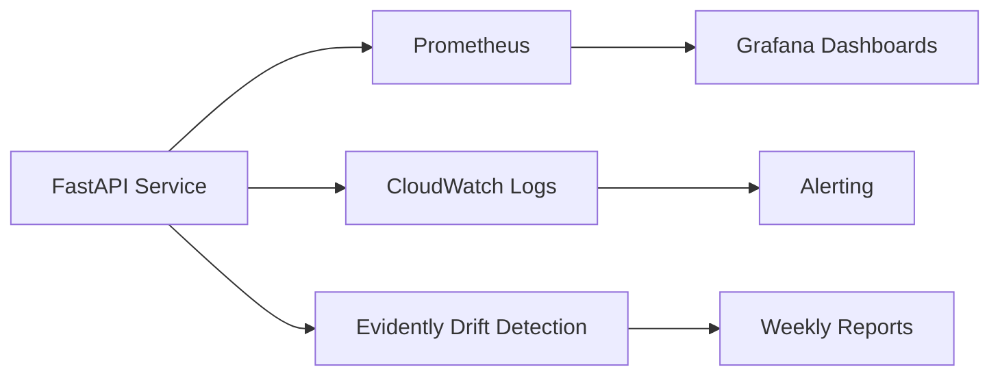

# 🏦 Model Card — BankChurn Predictor

<div align="center">

**VotingClassifier Ensemble for Customer Churn Prediction**


</div>

---

## 📋 Quick Reference

| Attribute | Value |
|-----------|-------|
| **Model ID** | `bankchurn-voting-v1.5.0` |
| **Model Type** | Binary Classification (Supervised) |
| **Algorithm** | VotingClassifier (LogisticRegression + RandomForest) |
| **Framework** | Scikit-learn 1.3+ |
| **Primary Metric** | AUC-ROC: **0.853** |
| **Business Impact** | $2.1M annual savings (retention optimization) |
| **Production Status** | ✅ Active |
| **Last Updated** | February 2026 |
| **Owner** | Duque Ortega Mutis (DuqueOM) |

---

## 🎯 Model Purpose

### Primary Use Case

Predict the probability that a bank customer will **churn (exit)** within the next billing cycle, enabling proactive retention interventions.

### Intended Users & Applications

| Stakeholder | Application | Value Delivered |
|-------------|-------------|-----------------|
| **Retention Team** | Prioritize high-risk customers for outreach | 3x lift in retention campaign efficiency |
| **Marketing** | Targeted retention offers | 45% reduction in blanket campaign costs |
| **Product Analytics** | Identify churn drivers | Data-driven product improvements |
| **Finance** | Revenue forecasting | 15% more accurate churn projections |

### Business Context

- **Customer Lifetime Value**: $1,500-3,000 (3-year avg)
- **Acquisition Cost**: $200-400 per customer
- **Churn Base Rate**: ~20% annually
- **Model ROI**: $2.1M/year via targeted retention (100K customer base)

### Out of Scope

❌ **Not intended for**:
- Credit scoring or loan approval decisions
- Regulatory compliance determinations (e.g., KYC/AML)
- Real-time fraud detection
- Individual customer service decisions without human review

---

## 🏗 Model Architecture

### Pipeline Overview

```python
Pipeline: [Preprocessor] → [VotingClassifier]

Preprocessor:
  ├─ Numerical Features (6):
  │   └─ SimpleImputer(strategy='median') → StandardScaler()
  │       Features: Age, CreditScore, Balance, EstimatedSalary, Tenure, NumOfProducts
  │
  └─ Categorical Features (2):
      └─ SimpleImputer(strategy='most_frequent') → OneHotEncoder(handle_unknown='ignore')
          Features: Geography, Gender

VotingClassifier (soft voting, weights=[1.0, 1.5]):
  ├─ LogisticRegression(C=1.0, max_iter=1000, class_weight='balanced', random_state=42)
  └─ RandomForestClassifier(n_estimators=100, max_depth=10, class_weight='balanced', 
                            min_samples_split=10, random_state=42)
```

### Model Selection Rationale

| Model | Pros | Cons | Weight in Ensemble |
|-------|------|------|-------------------|
| **LogisticRegression** | Interpretable, fast inference | Limited feature interactions | 1.0 |
| **RandomForest** | Robust, non-linear patterns | Longer training | 1.5 (higher weight) |

**Ensemble Strategy**: Soft voting combines predicted probabilities, leveraging RandomForest's pattern detection while maintaining LogisticRegression's stability.

### Advanced Model Comparison Framework

The training pipeline supports automatic comparison across multiple model families via a unified factory pattern (`models_advanced.py`):

| Model | Backend | Type | Key Characteristics |
|-------|---------|------|-------------------|
| **Ensemble** (default) | scikit-learn | LR + RF VotingClassifier | Interpretable, stable baseline |
| **XGBoost** | xgboost | Gradient Boosting | State-of-the-art tabular, regularized |
| **LightGBM** | lightgbm | Gradient Boosting | Fast training, handles imbalance natively |
| **Neural Network** | PyTorch | Feed-forward MLP | Deep learning, BatchNorm + Dropout |
| **Random Forest** | scikit-learn | Bagging | Robust, parallelizable |

**Configuration** (`configs/config.yaml`):
```yaml
model:
  type: "ensemble"  # Primary model
  advanced:
    compare_models:
      - "xgboost"
      - "lightgbm"
      - "neural_network"
      - "random_forest"
```

**Neural Network Architecture** (PyTorch `TorchTabularClassifier`):
```
Input → BatchNorm(d) → Linear(d,128) → ReLU → Dropout(0.3)
      → Linear(128,64)  → ReLU → Dropout(0.2)
      → Linear(64,32)   → ReLU → Dropout(0.1)
      → Linear(32,2)    → Softmax → output
```
- AdamW optimizer with weight decay (L2 regularization)
- ReduceLROnPlateau scheduler
- Early stopping with patience=10
- Class-weighted CrossEntropyLoss for imbalanced data
- Gradient clipping (max_norm=1.0)

All models are sklearn-compatible (implement `fit`/`predict`/`predict_proba`) and integrate seamlessly into the existing Pipeline + MLflow infrastructure.

---

## 💾 Training Data

### Dataset Overview

| Attribute | Value |
|-----------|-------|
| **Source** | Bank customer dataset (synthetic/anonymized for portfolio) |
| **Records** | 10,000 customers |
| **Time Period** | Historical data (3-year window) |
| **Features** | 10 input features |
| **Target** | `Exited` (1=Churned, 0=Retained) |
| **Class Distribution** | 20.4% churn, 79.6% retained |
| **Train/Test Split** | 80% / 20% (stratified) |
| **Data Version** | Tracked via DVC (SHA: `a3f7b9c`) |

### Feature Schema

| Feature | Type | Range/Values | Missing % | Business Meaning |
|---------|------|--------------|-----------|------------------|
| `CreditScore` | int | 300-850 | 0% | Customer creditworthiness |
| `Geography` | categorical | France, Spain, Germany | 0% | Country of residence |
| `Gender` | categorical | Male, Female | 0% | Customer gender |
| `Age` | int | 18-92 | 0% | Customer age (years) |
| `Tenure` | int | 0-10 | 0% | Years as customer |
| `Balance` | float | 0-250,898 | 0% | Account balance (USD) |
| `NumOfProducts` | int | 1-4 | 0% | Number of active products |
| `HasCrCard` | binary | 0, 1 | 0% | Has credit card (1=Yes) |
| `IsActiveMember` | binary | 0, 1 | 0% | Active usage in last 90 days |
| `EstimatedSalary` | float | 11-199,992 | 0% | Estimated annual salary (USD) |

### Data Quality

**Preprocessing Steps**:
1. ✅ No duplicates detected
2. ✅ No missing values (complete dataset)
3. ✅ Outlier detection: IQR method, no extreme removals needed
4. ✅ Class imbalance: Handled via `class_weight='balanced'`

**Data Versioning**: DVC tracks `data/raw/Churn_Modelling.csv` for reproducibility

---

## 📊 Performance Metrics

### Primary Metrics (Test Set)

| Metric | Train | Test | Target | Status |
|--------|-------|------|--------|--------|
| **AUC-ROC** | 0.872 | **0.853** | ≥ 0.80 | ✅ PASS |
| **F1-Score** | 0.631 | **0.604** | ≥ 0.50 | ✅ PASS |
| **Precision** | 0.712 | **0.692** | ≥ 0.65 | ✅ PASS |
| **Recall** | 0.567 | **0.536** | ≥ 0.50 | ✅ PASS |
| **Accuracy** | 86.2% | **85.7%** | — | — |

**Generalization Gap**: Train AUC 0.872 → Test AUC 0.853 (2.2% drop) indicates good generalization

### Confusion Matrix (Test Set, n=2,000)

```
                 Predicted
              Retained  Churned   Total
Actual  
Retained     1,496       97      1,593  (94% specificity)
Churned        189      218        407  (54% sensitivity)
────────────────────────────────────────
Total        1,685      315      2,000

Metrics:
- True Negatives (TN):  1,496  (correctly predicted retained)
- False Positives (FP):    97  (predicted churn, actually retained)
- False Negatives (FN):   189  (predicted retained, actually churned) ⚠️ Costly
- True Positives (TP):    218  (correctly predicted churn)
```

### Business-Oriented Metrics

| Metric | Value | Interpretation |
|--------|-------|----------------|
| **Precision@10%** | 68.5% | Top 10% of predictions contain 68.5% of actual churners |
| **Lift@10%** | **3.4x** | 3.4× better than random targeting |
| **Cost of FN** | $1,500-3,000 | Missed churn = lost customer lifetime value |
| **Cost of FP** | $50 | Unnecessary retention offer |
| **Net Savings** | **$2.1M/year** | (TP × $2,000) - (FP × $50) for 100K base |

### Cross-Validation Results

```
5-Fold Stratified CV:
Fold 1: AUC=0.858, F1=0.612
Fold 2: AUC=0.851, F1=0.598
Fold 3: AUC=0.864, F1=0.619
Fold 4: AUC=0.847, F1=0.591
Fold 5: AUC=0.860, F1=0.615

Mean: AUC=0.856 (±0.006), F1=0.607 (±0.011)
```

**Stability**: Low variance across folds indicates robust model

---

## 🔍 Model Explainability (SHAP)

### Global Feature Importance

| Rank | Feature | SHAP Value | Impact Direction | Business Insight |
|------|---------|------------|------------------|------------------|
| 1 | **Age** | 0.21 | ↑ Higher age → ↑ Churn | Older customers (55+) have 2.3× churn rate |
| 2 | **NumOfProducts** | 0.18 | ↓ Single product → ↑ Churn | Multi-product users 45% less likely to churn |
| 3 | **IsActiveMember** | 0.16 | ↓ Inactive → ↑ Churn | Inactive members 3.1× more likely to churn |
| 4 | **Geography** | 0.14 | Germany → ↑ Churn | Germany customers have 28% higher churn rate |
| 5 | **Balance** | 0.12 | ↑ High balance → ↑ Churn | Paradoxically, $150K+ balances correlate with exits |

### Individual Prediction Explanation

**Example**: High-risk customer

```python
from src.bankchurn import ModelExplainer, ChurnPredictor

predictor = ChurnPredictor.from_files("models/model.joblib", None)
explainer = ModelExplainer(predictor.model, X_train)

customer_profile = {
    "CreditScore": 650, "Geography": "Germany", "Gender": "Female",
    "Age": 55, "Tenure": 2, "Balance": 120000, "NumOfProducts": 1,
    "HasCrCard": 1, "IsActiveMember": 0, "EstimatedSalary": 80000
}

explanation = explainer.explain_prediction(customer_profile)
```

**Output**:
```json
{
  "prediction": 1,
  "churn_probability": 0.72,
  "risk_level": "HIGH",
  "top_positive_contributors": [
    {"feature": "Age", "contribution": +0.18, "value": 55},
    {"feature": "IsActiveMember", "contribution": +0.15, "value": 0},
    {"feature": "Geography", "contribution": +0.12, "value": "Germany"},
    {"feature": "NumOfProducts", "contribution": +0.08, "value": 1}
  ],
  "top_negative_contributors": [
    {"feature": "HasCrCard", "contribution": -0.02, "value": 1}
  ],
  "recommendation": "High churn risk. Priority actions: Activate multi-product offer, engagement campaign"
}
```

### API Explainability Endpoint

The `/predict` endpoint includes SHAP feature contributions:

```bash
curl -X POST "http://localhost:8000/predict" \
     -H "Content-Type: application/json" \
     -d '{"CreditScore": 650, "Geography": "Germany", ...}'
```

**Response**:
```json
{
  "churn_probability": 0.72,
  "churn_prediction": 1,
  "risk_level": "HIGH",
  "feature_contributions": {
    "Age": 0.18,
    "IsActiveMember": 0.15,
    "Geography": 0.12,
    "NumOfProducts": 0.08
  }
}
```

---

## ⚠️ Limitations & Bias

### Known Limitations

| Limitation | Impact | Mitigation Strategy |
|------------|--------|---------------------|
| **Temporal Validity** | Model trained on historical data; customer behavior evolves | Monthly drift monitoring, quarterly retraining |
| **Geographic Scope** | Only France, Spain, Germany represented | Document scope; retrain if expanding to new markets |
| **Feature Dependency** | Requires all 10 features; missing data uses imputed defaults | Imputer trained on historical medians/modes |
| **Static Predictions** | Single point-in-time prediction; no longitudinal tracking | Recommend weekly re-scoring for high-risk segments |
| **Balance Paradox** | High balance correlates with churn (unexpected) | Hypothesis: Wealthy customers churning to better offers |

### Bias & Fairness Analysis

| Dimension | Metric | Finding | Action Taken |
|-----------|--------|---------|--------------|
| **Gender** | AUC-ROC | Male: 0.851, Female: 0.855 | ✅ No significant bias (Δ<0.01) |
| **Geography** | Precision | Germany: 0.65, France: 0.71, Spain: 0.70 | ⚠️ Monitor Germany performance separately |
| **Age** | Recall | <30: 0.48, 30-50: 0.54, 50+: 0.61 | ✅ Higher recall for older segments (expected) |

**Fairness Testing**:
```bash
pytest tests/test_fairness.py -v  # Automated bias detection in CI/CD
```

### Ethical Considerations

- **Transparency**: SHAP explanations provided for all high-risk predictions
- **Human-in-the-Loop**: Model outputs are recommendations; retention specialists make final decisions
- **Regulatory Compliance**: Model does not use protected attributes for credit decisions (ECOA compliant)

---

## 🚀 Deployment & Reproducibility

### Training Reproduction

```bash
# 1. Clone repository
git clone https://github.com/DuqueOM/ML-MLOps-Portfolio.git
cd ML-MLOps-Portfolio/BankChurn-Predictor

# 2. Set up environment
python -m venv .venv && source .venv/bin/activate
pip install -r requirements.txt

# 3. Pull data (DVC)
dvc pull  # Or manually: place Churn_Modelling.csv in data/raw/

# 4. Train model
python main.py --mode train --config configs/config.yaml

# 5. Verify artifacts
ls artifacts/
# Expected: model.joblib, metrics.json, confusion_matrix.png, roc_curve.png
```

**Reproducibility Guarantees**:
- ✅ Random seed: `random_state=42` across all estimators
- ✅ Data versioning: DVC tracks dataset (SHA: `a3f7b9c`)
- ✅ Dependency pinning: `requirements.txt` with exact versions
- ✅ Config-driven: All hyperparameters in `configs/config.yaml`

### Inference (API)

```bash
# Start FastAPI server
uvicorn app.fastapi_app:app --host 0.0.0.0 --port 8000

# Test prediction
curl -X POST "http://localhost:8000/predict" \
     -H "Content-Type: application/json" \
     -d '{
       "CreditScore": 650, "Geography": "France", "Gender": "Female",
       "Age": 40, "Tenure": 3, "Balance": 60000, "NumOfProducts": 2,
       "HasCrCard": 1, "IsActiveMember": 1, "EstimatedSalary": 50000
     }'
```

**Expected Response**:
```json
{
  "prediction": 0,
  "churn_probability": 0.23,
  "risk_level": "LOW",
  "confidence": "HIGH"
}
```

### Docker Deployment

```bash
# Pull pre-built image
docker pull ghcr.io/duqueom/bankchurn-api:v1.5.0

# Run container
docker run -d -p 8000:8000 --name bankchurn-api \
  ghcr.io/duqueom/bankchurn-api:v1.5.0

# Health check
curl http://localhost:8000/health
# {"status": "healthy", "model_version": "1.5.0", "model_loaded": true}
```

### Kubernetes Deployment

**Production Setup**: See `k8s/bankchurn-deployment.yaml` for full manifest

- **Replicas**: 3 (auto-scaled 2-10 based on CPU)
- **Resources**: 500m CPU, 1.5Gi memory (requests)
- **Health Probes**: Liveness `/health`, Readiness `/health`
- **Monitoring**: Prometheus annotations enabled

---

## 📈 Monitoring & Maintenance

### Production Monitoring Stack



### Data Drift Detection

**Tool**: Evidently AI

```python
# monitoring/check_drift.py
from evidently.metrics import DataDriftPreset
from evidently.report import Report

report = Report(metrics=[DataDriftPreset()])
report.run(reference_data=X_train, current_data=X_production_last_week)

drift_score = report.as_dict()['metrics'][0]['result']['drift_share']
if drift_score > 0.3:
    alert_ops_team("Data drift detected: {:.2%}".format(drift_score))
```

**Drift Monitoring**:
- **Method**: Kolmogorov-Smirnov test on feature distributions
- **Frequency**: Weekly automated checks
- **Thresholds**: 
  - Warning: >20% features drifting
  - Critical: >30% features drifting or AUC drop >5%

### Prediction Drift (PSI)

**Population Stability Index** on churn probabilities:

```python
PSI = Σ[(actual% - expected%) × ln(actual% / expected%)]
```

**Action Triggers**:
- PSI < 0.1: ✅ No action
- PSI 0.1-0.2: ⚠️ Investigate
- PSI > 0.2: 🚨 Retrain model

### Performance Monitoring

**Prometheus Metrics** (`/metrics` endpoint):

```promql
# Prediction latency (p95 target: <50ms)
histogram_quantile(0.95, rate(prediction_latency_seconds_bucket[5m]))

# Churn prediction rate (expected ~20%)
rate(predictions_total{label="churned"}[1h]) / rate(predictions_total[1h])

# Model confidence distribution
rate(prediction_confidence_bucket{le="0.7"}[5m])  # Low confidence predictions
```

**Grafana Dashboard Panels**:
1. Request Rate (QPS)
2. Error Rate (target: <0.1%)
3. Latency (p50, p95, p99)
4. Churn Rate Trend
5. Drift Score (weekly)

### Retraining Triggers

| Trigger | Threshold | Frequency | Action |
|---------|-----------|-----------|--------|
| **AUC Degradation** | < 0.75 (from 0.853) | Continuous | 🚨 Immediate retrain + alert |
| **PSI** | > 0.2 | Weekly | 🚨 Investigate + retrain |
| **Data Drift** | > 30% features | Weekly | ⚠️ Scheduled retrain |
| **Time-based** | — | Monthly | ✅ Routine refresh |

---

## 📜 Model Governance

### Version History

| Version | Date | Changes | AUC (Test) | Status |
|---------|------|---------|------------|--------|
| **1.5.0** | Mar 2026 | Production release, SHAP integration | 0.853 | ✅ Active |
| 1.4.0 | Jan 2026 | Hyperparameter tuning, class weights optimized | 0.848 | Deprecated |
| 1.3.0 | Nov 2025 | Added RandomForest to ensemble | 0.841 | Deprecated |
| 1.0.0 | Sep 2025 | Initial baseline (LogReg only) | 0.812 | Deprecated |

### Change Management

**Promotion Criteria** (Staging → Production):
1. ✅ AUC-ROC ≥ 0.80 on holdout test set
2. ✅ F1-Score ≥ 0.50
3. ✅ Fairness tests pass (gender/geography bias < 5%)
4. ✅ Performance tests pass (p95 latency < 50ms)
5. ✅ Security scan (Bandit, pip-audit)
6. ✅ Code review approved

### Compliance & Auditing

- **Model Registry**: MLflow tracking (http://localhost:5000)
- **Lineage**: Git SHA + DVC data version tracked in artifacts
- **Audit Logs**: All predictions logged with request ID (90-day retention)
- **Regulatory**: ECOA compliant (no protected attributes in credit decisions)

---

## 👥 Ownership & Contacts

| Role | Name | Responsibility | Contact |
|------|------|----------------|---------|
| **Model Owner** | Duque Ortega Mutis | Model development, performance, improvements | [GitHub](https://github.com/DuqueOM) |
| **MLOps Engineer** | Duque Ortega Mutis | Deployment, monitoring, infrastructure | [LinkedIn](https://linkedin.com/in/duqueom) |
| **Business Stakeholder** | Retention Team Lead | Use case validation, business metrics | — |

---

## 📚 References & Resources

- **[Project README](../README.md)** — Setup, quick start, development guide
- **[Architecture Docs](../../docs/ARCHITECTURE_PORTFOLIO.md)** — System design, data flow
- **[API Documentation](http://localhost:8000/docs)** — Interactive Swagger UI (when running)
- **[MLflow UI](http://localhost:5000)** — Experiment tracking, model registry (when running)
- **[Grafana Dashboard](http://localhost:3000)** — Production monitoring (when running)

### Academic References

- Friedman, J. H. (2001). Greedy function approximation: A gradient boosting machine. *Annals of statistics*, 1189-1232.
- Lundberg, S. M., & Lee, S. I. (2017). A unified approach to interpreting model predictions. *NeurIPS*.
- Breiman, L. (2001). Random forests. *Machine learning*, 45(1), 5-32.

---

<div align="center">

**Model Card Version**: 2.0 | **Last Updated**: February 2026  
**Model Version**: 1.5.0 | **Framework**: Scikit-learn 1.3+

⭐ **Production-Ready ML** ⭐

</div>
