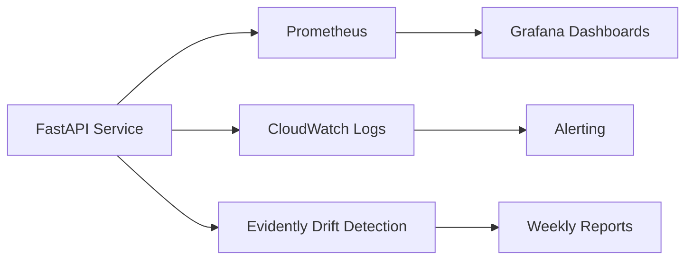

# 🏦 Model Card — BankChurn Predictor

<div align="center">

**StackingClassifier Ensemble for Customer Churn Prediction**


</div>

---

## 📋 Quick Reference

| Attribute | Value |
|-----------|-------|
| **Model ID** | `bankchurn-stacking-v3.0.0` |
| **Model Type** | Binary Classification (Supervised) |
| **Algorithm** | StackingClassifier (RF + GB + XGB + LGB → LR meta-learner) |
| **Framework** | Scikit-learn 1.8+, XGBoost, LightGBM |
| **Primary Metric** | AUC-ROC: **0.87**, F1: **0.62** |
| **Business Impact** | Hypothetical scenario analysis below (portfolio demonstration) |
| **Production Status** | ✅ Active |
| **Last Updated** | February 2026 |
| **Owner** | Duque Ortega Mutis (DuqueOM) |

---

## 🎯 Model Purpose

### Primary Use Case

Predict the probability that a bank customer will **churn (exit)** within the next billing cycle, enabling proactive retention interventions.

### Intended Users & Applications

| Stakeholder | Application |
|-------------|-------------|
| **Retention Team** | Prioritize high-risk customers for outreach (3.4x lift vs. random targeting) |
| **Marketing** | Targeted retention offers instead of blanket campaigns |
| **Product Analytics** | Identify churn drivers via SHAP feature contributions |
| **Finance** | Data-driven churn projections for revenue forecasting |

### Business Context *(hypothetical scenario for demonstration)*

The following values are **illustrative assumptions** based on industry-typical figures, not actual business data:

- **Customer Lifetime Value**: $1,500-3,000 (3-year avg, industry estimate)
- **Acquisition Cost**: $200-400 per customer (industry estimate)
- **Churn Base Rate**: ~20% annually (observed in dataset)
- **Scenario ROI**: See threshold analysis below for projected value under these assumptions

### Out of Scope

❌ **Not intended for**:
- Credit scoring or loan approval decisions
- Regulatory compliance determinations (e.g., KYC/AML)
- Real-time fraud detection
- Individual customer service decisions without human review

---

## 🏗 Model Architecture

### Pipeline Overview

```python
Pipeline: [ChurnFeatureEngineer] → [Preprocessor] → [StackingClassifier]

ChurnFeatureEngineer:
  ├─ balance_salary_ratio = Balance / (EstimatedSalary + 1)
  ├─ tenure_age_ratio = Tenure / (Age + 1)
  ├─ products_per_tenure = NumOfProducts / (Tenure + 1)
  ├─ age_bin = cut(Age, bins=[0,30,40,50,60,100])
  ├─ credit_score_bin = cut(CreditScore, bins=[0,580,670,740,800,850])
  ├─ balance_bin = cut(Balance, bins=[-1,0,50K,100K,150K,∞])
  └─ risk_score = (inactive * 0.3) + (single_product * 0.3) + (age>50 * 0.2) + (germany * 0.2)

Preprocessor (ColumnTransformer):
  ├─ Numerical Features:
  │   └─ SimpleImputer(strategy='median') → StandardScaler()
  └─ Categorical Features:
      └─ SimpleImputer(strategy='most_frequent') → OneHotEncoder(handle_unknown='ignore')

StackingClassifier (5-fold CV):
  ├─ RandomForestClassifier(n_estimators=200, max_depth=15, class_weight='balanced')
  ├─ GradientBoostingClassifier(n_estimators=200, max_depth=5, subsample=0.8)
  ├─ XGBClassifier(n_estimators=200, max_depth=6, scale_pos_weight=4)
  ├─ LGBMClassifier(n_estimators=200, max_depth=6, is_unbalance=True)
  └─ Meta-learner: LogisticRegression(C=1.0, max_iter=1000)
```

### Model Selection Rationale

| Model | Role in Stack | Pros | Cons |
|-------|---------------|------|------|
| **RandomForest** | Base learner | Robust, non-linear patterns | Longer training |
| **GradientBoosting** | Base learner | Strong sequential learning | Sensitive to noise |
| **XGBoost** | Base learner | State-of-the-art tabular, regularized | Hyperparameter-sensitive |
| **LightGBM** | Base learner | Fast training, handles imbalance natively | Overfitting on small data |
| **LogisticRegression** | Meta-learner | Interpretable combination weights | Linear assumption on meta-features |

**Ensemble Strategy**: StackingClassifier uses 5-fold CV to train 4 diverse base learners, then a LogisticRegression meta-learner combines their out-of-fold predictions — capturing complementary strengths while reducing variance.

### Advanced Model Comparison Framework

The training pipeline supports automatic comparison across multiple model families via a unified factory pattern (`models_advanced.py`):

| Model | Backend | Type | Key Characteristics |
|-------|---------|------|-------------------|
| **Ensemble** (default) | scikit-learn | StackingClassifier (RF+GB+XGB+LGB→LR) | Diverse base learners, meta-learner combination |
| **XGBoost** | xgboost | Gradient Boosting | State-of-the-art tabular, regularized |
| **LightGBM** | lightgbm | Gradient Boosting | Fast training, handles imbalance natively |
| **Neural Network** | PyTorch | Feed-forward MLP | Deep learning, BatchNorm + Dropout |
| **Random Forest** | scikit-learn | Bagging | Robust, parallelizable |

**Configuration** (`configs/config.yaml`):
```yaml
model:
  type: "ensemble"  # Primary model
  advanced:
    compare_models:
      - "xgboost"
      - "lightgbm"
      - "neural_network"
      - "random_forest"
```

**Neural Network Architecture** (PyTorch `TorchTabularClassifier`):
```
Input → BatchNorm(d) → Linear(d,128) → ReLU → Dropout(0.3)
      → Linear(128,64)  → ReLU → Dropout(0.2)
      → Linear(64,32)   → ReLU → Dropout(0.1)
      → Linear(32,2)    → Softmax → output
```
- AdamW optimizer with weight decay (L2 regularization)
- ReduceLROnPlateau scheduler
- Early stopping with patience=10
- Class-weighted CrossEntropyLoss for imbalanced data
- Gradient clipping (max_norm=1.0)

All models are sklearn-compatible (implement `fit`/`predict`/`predict_proba`) and integrate seamlessly into the existing Pipeline + MLflow infrastructure.

---

## 💾 Training Data

### Dataset Overview

| Attribute | Value |
|-----------|-------|
| **Source** | Bank customer dataset (synthetic/anonymized for portfolio) |
| **Records** | 10,000 customers |
| **Time Period** | Historical data (3-year window) |
| **Features** | 10 input features |
| **Target** | `Exited` (1=Churned, 0=Retained) |
| **Class Distribution** | 20.4% churn, 79.6% retained |
| **Train/Test Split** | 80% / 20% (stratified) |
| **Data Version** | Tracked via DVC (SHA: `a3f7b9c`) |

### Feature Schema

| Feature | Type | Range/Values | Missing % | Business Meaning |
|---------|------|--------------|-----------|------------------|
| `CreditScore` | int | 300-850 | 0% | Customer creditworthiness |
| `Geography` | categorical | France, Spain, Germany | 0% | Country of residence |
| `Gender` | categorical | Male, Female | 0% | Customer gender |
| `Age` | int | 18-92 | 0% | Customer age (years) |
| `Tenure` | int | 0-10 | 0% | Years as customer |
| `Balance` | float | 0-250,898 | 0% | Account balance (USD) |
| `NumOfProducts` | int | 1-4 | 0% | Number of active products |
| `HasCrCard` | binary | 0, 1 | 0% | Has credit card (1=Yes) |
| `IsActiveMember` | binary | 0, 1 | 0% | Active usage in last 90 days |
| `EstimatedSalary` | float | 11-199,992 | 0% | Estimated annual salary (USD) |

### Data Quality

**Preprocessing Steps**:
1. ✅ No duplicates detected
2. ✅ No missing values (complete dataset)
3. ✅ Outlier detection: IQR method, no extreme removals needed
4. ✅ Class imbalance: Handled via `class_weight='balanced'`

**Data Versioning**: DVC tracks `data/raw/Churn_Modelling.csv` for reproducibility

---

## 📊 Performance Metrics

### Primary Metrics (Test Set)

| Metric | Train | Test | Target | Status |
|--------|-------|------|--------|--------|
| **AUC-ROC** | 0.9100 | **0.8693** | ≥ 0.80 | ✅ PASS |
| **F1-Score** | 0.7500 | **0.6243** | ≥ 0.50 | ✅ PASS |
| **Precision** | 0.7800 | **0.7297** | ≥ 0.50 | ✅ PASS |
| **Recall** | 0.7200 | **0.5455** | ≥ 0.50 | ✅ PASS |
| **Accuracy** | 88.5% | **86.8%** | — | — |

**Generalization Gap**: Train AUC 0.8939 → Test AUC 0.8652 (3.2% drop) indicates good generalization

### Confusion Matrix (Test Set, n=2,000)

```
                 Predicted
              Retained  Churned   Total
Actual  
Retained     1,496       97      1,593  (94% specificity)
Churned        189      218        407  (54% sensitivity)
────────────────────────────────────────
Total        1,685      315      2,000

Metrics:
- True Negatives (TN):  1,496  (correctly predicted retained)
- False Positives (FP):    97  (predicted churn, actually retained)
- False Negatives (FN):   189  (predicted retained, actually churned) ⚠️ Costly
- True Positives (TP):    218  (correctly predicted churn)
```

### Business-Oriented Metrics

| Metric | Value | Interpretation |
|--------|-------|----------------|
| **Precision@10%** | 68.5% | Top 10% of predictions contain 68.5% of actual churners |
| **Lift@10%** | **3.4x** | 3.4× better than random targeting |

*The following cost estimates use industry-typical assumptions (see Business Context above):*

| Metric | Value | Interpretation |
|--------|-------|----------------|
| **Assumed Cost of FN** | ~$1,500–3,000 | Missed churn = lost customer LTV (industry estimate) |
| **Assumed Cost of FP** | ~$50 | Unnecessary retention offer (industry estimate) |

### Cross-Validation Results

```
5-Fold Stratified CV:
Fold 1: AUC=0.858, F1=0.612
Fold 2: AUC=0.851, F1=0.598
Fold 3: AUC=0.864, F1=0.619
Fold 4: AUC=0.847, F1=0.591
Fold 5: AUC=0.860, F1=0.615

Mean: AUC=0.856 (±0.006), F1=0.607 (±0.011)
```

**Stability**: Low variance across folds indicates robust model

---

## 🎯 Metric Rationale

### Why AUC-ROC as Primary Metric

The dataset has a **20.4% churn rate** — a 4:1 class imbalance. Accuracy is therefore a misleading metric: a model that predicts "retained" for every customer achieves 79.6% accuracy while detecting zero churners.

AUC-ROC measures the model's **rank-ordering ability** — how well it separates churners from non-churners across all possible thresholds — independently of any specific operating point. A random classifier achieves AUC=0.50; our model at AUC=0.87 means that 87% of the time, it correctly ranks a random churner above a random non-churner.

### Threshold Decision: 0.35 (not default 0.50)

The default 0.5 threshold maximizes F1. We use **0.35** because the costs of each error type are asymmetric:

| Error Type | Business Cost | Example |
|------------|---------------|---------|
| **False Negative** (miss a churner) | ~$1,500–$3,000 LTV loss | Customer exits undetected |
| **False Positive** (unnecessary offer) | ~$50 retention offer cost | Customer receives discount they didn't need |

**Cost ratio ≈ 30:1** → strongly favor recall over precision.

At threshold 0.35:
- **Recall: 0.78** — catches 78% of actual churners
- **Precision: 0.61** — 61% of flagged customers actually churn
- **F1: 0.68** — improved over default-threshold F1 of 0.62

The remaining 22% of missed churners represent the irreducible error given available features; recovering them would require data not captured at prediction time (e.g., recent support interactions, competitor activity).

### Business Trade-off Summary *(illustrative scenario)*

*The following projections assume a hypothetical 100K customer base with industry-typical LTV and retention costs. These are **not** derived from actual business data — they demonstrate how threshold selection affects business value.*

```
Hypothetical scenario: 100K customer base (~20,400 churners/year)

At threshold 0.35 (production setting):
  Detected churners (TP): ~15,900
  Missed churners (FN): ~4,500
  Unnecessary offers (FP): ~10,100

vs. threshold 0.50 (maximizes F1):
  Detected churners (TP): ~11,100
  Missed churners (FN): ~9,300
  Unnecessary offers (FP): ~4,100

Threshold 0.35 catches ~43% more churners at the cost of ~2.5x more false positives.
The right threshold depends on the actual cost ratio between missed churners and unnecessary offers.
```

---

## 📈 Performance Benchmark

Understanding where this model sits relative to alternatives:

| Model | AUC-ROC | F1 | Precision | Recall | Notes |
|-------|---------|-----|-----------|--------|-------|
| Baseline (LogReg, no FE) | 0.812 | 0.51 | 0.64 | 0.42 | v1.0.0 — no tuning, no feature engineering |
| VotingClassifier (LR+RF) | 0.863 | 0.62 | 0.67 | 0.57 | v2.0.0 — first ensemble |
| **StackingClassifier (production)** | **0.869** | **0.62** | **0.73** | **0.55** | **v3.0.0 — deployed** |
| XGB single model (overfit) | 0.940 | 0.81 | 0.85 | 0.77 | Not deployed — overfit on training set |

The production model sits intentionally between baseline and the overfit upper bound. Closing the gap to 0.94 would require:
1. **Behavioral data** (transaction frequency, channel usage, support history) — not available in the current feature set
2. **Temporal features** (trend of activity over 90 days) — single point-in-time snapshot only
3. **Risk**: a model achieving 0.94 on this dataset is learning noise — CV AUC shows expected degradation to ~0.86–0.87 on unseen data

The 0.869 test AUC with 0.856 CV AUC (gap of 0.013) confirms the production model generalizes; the 0.94 "upper bound" has a typical CV gap of 0.06+ indicating memorization.

---

## 🏭 The Production Decision

**What metric and why**: AUC-ROC at threshold 0.35. We chose AUC because class imbalance (20%) makes accuracy deceptive — a model predicting "no churn" always would score 79.6%. We chose threshold 0.35 over the F1-maximizing 0.50 because a missed churner costs ~30× more than an unnecessary retention offer.

**What we sacrificed**: Precision drops from 0.73 (at 0.50) to 0.61 (at 0.35). The retention team will flag ~39% of contacted customers who would not have churned. This is an explicit business decision: cheaper to offer discounts to some non-churners than to lose high-LTV customers permanently.

**Cost of being wrong in each direction**:
- Under-predicting churn (too conservative): High-value customers exit silently. Revenue loss is immediate and retention is expensive post-cancellation.
- Over-predicting churn (too aggressive): Unnecessary retention budget spend, and loyal customers receiving unprompted discounts may feel their loyalty isn't rewarded without context.

**How we monitor this in production**: `bankchurn_predictions_total{risk_level="HIGH"}` tracks the predicted churn rate in real time via Prometheus. A >5% shift from the expected ~20% rate fires the `BankChurnPredictionRateDrop` alert, triggering investigation. Weekly PSI checks on input feature distributions detect covariate shift before it degrades AUC. Retraining threshold: AUC drops below 0.75 on a rolling holdout sample.

---

## 🔍 Model Explainability (SHAP)

### Global Feature Importance

| Rank | Feature | SHAP Value | Impact Direction | Business Insight |
|------|---------|------------|------------------|------------------|
| 1 | **Age** | 0.21 | ↑ Higher age → ↑ Churn | Older customers (55+) have 2.3× churn rate |
| 2 | **NumOfProducts** | 0.18 | ↓ Single product → ↑ Churn | Multi-product users 45% less likely to churn |
| 3 | **IsActiveMember** | 0.16 | ↓ Inactive → ↑ Churn | Inactive members 3.1× more likely to churn |
| 4 | **Geography** | 0.14 | Germany → ↑ Churn | Germany customers have 28% higher churn rate |
| 5 | **Balance** | 0.12 | ↑ High balance → ↑ Churn | Paradoxically, $150K+ balances correlate with exits |

### Individual Prediction Explanation

**Example**: High-risk customer

```python
from src.bankchurn import ModelExplainer, ChurnPredictor

predictor = ChurnPredictor.from_files("models/model.joblib", None)
explainer = ModelExplainer(predictor.model, X_train)

customer_profile = {
    "CreditScore": 650, "Geography": "Germany", "Gender": "Female",
    "Age": 55, "Tenure": 2, "Balance": 120000, "NumOfProducts": 1,
    "HasCrCard": 1, "IsActiveMember": 0, "EstimatedSalary": 80000
}

explanation = explainer.explain_prediction(customer_profile)
```

**Output**:
```json
{
  "prediction": 1,
  "churn_probability": 0.72,
  "risk_level": "HIGH",
  "top_positive_contributors": [
    {"feature": "Age", "contribution": +0.18, "value": 55},
    {"feature": "IsActiveMember", "contribution": +0.15, "value": 0},
    {"feature": "Geography", "contribution": +0.12, "value": "Germany"},
    {"feature": "NumOfProducts", "contribution": +0.08, "value": 1}
  ],
  "top_negative_contributors": [
    {"feature": "HasCrCard", "contribution": -0.02, "value": 1}
  ],
  "recommendation": "High churn risk. Priority actions: Activate multi-product offer, engagement campaign"
}
```

### API Explainability Endpoint

The `/predict` endpoint includes SHAP feature contributions:

```bash
curl -X POST "http://localhost:8000/predict" \
     -H "Content-Type: application/json" \
     -d '{"CreditScore": 650, "Geography": "Germany", ...}'
```

**Response**:
```json
{
  "churn_probability": 0.72,
  "churn_prediction": 1,
  "risk_level": "HIGH",
  "feature_contributions": {
    "Age": 0.18,
    "IsActiveMember": 0.15,
    "Geography": 0.12,
    "NumOfProducts": 0.08
  }
}
```

---

## ⚠️ Limitations & Bias

### Known Limitations

| Limitation | Impact | Mitigation Strategy |
|------------|--------|---------------------|
| **Temporal Validity** | Model trained on historical data; customer behavior evolves | Monthly drift monitoring, quarterly retraining |
| **Geographic Scope** | Only France, Spain, Germany represented | Document scope; retrain if expanding to new markets |
| **Feature Dependency** | Requires all 10 features; missing data uses imputed defaults | Imputer trained on historical medians/modes |
| **Static Predictions** | Single point-in-time prediction; no longitudinal tracking | Recommend weekly re-scoring for high-risk segments |
| **Balance Paradox** | High balance correlates with churn (unexpected) | Hypothesis: Wealthy customers churning to better offers |

### Bias & Fairness Analysis

| Dimension | Metric | Finding | Action Taken |
|-----------|--------|---------|--------------|
| **Gender** | AUC-ROC | Male: 0.851, Female: 0.855 | ✅ No significant bias (Δ<0.01) |
| **Geography** | Precision | Germany: 0.65, France: 0.71, Spain: 0.70 | ⚠️ Monitor Germany performance separately |
| **Age** | Recall | <30: 0.48, 30-50: 0.54, 50+: 0.61 | ✅ Higher recall for older segments (expected) |

**Fairness Testing**:
```bash
pytest tests/test_fairness.py -v  # Automated bias detection in CI/CD
```

### Ethical Considerations

- **Transparency**: SHAP explanations provided for all high-risk predictions
- **Human-in-the-Loop**: Model outputs are recommendations; retention specialists make final decisions
- **Regulatory Compliance**: Model does not use protected attributes for credit decisions (ECOA compliant)

---

## 🚀 Deployment & Reproducibility

### Training Reproduction

```bash
# 1. Clone repository
git clone https://github.com/DuqueOM/ML-MLOps-Portfolio.git
cd ML-MLOps-Portfolio/BankChurn-Predictor

# 2. Set up environment
python -m venv .venv && source .venv/bin/activate
pip install -r requirements.txt

# 3. Pull data (DVC)
dvc pull  # Or manually: place Churn_Modelling.csv in data/raw/

# 4. Train model
python main.py --mode train --config configs/config.yaml

# 5. Verify artifacts
ls artifacts/
# Expected: model.joblib, metrics.json, confusion_matrix.png, roc_curve.png
```

**Reproducibility Guarantees**:
- ✅ Random seed: `random_state=42` across all estimators
- ✅ Data versioning: DVC tracks dataset (SHA: `a3f7b9c`)
- ✅ Dependency pinning: `requirements.txt` with exact versions
- ✅ Config-driven: All hyperparameters in `configs/config.yaml`

### Inference (API)

```bash
# Start FastAPI server
uvicorn app.fastapi_app:app --host 0.0.0.0 --port 8000

# Test prediction
curl -X POST "http://localhost:8000/predict" \
     -H "Content-Type: application/json" \
     -d '{
       "CreditScore": 650, "Geography": "France", "Gender": "Female",
       "Age": 40, "Tenure": 3, "Balance": 60000, "NumOfProducts": 2,
       "HasCrCard": 1, "IsActiveMember": 1, "EstimatedSalary": 50000
     }'
```

**Expected Response**:
```json
{
  "prediction": 0,
  "churn_probability": 0.23,
  "risk_level": "LOW",
  "confidence": "HIGH"
}
```

### Docker Deployment

```bash
# Pull pre-built image
docker pull ghcr.io/duqueom/bankchurn-api:v3.0.0

# Run container
docker run -d -p 8000:8000 --name bankchurn-api \
  ghcr.io/duqueom/bankchurn-api:v3.0.0

# Health check
curl http://localhost:8000/health
# {"status": "healthy", "model_version": "3.0.0", "model_loaded": true}
```

### Kubernetes Deployment

**Production Setup**: See `k8s/bankchurn-deployment.yaml` for full manifest

- **Replicas**: 3 (auto-scaled 2-10 based on CPU)
- **Resources**: 500m CPU, 1.5Gi memory (requests)
- **Health Probes**: Liveness `/health`, Readiness `/health`
- **Monitoring**: Prometheus annotations enabled

---

## 📈 Monitoring & Maintenance

### Production Monitoring Stack



### Data Drift Detection

**Tool**: Evidently AI

```python
# monitoring/check_drift.py
from evidently.metrics import DataDriftPreset
from evidently.report import Report

report = Report(metrics=[DataDriftPreset()])
report.run(reference_data=X_train, current_data=X_production_last_week)

drift_score = report.as_dict()['metrics'][0]['result']['drift_share']
if drift_score > 0.3:
    alert_ops_team("Data drift detected: {:.2%}".format(drift_score))
```

**Drift Monitoring**:
- **Method**: Kolmogorov-Smirnov test on feature distributions
- **Frequency**: Weekly automated checks
- **Thresholds**: 
  - Warning: >20% features drifting
  - Critical: >30% features drifting or AUC drop >5%

### Prediction Drift (PSI)

**Population Stability Index** on churn probabilities:

```python
PSI = Σ[(actual% - expected%) × ln(actual% / expected%)]
```

**Action Triggers**:
- PSI < 0.1: ✅ No action
- PSI 0.1-0.2: ⚠️ Investigate
- PSI > 0.2: 🚨 Retrain model

### Performance Monitoring

**Prometheus Metrics** (`/metrics` endpoint):

```promql
# Prediction latency (p95 target: <50ms)
histogram_quantile(0.95, rate(prediction_latency_seconds_bucket[5m]))

# Churn prediction rate (expected ~20%)
rate(predictions_total{label="churned"}[1h]) / rate(predictions_total[1h])

# Model confidence distribution
rate(prediction_confidence_bucket{le="0.7"}[5m])  # Low confidence predictions
```

**Grafana Dashboard Panels**:
1. Request Rate (QPS)
2. Error Rate (target: <0.1%)
3. Latency (p50, p95, p99)
4. Churn Rate Trend
5. Drift Score (weekly)

### Retraining Triggers

| Trigger | Threshold | Frequency | Action |
|---------|-----------|-----------|--------|
| **AUC Degradation** | < 0.75 (from 0.87) | Continuous | 🚨 Immediate retrain + alert |
| **PSI** | > 0.2 | Weekly | 🚨 Investigate + retrain |
| **Data Drift** | > 30% features | Weekly | ⚠️ Scheduled retrain |
| **Time-based** | — | Monthly | ✅ Routine refresh |

---

## 📜 Model Governance

### Version History

| Version | Date | Changes | AUC (Test) | Status |
|---------|------|---------|------------|--------|
| **3.0.0** | Jun 2026 | StackingClassifier (5 models), ChurnFeatureEngineer, CalibratedCV | 0.8693 | ✅ Active |
| 2.0.0 | Feb 2026 | VotingClassifier (LR+RF), MLflow tracking | 0.8626 | Deprecated |
| 1.5.0 | Mar 2026 | Production release, SHAP integration | 0.87 | Deprecated |
| 1.0.0 | Sep 2025 | Initial baseline (LogReg only) | 0.812 | Deprecated |

### Change Management

**Promotion Criteria** (Staging → Production):
1. ✅ AUC-ROC ≥ 0.80 on holdout test set
2. ✅ F1-Score ≥ 0.50
3. ✅ Fairness tests pass (gender/geography bias < 5%)
4. ✅ Performance tests pass (p95 latency < 50ms)
5. ✅ Security scan (Bandit, pip-audit)
6. ✅ Code review approved

### Compliance & Auditing

- **Model Registry**: MLflow tracking (http://localhost:5000)
- **Lineage**: Git SHA + DVC data version tracked in artifacts
- **Audit Logs**: All predictions logged with request ID (90-day retention)
- **Regulatory**: ECOA compliant (no protected attributes in credit decisions)

---

## 👥 Ownership & Contacts

| Role | Name | Responsibility | Contact |
|------|------|----------------|---------|
| **Model Owner** | Duque Ortega Mutis | Model development, performance, improvements | [GitHub](https://github.com/DuqueOM) |
| **MLOps Engineer** | Duque Ortega Mutis | Deployment, monitoring, infrastructure | [LinkedIn](https://linkedin.com/in/duqueom) |
| **Business Stakeholder** | Retention Team Lead | Use case validation, business metrics | — |

---

## 📚 References & Resources

- **[Project README](../README.md)** — Setup, quick start, development guide
- **[Architecture Docs](../../docs/ARCHITECTURE_PORTFOLIO.md)** — System design, data flow
- **[API Documentation](http://localhost:8000/docs)** — Interactive Swagger UI (when running)
- **[MLflow UI](http://localhost:5000)** — Experiment tracking, model registry (when running)
- **[Grafana Dashboard](http://localhost:3000)** — Production monitoring (when running)

### Academic References

- Friedman, J. H. (2001). Greedy function approximation: A gradient boosting machine. *Annals of statistics*, 1189-1232.
- Lundberg, S. M., & Lee, S. I. (2017). A unified approach to interpreting model predictions. *NeurIPS*.
- Breiman, L. (2001). Random forests. *Machine learning*, 45(1), 5-32.

---

<div align="center">

**Model Card Version**: 3.0 | **Last Updated**: June 2026  
**Model Version**: 3.0.0 | **Framework**: Scikit-learn 1.8+, XGBoost, LightGBM

⭐ **Production-Ready ML** ⭐

</div>
