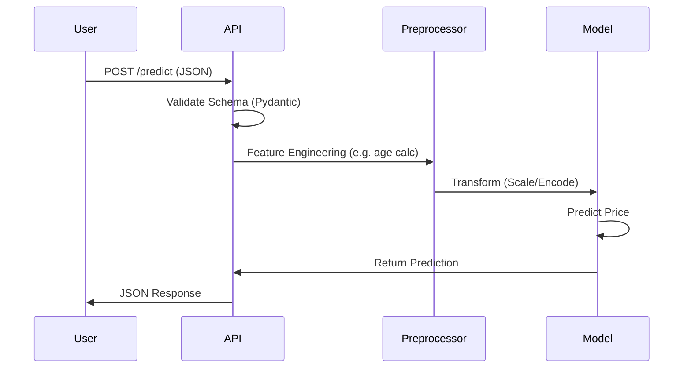

# Architecture Decision Record (ADR) - CarVision

## 1. Overview
CarVision Market Intelligence is designed as a modular, containerized machine learning system. The primary goal is to provide accurate vehicle price predictions and market insights while ensuring reproducibility, scalability, and maintainability.

## 2. System Components

### 2.1 Data Pipeline (`src/carvision/data.py`)
- **Responsibility:** Ingestion, basic row-level cleaning, and deterministic splitting of raw CSV data.
- **Design Choice:** Using `pandas` for efficient in-memory processing. Data volume (<1GB) allows for this approach without distributed computing (Spark/Dask).
- **Key Logic:** 
  - Filters invalid records and outliers (price, year, odometer) using configurable thresholds.
  - Delegates feature engineering (e.g. `vehicle_age`, `brand`, price-based features) to the centralized `FeatureEngineer` in `src/carvision/features.py`.
  - Produces stable train/val/test splits and persists split indices for reproducibility.

### 2.2 Training Pipeline (`src/carvision/training.py`)
- **Responsibility:** Model training and artifact generation.
- **Algorithm:** Random Forest Regressor (Scikit-Learn).
- **Reasoning:** Random Forest handles non-linear relationships and categorical variables well (via OneHotEncoding) with minimal tuning compared to Gradient Boosting, making it robust for a baseline production model.
- **Preprocessing:** `ColumnTransformer` handles imputation (Median/Mode) and scaling (StandardScaler) automatically.
- **Artifacts:** The entire pipeline is serialized via `joblib` to ensure preprocessing steps are locked with the model.

### 2.3 Inference API (`app/fastapi_app.py`)
- **Framework:** FastAPI.
- **Design:**
  - **Shared Logic:** Imports feature engineering logic directly from `src.carvision` to prevent training-serving skew.
  - **Validation:** Pydantic models enforce strict input schema.
  - **Performance:** `uvicorn` provides an asynchronous, high-performance ASGI server.
- **Input Handling:** Accepts raw user inputs (e.g., "2018") and transforms them on-the-fly (e.g., calculating `vehicle_age`) before passing to the model pipeline.

### 2.4 Dashboard (`app/streamlit_app.py`)
- **Framework:** Streamlit + Plotly.
- **Purpose:** Business Intelligence, model explainability and interactive demo for stakeholders.
- **Main Sections:**
  - **📊 Overview** – Top-level KPIs (total inventory value, average/median price, price volatility), price histogram and inventory composition (brands, model years).
  - **📈 Market Analysis** – Executive summary built on `MarketAnalyzer` and `VisualizationEngine` (investment opportunities, risk factors, competitive landscape).
  - **🧠 Model Metrics** – Visualization of core metrics (RMSE, MAE, R², MAPE), model vs baseline comparison, bootstrap confidence intervals and temporal backtest using artifacts from `artifacts/metrics*.json`.
  - **🔮 Price Predictor** – Single-vehicle price estimation via the trained sklearn `Pipeline` (features → pre → model), including market percentile positioning and optional SHAP-based explanations.

## 3. Data Flow

## 4. Technology Stack & Trade-offs

| Component | Choice | Alternatives | Trade-offs |
|-----------|--------|--------------|------------|
| **Language** | Python 3.10+ | R, Julia | Python offers the best MLOps ecosystem (FastAPI, Streamlit, DVC). |
| **Model** | Random Forest | XGBoost, Linear Regression | RF is more robust to outliers than LR, easier to tune than XGBoost. |
| **API** | FastAPI | Flask, Django | FastAPI provides auto-docs (Swagger) and async support out-of-the-box. |
| **UI** | Streamlit | Dash, React | Streamlit allows rapid Python-only development at the cost of customization flexibility. |
| **Packaging** | Docker | Conda, Virtualenv | Docker ensures environment consistency across Dev/Prod. |

## 5. CI/CD & DevOps
- **GitHub Actions:** Runs linting (`flake8`, `black`) and unit tests (`pytest`) on every push.
- **Docker:** Multi-stage builds could be implemented to reduce image size (currently using slim-buster).
- **Reproducibility:** `make` commands standardize entry points.

## 6. Future Improvements
- **Model Registry:** Integrate MLflow Tracking Server for experiment management.
- **Data Versioning:** Fully implement DVC with remote storage (S3/GCS).
- **Monitoring:** Add Prometheus middleware to FastAPI to track request latency and drift.
