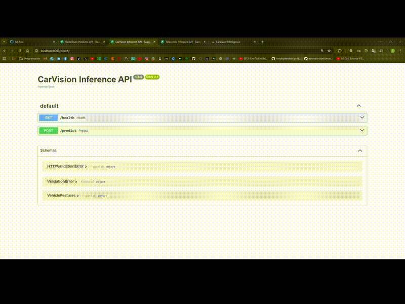

# CarVision Market Intelligence

[](https://github.com/DuqueOM/ML-MLOps-Portfolio/actions/workflows/ci-mlops.yml)
[](../reports/)
[](https://python.org)
[](Dockerfile)
[](https://mlflow.org)
[](https://streamlit.io)

---

<!-- 
=============================================================================
🎬 DEMO GIF PLACEHOLDER
=============================================================================
TODO: Record a 6-8 second GIF showing:
1. Streamlit dashboard interaction
2. Price prediction with gauge visualization

Create GIF:
1. Record screen: enter vehicle details → see prediction
2. Convert: ffmpeg -i video.mp4 -vf "fps=15,scale=800:-1" carvision-demo.gif
3. Place in: ../media/gifs/carvision-preview.gif
4. Uncomment the line below
=============================================================================
-->

<div align="center">

<!--  -->
**[🎬 DEMO GIF — PENDING]** <!-- Remove this line after adding GIF -->

**[📺 Watch Full Demo Video](#)** <!-- TODO: Replace # with YouTube/Drive link -->

</div>

---

**End-to-end ML system for vehicle price prediction and market analytics. Features centralized feature engineering, FastAPI serving, and Streamlit dashboards.**

## 📋 Overview
This project implements a robust Machine Learning solution designed for production environments. It includes end-to-end pipelines for data processing, model training, evaluation, and deployment, adhering to MLOps best practices.

### Key Features
- **Reproducible Pipelines**: Managed via DVC/Make for consistent execution.
- **Experiment Tracking**: MLflow integration for metrics and parameters.
- **Containerization**: Optimized Docker images for training and inference.
- **Quality Assurance**: High test coverage, type checking, and linting.
- **Scalable Serving**: FastAPI for high-performance inference and Streamlit for interactive dashboards.

## 🚀 Quickstart

### Prerequisites
- Docker & Docker Compose
- Python 3.11+
- Make (optional, but recommended)

### One-Click Demo (Local)
Train the model and run both API + Dashboard locally:

```bash
make start-demo
```

- **API (Swagger)**: [http://localhost:8000/docs](http://localhost:8000/docs)
- **Dashboard (Streamlit)**: [http://localhost:8501](http://localhost:8501)

### Full Portfolio Demo (Docker)
Run all 3 projects together from the portfolio root:

```bash
cd ..  # Go to portfolio root
docker compose -f docker-compose.demo.yml up --build
```

- **CarVision API**: [http://localhost:8002/docs](http://localhost:8002/docs)
- **CarVision Dashboard**: [http://localhost:8501](http://localhost:8501)
- **MLflow**: [http://localhost:5000](http://localhost:5000)

### Manual Setup
```bash
# Install dependencies
pip install -r requirements.txt

# Run training
python main.py --mode train --config configs/config.yaml

# Run API
uvicorn app.fastapi_app:app --reload
```

## 📊 Data
The project uses a structured data pipeline:
1.  **Raw Data**: Ingested from source (CSV/DB).
2.  **Processing**: Cleaning, validation, and feature engineering via `src.carvision.features`.
3.  **Splitting**: Train/Val/Test splits saved as artifacts.

Data versioning is handled by DVC. To reproduce data stages:
```bash
dvc repro data_processing
```

## 🧠 Training
Training is configured via `configs/config.yaml`. The pipeline includes:
- Feature Engineering (temporal features, binning)
- Preprocessing (Imputation, OneHotEncoding, Scaling)
- Model Training (RandomForest/LightGBM)
- Evaluation (CV, Bootstrap, Temporal Backtesting)

To retrain:
```bash
python main.py --mode train
```

## 🔌 Serving
### API (FastAPI)
REST endpoint for real-time inference.

**Request Example:**
```bash
curl -X POST "http://localhost:8000/predict" \
     -H "Content-Type: application/json" \
     -d '{
  "model_year": 2018,
  "odometer": 45000,
  "model": "ford f-150",
  "fuel": "gas",
  "transmission": "automatic"
}'
```

**Response:**
```json
{
  "prediction": 24500.0,
  "vehicle_age": 6,
  "brand": "ford"
}
```

### Dashboard (Streamlit)
Interactive UI for market analysis, model performance review and price prediction.

Sections:
- **Overview** – Portfolio KPIs, price distribution and inventory breakdown.
- **Market Analysis** – Executive-level investment and risk insights powered by `MarketAnalyzer` and `VisualizationEngine`.
- **Model Metrics** – RMSE/MAE/R²/MAPE, bootstrap confidence intervals and temporal backtest from `artifacts/metrics*.json`.
- **Price Predictor** – Single-vehicle ML price estimator with market percentile positioning and gauge visualization.

Run locally:
```bash
streamlit run app/streamlit_app.py
```

Requirements for the dashboard:
- Trained model artifact at `artifacts/model.joblib`.
- Metrics files at `artifacts/metrics.json` (and optionally `metrics_baseline.json`, `metrics_bootstrap.json`, `metrics_temporal.json`).
- Dataset `data/raw/vehicles_us.csv` available in the project root or under `data/raw/`.

Optional enhancements:
- `pip install pandera` to enable data schema validation on load.
- `pip install shap` to enable SHAP-based prediction explanations in the Price Predictor tab.

## 📈 Monitoring & Operations
- **Health Check**: `GET /health` returns 200 OK if model is loaded.
- **MLflow**: Tracks all training runs. View with `mlflow ui`.
- **Logging**: Structured logging in `logs/` directory.

See [OPERATIONS.md](docs/OPERATIONS.md) for detailed runbook.

## 🛠️ Architecture
See [ARCHITECTURE.md](docs/ARCHITECTURE.md) for system design, data flow, and component diagrams.

## 🐛 Troubleshooting

| Issue | Solution |
|-------|----------|
| Docker issues | Run `docker-compose down -v` to clear volumes |
| Missing dependencies | Ensure `requirements.txt` is synced |
| Tests failing | Run `pytest -v` to identify regressions |
| Model not found | Run training first: `python main.py --mode train` |

---

## 📋 CI Notes

| Component | Details |
|-----------|---------|
| **Workflow** | `.github/workflows/ci-mlops.yml` |
| **Coverage** | 96% (threshold: 70%) |
| **Python** | 3.11, 3.12 (matrix) |

**If tests fail**: Check the `tests` job logs → expand coverage artifact.

---

## 📄 Model Card

See [models/model_card.md](models/model_card.md) for:
- Model architecture (RandomForest with FeatureEngineer pipeline)
- Performance metrics (RMSE, MAE, R², MAPE)
- Validation methods (Cross-validation, Bootstrap, Temporal backtest)
- Reproduction instructions

---

## ✅ Acceptance Checklist

- [x] Tests pass (`pytest`)
- [x] API starts and responds
- [x] Dashboard loads without errors
- [x] Docker image builds
- [x] Model card documented

---

## 👥 Maintainers

- **Daniel Duque** - Lead MLOps Engineer - [GitHub](https://github.com/DuqueOM)
