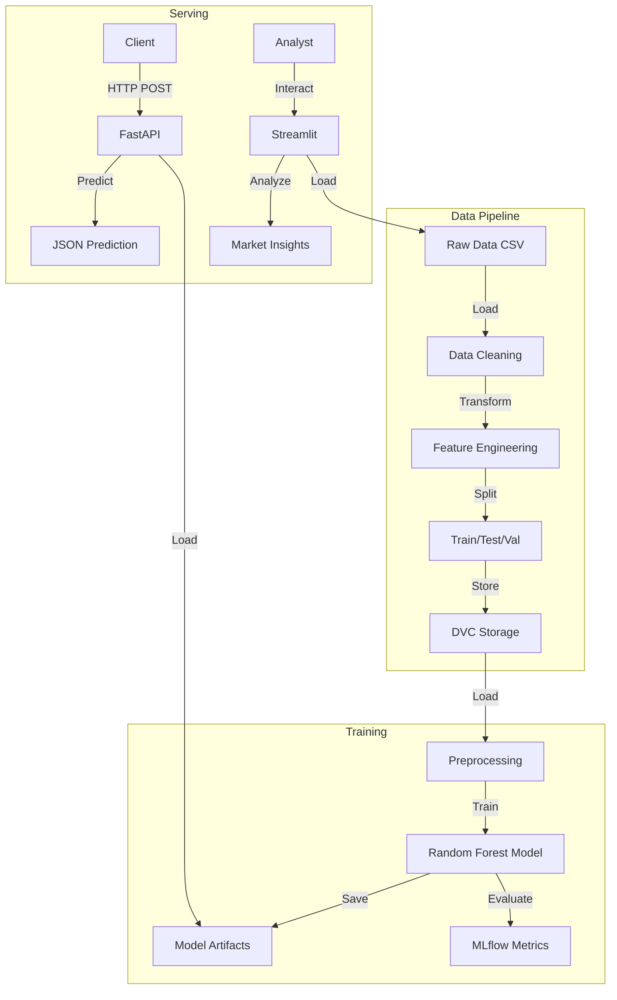

# Architecture - CarVision Market Intelligence

## System Overview
CarVision Market Intelligence is a Machine Learning system designed to predict vehicle prices and analyze market trends. It leverages a modular architecture to ensure scalability, reproducibility, and maintainability. The system is divided into three main subsystems:
1.  **Training Pipeline**: Handles data ingestion, feature engineering, and model training.
2.  **Inference Service**: Provides real-time predictions via a REST API.
3.  **Analytics Dashboard**: Offers interactive market insights for end-users.

## High-Level Architecture

## Component Details

### 1. Data Processing (`src.carvision.data`)
-   **Responsibility**: Validates and cleans raw data.
-   **Key Decision**: Parameterized filtering via `config.yaml` allows flexible data quality rules without code changes.
-   **Trade-off**: Using pandas for processing is efficient for datasets <10GB but may require Spark for larger scales.

### 2. Feature Engineering (`src.carvision.features`)
-   **Responsibility**: Centralized logic for feature creation (e.g., `vehicle_age`, `brand`).
-   **Design Pattern**: Implemented as a scikit-learn Transformer (`FeatureEngineer`). This ensures exact consistency between training and inference, preventing training-serving skew.

### 3. Model Training (`src.carvision.training`)
-   **Algorithm**: Random Forest Regressor.
-   **Reasoning**: Handles non-linear relationships and categorical interactions well; robust to outliers.
-   **Pipeline**: `scikit-learn` Pipeline encapsulates Preprocessing (Imputer, Encoder) and Model, simplifying deployment.

### 4. API Service (`app/fastapi_app.py`)
-   **Framework**: FastAPI.
-   **Performance**: Uses `uvicorn` with `uvloop` for high-throughput async handling.
-   **Validation**: Pydantic models ensure request schema validity.

### 5. Dashboard (`app/streamlit_app.py`)
-   **Framework**: Streamlit.
-   **Purpose**: Rapid prototyping of visualization tools for stakeholders. Direct integration with Python logic allows sharing code with analysis modules.

## Infrastructure & DevOps

### Containerization
-   **Multi-stage Docker Builds**: Separate stages for building dependencies and running the app reduce image size and improve security by excluding build tools from runtime.
-   **Non-root User**: Containers run as `appuser` to mitigate privilege escalation risks.

### CI/CD
-   **GitHub Actions**: Automated workflows for:
    -   Linting (`ruff`, `flake8`)
    -   Testing (`pytest`)
    -   Coverage reporting
    -   Security scanning (`gitleaks`)

### Experiment Tracking
-   **MLflow**: Used to log parameters (`n_estimators`, `max_depth`) and metrics (`RMSE`, `R2`). Enables comparison of different model versions.

## Data Flow
1.  **Ingestion**: Data arrives as CSV. DVC tracks the file hash.
2.  **Processing**: Scripts clean and feature-engineer data.
3.  **Training**: Model is trained on processed data. Artifacts (`model.joblib`, `preprocessor.pkl`) are versioned.
4.  **Deployment**: Docker image is built containing the artifacts.
5.  **Inference**: API loads artifacts at startup and serves predictions.

## Key Design Decisions
-   **Centralized Configuration**: All hyperparameters and paths are in `configs/config.yaml`. avoiding hardcoded values.
-   **DVC for Data**: Ensures data reproducibility. Git tracks code, DVC tracks data.
-   **Makefiles**: Standardize developer commands (`make train`, `make test`), abstracting complex shell commands.
