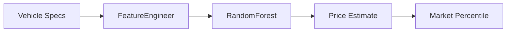

# CarVision Market Intelligence — One-Pager

> **TL;DR**: End-to-end ML platform for vehicle price prediction with interactive Streamlit dashboard and REST API. R² = 0.77, RMSE = $4,396.

---

## 🎯 Business Problem

Used car pricing is complex with many variables. Dealerships and buyers need accurate, instant valuations based on vehicle specifications and market conditions.

---

## 🔧 Solution



**Centralized FeatureEngineer** ensures consistency across training, inference, and analysis. RandomForest regressor with bootstrap confidence intervals.

---

## 📊 Key Metrics

| Metric | Value | Context |
|--------|-------|---------|
| **R²** | 0.77 | Explains 77% of price variance |
| **RMSE** | $4,396 | Average prediction error |
| **MAE** | $2,371 | Median error |
| **Coverage** | 97% | Test coverage |

---

## 🛠️ Tech Stack


- **ML**: Scikit-learn, RandomForest, SHAP
- **Dashboard**: Streamlit with 4 interactive tabs
- **API**: FastAPI with Prometheus metrics
- **Ops**: Docker, GitHub Actions, MLflow

---

## 🚀 Quick Demo

```bash
# Start API + Dashboard
docker-compose -f docker-compose.demo.yml up -d

# API Prediction
curl -X POST "http://localhost:8002/predict" \
     -H "Content-Type: application/json" \
     -d '{"model_year":2018,"model":"ford f-150","condition":"good","cylinders":6,"fuel":"gas","odometer":50000,"transmission":"automatic","drive":"4wd","type":"truck","paint_color":"white"}'

# Response: {"prediction": 28500.0}
```

**Dashboard**: `http://localhost:8501`

---

## 📈 Dashboard Features

| Tab | Description |
|-----|-------------|
| **Overview** | Portfolio KPIs, price distribution |
| **Market Analysis** | Investment insights, risk analysis |
| **Model Metrics** | RMSE, bootstrap CIs, temporal backtest |
| **Price Predictor** | Interactive ML prediction with gauge |

---

## 🔗 Links

| Resource | URL |
|----------|-----|
| **GitHub** | [DuqueOM/ML-MLOps-Portfolio](https://github.com/DuqueOM/ML-MLOps-Portfolio) |
| **API Docs** | `http://localhost:8002/docs` |
| **Dashboard** | `http://localhost:8501` |
| **Model Card** | [models/model_card.md](../models/model_card.md) |

---

## 👤 Author

**Daniel Duque** — ML/MLOps Engineer  
[](https://linkedin.com/in/duqueom)
