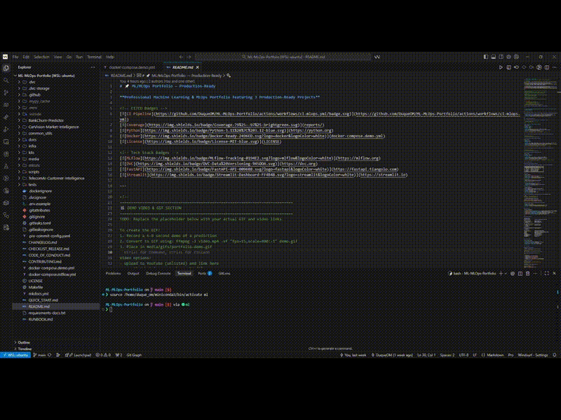
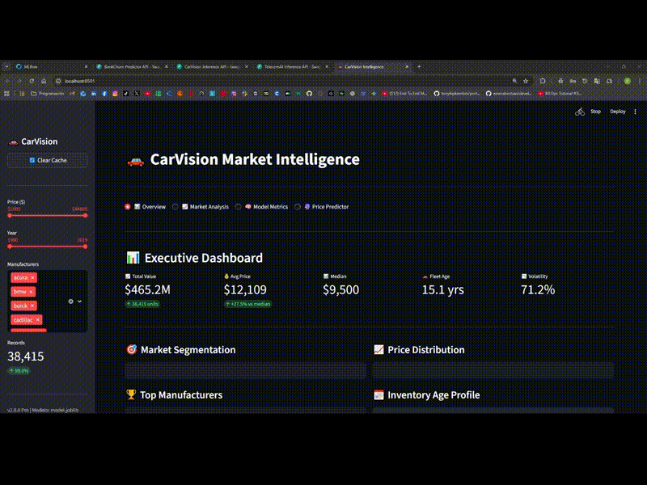
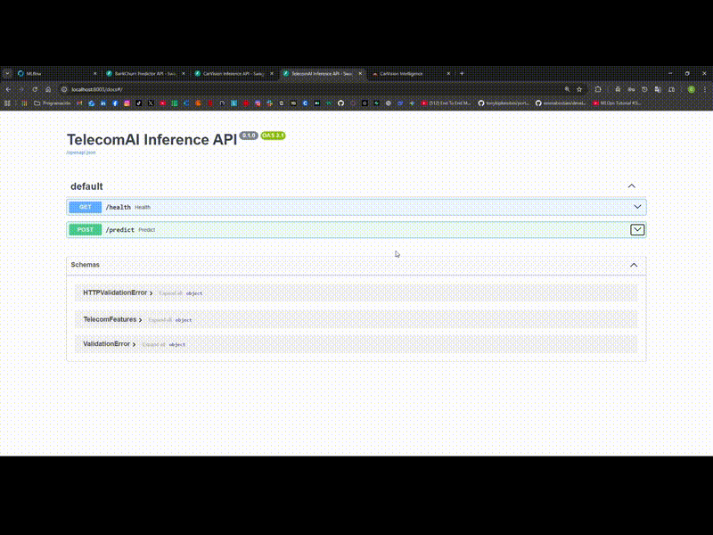
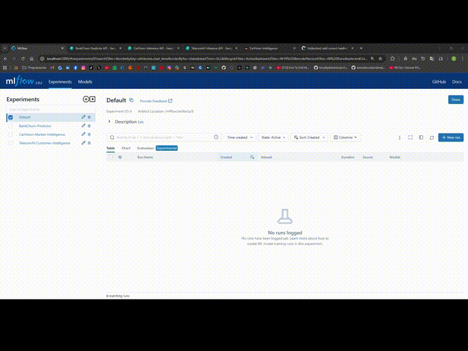
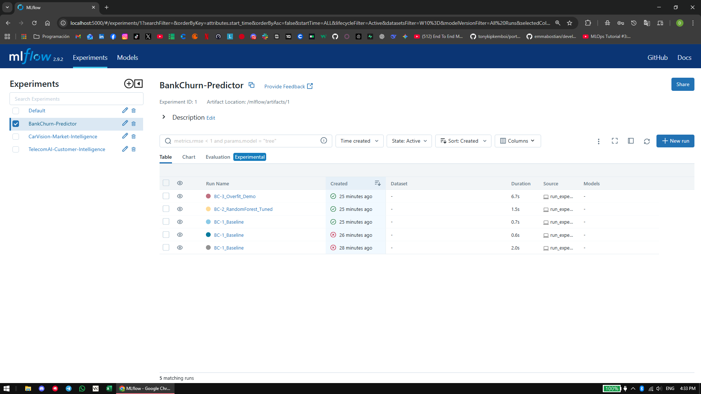

# 🚀 ML/MLOps Portfolio — Production-Ready

**Professional Machine Learning & MLOps Portfolio featuring 3 Production-Ready Projects**

<!-- CI/CD Badges -->
[](https://github.com/DuqueOM/ML-MLOps-Portfolio/actions/workflows/ci-mlops.yml)
[](reports/)
[](https://python.org)
[](docker-compose.demo.yml)
[](LICENSE)

<!-- Tech Stack Badges -->
[](https://mlflow.org)
[](https://dvc.org)
[](https://fastapi.tiangolo.com)
[](https://streamlit.io)

---

<div align="center">



### 📺 Watch the Full Demo

[](https://youtu.be/qmw9VlgUcn8)

*End-to-end walkthrough: Architecture, MLflow experiments, API demos, and Streamlit dashboards*

</div>

---

> **A professional portfolio demonstrating the complete Machine Learning lifecycle: from exploratory analysis and model training, to CI/CD pipelines, REST APIs, and containerized deployment.**

---

## 👨‍💻 About This Portfolio

This repository focuses on **3 Main Projects (Top-3)** brought to professional software engineering standards, demonstrating Senior/Enterprise capabilities in:

- ✅ **Advanced Machine Learning**: Ensembles, Regression, Classification with imbalance handling
- ✅ **MLOps & CI/CD**: Unified automated pipelines (`ci-mlops.yml`), rigorous testing, and security scanning
- ✅ **Software Engineering**: Modular architecture, Pydantic validation, FastAPI-based APIs
- ✅ **Deployment**: Complete Dockerization and interactive dashboards (Streamlit)

---

## 🌟 TOP-3: Production-Ready Projects

### 🏦 1. [BankChurn Predictor](BankChurn-Predictor/) — Customer Churn Prediction

<details>
<summary>🎬 Click to expand demo</summary>


</details>

**Production-grade customer churn prediction system for banking**

| Metric | Value | Notes |
|--------|-------|-------|
| **F1-Score** | **0.64** | Tuned RandomForest |
| **AUC-ROC** | **0.87** | 3 experiments tracked |
| **Coverage** | 79% | Unit + Integration |
| **Latency** | <50ms | FastAPI async |

- **Architecture**: Modular Python package (`src/bankchurn`) with Pydantic config validation
- **MLOps**: MLflow experiment tracking with baseline/tuned/overfit comparison runs
- **Tech Stack**: FastAPI, Scikit-learn (Ensemble), Docker, DVC
- **Model Card**: [View](BankChurn-Predictor/models/model_card.md)

[📂 View Project →](BankChurn-Predictor/) | [📺 Video Demo](https://youtu.be/qmw9VlgUcn8)

---

### 🚗 2. [CarVision Market Intelligence](CarVision-Market-Intelligence/) — Vehicle Price Prediction

<details>
<summary>🎬 Click to expand demo (API + Streamlit)</summary>

**API Demo:**


**Streamlit Dashboard:**


</details>

**Vehicle valuation platform with BI Dashboard and REST API**

| Metric | Value | Notes |
|--------|-------|-------|
| **R²** | **0.77** | RandomForest tuned |
| **RMSE** | **$4,396** | 3 experiments tracked |
| **Coverage** | 97% | Comprehensive tests |

- **User Experience**: Streamlit dashboard with 4 sections: Overview, Market Analysis, Model Metrics, Price Predictor
- **Backend**: REST API (FastAPI) with centralized `FeatureEngineer` class for consistent inference
- **Modeling**: Optimized RandomForest with `[features → pre → model]` pipeline, bootstrap CI, temporal backtest
- **Model Card**: [View](CarVision-Market-Intelligence/models/model_card.md)

[📂 View Project →](CarVision-Market-Intelligence/) | [📺 Video Demo](https://youtu.be/qmw9VlgUcn8)

---

### 📱 3. [TelecomAI Customer Intelligence](TelecomAI-Customer-Intelligence/) — Plan Recommendation

<details>
<summary>🎬 Click to expand demo</summary>



</details>

**Strategic customer intelligence for telecommunications**

| Metric | Value | Notes |
|--------|-------|-------|
| **AUC-ROC** | **0.84** | GradientBoosting |
| **F1-Score** | **0.63** | 3 experiments tracked |
| **Coverage** | 97% | Full test suite |

- **Modeling**: GradientBoosting and RandomForest classifiers with experiment comparison
- **Pipeline**: Standardized preprocessing with MLflow tracking
- **Automation**: End-to-end tests integrated in unified CI pipeline
- **Model Card**: [View](TelecomAI-Customer-Intelligence/models/model_card.md)

[📂 View Project →](TelecomAI-Customer-Intelligence/) | [📺 Video Demo](https://youtu.be/qmw9VlgUcn8)

---

## 🛠️ Tech Stack & MLOps

### Unified CI/CD Infrastructure (Staff-Level)

The entire portfolio is validated by a single master workflow (`ci-mlops.yml`) that orchestrates:

```
┌─────────────────────────────────────────────────────────────────┐
│  CI/CD Pipeline: .github/workflows/ci-mlops.yml                 │
├─────────────────────────────────────────────────────────────────┤
│  1. Build & Env    → Python 3.11/3.12 matrix, pip cache         │
│  2. Data Quality   → Validate data before tests                 │
│  3. Code Quality   → flake8, black, mypy, bandit                │
│  4. Testing        → pytest with coverage reports               │
│  5. Docker Build   → Multi-stage, push to GHCR                  │
│  6. Security       → Trivy container scanning                   │
└─────────────────────────────────────────────────────────────────┘
```

### CI Notes

| Component | Details |
|-----------|---------|
| **Workflow file** | `.github/workflows/ci-mlops.yml` |
| **Jobs** | `tests` → `coverage` → `docker-build` → `e2e` |
| **Python versions** | 3.11, 3.12 (matrix testing) |
| **Coverage threshold** | BankChurn ≥79%, CarVision/TelecomAI ≥80% |
| **Docker registry** | GitHub Container Registry (GHCR) |

**If a run fails:**
1. Check the `tests` job logs first
2. Expand `coverage-report` artifact for detailed coverage
3. For Docker failures, check base image availability

### Infrastructure as Code (IaC)

- **Terraform**: AWS and GCP modules in `infra/terraform/`
  - Full stack: EKS, S3, RDS, ECR (see `main.tf`)
  - **S3 Artifact Store**: Versioning, encryption, lifecycle policies
- **Kubernetes**: Production-ready manifests in `k8s/`

### Key Technologies

| Category | Technologies |
|----------|--------------|
| **Core** | Python 3.11+, Pandas, NumPy, Scikit-learn, XGBoost |
| **Web** | FastAPI, Streamlit, Uvicorn |
| **Ops** | Docker (Multi-Stage), GitHub Actions, Kubernetes, Make |
| **Tracking** | MLflow, DVC |
| **Monitoring** | Prometheus, Grafana |
| **Security** | Trivy, Bandit, Gitleaks |
| **Registry** | GitHub Container Registry (GHCR) |

### MLflow Experiment Tracking

<details>
<summary>🎬 Click to expand MLflow demo</summary>



</details>

All 3 projects are integrated with a central MLflow server for unified experiment tracking. Each project has **3 tracked runs** demonstrating baseline, tuned, and alternative model comparisons.

```bash
# 1. Start the demo stack (includes MLflow server)
docker compose -f docker-compose.demo.yml up -d

# 2. Run all experiments (9 total runs across 3 projects)
python scripts/run_experiments.py
```

**View experiments at [http://localhost:5000](http://localhost:5000)**

| Experiment | Runs | Best Metric | Comparison |
|------------|------|-------------|------------|
| **BankChurn-Predictor** | 3 | F1=0.64, AUC=0.87 | Baseline vs Tuned vs Overfit |
| **CarVision-Market-Intelligence** | 3 | RMSE=$4,396, R²=0.77 | Ridge vs RF vs GradientBoosting |
| **TelecomAI-Customer-Intelligence** | 3 | Acc=0.82, F1=0.63 | LogReg vs GB vs RandomForest |



---

## 📚 Documentation

| Document | Description |
|----------|-------------|
| **[Architecture](docs/ARCHITECTURE_PORTFOLIO.md)** | System design with Mermaid diagrams, Docker multi-stage, CI/CD pipeline |
| **[Operations Runbook](docs/OPERATIONS_PORTFOLIO.md)** | Deployment guide (Docker/K8s), monitoring, troubleshooting |
| **[Runbook (Quick Reference)](RUNBOOK.md)** | Copy-paste commands for common operations |
| **[Release Process](docs/RELEASE.md)** | Release workflow, GHCR publishing, rollback procedures |
| **[Dependencies](docs/DEPENDENCY_CONFLICTS.md)** | Conflict analysis (PyArrow, Pydantic), remediation plan |
| **[Release Checklist](CHECKLIST_RELEASE.md)** | Pre-launch verification checklist |
| **[Quick Start](QUICK_START.md)** | One-command demo for quick evaluation |

---

## 📁 Portfolio Structure

```
ML-MLOps-Portfolio/
├── .github/workflows/
│   └── ci-mlops.yml               # ⚡ Unified CI Pipeline (Build, Test, Scan)
│
├── BankChurn-Predictor/           # 🏦 Tier-1 Project
│   ├── src/bankchurn/             # Modular Python package
│   ├── models/model_card.md       # Model documentation
│   ├── tests/                     # Unit & integration tests
│   └── Dockerfile
│
├── CarVision-Market-Intelligence/ # 🚗 Interactive App
│   ├── app/                       # Streamlit + FastAPI
│   ├── models/model_card.md       # Model documentation
│   ├── tests/
│   └── Dockerfile
│
├── TelecomAI-Customer-Intelligence/# 📱 Advanced Analytics
│   ├── models/model_card.md       # Model documentation
│   ├── tests/
│   └── Dockerfile
│
├── common_utils/                  # Shared utilities (seed, logger)
├── tests/integration/             # Cross-project integration tests
├── infra/                         # Docker Compose, Terraform, Prometheus/Grafana
├── k8s/                           # Kubernetes manifests (deployments, HPA, ingress)
├── media/                         # Videos, GIFs, screenshots
├── docs/                          # Global documentation
├── RUNBOOK.md                     # Quick command reference
├── CHECKLIST_RELEASE.md           # Pre-launch checklist
├── CONTRIBUTING.md                # Contribution guidelines
├── CHANGELOG.md                   # Version history
└── README.md                      # This file
```

---

## 📈 Quality Metrics

| Metric | Status | Target |
|--------|--------|--------|
| **CI Pipeline** | 🟢 **Passing** | 100% Green |
| **Test Coverage** | 🟢 **79%–97%** | ≥79% BankChurn, ≥80% others |
| **Security** | 🛡️ **Scanned** | 0 Critical CVEs |
| **Docker Builds** | 🐳 **Multi-Stage** | 50% Size Reduction |
| **Python Support** | ✅ **3.11 & 3.12** | Matrix Testing |

---

## 🚀 Quick Start

### One-Liner Demo (Recommended)
```bash
# 1. Generate demo models first (required for first run)
bash scripts/setup_demo_models.sh

# 2. Start full demo stack with all 3 services + MLflow
make docker-demo
# or: docker-compose -f docker-compose.demo.yml up -d --build

# 3. Run integration tests to verify everything works
bash scripts/run_demo_tests.sh
```

**Demo includes:**
- 🏦 BankChurn API: `http://localhost:8001/docs`
- 🚗 CarVision API: `http://localhost:8002/docs`
- 🚗 CarVision Dashboard: `http://localhost:8501`
- 📱 TelecomAI API: `http://localhost:8003/docs`
- 📊 MLflow UI: `http://localhost:5000`
- 📈 Prometheus: `http://localhost:9090` (with --profile monitoring)
- 📊 Grafana: `http://localhost:3000` (with --profile monitoring)

### Manual Setup (BankChurn)
```bash
# 1. Clone repository
git clone https://github.com/DuqueOM/ML-MLOps-Portfolio.git
cd ML-MLOps-Portfolio

# 2. Using Docker Compose (easiest)
docker-compose -f docker-compose.demo.yml up -d

# 3. Or build individual service
cd BankChurn-Predictor
docker build -t bankchurn:latest .
docker run -p 8000:8000 bankchurn:latest

# 4. Test API
curl -X POST "http://localhost:8001/predict" \
     -H "Content-Type: application/json" \
     -d '{
       "CreditScore": 650,
       "Geography": "France",
       "Gender": "Female",
       "Age": 40,
       "Tenure": 3,
       "Balance": 60000,
       "NumOfProducts": 2,
       "HasCrCard": 1,
       "IsActiveMember": 1,
       "EstimatedSalary": 50000
     }'
```

### Development Setup
```bash
# Install dependencies for all projects
make install

# Run tests
make test

# Run integration tests
pytest tests/integration/test_demo.py -v

# Check service health
make health-check

# Security scans
bandit -r . -f json -o bandit-report.json
docker run --rm aquasec/trivy image <image-name>
```

---

## 👤 Author

**Duque Ortega Mutis (DuqueOM)**  
*Machine Learning & MLOps Engineer*

[](https://linkedin.com/in/duqueom) 
[](https://github.com/DuqueOM)

---

## 📬 How to Reach Me

- **Portfolio Review**: Open an issue with tag `[portfolio-review]`
- **Collaboration**: Reach out via LinkedIn
- **Bug Reports**: Use GitHub Issues

---

<div align="center">

**Status**: ✅ Production-Ready | **Last Updated**: December 2025

*Star ⭐ this repo if you find it useful!*

</div>
