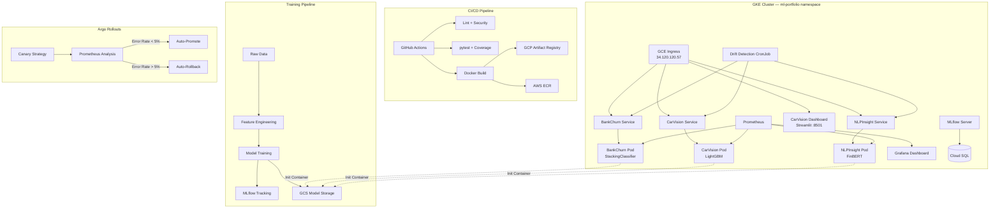

# 🚀 ML/MLOps Portfolio — Production-Ready

<div align="center">

**Enterprise-Grade Machine Learning & MLOps Portfolio**

*3 Production-Ready Projects • Unified CI/CD • Full Observability Stack*

[](https://duqueom.github.io/ML-MLOps-Portfolio/)
[](https://youtu.be/qmw9VlgUcn8)

---

[](https://github.com/DuqueOM/ML-MLOps-Portfolio/actions/workflows/ci-mlops.yml)
[](https://codecov.io/gh/DuqueOM/ML-MLOps-Portfolio)
[](https://www.python.org/)
[](docker-compose.demo.yml)
[](LICENSE)
[](CHANGELOG.md)

[](https://mlflow.org/)
[](https://fastapi.tiangolo.com/)
[](docs/DEPLOYMENT_EVIDENCE.md)
[](infra/terraform/aws/)
[](k8s/)
[](infra/terraform/)
[](infra/prometheus-config.yaml)
[](infra/grafana/)

</div>

---

## ⚡ 30-Second Pitch

> After **14 years managing high-pressure operations** in hospitality and logistics, I discovered that the principles that make great operational systems—reliability, monitoring, reproducibility—are the same ones that make great ML systems.
>
> This portfolio demonstrates that transition: **not just ML models that achieve good metrics, but production-ready systems** built with the discipline of someone who understands that downtime costs real money and poor monitoring creates real problems.
>
> Every project here answers the question: ***"Would I trust this in production at 2am?"***

<div align="center">


*End-to-end walkthrough: GCP deployment, ML predictions, monitoring, and CI/CD pipeline*

</div>

---

## 📊 Key Metrics

| Project | Type | Best Metric | Coverage | API Latency | Key Features |
|---------|------|-------------|----------|-------------|---------------|
| [🏦 BankChurn](BankChurn-Predictor/) | Classification | **AUC 0.87**, F1 0.62 | 90% | 180ms p50 | StackingClassifier (5 models), Feature Engineering, Drift Detection |
| [🚗 CarVision](CarVision-Market-Intelligence/) | Regression | **R² 0.80**, RMSE $6.7K | 96% | 110ms p50 | LightGBM + FeatureEngineer, Streamlit Dashboard (4 tabs) |
| [📝 NLPInsight](NLPInsight-Analyzer/) | Classification | **Acc 97%** (sentiment) | 98% | 220ms p50 | FinBERT (ProsusAI), Transfer Learning, Financial PhraseBank |

| Infrastructure | Status | Details |
|----------------|--------|---------- |
| **GCP Deployment** | ✅ Live | GKE cluster (7 nodes), 8 pods (incl. Streamlit dashboard), Ingress IP, Artifact Registry |
| **AWS Deployment** | 🟡 Ready | EKS + ECR + S3 + RDS — Terraform + K8s overlays complete |
| **CI/CD** | ✅ Unified | GitHub Actions → GKE + EKS (separate deploy workflows) |
| **IaC** | ✅ Multi-Cloud | Terraform (GCP + AWS) — parallel provider configs |
| **Monitoring** | ✅ Full Stack | Prometheus + Grafana + MLflow — cloud-agnostic on K8s |
| **Security** | ✅ Automated | Gitleaks, Bandit, Trivy, pip-audit — blocking in CI (HIGH severity) |

---

## 🌟 TOP-3: Production-Ready Projects

### 🏦 1. [BankChurn Predictor](BankChurn-Predictor/) — Customer Churn Prediction

Production-grade churn prediction with **StackingClassifier** ensemble (RF + GradientBoosting + XGBoost + LightGBM → LogisticRegression meta-learner). Advanced `ChurnFeatureEngineer` with domain-specific ratios, bins, and risk scores. MLflow tracking.

| AUC-ROC | F1 | Precision | Recall | Coverage | Latency |
|---------|-----|-----------|--------|----------|----------|
| **0.87** | 0.62 | 0.73 | 0.54 | 90% | <50ms p95 |

[📂 Project](BankChurn-Predictor/) · [📄 Model Card](BankChurn-Predictor/models/model_card.md) · [📺 Video](https://youtu.be/qmw9VlgUcn8)

---

### 🚗 2. [CarVision Market Intelligence](CarVision-Market-Intelligence/) — Vehicle Price Prediction

End-to-end vehicle valuation platform powered by **LightGBM** with optimized hyperparameters. Centralized `FeatureEngineer` prevents train-serve skew. Streamlit BI Dashboard (4 tabs) and REST API.

| R² | RMSE | MAE | MAPE | Coverage | Dashboard |
|----|------|-----|------|----------|------------|
| **0.80** | $6,744 | $3,973 | 32.9% | 96% | <2s load |

[📂 Project](CarVision-Market-Intelligence/) · [📄 Model Card](CarVision-Market-Intelligence/models/model_card.md) · [📺 Video](https://youtu.be/qmw9VlgUcn8)

---

### � 3. [NLPInsight Analyzer](NLPInsight-Analyzer/) — Financial Sentiment Analysis

Real-time financial sentiment analysis using **ProsusAI/FinBERT** — a BERT model fine-tuned on financial corpora. Domain-specific transfer learning achieving 97% accuracy on Financial PhraseBank. Dual inference backend supports both transformer and sklearn models.

| Accuracy | F1 (weighted) | F1 (macro) | Labels | Coverage |
|----------|---------------|------------|--------|----------|
| **97%** | 0.97 | 0.96 | 3 | 98% |

[📂 Project](NLPInsight-Analyzer/) · [📄 Model Card](NLPInsight-Analyzer/models/model_card.md) · [📺 Video](https://youtu.be/qmw9VlgUcn8)

---

## 🛠️ Tech Stack

| Category | Technologies |
|----------|-------------|
| **ML/DS** | Scikit-learn, XGBoost, LightGBM, PyTorch, Pandas, NumPy, SHAP, Optuna |
| **MLOps** | MLflow (9 experiments), DVC, Docker, Kubernetes, Terraform |
| **API & Dashboard** | FastAPI, Pydantic, Streamlit, Plotly |
| **Cloud & IaC** | GCP (GKE, GCS, AR, Cloud SQL), AWS (EKS, S3, ECR, RDS), Terraform, K8s |
| **Monitoring** | Prometheus (multi-service scraping), Grafana (10-panel dashboard), Load Testing (SRE methodology), Evidently |
| **CI/CD** | GitHub Actions (CI + GCP deploy + AWS deploy), Artifact Registry, ECR, Codecov |
| **Security** | Gitleaks, Bandit, Trivy, pip-audit |
| **Testing** | pytest (90–98% coverage, 367+ tests), Codecov, pre-commit hooks |

> **v3.3.0 Highlights**: StackingClassifier (BankChurn), LightGBM (CarVision), FinBERT (NLPInsight), Lazy SHAP, dual NLP backend, Pandera validation, fairness audits, OpenTelemetry tracing, adversarial tests (43), Pod Security Standards. Load test: 0% error rate, p95 500ms (10 users, 2min). Full details in [docs/FEATURES.md](docs/FEATURES.md).

## 🏗️ Architecture


```mermaid
graph TB
    subgraph "CI/CD Pipeline"
        GH[GitHub Actions] --> LINT[Lint + Security]
        GH --> TEST[pytest + Coverage]
        GH --> BUILD[Docker Build]
        BUILD --> AR[GCP Artifact Registry]
        BUILD --> ECR[AWS ECR]
    end

    subgraph "Training Pipeline"
        DATA[Raw Data] --> FE[Feature Engineering]
        FE --> TRAIN[Model Training]
        TRAIN --> MLFLOW[MLflow Tracking]
        TRAIN --> GCS[GCS Model Storage]
    end

    subgraph "GKE Cluster — ml-portfolio namespace"
        direction TB
        INGRESS[GCE Ingress<br/>34.120.120.57] --> BC_SVC[BankChurn Service]
        INGRESS --> CV_SVC[CarVision Service]
        INGRESS --> NL_SVC[NLPInsight Service]
        INGRESS --> CV_DASH[CarVision Dashboard<br/>Streamlit :8501]

        BC_SVC --> BC_POD[BankChurn Pod<br/>StackingClassifier]
        CV_SVC --> CV_POD[CarVision Pod<br/>LightGBM]
        NL_SVC --> NL_POD[NLPInsight Pod<br/>FinBERT]

        BC_POD -.->|Init Container| GCS
        CV_POD -.->|Init Container| GCS
        NL_POD -.->|Init Container| GCS

        PROM[Prometheus] --> BC_POD
        PROM --> CV_POD
        PROM --> NL_POD
        PROM --> GRAF[Grafana Dashboard]

        MLF[MLflow Server] --> CLOUDSQL[(Cloud SQL)]
        DRIFT[Drift Detection CronJob] --> BC_SVC
        DRIFT --> CV_SVC
        DRIFT --> NL_SVC
    end

    subgraph "Argo Rollouts"
        CANARY[Canary Strategy] --> ANALYSIS[Prometheus Analysis]
        ANALYSIS -->|Error Rate < 5%| PROMOTE[Auto-Promote]
        ANALYSIS -->|Error Rate > 5%| ROLLBACK[Auto-Rollback]
    end
```

For detailed architecture docs, see [docs/ARCHITECTURE_PORTFOLIO.md](docs/ARCHITECTURE_PORTFOLIO.md).

---

## 🚀 Quick Start

```bash
# 1. Clone and enter
git clone https://github.com/DuqueOM/ML-MLOps-Portfolio.git && cd ML-MLOps-Portfolio

# 2. Generate demo models (first time only, ~2 min)
bash scripts/setup_demo_models.sh

# 3. Start full stack (APIs + MLflow + Dashboard, ~3 min build)
docker compose -f docker-compose.demo.yml up -d --build

# 4. Wait for services and verify health (~60s)
sleep 60 && bash scripts/run_demo_tests.sh

# 5. Access services
#    🏦 BankChurn API:    http://localhost:8001/docs
#    🚗 CarVision API:    http://localhost:8002/docs
#    🚗 CarVision UI:     http://localhost:8501
#    � NLPInsight API:   http://localhost:8003/docs
#    📊 MLflow:           http://localhost:5000
```

For API examples, monitoring setup, and troubleshooting, see [QUICK_START.md](QUICK_START.md) and [RUNBOOK.md](RUNBOOK.md).

---

## ☁️ Multi-Cloud Production Deployment

This portfolio demonstrates **cloud-agnostic MLOps** — the same ML system deployed on **both GCP and AWS**:

<div align="center">


*8 services running on GKE: 3 ML APIs (HPA) + Streamlit Dashboard + MLflow + Prometheus + Grafana*

</div>

### Multi-Cloud Architecture

| Component | GCP (Live) | AWS (Ready) |
|-----------|-----------|-------------|
| **K8s Cluster** | GKE (`us-central1`) ✅ | EKS (`us-east-1`) 🟡 |
| **Container Registry** | Artifact Registry ✅ | ECR 🟡 |
| **Model Storage** | Cloud Storage (GCS) ✅ | S3 (versioned + Glacier lifecycle) 🟡 |
| **Database** | Cloud SQL (Postgres) ✅ | RDS (Postgres) 🟡 |
| **Load Balancer** | GCE Ingress (static IP) ✅ | ALB (DNS) 🟡 |
| **IAM for Pods** | Workload Identity ✅ | IRSA 🟡 |
| **Init Containers** | GCS download (`google-cloud-storage`) ✅ | S3 download (`boto3`) 🟡 |
| **CI/CD** | `deploy-gcp.yml` ✅ | `deploy-aws.yml` 🟡 |
| **IaC** | `infra/terraform/gcp/` ✅ | `infra/terraform/aws/` 🟡 |
| **Monitoring** | Prometheus + Grafana + MLflow ✅ | Same stack (cloud-agnostic) 🟡 |

> **Cloud-Agnostic Design**: Monitoring stack (Prometheus, Grafana, MLflow), K8s deployment patterns (HPA, anti-affinity, health probes), and CI/CD structure are identical across clouds. Only the init container SDK and ingress annotations change.

> **💰 Cost-Aware**: Full GCP stack runs at ~$51 USD/month (3 nodes, 6 pods, monitoring + CI/CD). See [detailed cost analysis](docs/ARCHITECTURE_PORTFOLIO.md#-production-infrastructure--cost-analysis).

<div align="center">

[-red?style=for-the-badge&logo=youtube)](https://youtu.be/qmw9VlgUcn8)

</div>

<details>
<summary><strong>📊 GCP Evidence (click to expand)</strong></summary>

#### Terraform IaC — Infrastructure synchronized


#### Monitoring — Grafana Dashboard


#### CI/CD — GitHub Actions Pipeline Completed


#### ML Prediction in Production


</details>

<details>
<summary><strong>🟡 AWS Infrastructure (click to expand)</strong></summary>

#### Terraform AWS — EKS + VPC + S3 + RDS + ECR
- Full Terraform config: [`infra/terraform/aws/`](infra/terraform/aws/)
- EKS cluster with managed node groups (t3.large)
- S3 buckets with versioning, encryption, and Glacier lifecycle
- RDS PostgreSQL for MLflow backend
- ECR repositories with lifecycle policies

#### K8s Overlay — AWS-Specific Manifests
- ALB Ingress: [`k8s/overlays/aws/ingress-aws.yaml`](k8s/overlays/aws/ingress-aws.yaml)
- S3 Download Script: [`k8s/overlays/aws/download-script-aws.yaml`](k8s/overlays/aws/download-script-aws.yaml)
- IRSA Service Account: [`k8s/overlays/aws/serviceaccount-aws.yaml`](k8s/overlays/aws/serviceaccount-aws.yaml)

#### Deploy Workflow
- [`deploy-aws.yml`](.github/workflows/deploy-aws.yml): GitHub Actions → ECR → EKS

</details>

---

## 📚 Documentation

| Document | Description |
|----------|-------------|
| **[Quick Start](QUICK_START.md)** | 5-minute demo with API examples and health checks |
| **[Architecture](docs/ARCHITECTURE_PORTFOLIO.md)** | System design, Mermaid diagrams, infrastructure, CI/CD workflow |
| **[Operations Runbook](RUNBOOK.md)** | Day-to-day commands, Docker, K8s, Terraform deployment |
| **[Features & Changelog](docs/FEATURES.md)** | Performance optimizations, new features, version history |
| **[Release Process](docs/RELEASE.md)** | GHCR publishing, blue/green deployments, rollback procedures |
| **[Contributing](docs/contributing/guidelines.md)** | Development workflow, code standards, PR process |
| **[Security Policy](SECURITY.md)** | Vulnerability reporting and scanning details |

---

## 🔧 Development Process

This portfolio was developed using **AI-assisted tools** (Cursor / Cascade) for code generation and boilerplate acceleration. All architectural decisions, project selection, MLOps pipeline design, infrastructure choices, and system integration were made by the author.

AI tools were used as **accelerators, not replacements** for understanding — the same way senior engineers use code completion and documentation generators to increase throughput while retaining full ownership of design decisions.

The author maintains and operates all systems independently, including CI/CD pipeline debugging, Docker optimization, Terraform configuration, and production monitoring setup.

---

## 👤 Author

**Duque Ortega Mutis (DuqueOM)**
*Machine Learning & MLOps Engineer*

14 years of operational experience transitioning to ML engineering with a focus on production-ready systems, reliability, and operational excellence.

[](https://linkedin.com/in/duqueom)
[](https://github.com/DuqueOM)
[](https://duqueom.github.io/ML-MLOps-Portfolio/)
[](mailto:DuqueOrtegaMutis@gmail.com)

---

<div align="center">

**Portfolio Version**: 3.3.0 · **License**: MIT · **Status**: ✅ Production-Ready (GCP) · 🟡 AWS Ready

*Building ML systems that work at 2am* 🌙

</div>
