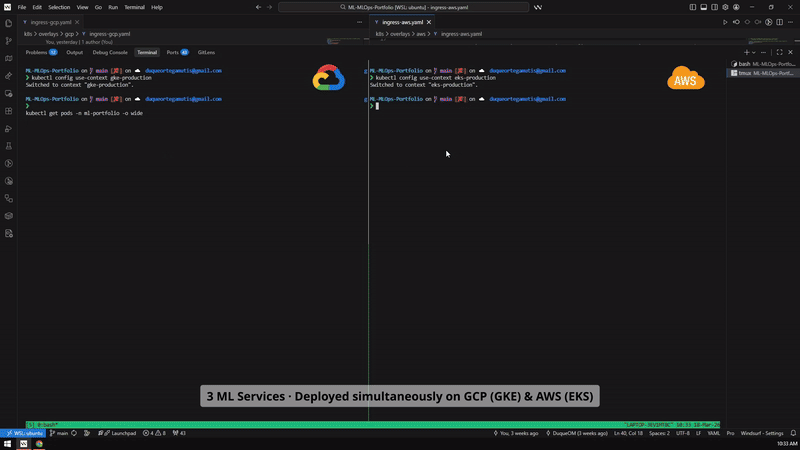
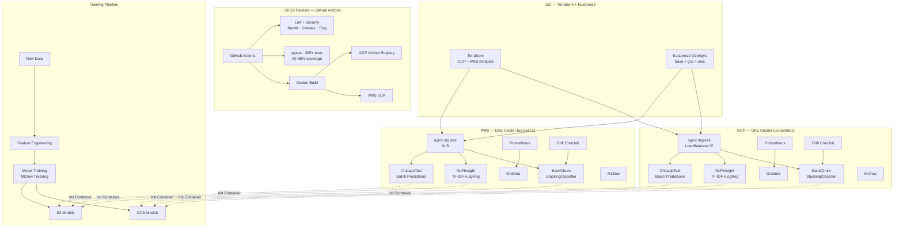

# ML/MLOps Portfolio — Production-Ready

<div align="center">

**3 ML Services · GKE + EKS · 17 ADRs · Production Incidents Diagnosed**

[](https://duqueom.github.io/ML-MLOps-Portfolio/)
[](https://youtu.be/7dFFqq2ROPw)
[](ENGINEERING_HIGHLIGHTS.md)

---

[](https://github.com/DuqueOM/ML-MLOps-Portfolio/actions/workflows/ci-mlops.yml)
[](https://codecov.io/gh/DuqueOM/ML-MLOps-Portfolio)
[](https://www.python.org/)
[](k8s/)
[](infra/terraform/)
[](LICENSE)
[](CHANGELOG.md)

</div>

---

## ⚡ Why This Portfolio Is Different

Most ML portfolios show models that score well. This one shows what happens **after you deploy** — production incidents diagnosed from first principles, wrong decisions corrected and documented, trade-offs measured and justified.

### Three production incidents diagnosed — root cause to fix, documented with data:

| Incident | Root Cause | Fix | Outcome | ADR |
|----------|------------|-----|---------|-----|
| 81% error rate under load | `uvicorn --workers N` on K8s: workers share one CPU budget → thrashing, not parallelism | `asyncio.run_in_executor` + `ThreadPoolExecutor(4)` — sklearn C extensions release the GIL | Errors 81% → 0% · CPU 2000m → 1000m | [014](docs/decisions/014-single-worker-pod-ml-inference.md)/[015](docs/decisions/015-async-inference-threadpool.md) |
| SHAP returning all zeros | `TreeExplainer` incompatible with `StackingClassifier` — evaluated 4 alternatives before deciding | `KernelExplainer` in original 10-feature space (interpretable by business, not 38 encoded cols) | Real SHAP values in production | [010](docs/decisions/010-shap-kernelexplainer-bankchurn.md) |
| HPA never scaled down | Memory-based HPA + fixed ML footprint: `ceil(replicas × usage/target)` always ≥ current replicas | CPU-only HPA — CPU correlates with traffic; memory is constant signal | 3→1 pods in 8 minutes | [001](docs/decisions/001-cpu-only-hpa.md) |

---

**This is not a tutorial project. It's an operational record.**

The CHANGELOG traces the full incident history from v1.0.0 to v3.6.0 — SHAP production bug, Grafana broken panels, AWS EKS LoadBalancer migration, async inference fix — each with root cause and resolution.

<div align="center">



*End-to-end: API predictions with SHAP explainability, multi-cloud deployment, monitoring*

</div>

---

## 🗺️ Quick Navigation

| I want to understand... | Start here |
|------------------------|-----------|
| Why decisions were made (not just what) | [17 ADRs →](docs/decisions/) |
| Incidents diagnosed in production | [ENGINEERING_HIGHLIGHTS.md →](ENGINEERING_HIGHLIGHTS.md) |
| What was built and how it performs | [Key Metrics ↓](#-key-metrics) · [Projects ↓](#-production-ready-projects) |
| How to run it locally in 5 minutes | [Quick Start ↓](#-quick-start) |
| Multi-cloud deployment evidence | [GCP + AWS Evidence ↓](#️-multi-cloud-production-deployment) |
| What broke and when | [CHANGELOG.md →](CHANGELOG.md) |

---

## 📐 Architectural Decision Records — 17 Documented

These are not explanations of what was built — they are records of what was **evaluated, rejected, and why**. Written for technical reviewers and hiring managers.

| ADR | Decision | The Harder Choice |
|-----|----------|-------------------|
| [001](docs/decisions/001-cpu-only-hpa.md) | CPU-only HPA | Proved mathematically that memory HPA cannot scale down ML pods |
| [003](docs/decisions/003-stacking-classifier-bankchurn.md) | StackingClassifier | Acknowledged single LightGBM achieves comparable AUC at lower cost |
| [005](docs/decisions/005-compatible-release-pinning.md) | Compatible release pinning | numpy 2.x silently broke serialized models — silent failure, worst category |
| [006](docs/decisions/006-drift-triggered-retraining.md) | CronJob over Airflow | Documented why Airflow is over-engineering for 3-model portfolio |
| [007](docs/decisions/007-feature-store-decision.md) | No Feature Store | Designed full Feast architecture for when time-window features are needed |
| [008](docs/decisions/008-argo-rollouts-canary.md) | Argo Rollouts canary | Progressive delivery with Prometheus analysis gates — not all-or-nothing rollout |
| [009](docs/decisions/009-simplification-when-not-to-build.md) | Removed CarVision | MAPE 32.9% not defensible — knowing when not to build is harder |
| [010](docs/decisions/010-shap-kernelexplainer-bankchurn.md) | SHAP KernelExplainer | Diagnosed production bug, evaluated 4 alternatives before deciding |
| [014](docs/decisions/014-single-worker-pod-ml-inference.md) | Single-worker pods | Found uvicorn --workers anti-pattern under K8s from first principles |
| [015](docs/decisions/015-async-inference-threadpool.md) | Async inference | GIL analysis → ThreadPoolExecutor → 81% errors → 0% |
| [016](docs/decisions/016-gcp-aws-performance-parity.md) | GCP/AWS latency gap | $24/mo vs $145/mo — both meet SLA; chose FinOps over vanity metrics |
| [017](docs/decisions/017-custom-vs-managed-ml-platforms.md) | Custom vs Managed ML | FastAPI+K8s primary, SageMaker/Vertex AI as documented complement |

[View all 17 ADRs with full context, alternatives considered, and trade-offs →](docs/decisions/)

---

## 📊 Key Metrics

| Project | Type | Best Metric | Coverage | Latency p50 | Key Engineering Decision |
|---------|------|-------------|----------|-------------|--------------------------|
| [🏦 BankChurn](BankChurn-Predictor/) | Classification | **AUC 0.87** | 90% | 200ms GCP / 110ms AWS | Async inference via ThreadPoolExecutor · threshold 0.35 (30:1 cost ratio) |
| [📝 NLPInsight](NLPInsight-Analyzer/) | NLP Sentiment | **Acc 80.6%** | 98% | 78ms GCP / 100ms AWS | Upgraded to harder dataset (97%→80.6%) for honest benchmark |
| [🚕 ChicagoTaxi](ChicagoTaxi-Demand-Pipeline/) | Batch Pipeline | **R² 0.96** | 91% | 100ms GCP / 120ms AWS | Data leakage found & fixed · lag features + temporal split |

| Infrastructure | Status | Details |
|----------------|--------|---------|
| **GCP Deployment** | ✅ Verified | GKE 1-5 nodes, 6 pods, 0% error rate under 100 concurrent users |
| **AWS Deployment** | ✅ Verified | EKS 1-5 nodes, 6 pods, CI/CD via GitHub Actions |
| **CI/CD** | ✅ Unified | 10-job matrix, security scanning (Trivy/Bandit/Gitleaks), automated deploy to both clouds |
| **IaC** | ✅ Multi-Cloud | Terraform (GCP + AWS) · `terraform plan` = 0 drift |
| **Monitoring** | ✅ Full Stack | Prometheus + Grafana (26 panels, 16 alert rules) + MLflow |
| **Security** | ✅ Automated | Blocking on HIGH severity · non-root containers · Network Policies · IRSA/Workload Identity |

> **☁️ Deployment Status**: Both clusters were deployed to production, load-tested, and fully verified — all screenshots, metrics, and evidence are from real running infrastructure. Clusters are provisioned on-demand via Terraform and decommissioned after validation (~$300/month combined when running). This is a deliberate **FinOps practice**: infrastructure is reproducible and re-deployable in <15 minutes with `terraform apply`.

---

## Agentic Development Configuration

This repository includes a production-grade agentic development setup that encodes
the portfolio's 17 ADRs and 3 production incidents directly into the AI development
environment — not as documentation to read, but as behavioral constraints the agent
follows automatically.

```
AGENTS.md           — Project identity, critical DO NOT VIOLATE patterns, HPA targets
.windsurf/
├── rules/          — 7 context-aware rules (glob-triggered per file type)
│   ├── 01-mlops-conventions.md     always_on: core ADR constraints
│   ├── 02-kubernetes.md            k8s/**/*.yaml: HPA targets, single-worker
│   ├── 03-terraform.md             **/*.tf: state management, tagging
│   ├── 04-python-ml.md             **/*.py: async patterns, SHAP, pinning
│   ├── 05-github-actions.md        .github/workflows/: CI standards
│   ├── 06-documentation.md         docs/**/*.md: ADR format, content guidelines
│   └── 07-docker.md                Dockerfile*: multi-stage, non-root, no model bake
├── skills/         — 6 multi-step operational procedures with supplementary data
│   ├── debug-ml-inference/         symptom → root cause → ADR cross-reference
│   ├── deploy-gke/ deploy-aws/     pre/post-deploy checklists + rollback procedures
│   ├── drift-detection/            per-service PSI thresholds + alert integration
│   ├── model-retrain/              validation criteria + acceptance gates per service
│   └── release-checklist/          full multi-cloud release + CHANGELOG template
└── workflows/      — 6 structured prompt workflows (/incident, /retrain, /release,
                      /load-test, /new-adr, /drift-check)
```

The agent knows: 50%/60%/60% CPU targets (not 70%), KernelExplainer for SHAP (not
TreeExplainer), workers=1 (never N) under K8s. Operational knowledge encoded, not
just referenced.

→ [AGENTS.md](AGENTS.md) &nbsp;|&nbsp; [.windsurf/](.windsurf/)

---

## 🌟 Production-Ready Projects

### 🏦 1. [BankChurn Predictor](BankChurn-Predictor/) — Customer Churn Prediction

Production-grade churn prediction with **StackingClassifier** ensemble (RF + GradientBoosting + XGBoost + LightGBM → LogisticRegression meta-learner). `ChurnFeatureEngineer` with domain-specific ratios, bins, and risk scores. MLflow experiment tracking.

| AUC-ROC | F1 | Precision | Recall | Coverage | In-Pod Latency (GKE) |
|---------|-----|-----------|--------|----------|----------------------|
| **0.87** | 0.62 | 0.73 | 0.54 | 90% | 103ms p50 / 111ms p95 |

> **Why these metrics**: AUC-ROC is the primary metric — 20.4% churn rate (4:1 imbalance) makes accuracy meaningless (a "never churn" model scores 79.6%). **Production threshold: 0.35** (not default 0.50) — missed churner costs ~$1,500–$3,000 LTV vs. ~$50 retention offer (30:1 cost ratio). At 0.35 Recall = 0.78; at 0.50 Recall = 0.54. The precision trade-off is intentional and quantified with business context.

**Key engineering decisions:**
- **ADR-015**: `uvicorn --workers N` under Kubernetes causes CPU thrashing (shared budget). Fixed via `asyncio.run_in_executor` + `ThreadPoolExecutor(4)` exploiting GIL release in sklearn C extensions → 81% error rate → 0%, CPU 2000m → 1000m
- **ADR-010**: SHAP returning all-zero values in production. `TreeExplainer` incompatible with `StackingClassifier`. Evaluated 4 alternatives → `KernelExplainer` in original 10-feature space for business interpretability
- **ADR-003**: 7-model comparison (5-fold CV). StackingClassifier AUC 0.87 vs single LightGBM 0.86. Documented that simpler model wins in production with strict latency SLAs

[📂 Project](BankChurn-Predictor/) · [📄 Model Card](BankChurn-Predictor/models/model_card.md) · [📺 Video](https://youtu.be/7dFFqq2ROPw)

---

### 📝 2. [NLPInsight Analyzer](NLPInsight-Analyzer/) — Financial Sentiment Analysis

Financial sentiment analysis on **Twitter Financial News** — 11,931 real financial tweets with stock tickers, informal language, and noisy text. TF-IDF + LogReg production model with dual-backend support (FinBERT for GPU environments).

| Accuracy | F1 (weighted) | F1 (macro) | Labels | Dataset |
|----------|---------------|------------|--------|---------|
| **80.6%** | 0.810 | 0.748 | 3 | 11,931 tweets |

> **Why these metrics**: 80.6% on real financial tweets (vs 97% on the easier Financial PhraseBank) is the honest choice. The dataset upgrade — from 4,845 curated sentences to 11,931 noisy real tweets — deliberately lowered the metric to produce a more defensible benchmark. F1-macro (0.748) guards against ignoring the minority class.

**Key engineering decisions:**
- **ADR-009**: Chose harder dataset over better-looking number — intellectual honesty over portfolio optics
- Dual-backend design: TF-IDF+LogReg for CPU production (5ms p50 in-pod), FinBERT for GPU environments — same API contract, different serving backend

[📂 Project](NLPInsight-Analyzer/) · [📄 Model Card](NLPInsight-Analyzer/model_card.md) · [📺 Video](https://youtu.be/7dFFqq2ROPw)

---

### 🚕 3. [ChicagoTaxi Demand Pipeline](ChicagoTaxi-Demand-Pipeline/) — Batch Processing at Scale

Data engineering pipeline processing **6.3M taxi trips** (2.8 GB CSV) via PySpark ETL into partitioned Parquet, with batch prediction using lag features and temporal split.

| Raw Rows | Clean Rows | ETL Throughput | Model R² | RMSE | MAE | Compression |
|----------|------------|----------------|----------|------|-----|-------------|
| **6.36M** | 5.37M | 3,320 rows/sec | **0.96** | 7.87 | 2.85 | 97% (2.8GB→95MB) |

> **Why this project**: Complements the online inference services with batch/data engineering skills. The R² 0.96 is **leak-free** — same-period aggregate features (`avg_fare`, `avg_speed`) were identified as leakage, removed, and replaced with lag features (1h, 24h, 168h, rolling 24h) and a temporal train/test split. R² improved from 0.905 → 0.965 with honest features. The initial high R² was a signal to investigate, not celebrate.

**Key engineering decisions:**
- **ADR-009 (data leakage)**: Found that `avg_fare` was computed from the same trips being predicted — future information leaked into training. Documented, fixed, R² re-measured with honest features only

[📂 Project](ChicagoTaxi-Demand-Pipeline/) · [📄 Model Card](ChicagoTaxi-Demand-Pipeline/model_card.md)

---

## 🛠️ Tech Stack

| Category | Technologies |
|----------|-------------|
| **ML/DS** | Scikit-learn, XGBoost, LightGBM, HuggingFace (FinBERT), PySpark, Dask, Pandas, NumPy, SHAP, Optuna |
| **MLOps** | MLflow (9 experiments), DVC, Docker, Kubernetes, Terraform, Argo Rollouts |
| **API** | FastAPI, Pydantic, async inference (ThreadPoolExecutor + asyncio) |
| **Cloud & IaC** | GCP (GKE, GCS, Artifact Registry, Cloud SQL, Workload Identity), AWS (EKS, S3, ECR, RDS, IRSA), Terraform, Kustomize |
| **Monitoring** | Prometheus (16 alert rules), Grafana (26-panel dashboard), Locust load testing, Evidently drift detection |
| **CI/CD** | GitHub Actions (CI + deploy-gcp + deploy-aws + smoke tests), Codecov, pre-commit hooks |
| **Security** | Gitleaks, Bandit, Trivy, pip-audit, non-root containers, Network Policies, Pod Disruption Budgets |
| **Testing** | pytest (395+ tests, 90–98% coverage), Pandera data validation, 43 adversarial tests, Codecov |
| **Responsible AI** | Fairness audits (disparate impact + equal opportunity), SHAP explainability, drift detection (KS + PSI) |
| **Managed ML** | AWS SageMaker Endpoints, GCP Vertex AI Custom Prediction Routines ([ADR-017](docs/decisions/017-custom-vs-managed-ml-platforms.md)) |

> **v3.6.0 Highlights**: SageMaker + Vertex AI endpoints (multi-paradigm ML serving), async inference fix (ADR-015), single-worker pod pattern (ADR-014), GCP/AWS performance parity analysis (ADR-016). Full history in [CHANGELOG.md](CHANGELOG.md).

---

## 🏗️ Architecture


```mermaid
graph TB
    subgraph "CI/CD Pipeline — GitHub Actions"
        GH[GitHub Actions] --> LINT[Lint + Security<br/>Bandit · Gitleaks · Trivy]
        GH --> TEST[pytest · 395+ tests<br/>90-98% coverage]
        GH --> BUILD[Docker Build]
        BUILD --> AR[GCP Artifact Registry]
        BUILD --> ECR[AWS ECR]
    end

    subgraph "Training Pipeline"
        DATA[Raw Data] --> FE[Feature Engineering]
        FE --> TRAIN[Model Training<br/>MLflow Tracking]
        TRAIN --> GCS[GCS Models]
        TRAIN --> S3[S3 Models]
    end

    subgraph "GCP — GKE Cluster (us-central1)"
        direction TB
        GCE_ING[nginx Ingress<br/>LoadBalancer IP] --> BC1[BankChurn<br/>StackingClassifier]
        GCE_ING --> NL1[NLPInsight<br/>TF-IDF+LogReg]
        GCE_ING --> CT1[ChicagoTaxi<br/>Batch Predictions]
        BC1 -.->|Init Container| GCS
        NL1 -.->|Init Container| GCS
        CT1 -.->|Init Container| GCS
        PROM1[Prometheus] --> GRAF1[Grafana]
        DRIFT1[Drift CronJob] --> BC1
        MLF1[MLflow]
    end

    subgraph "AWS — EKS Cluster (us-east-1)"
        direction TB
        AWS_ING[nginx Ingress<br/>NLB] --> BC2[BankChurn<br/>StackingClassifier]
        AWS_ING --> NL2[NLPInsight<br/>TF-IDF+LogReg]
        AWS_ING --> CT2[ChicagoTaxi<br/>Batch Predictions]
        BC2 -.->|Init Container| S3
        NL2 -.->|Init Container| S3
        CT2 -.->|Init Container| S3
        PROM2[Prometheus] --> GRAF2[Grafana]
        DRIFT2[Drift CronJob] --> BC2
        MLF2[MLflow]
    end

    subgraph "IaC — Terraform + Kustomize"
        TF[Terraform<br/>GCP + AWS modules] --> GCE_ING
        TF --> AWS_ING
        KUST[Kustomize Overlays<br/>base + gcp + aws] --> GCE_ING
        KUST --> AWS_ING
    end
```

For detailed architecture docs, see [docs/ARCHITECTURE_PORTFOLIO.md](docs/ARCHITECTURE_PORTFOLIO.md).

---

## 🚀 Quick Start

```bash
# 1. Clone and enter
git clone https://github.com/DuqueOM/ML-MLOps-Portfolio.git && cd ML-MLOps-Portfolio

# 2. Generate demo models (first time only, ~2 min)
bash scripts/setup_demo_models.sh

# 3. Start full stack (APIs + MLflow + Dashboard, ~3 min build)
docker compose -f docker-compose.demo.yml up -d --build

# 4. Wait for services and verify health (~60s)
sleep 60 && bash scripts/run_demo_tests.sh

# 5. Access services
#    🏦 BankChurn API:    http://localhost:8001/docs
#    📝 NLPInsight API:   http://localhost:8003/docs
#    🚕 ChicagoTaxi API:  http://localhost:8004/docs
#    📊 MLflow:           http://localhost:5000
```

For API examples, monitoring setup, and troubleshooting → [QUICK_START.md](QUICK_START.md) and [RUNBOOK.md](RUNBOOK.md).

---

## ☁️ Multi-Cloud Production Deployment

Same ML system deployed cloud-agnostically on **both GCP and AWS**:

<div align="center">


*Same 6 services running on GCP (GKE, us-central1) and AWS (EKS, us-east-1) — simultaneously deployed and verified*

</div>

| Component | GCP ✅ | AWS ✅ |
|-----------|--------|--------|
| **K8s Cluster** | GKE 1-5 nodes (`us-central1`) | EKS 1-5 nodes (`us-east-1`) |
| **Container Registry** | Artifact Registry | ECR (3 private repos) |
| **Model Storage** | GCS (versioned) | S3 (encrypted, versioned) |
| **Load Balancer** | nginx Ingress (static IP) | nginx Ingress (NLB) |
| **IAM for Pods** | Workload Identity | IRSA |
| **CI/CD** | `deploy-gcp.yml` | `deploy-aws.yml` |
| **IaC** | `infra/terraform/gcp/` | `infra/terraform/aws/` |
| **Drift Detection** | CronJob (daily 06:00 UTC) | CronJob (daily 06:00 UTC) |
| **Monitoring** | Prometheus + Grafana + MLflow | Prometheus + Grafana + MLflow |

> **Cloud-Agnostic Design**: Monitoring stack, K8s patterns (HPA, anti-affinity, health probes), and CI/CD structure are identical across clouds. Only the init container SDK and ingress annotations differ. See [ADR-013](docs/decisions/013-multicloud-parity-policy.md).

> **💰 Cost-Aware**: GCP ~$51/month (4× e2-medium). AWS ~$45/month (3× t3.small). Performance difference documented in [ADR-016](docs/decisions/016-gcp-aws-performance-parity.md) — accepted as FinOps trade-off, not hidden.

<div align="center">

[-red?style=for-the-badge&logo=youtube)](https://youtu.be/7dFFqq2ROPw)

</div>

<details>
<summary><strong>📊 GCP Evidence — click to expand</strong></summary>

#### GKE Workloads — 6 services running


#### Grafana ML Dashboard — 26 panels


#### GitHub Actions Pipeline — 10 jobs green


#### BankChurn prediction with SHAP explainability


</details>

<details>
<summary><strong>☁️ AWS Evidence — click to expand</strong></summary>

#### EKS Cluster — Active (us-east-1)


#### EKS Workloads — 6 pods Running


#### ECR — 3 Private Repositories


#### S3 — Model Storage (encrypted, versioned)


#### Health Checks via ELB


#### SHAP Prediction on EKS


</details>

---

## 📚 Documentation

| Document | Description |
|----------|-------------|
| **[⭐ Engineering Highlights](ENGINEERING_HIGHLIGHTS.md)** | **Start here** — incidents diagnosed, decisions made, trade-offs documented. Quick reference for technical reviewers |
| **[ADRs (17)](docs/decisions/)** | Every non-trivial architectural decision with context, alternatives evaluated, and trade-offs accepted |
| **[AGENTS.md](AGENTS.md)** | Agentic development configuration |
| **[RUNBOOK.md](RUNBOOK.md)** | Copy-paste commands for common operations |
| **[Quick Start](QUICK_START.md)** | 5-minute demo with API examples and health checks |
| **[Architecture](docs/ARCHITECTURE_PORTFOLIO.md)** | System design, Mermaid diagrams, infrastructure, CI/CD workflow |
| **[CHANGELOG](CHANGELOG.md)** | Full incident history from v1.0.0 to v3.6.0 — what broke, when, and how it was fixed |
| **[Operations Runbook](RUNBOOK.md)** | Day-to-day commands — Docker, K8s, Terraform deployment |
| **[Multi-Cloud Comparison](docs/MULTI_CLOUD_COMPARISON.md)** | GCP vs AWS with real measured data |
| **[Deployment Evidence](docs/DEPLOYMENT_EVIDENCE.md)** | Screenshots, load tests, production verification |
| **[Managed ML Guide](docs/MANAGED_ML_GUIDE.md)** | SageMaker + Vertex AI deployment guide ([ADR-017](docs/decisions/017-custom-vs-managed-ml-platforms.md)) |
| **[Security Policy](SECURITY.md)** | Vulnerability reporting and scanning details |

---

## 🔧 Development Process

This portfolio was developed using **AI-assisted tools** (Cursor / Windsurf Cascade) for code generation and boilerplate acceleration. All architectural decisions, MLOps pipeline design, infrastructure choices, system integration, and incident resolution were made by the author.

AI tools were used as **accelerators, not replacements** for engineering judgment — the same way senior engineers use code completion and documentation generators to increase throughput while retaining full ownership of design decisions.

The author operates all systems independently: CI/CD pipeline debugging, Docker optimization, Terraform configuration, production monitoring, and load testing.

---

## 👤 Author

**Duque Ortega Mutis** · MLOps / ML Platform Engineer

14 years running operations taught me that systems fail silently when nobody monitors them, nobody documents decisions, and nobody thinks about what happens at 2am. That's the mindset I bring to ML infrastructure — not just deploying models, but building systems you can actually trust in production.

[](https://linkedin.com/in/duqueom)
[](https://github.com/DuqueOM)
[](https://duqueom.github.io/ML-MLOps-Portfolio/)
[](mailto:DuqueOrtegaMutis@gmail.com)

---

<div align="center">

**Portfolio Version**: 3.6.0 · **License**: MIT · **Status**: ✅ Deployed on GCP (GKE) + AWS (EKS)

*Building ML systems that work at 2am* 🌙

</div>