# 🚀 ML/MLOps Portfolio — Production-Ready

<div align="center">

**Machine Learning & MLOps Portfolio — Built and Deployed**

*3 ML Projects • GKE + EKS • GitHub Actions CI/CD • Prometheus + Grafana + MLflow*

[](https://duqueom.github.io/ML-MLOps-Portfolio/)
[](https://youtu.be/7dFFqq2ROPw)

---

[](https://github.com/DuqueOM/ML-MLOps-Portfolio/actions/workflows/ci-mlops.yml)
[](https://codecov.io/gh/DuqueOM/ML-MLOps-Portfolio)
[](https://www.python.org/)
[](docker-compose.demo.yml)
[](LICENSE)
[](CHANGELOG.md)

[](https://mlflow.org/)
[](https://fastapi.tiangolo.com/)
[](docs/DEPLOYMENT_EVIDENCE.md)
[](docs/DEPLOYMENT_EVIDENCE.md)
[](k8s/)
[](infra/terraform/)
[](infra/prometheus-config.yaml)
[](infra/grafana/)

</div>

---

## ⚡ 30-Second Pitch

> After **over a decade of launching and operating ventures** across tech services, digital marketing, restaurants, and events, I discovered that the principles that make great operational systems—reliability, monitoring, reproducibility—are the same ones that make great ML systems.
>
> This portfolio demonstrates that transition: **3 ML models deployed on GKE, served via FastAPI, monitored via Prometheus + Grafana, tested at 90–98% coverage, and shipped through a multi-stage CI/CD pipeline.** Every technical decision is documented with the reasoning behind it — not just what was built, but why.
>
> Every project here answers the question: ***"If this broke at 2am, could I diagnose and fix it?"***

<div align="center">


*End-to-end walkthrough: GCP deployment, ML predictions, monitoring, and CI/CD pipeline*

</div>

---

## 📊 Key Metrics

| Project | Type | Best Metric | Coverage | API Latency | Key Features |
|---------|------|-------------|----------|-------------|---------------|
| [🏦 BankChurn](BankChurn-Predictor/) | Classification | **AUC 0.87**, F1 0.62 | 90% | ~200ms (GCP) / ~110ms (AWS) | StackingClassifier (5 models), SHAP, Drift Detection |
| [📝 NLPInsight](NLPInsight-Analyzer/) | NLP | **Acc 80.6%** (sentiment) | 98% | ~78ms (GCP) / ~100ms (AWS) | FinBERT Transformer, Twitter Financial News (11.9K tweets) |
| [🚕 ChicagoTaxi](ChicagoTaxi-Demand-Pipeline/) | Batch Pipeline | **R² 0.96**, 6.3M rows | 91% | ~100ms (GCP) / ~120ms (AWS) | PySpark ETL, LightGBM, Temporal Split |

| Infrastructure | Status | Details |
|----------------|--------|---------- |
| **GCP Deployment** | ✅ Verified | GKE 1-5 nodes (auto-scaling), 6 pods (3 ML + MLflow + Prometheus + Grafana), 0% error rate under 100 concurrent users |
| **AWS Deployment** | ✅ Verified | EKS 1-5 nodes (auto-scaling), 6 pods (3 ML + MLflow + Prometheus + Grafana), CI/CD via GitHub Actions |
| **CI/CD** | ✅ Unified | GitHub Actions → GKE + EKS (separate deploy workflows) |
| **IaC** | ✅ Multi-Cloud | Terraform (GCP + AWS) — parallel provider configs |
| **Monitoring** | ✅ Full Stack | Prometheus + Grafana + MLflow — cloud-agnostic on K8s |
| **Security** | ✅ Automated | Gitleaks, Bandit, Trivy, pip-audit — blocking in CI (HIGH severity) |

> **☁️ Deployment Status**: Both GCP and AWS clusters were **deployed to production, load-tested, and fully verified** — all screenshots, metrics, and evidence in this repository are from real running infrastructure. Clusters are **provisioned on-demand via Terraform** and decommissioned after validation to avoid unnecessary cloud costs (~$300/month combined). This is a deliberate FinOps practice: infrastructure is reproducible and can be re-deployed in <15 minutes with `terraform apply`.

---

## 🌟 Production-Ready Projects

### 🏦 1. [BankChurn Predictor](BankChurn-Predictor/) — Customer Churn Prediction

Production-grade churn prediction with **StackingClassifier** ensemble (RF + GradientBoosting + XGBoost + LightGBM → LogisticRegression meta-learner). Advanced `ChurnFeatureEngineer` with domain-specific ratios, bins, and risk scores. MLflow tracking.

| AUC-ROC | F1 | Precision | Recall | Coverage | **In-Pod Latency (GKE)** |
|---------|-----|-----------|--------|----------|----------|
| **0.87** | 0.62 | 0.73 | 0.54 | 90% | 103ms p50 / 111ms p95 |

> **Why these metrics**: AUC-ROC is the primary metric — the dataset has 20.4% churn rate (4:1 imbalance), making accuracy meaningless (a "never churn" model scores 79.6%). AUC measures rank-ordering quality across all thresholds. **Production threshold: 0.35** (not default 0.50) — a missed churner costs ~$1,500–$3,000 LTV vs. ~$50 for an unnecessary retention offer (30:1 cost ratio). At threshold 0.35, Recall rises to 0.78, catching 78% of churners; at 0.50, Recall drops to 0.54. The precision trade-off is intentional and quantified.

[📂 Project](BankChurn-Predictor/) · [📄 Model Card](BankChurn-Predictor/models/model_card.md) · [📺 Video](https://youtu.be/7dFFqq2ROPw)

---

### � 2. [NLPInsight Analyzer](NLPInsight-Analyzer/) — Financial Sentiment Analysis

Financial sentiment analysis on **Twitter Financial News** — 11,931 real financial tweets with stock tickers, informal language, and noisy text. TF-IDF + LogReg production model with dual-backend support (FinBERT for GPU environments).

| Accuracy | F1 (weighted) | F1 (macro) | Labels | Dataset |
|----------|---------------|------------|--------|---------|
| **80.6%** | 0.810 | 0.748 | 3 | 11,931 tweets |

> **Why these metrics**: 80.6% accuracy on real financial tweets (vs 97% on the easier Financial PhraseBank) is an honest, defensible metric. F1-macro (0.748) is the guard rail — the negative class (15.1% of data, highest business value) achieves 0.65 F1, showing room for FinBERT improvement when GPU is available. The dataset upgrade from curated sentences to noisy tweets better demonstrates real-world NLP capability.

[📂 Project](NLPInsight-Analyzer/) · [📄 Model Card](NLPInsight-Analyzer/model_card.md) · [📺 Video](https://youtu.be/7dFFqq2ROPw)

---

### 🚕 3. [ChicagoTaxi Demand Pipeline](ChicagoTaxi-Demand-Pipeline/) — Batch Processing at Scale

Data engineering pipeline processing **6.3M taxi trips** (2.8 GB CSV) via PySpark ETL into partitioned Parquet, with batch prediction using lag features and temporal split. Demonstrates distributed processing skills complementing the online inference services above.

| Raw Rows | Clean Rows | ETL Throughput | Model R² | RMSE | MAE | Compression |
|----------|------------|----------------|----------|------|-----|-------------|
| **6.36M** | 5.37M | 3,320 rows/sec | **0.96** | 7.87 | 2.85 | 97% (2.8GB→95MB) |

> **Why this project**: The other 2 projects demonstrate online ML inference. This one fills the data engineering gap — PySpark for ETL, lag features for leak-free time-series forecasting, Parquet for columnar storage. Data leakage was identified and fixed: same-period aggregates replaced with historical lag features, random split replaced with temporal split (train on past, test on future). R² 0.96 with leak-free features only.

[📂 Project](ChicagoTaxi-Demand-Pipeline/) · [📄 Model Card](ChicagoTaxi-Demand-Pipeline/model_card.md)

---

## 🛠️ Tech Stack

| Category | Technologies |
|----------|-------------|
| **ML/DS** | Scikit-learn, XGBoost, LightGBM, PyTorch, PySpark, Dask, Pandas, NumPy, SHAP, Optuna |
| **MLOps** | MLflow (9 experiments), DVC, Docker, Kubernetes, Terraform |
| **API** | FastAPI, Pydantic |
| **Cloud & IaC** | GCP (GKE, GCS, AR, Cloud SQL), AWS (EKS, S3, ECR, RDS), Terraform, K8s |
| **Monitoring** | Prometheus (4 targets), Grafana (26-panel enterprise dashboard), Locust load testing, Evidently drift |
| **CI/CD** | GitHub Actions (CI + GCP deploy + AWS deploy + post-deploy smoke tests), Artifact Registry, ECR, Codecov |
| **Security** | Gitleaks, Bandit, Trivy, pip-audit |
| **Testing** | pytest (90–98% coverage, 395+ tests), automated smoke tests (GCP + AWS), Codecov, pre-commit hooks |
| **Managed ML** | AWS SageMaker + GCP Vertex AI (BankChurn) — multi-paradigm: custom FastAPI + managed serving ([ADR-017](docs/decisions/017-custom-vs-managed-ml-platforms.md), [Guide](docs/MANAGED_ML_GUIDE.md)) |

> **v3.5.3 Highlights**: StackingClassifier (BankChurn), FinBERT (NLPInsight), PySpark + lag features (ChicagoTaxi), data leakage fix, Pandera validation, fairness audits, OpenTelemetry tracing, adversarial tests, drift-triggered retraining ([ADR-006](docs/decisions/006-drift-triggered-retraining.md)), simplification ADR ([ADR-009](docs/decisions/009-simplification-when-not-to-build.md)). Full details in [docs/FEATURES.md](docs/FEATURES.md).

## 🏗️ Architecture

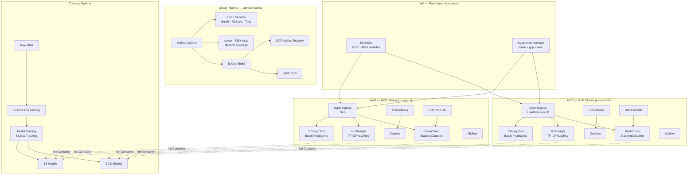
```mermaid
graph TB
    subgraph "CI/CD Pipeline — GitHub Actions"
        GH[GitHub Actions] --> LINT[Lint + Security<br/>Bandit · Gitleaks · Trivy]
        GH --> TEST[pytest · 395+ tests<br/>90-98% coverage]
        GH --> BUILD[Docker Build]
        BUILD --> AR[GCP Artifact Registry]
        BUILD --> ECR[AWS ECR]
    end

    subgraph "Training Pipeline"
        DATA[Raw Data] --> FE[Feature Engineering]
        FE --> TRAIN[Model Training<br/>MLflow Tracking]
        TRAIN --> GCS[GCS Models]
        TRAIN --> S3[S3 Models]
    end

    subgraph "GCP — GKE Cluster (us-central1)"
        direction TB
        GCE_ING[nginx Ingress<br/>LoadBalancer IP] --> BC1[BankChurn<br/>StackingClassifier]
        GCE_ING --> NL1[NLPInsight<br/>TF-IDF+LogReg]
        GCE_ING --> CT1[ChicagoTaxi<br/>Batch Predictions]
        BC1 -.->|Init Container| GCS
        NL1 -.->|Init Container| GCS
        CT1 -.->|Init Container| GCS
        PROM1[Prometheus] --> GRAF1[Grafana]
        DRIFT1[Drift CronJob] --> BC1
        MLF1[MLflow]
    end

    subgraph "AWS — EKS Cluster (us-east-1)"
        direction TB
        AWS_ING[nginx Ingress<br/>NLB] --> BC2[BankChurn<br/>StackingClassifier]
        AWS_ING --> NL2[NLPInsight<br/>TF-IDF+LogReg]
        AWS_ING --> CT2[ChicagoTaxi<br/>Batch Predictions]
        BC2 -.->|Init Container| S3
        NL2 -.->|Init Container| S3
        CT2 -.->|Init Container| S3
        PROM2[Prometheus] --> GRAF2[Grafana]
        DRIFT2[Drift CronJob] --> BC2
        MLF2[MLflow]
    end

    subgraph "IaC — Terraform + Kustomize"
        TF[Terraform<br/>GCP + AWS modules] --> GCE_ING
        TF --> AWS_ING
        KUST[Kustomize Overlays<br/>base + gcp + aws] --> GCE_ING
        KUST --> AWS_ING
    end
```

For detailed architecture docs, see [docs/ARCHITECTURE_PORTFOLIO.md](docs/ARCHITECTURE_PORTFOLIO.md).

---

## 🚀 Quick Start

```bash
# 1. Clone and enter
git clone https://github.com/DuqueOM/ML-MLOps-Portfolio.git && cd ML-MLOps-Portfolio

# 2. Generate demo models (first time only, ~2 min)
bash scripts/setup_demo_models.sh

# 3. Start full stack (APIs + MLflow + Dashboard, ~3 min build)
docker compose -f docker-compose.demo.yml up -d --build

# 4. Wait for services and verify health (~60s)
sleep 60 && bash scripts/run_demo_tests.sh

# 5. Access services
#    🏦 BankChurn API:    http://localhost:8001/docs
#    � NLPInsight API:   http://localhost:8003/docs
#    � ChicagoTaxi API:  http://localhost:8004/docs
#    📊 MLflow:           http://localhost:5000
```

For API examples, monitoring setup, and troubleshooting, see [QUICK_START.md](QUICK_START.md) and [RUNBOOK.md](RUNBOOK.md).

---

## ☁️ Multi-Cloud Production Deployment

This portfolio demonstrates **cloud-agnostic MLOps** — the same ML system deployed on **both GCP and AWS**:

<div align="center">

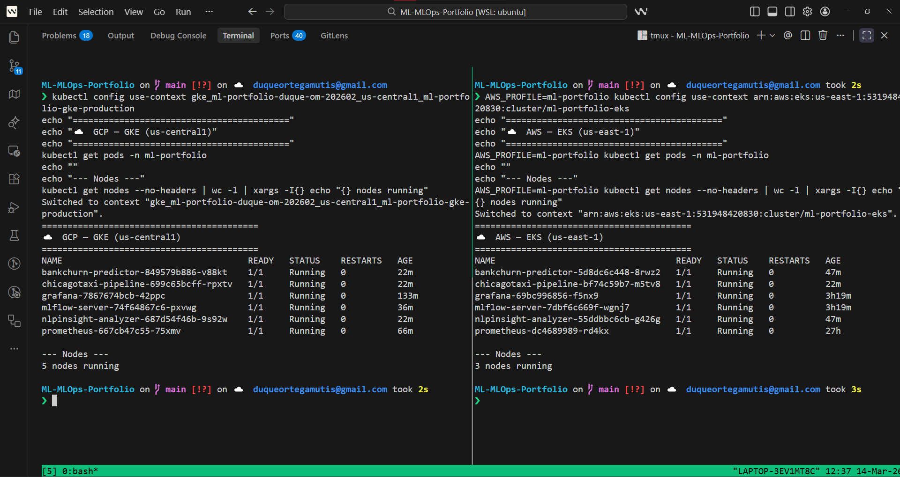

*Same 6 services running on GCP (GKE) and AWS (EKS) — multi-cloud deployed*

</div>

### Multi-Cloud Architecture

| Component | GCP (Live ✅) | AWS (Live ✅) |
|-----------|--------------|--------------|
| **K8s Cluster** | GKE 1-5 nodes auto-scaling (`us-central1`) | EKS 1-5 nodes auto-scaling (`us-east-1`) |
| **Container Registry** | Artifact Registry | ECR (3 private repos) |
| **Model Storage** | GCS | S3 (versioned, encrypted) |
| **Load Balancer** | nginx Ingress (static IP) | nginx Ingress (NLB) |
| **IAM for Pods** | Workload Identity | IRSA |
| **Init Containers** | GCS download | S3 download (boto3) |
| **CI/CD** | `deploy-gcp.yml` | `deploy-aws.yml` |
| **IaC** | `infra/terraform/gcp/` | `infra/terraform/aws/` |
| **Drift Detection** | CronJob (daily, completing) | CronJob (daily, completing) |
| **Monitoring** | Prometheus + Grafana + MLflow | Prometheus + Grafana + MLflow |

> **Cloud-Agnostic Design**: Monitoring stack (Prometheus, Grafana, MLflow), K8s deployment patterns (HPA, anti-affinity, health probes), and CI/CD structure are identical across clouds. Only the init container SDK and ingress annotations change. See [ADR-013](docs/decisions/013-multicloud-parity-policy.md).

> **💰 Cost-Aware**: GCP ~$51/month (4× e2-medium). AWS ~$45/month (3× t3.small). See [cost analysis](docs/ARCHITECTURE_PORTFOLIO.md).

<div align="center">

[-red?style=for-the-badge&logo=youtube)](https://youtu.be/7dFFqq2ROPw)

</div>

<details>
<summary><strong>📊 GCP Evidence (click to expand)</strong></summary>

#### GKE Workloads — 6 services running
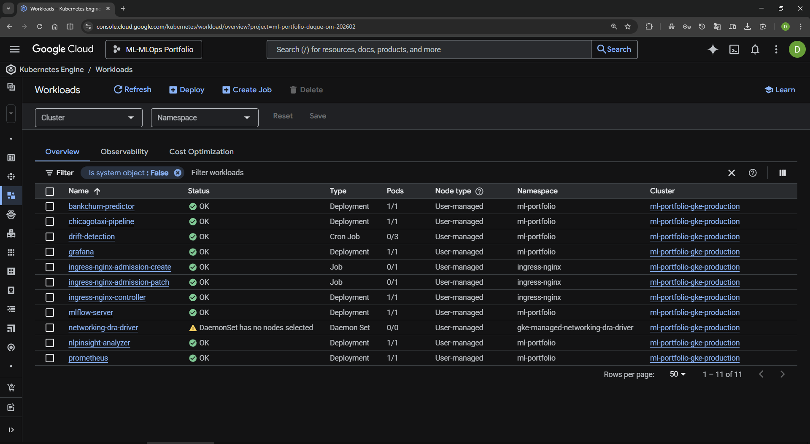

#### Monitoring — Grafana ML Dashboard


#### CI/CD — GitHub Actions Pipeline (10 jobs green)
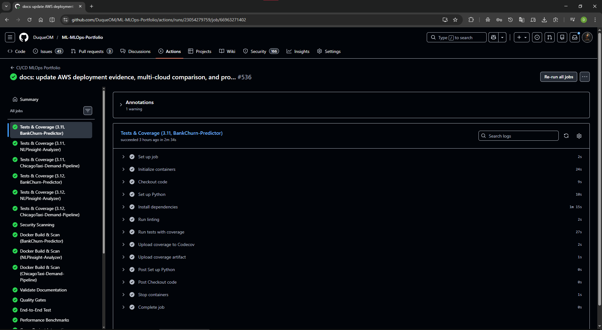

#### ML Prediction with SHAP Explainability
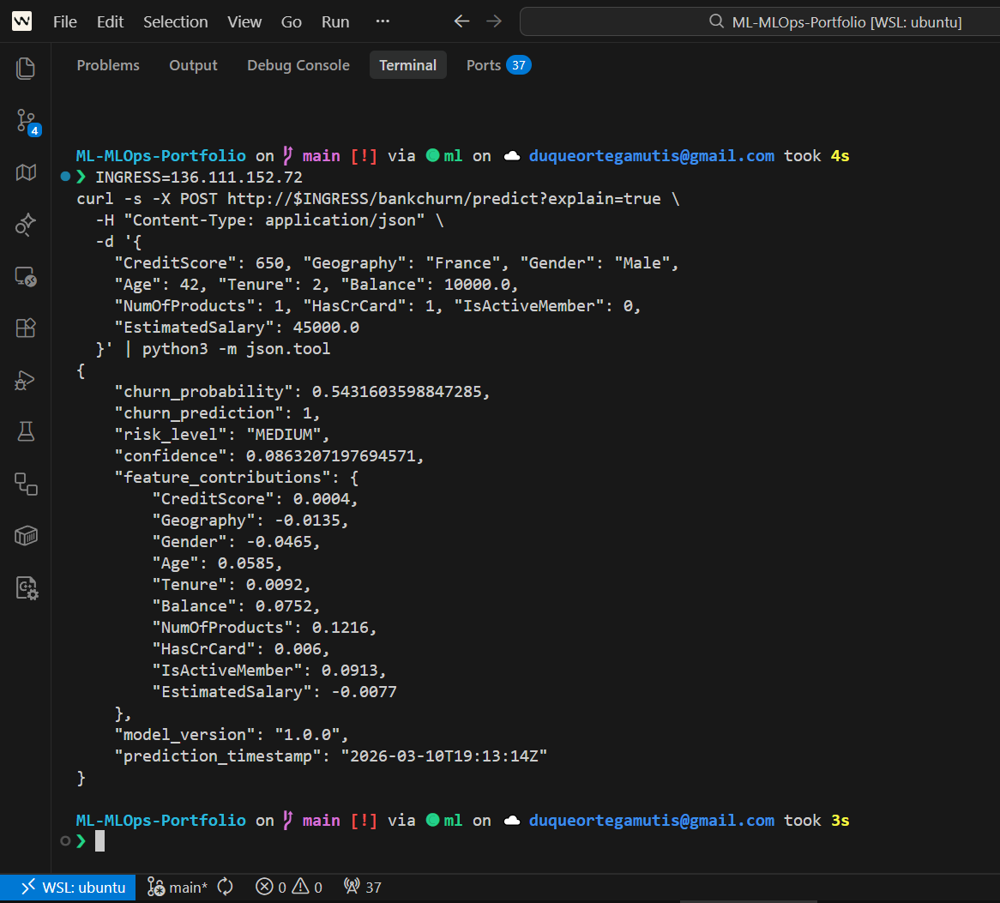

</details>

<details>
<summary><strong>☁️ AWS Evidence (click to expand)</strong></summary>

#### EKS Cluster — Active (us-east-1)
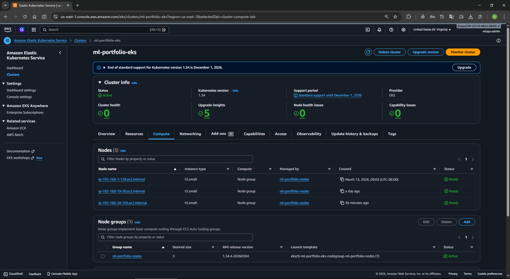

#### EKS Workloads — 6 pods Running
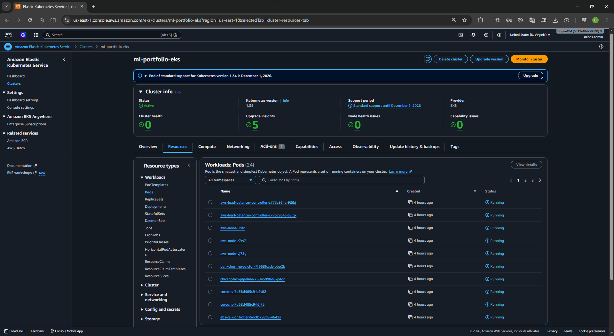

#### ECR — 3 Private Repositories
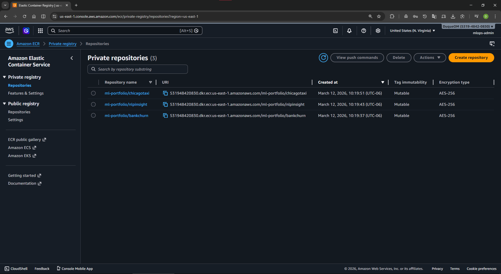

#### S3 — Model Storage (encrypted, versioned)
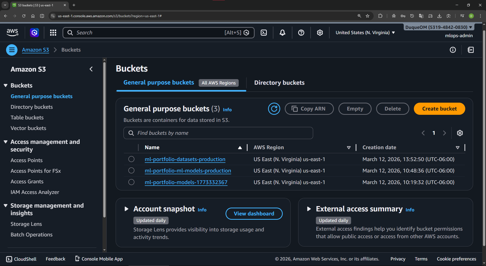

#### Health Checks via Classic ELB
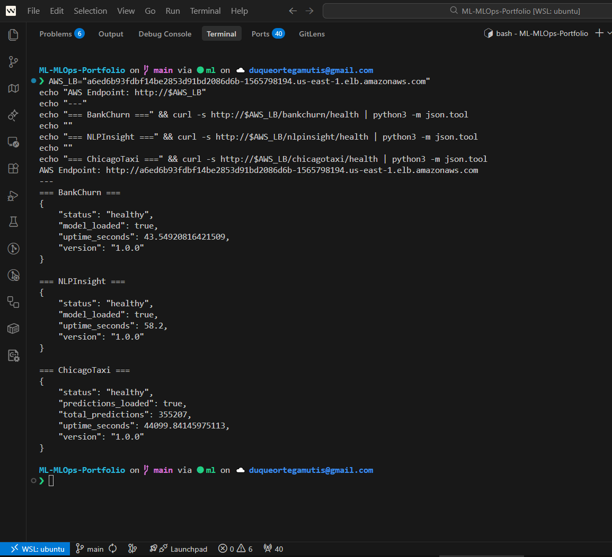

#### SHAP Prediction on EKS
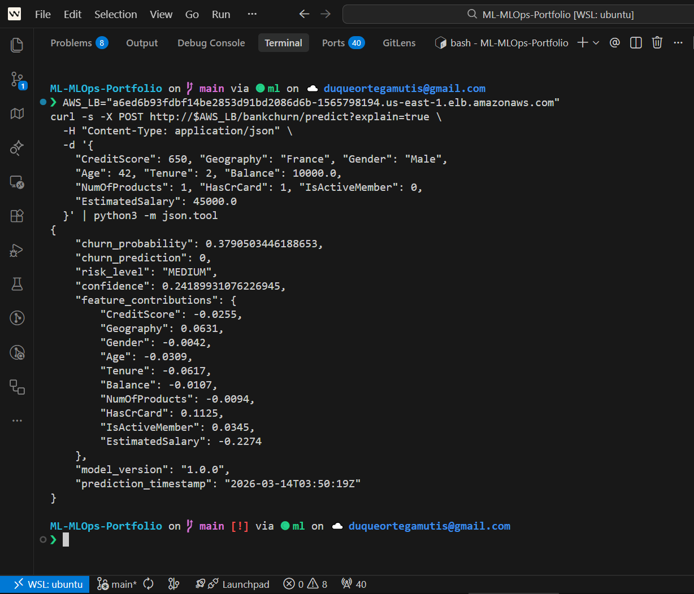

</details>

---

## 📚 Documentation

| Document | Description |
|----------|-------------|
| **[Quick Start](QUICK_START.md)** | 5-minute demo with API examples and health checks |
| **[Architecture](docs/ARCHITECTURE_PORTFOLIO.md)** | System design, Mermaid diagrams, infrastructure, CI/CD workflow |
| **[Operations Runbook](RUNBOOK.md)** | Day-to-day commands, Docker, K8s, Terraform deployment |
| **[Features & Changelog](docs/FEATURES.md)** | Performance optimizations, new features, version history |
| **[Release Process](docs/RELEASE.md)** | GHCR publishing, blue/green deployments, rollback procedures |
| **[Contributing](docs/contributing/guidelines.md)** | Development workflow, code standards, PR process |
| **[Security Policy](SECURITY.md)** | Vulnerability reporting and scanning details |

---

## 🔧 Development Process

This portfolio was developed using **AI-assisted tools** (Cursor / Cascade) for code generation and boilerplate acceleration. All architectural decisions, project selection, MLOps pipeline design, infrastructure choices, and system integration were made by the author.

AI tools were used as **accelerators, not replacements** for understanding — the same way senior engineers use code completion and documentation generators to increase throughput while retaining full ownership of design decisions.

The author maintains and operates all systems independently, including CI/CD pipeline debugging, Docker optimization, Terraform configuration, and production monitoring setup.

---

## 👤 Author

**Duque Ortega Mutis (DuqueOM)**
*Machine Learning & MLOps Engineer*

Serial entrepreneur turned ML engineer. Over a decade of launching ventures—managing teams, budgets, sales targets, and multi-vendor operations—now applied to production ML systems.

[](https://linkedin.com/in/duqueom)
[](https://github.com/DuqueOM)
[](https://duqueom.github.io/ML-MLOps-Portfolio/)
[](mailto:DuqueOrtegaMutis@gmail.com)

---

<div align="center">

**Portfolio Version**: 3.5.3 · **License**: MIT · **Status**: ✅ Deployed on GCP (GKE) + AWS (EKS)

*Building ML systems that work at 2am* 🌙

</div>
