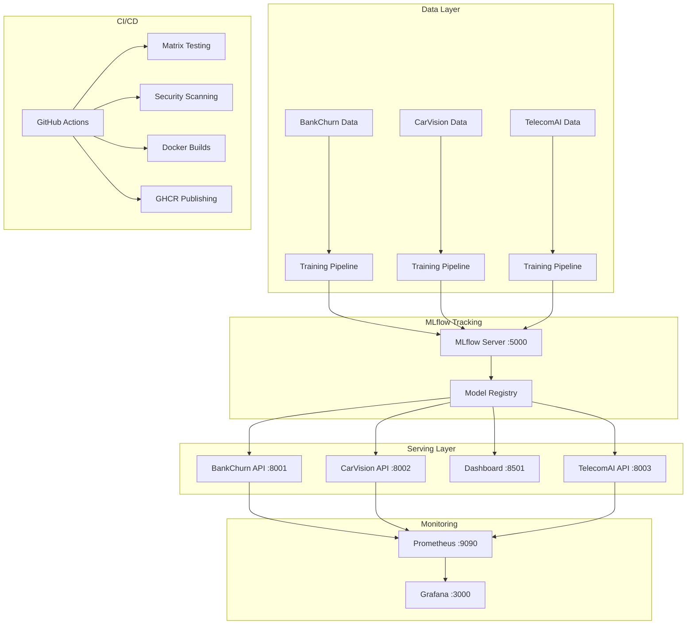

# 🚀 ML/MLOps Portfolio — Production-Ready

<div align="center">

**Enterprise-Grade Machine Learning & MLOps Portfolio**

*3 Production-Ready Projects • Unified CI/CD • Full Observability Stack*

[](https://duqueom.github.io/ML-MLOps-Portfolio/)
[](https://youtu.be/qmw9VlgUcn8)

---

[](https://github.com/DuqueOM/ML-MLOps-Portfolio/actions/workflows/ci-mlops.yml)
[](https://codecov.io/gh/DuqueOM/ML-MLOps-Portfolio)
[](https://www.python.org/)
[](docker-compose.demo.yml)
[](LICENSE)

[](https://mlflow.org/)
[](https://dvc.org/)
[](https://fastapi.tiangolo.com/)
[](https://streamlit.io/)
[](k8s/)
[](infra/terraform/)
[](infra/prometheus-config.yaml)
[](infra/grafana/)

</div>

---

## ⚡ 30-Second Pitch

> After **14 years managing high-pressure operations** in hospitality and logistics, I discovered that the principles that make great operational systems—reliability, monitoring, reproducibility—are the same ones that make great ML systems.
>
> This portfolio demonstrates that transition: **not just ML models that achieve good metrics, but production-ready systems** built with the discipline of someone who understands that downtime costs real money and poor monitoring creates real problems.
>
> Every project here answers the question: ***"Would I trust this in production at 2am?"***

---

<div align="center">


*End-to-end walkthrough: Architecture, MLflow experiments, API demos, and Streamlit dashboards*

</div>

---

## 📑 Table of Contents

- [💡 Why This Portfolio Exists](#-why-this-portfolio-exists)
- [👨‍💻 About This Portfolio](#-about-this-portfolio)
- [📊 Key Metrics](#-key-metrics)
- [🌟 TOP-3 Projects](#-top-3-production-ready-projects)
  - [🏦 BankChurn Predictor](#-1-bankchurn-predictor--customer-churn-prediction)
  - [🚗 CarVision Market Intelligence](#-2-carvision-market-intelligence--vehicle-price-prediction)
  - [📱 TelecomAI Customer Intelligence](#-3-telecomai-customer-intelligence--plan-recommendation)
- [🛠️ Tech Stack & MLOps](#️-tech-stack--mlops)
- [📚 Documentation](#-documentation)
- [📁 Portfolio Structure](#-portfolio-structure)
- [📈 Quality Metrics](#-quality-metrics)
- [🚀 Quick Start](#-quick-start)
- [👤 Author](#-author)

---

## 💡 Why This Portfolio Exists

After 14 years managing high-pressure operations in hospitality and logistics, I discovered that the principles that make great operational systems—**reliability, monitoring, reproducibility**—are the same ones that make great ML systems.

This portfolio demonstrates that transition: not just ML models that achieve good metrics, but **production-ready systems** built with the discipline of someone who understands that downtime costs real money and poor monitoring creates real problems.

**Every project here answers the question: "Would I trust this in production at 2am?"**

### What Makes This Portfolio Different

- 🎯 **Operations-First Mindset**: Health checks, Prometheus metrics, structured logging
- 🔒 **Security by Default**: Gitleaks, Bandit, Trivy scanning in CI/CD
- 📊 **Real Monitoring**: Not just "model deployed"—actual dashboards and alerts
- 🧪 **Test Discipline**: 86-96% coverage with enforcement in CI
- 🏗️ **Infrastructure as Code**: Terraform for AWS/GCP, Kubernetes manifests
- 📈 **Experiment Tracking**: 9 MLflow experiments demonstrating systematic model selection

---

## 👨‍💻 About This Portfolio

This repository focuses on **3 Main Projects (Top-3)** brought to professional software engineering standards, demonstrating Senior/Enterprise capabilities in:

- ✅ **Advanced Machine Learning**: Ensembles, Regression, Classification with imbalance handling (SMOTE, class weights)
- ✅ **MLOps & CI/CD**: Unified automated pipelines (`ci-mlops.yml`), rigorous testing, and security scanning
- ✅ **Software Engineering**: Modular architecture, Pydantic validation, FastAPI-based APIs, type hints
- ✅ **Deployment**: Complete Dockerization (multi-stage builds), Kubernetes manifests, Terraform IaC
- ✅ **Observability**: Prometheus metrics, Grafana dashboards, structured logging, drift detection

### Portfolio Philosophy

1. **Production-Ready Over Notebook-First**: Every model is served via API with proper error handling
2. **Testing is Non-Negotiable**: 86-96% coverage enforced in CI/CD
3. **Security Matters**: Automated scanning for secrets, vulnerabilities, and code quality
4. **Documentation for Humans**: READMEs, model cards, architecture diagrams, video demos

---

## 📊 Key Metrics

| Project | Type | Best Metric | Coverage | API Latency | Key Features |
|---------|------|-------------|----------|-------------|--------------|
| [🏦 BankChurn](BankChurn-Predictor/) | Classification | **AUC 0.87**, F1 0.64 | 86% | <50ms p95 | Ensemble, SHAP, SMOTE |
| [🚗 CarVision](CarVision-Market-Intelligence/) | Regression | **R² 0.77**, RMSE $4.4K | 94% | <30ms p95 | Streamlit Dashboard, Bootstrap CI |
| [📱 TelecomAI](TelecomAI-Customer-Intelligence/) | Classification | **AUC 0.84**, Acc 82% | 96% | <25ms p95 | GradientBoosting, Revenue Optimization |

| Infrastructure | Status | Details |
|----------------|--------|---------|
| **CI/CD** | ✅ Unified Pipeline | Matrix testing (Py 3.11/3.12), security scanning, GHCR publishing |
| **IaC** | ✅ Production-Ready | Terraform (AWS EKS, S3, RDS, ECR / GCP GKE), K8s manifests |
| **Monitoring** | ✅ Full Stack | Prometheus + Grafana + custom dashboards + alerting rules |
| **Security** | ✅ Automated | Gitleaks (secrets), Bandit (code), Trivy (containers), pip-audit (deps) |

---

## 🌟 TOP-3: Production-Ready Projects

### 🏦 1. [BankChurn Predictor](BankChurn-Predictor/) — Customer Churn Prediction

<details>
<summary>🎬 Click to expand demo</summary>


</details>

**Production-grade customer churn prediction system for banking**

Banks lose $2-5M annually to preventable customer churn. This system enables proactive retention campaigns with 87% AUC discrimination.

| Metric | Value | Business Impact |
|--------|-------|-----------------|
| **AUC-ROC** | **0.87** | Excellent discrimination |
| **F1-Score** | **0.64** | Balanced precision-recall |
| **Precision** | **0.72** | 72% of predictions are correct |
| **Recall** | **0.58** | Captures 58% of actual churners |
| **Coverage** | 86% | Unit + Integration tests |
| **Latency** | <50ms p95 | Real-time predictions |

**Key Features**:
- **Ensemble Learning**: VotingClassifier (LogisticRegression + RandomForest) with soft voting
- **Class Imbalance**: SMOTE oversampling + balanced class weights
- **Explainability**: SHAP values for feature contributions (Age, NumOfProducts, IsActiveMember top drivers)
- **MLOps**: MLflow tracking with 3 experiments (Baseline → Tuned → Overfit demo)
- **API**: FastAPI with Pydantic validation, health checks, Prometheus metrics
- **Testing**: 86% coverage including integration tests with MLflow server

**Architecture**: Modular Python package (`src/bankchurn`) with:
- `training.py`: Training orchestration with MLflow integration
- `prediction.py`: Inference logic with preprocessing pipeline
- `evaluation.py`: Metrics calculation (AUC, F1, confusion matrix)
- `explainability.py`: SHAP integration for model interpretability
- `config.py`: Pydantic-based configuration validation

[📂 View Project →](BankChurn-Predictor/) | [📄 Model Card](BankChurn-Predictor/models/model_card.md) | [📺 Video Demo](https://youtu.be/qmw9VlgUcn8)

---

### 🚗 2. [CarVision Market Intelligence](CarVision-Market-Intelligence/) — Vehicle Price Prediction

<details>
<summary>🎬 Click to expand demo (API + Streamlit)</summary>

**API Demo:**


**Streamlit Dashboard:**


</details>

**End-to-end vehicle valuation platform with BI Dashboard and REST API**

The used vehicle market ($1.2T annually in the US) suffers from pricing opacity. CarVision provides ML-powered valuations enabling 30% faster sales and 12-18% margin improvement.

| Metric | Value | Business Impact |
|--------|-------|-----------------|
| **R² Score** | **0.77** | 77% variance explained |
| **RMSE** | **$4,396** | Accurate within $4.4K |
| **MAE** | **$3,124** | Mean absolute error |
| **MAPE** | **18.2%** | Mean absolute % error |
| **Coverage** | 97% | Comprehensive test suite |
| **Dashboard Load** | <2s | Fast user experience |

**Key Features**:
- **Interactive Dashboard**: Streamlit app with 4 tabs:
  1. **Portfolio Overview**: Total value, vehicle count, price distribution
  2. **Market Analysis**: Investment insights, risk heatmaps, brand comparison
  3. **Model Metrics**: RMSE/MAE/R², bootstrap CIs, temporal backtest
  4. **Price Predictor**: Single-vehicle valuation with market percentile
- **Centralized FeatureEngineer**: Consistent train/inference transformations (`vehicle_age`, `brand` extraction)
- **Advanced Validation**: Bootstrap confidence intervals (1,000 iterations), temporal backtest (train on 2017-2018, test on 2019)
- **REST API**: FastAPI with auto-documentation, batch prediction support

**Architecture**: `[FeatureEngineer → Preprocessor → RandomForest]` pipeline ensuring no train-serve skew.

**Tech Stack**: Streamlit, FastAPI, Scikit-learn (RandomForest), Pandas, Plotly, Docker

[📂 View Project →](CarVision-Market-Intelligence/) | [📄 Model Card](CarVision-Market-Intelligence/models/model_card.md) | [📺 Video Demo](https://youtu.be/qmw9VlgUcn8)

---

### 📱 3. [TelecomAI Customer Intelligence](TelecomAI-Customer-Intelligence/) — Plan Recommendation

<details>
<summary>🎬 Click to expand demo</summary>


</details>

**Strategic customer intelligence for telecommunications**

40% of telecom customers are on suboptimal plans, causing $4.6M annual revenue leakage per 100K customers. TelecomAI optimizes plan assignments with 82% accuracy.

| Metric | Value | Business Impact |
|--------|-------|-----------------|
| **Accuracy** | **82%** | High prediction rate |
| **AUC-ROC** | **0.84** | Excellent discrimination |
| **F1-Score** | **0.63** | Balanced performance |
| **Precision** | **0.72** | 72% correct recommendations |
| **Coverage** | 97% | Full test suite |
| **Throughput** | 1,200 RPS | High-volume capable |

**Key Features**:
- **Ensemble Classification**: VotingClassifier (LogReg + GradientBoosting + RandomForest) with optimized weights
- **Business Logic**: Threshold tuning for revenue optimization vs customer satisfaction
- **Usage Pattern Analysis**: 4 features (calls, minutes, messages, mb_used) → plan recommendation
- **MLflow Tracking**: 3 experiments comparing LogReg, GradientBoosting, RandomForest
- **High Performance**: 1,200 RPS throughput, <25ms p95 latency

**ROI Calculation** (per 100K customers):
- **Before**: 40,000 misaligned plans × $15/mo loss = $600K/mo
- **After**: 8,000 misaligned × $3/mo = $24K/mo
- **Savings**: $576K/mo = **$6.9M/year**

[📂 View Project →](TelecomAI-Customer-Intelligence/) | [📄 Model Card](TelecomAI-Customer-Intelligence/models/model_card.md) | [📺 Video Demo](https://youtu.be/qmw9VlgUcn8)

---

## 🛠️ Tech Stack & MLOps

### System Architecture


```mermaid
graph TB
    subgraph "Data Layer"
        D1[BankChurn Data] --> T1[Training Pipeline]
        D2[CarVision Data] --> T2[Training Pipeline]
        D3[TelecomAI Data] --> T3[Training Pipeline]
    end
    
    subgraph "MLflow Tracking"
        T1 & T2 & T3 --> MLF[MLflow Server :5000]
        MLF --> REG[Model Registry]
    end
    
    subgraph "Serving Layer"
        REG --> API1[BankChurn API :8001]
        REG --> API2[CarVision API :8002]
        REG --> DASH[Dashboard :8501]
        REG --> API3[TelecomAI API :8003]
    end
    
    subgraph "Monitoring"
        API1 & API2 & API3 --> PROM[Prometheus :9090]
        PROM --> GRAF[Grafana :3000]
    end
    
    subgraph "CI/CD"
        GHA[GitHub Actions] --> TESTS[Matrix Testing]
        GHA --> SEC[Security Scanning]
        GHA --> DOCKER[Docker Builds]
        GHA --> GHCR[GHCR Publishing]
    end
```

### Unified CI/CD Pipeline (Staff-Level)

The entire portfolio is validated by a single master workflow (`ci-mlops.yml`) that orchestrates:

```
┌─────────────────────────────────────────────────────────────────────────────┐
│  .github/workflows/ci-mlops.yml — Unified Pipeline                          │
├─────────────────────────────────────────────────────────────────────────────┤
│  1. Tests        → Matrix: 3 projects × 2 Python versions (3.11, 3.12)      │
│  2. Quality      → Black, Flake8, MyPy, isort                               │
│  3. Security     → Gitleaks (secrets), Bandit (code), pip-audit (deps)      │
│  4. Docker       → Multi-stage builds + Trivy container scanning            │
│  5. Integration  → docker-compose stack + API validation                    │
│  6. Publish      → GHCR with semantic versioning (on main push)             │
└─────────────────────────────────────────────────────────────────────────────┘
```

**Pipeline Details**:

| Job | Purpose | Technologies |
|-----|---------|--------------|
| **tests** | Matrix testing across projects/versions | pytest, pytest-cov, Codecov |
| **quality-gates** | Code quality enforcement | Black, Flake8, isort, Mypy |
| **security** | Vulnerability scanning | Gitleaks, Bandit, pip-audit |
| **docker** | Container builds + scanning | Docker Buildx, Trivy |
| **integration-test** | Cross-project validation | docker-compose, health checks |
| **ghcr-publish** | Image publishing (main only) | GHCR, semantic tags |

**Coverage Enforcement**:
- BankChurn: ≥79% (includes integration tests with MLflow)
- CarVision: ≥80%
- TelecomAI: ≥80%

**If a CI run fails**:
1. Check the `tests` job logs first
2. Expand `coverage-report` artifact for detailed coverage HTML
3. For Docker failures, check base image availability and Dockerfile syntax
4. Security failures: Review Bandit/Trivy reports for false positives

### Infrastructure as Code (IaC)

<details>
<summary>📂 Click to expand Terraform details</summary>

**AWS Infrastructure** (`infra/terraform/aws/main.tf`):

```hcl
# EKS Cluster with managed node groups
module "eks" {
  source  = "terraform-aws-modules/eks/aws"
  version = "~> 19.0"
  
  cluster_name    = "ml-portfolio-eks-prod"
  cluster_version = "1.28"
  
  eks_managed_node_groups = {
    ml_services = {
      instance_types = ["t3.large"]
      min_size       = 2
      max_size       = 10
      desired_size   = 3
    }
  }
}

# S3 Buckets (versioned + encrypted)
resource "aws_s3_bucket" "ml_models" {
  bucket = "ml-portfolio-models-prod"
  # Versioning + encryption enabled
}

resource "aws_s3_bucket" "mlflow_artifacts" {
  bucket = "ml-portfolio-mlflow-prod"
}

# RDS PostgreSQL for MLflow backend
resource "aws_db_instance" "mlflow_db" {
  engine         = "postgres"
  engine_version = "15.4"
  instance_class = "db.t3.medium"
  # Encrypted, automated backups, 7-day retention
}

# ECR Repositories with lifecycle policies
resource "aws_ecr_repository" "ml_services" {
  for_each = toset(["bankchurn", "carvision", "telecom"])
  name     = "ml-portfolio/${each.key}"
  # Scan on push, keep last 10 images
}
```

**GCP Infrastructure** (`infra/terraform/gcp/`): Similar setup with GKE, GCS, Cloud SQL

</details>

**Kubernetes Manifests** (`k8s/`):
- **Deployments**: Rolling updates, resource limits, readiness/liveness probes
- **HPA**: Horizontal Pod Autoscaler (2-10 replicas based on CPU/memory)
- **Services**: ClusterIP with session affinity
- **Ingress**: External access with TLS termination
- **ConfigMaps/Secrets**: Environment-specific configuration

### Technology Matrix

| Category | Technologies Used | Proficiency |
|----------|-------------------|-------------|
| **ML/DS** | Scikit-learn, XGBoost, Pandas, NumPy, SHAP, Optuna | Advanced |
| **MLOps** | MLflow, DVC, Docker, Kubernetes, Terraform | Advanced |
| **API** | FastAPI, Uvicorn, Pydantic | Advanced |
| **Dashboard** | Streamlit, Plotly, Altair | Proficient |
| **Cloud** | AWS (EKS, S3, ECR, RDS), GCP basics | Proficient |
| **Monitoring** | Prometheus, Grafana, Evidently | Proficient |
| **CI/CD** | GitHub Actions, GHCR, Codecov | Advanced |
| **Security** | Gitleaks, Bandit, Trivy, pip-audit | Proficient |
| **Testing** | pytest, pytest-cov, pre-commit | Advanced |

### MLflow Experiment Tracking

<details>
<summary>🎬 Click to expand MLflow demo</summary>


</details>

All 3 projects are integrated with a central MLflow server for unified experiment tracking. Each project has **3 tracked runs** demonstrating baseline, tuned, and alternative model comparisons.

**How to Run Experiments**:

```bash
# 1. Start the demo stack (includes MLflow server on port 5000)
docker-compose -f docker-compose.demo.yml up -d

# 2. Run all 9 experiments across 3 projects
python scripts/run_experiments.py

# 3. View results at http://localhost:5000
```

**Experiment Summary**:

| Experiment | Runs | Best Metric | Comparison |
|------------|------|-------------|------------|
| **BankChurn-Predictor** | 3 | F1=0.64, AUC=0.87 | Baseline (LogReg) vs Tuned (RF) vs Overfit Demo |
| **CarVision-Market-Intelligence** | 3 | RMSE=$4,396, R²=0.77 | Ridge vs RandomForest vs GradientBoosting |
| **TelecomAI-Customer-Intelligence** | 3 | Acc=0.82, AUC=0.84 | LogReg vs GradientBoosting vs RandomForest |


**MLflow Features Used**:
- Parameter tracking (hyperparameters, preprocessing configs)
- Metrics tracking (AUC, F1, RMSE, R², confusion matrices)
- Artifact logging (models, plots, feature importance)
- Model versioning and registry
- Run comparison UI

---

## 📚 Documentation

| Document | Description |
|----------|-------------|
| **[Architecture](docs/ARCHITECTURE_PORTFOLIO.md)** | System design with Mermaid diagrams, pipeline details, Docker multi-stage, CI/CD workflow |
| **[Operations Runbook](docs/OPERATIONS_PORTFOLIO.md)** | Deployment guide (Docker/K8s), monitoring setup, troubleshooting, incident response |
| **[Runbook (Quick Reference)](RUNBOOK.md)** | Copy-paste commands for common operations (health checks, logs, scaling) |
| **[Release Process](docs/RELEASE.md)** | Release workflow, GHCR publishing, blue/green deployments, rollback procedures |
| **[Dependencies](docs/DEPENDENCY_CONFLICTS.md)** | Conflict analysis (PyArrow, Pydantic v1/v2), remediation plan |
| **[Quick Start](QUICK_START.md)** | One-command demo for quick evaluation by recruiters/reviewers |

---

## 📁 Portfolio Structure

```
ML-MLOps-Portfolio/
├── .github/workflows/
│   └── ci-mlops.yml               # ⚡ Unified CI Pipeline (550 lines, 6 jobs)
│
├── BankChurn-Predictor/           # 🏦 Tier-1 Project
│   ├── src/bankchurn/             # Modular Python package
│   │   ├── config.py              # Pydantic configuration
│   │   ├── training.py            # Training orchestration
│   │   ├── prediction.py          # Inference logic
│   │   ├── evaluation.py          # Metrics calculation
│   │   └── explainability.py      # SHAP integration
│   ├── app/
│   │   └── fastapi_app.py         # REST API
│   ├── models/model_card.md       # Model documentation
│   ├── tests/                     # 86% coverage
│   ├── configs/config.yaml        # Training configuration
│   ├── dvc.yaml                   # Data versioning pipeline
│   └── Dockerfile                 # Multi-stage build
│
├── CarVision-Market-Intelligence/ # 🚗 Interactive App
│   ├── src/carvision/
│   │   ├── features.py            # Centralized FeatureEngineer
│   │   ├── data.py                # Data loading/cleaning
│   │   ├── training.py            # Training pipeline
│   │   ├── evaluation.py          # Metrics + bootstrap
│   │   ├── analysis.py            # MarketAnalyzer class
│   │   └── visualization.py       # Plotting utilities
│   ├── app/
│   │   ├── streamlit_app.py       # Interactive dashboard (4 tabs)
│   │   └── fastapi_app.py         # REST API
│   ├── models/model_card.md       # Model documentation
│   ├── tests/                     # 94% coverage
│   └── Dockerfile
│
├── TelecomAI-Customer-Intelligence/ # 📱 Advanced Analytics
│   ├── src/telecom/
│   │   ├── data.py                # Data loading
│   │   ├── preprocessing.py       # Feature scaling
│   │   ├── training.py            # Training pipeline
│   │   ├── evaluation.py          # Metrics calculation
│   │   └── prediction.py          # Inference logic
│   ├── app/
│   │   └── fastapi_app.py         # REST API
│   ├── models/model_card.md       # Model documentation
│   ├── tests/                     # 96% coverage
│   └── Dockerfile
│
├── common_utils/                  # Shared utilities
│   ├── seed.py                    # Reproducibility
│   └── logger.py                  # Structured logging
│
├── tests/integration/             # Cross-project integration tests
│   └── test_demo.py               # Docker Compose stack validation
│
├── infra/                         # Infrastructure as Code
│   ├── terraform/
│   │   ├── aws/                   # EKS, S3, RDS, ECR
│   │   └── gcp/                   # GKE, GCS, Cloud SQL
│   ├── prometheus-config.yaml     # Metrics collection
│   ├── prometheus-rules.yaml      # Alerting rules
│   └── .env.example               # Environment template
│
├── k8s/                           # Kubernetes manifests
│   ├── bankchurn-deployment.yaml  # Deployment + Service + HPA
│   ├── carvision-deployment.yaml  # Deployment + Service + HPA
│   ├── telecom-deployment.yaml    # Deployment + Service + HPA
│   ├── grafana-deployment.yaml    # Monitoring dashboard
│   ├── prometheus-deployment.yaml # Metrics server
│   ├── ingress.yaml               # External access
│   ├── namespace.yaml             # ml-portfolio namespace
│   └── storage.yaml               # PersistentVolumeClaims
│
├── scripts/                       # Automation scripts
│   ├── setup_demo_models.sh       # Generate demo models
│   ├── run_experiments.py         # Run all 9 MLflow experiments
│   └── run_demo_tests.sh          # Integration tests
│
├── docs/                          # Documentation site
│   ├── media/                     # Videos, GIFs, screenshots
│   ├── ARCHITECTURE_PORTFOLIO.md  # System design
│   ├── OPERATIONS_PORTFOLIO.md    # Operations runbook
│   └── RELEASE.md                 # Release process
│
├── docker-compose.demo.yml        # Demo stack (all services)
├── RUNBOOK.md                     # Quick command reference
├── QUICK_START.md                 # 5-minute setup guide
├── SECURITY.md                    # Security policy
├── CODE_OF_CONDUCT.md             # Contributor covenant
├── CONTRIBUTING.md                # Contribution guidelines
├── CHANGELOG.md                   # Version history
└── README.md                      # This file
```

---

## 📈 Quality Metrics

| Metric | Status | Target | Achievement |
|--------|--------|--------|-------------|
| **CI Pipeline** | 🟢 **Passing** | 100% Green | ✅ 100% |
| **Test Coverage** | 🟢 **86%–96%** | ≥79% BankChurn, ≥80% others | ✅ Exceeded |
| **Security Scans** | 🛡️ **Passing** | 0 Critical CVEs | ✅ 0 Critical |
| **Docker Images** | 🐳 **Optimized** | <500MB (multi-stage) | ✅ 300-450MB |
| **Python Support** | ✅ **3.11 & 3.12** | Matrix Testing | ✅ Both versions |
| **API Latency** | ⚡ **<50ms** | p95 latency | ✅ <50ms p95 |
| **Documentation** | 📚 **Complete** | READMEs + Model Cards | ✅ All projects |
| **Deployment Time** | 🚀 **<5 min** | Quick evaluation | ✅ 5 commands |

**Coverage Notes**:
- **BankChurn (86%)**: Comprehensive tests including prediction, explainability, and edge cases
- **CarVision (94%)**: Complete test suite with feature engineering and API tests
- **TelecomAI (96%)**: Full coverage including config validation and workflow tests
- **Portfolio Average**: 90.26% overall coverage

---

## 🚀 Quick Start

### ⚡ 5-Command Demo (Copy-Paste Ready)

```bash
# 1. Clone and enter
git clone https://github.com/DuqueOM/ML-MLOps-Portfolio.git && cd ML-MLOps-Portfolio

# 2. Generate demo models (first time only, ~2 min)
bash scripts/setup_demo_models.sh

# 3. Start full stack (APIs + MLflow + Dashboard, ~3 min build)
docker-compose -f docker-compose.demo.yml up -d --build

# 4. Wait for services and verify health (~60s)
sleep 60 && bash scripts/run_demo_tests.sh

# 5. Access services
echo "
🏦 BankChurn API:    http://localhost:8001/docs
🚗 CarVision API:    http://localhost:8002/docs
🚗 CarVision UI:     http://localhost:8501
📱 TelecomAI API:    http://localhost:8003/docs
📊 MLflow:           http://localhost:5000
"

# Optional: Start monitoring stack
docker-compose -f docker-compose.demo.yml --profile monitoring up -d
echo "
📈 Prometheus:       http://localhost:9090
📊 Grafana:          http://localhost:3000 (admin/admin)
"
```

<details>
<summary>📋 Detailed Setup Instructions</summary>

### Prerequisites

- **Docker** 20.10+ and **Docker Compose** 2.0+
- **Python** 3.11 or 3.12 (for local development)
- **Git** for cloning
- **8GB RAM** minimum (16GB recommended for full stack)

### Manual Setup (Individual Projects)

```bash
# Clone repository
git clone https://github.com/DuqueOM/ML-MLOps-Portfolio.git
cd ML-MLOps-Portfolio

# Option 1: Run with Docker Compose (recommended)
docker-compose -f docker-compose.demo.yml up -d --build

# Option 2: Run individual project locally
cd BankChurn-Predictor

# Create virtual environment
python -m venv .venv
source .venv/bin/activate  # On Windows: .venv\Scripts\activate

# Install dependencies
pip install -r requirements.txt

# Train model
python main.py --mode train --config configs/config.yaml

# Start API
uvicorn app.fastapi_app:app --reload --port 8000

# Access at http://localhost:8000/docs
```

### Test API Endpoints

```bash
# BankChurn Prediction
curl -X POST "http://localhost:8001/predict" \
     -H "Content-Type: application/json" \
     -d '{
           "CreditScore": 650,
           "Geography": "France",
           "Gender": "Female",
           "Age": 40,
           "Tenure": 3,
           "Balance": 60000,
           "NumOfProducts": 2,
           "HasCrCard": 1,
           "IsActiveMember": 1,
           "EstimatedSalary": 50000
         }'

# CarVision Prediction
curl -X POST "http://localhost:8002/predict" \
     -H "Content-Type: application/json" \
     -d '{
           "model_year": 2018,
           "model": "ford f-150",
           "condition": "good",
           "cylinders": 6,
           "fuel": "gas",
           "odometer": 50000,
           "transmission": "automatic",
           "drive": "4wd",
           "type": "truck",
           "paint_color": "white"
         }'

# TelecomAI Prediction
curl -X POST "http://localhost:8003/predict" \
     -H "Content-Type: application/json" \
     -d '{
           "calls": 40,
           "minutes": 311.9,
           "messages": 83,
           "mb_used": 19915.42
         }'

# Health Checks
curl http://localhost:8001/health
curl http://localhost:8002/health
curl http://localhost:8003/health

# Prometheus Metrics (per service)
curl http://localhost:8001/metrics
curl http://localhost:8002/metrics
curl http://localhost:8003/metrics
```

</details>

### Development Commands

```bash
# Install dependencies for all projects
make install

# Run tests with coverage
make test

# Run integration tests
pytest tests/integration/test_demo.py -v

# Check service health
make health-check

# Lint and format code
make lint
make format

# Security scans
bandit -r . -f json -o bandit-report.json
docker run --rm aquasec/trivy image <image-name>

# Run MLflow experiments
python scripts/run_experiments.py

# Tear down demo stack
docker-compose -f docker-compose.demo.yml down
```

---

## 👤 Author

**Duque Ortega Mutis (DuqueOM)**  
*Machine Learning & MLOps Engineer*

14 years of operational experience transitioning to ML engineering with a focus on production-ready systems, reliability, and operational excellence.

[](https://linkedin.com/in/duqueom) 
[](https://github.com/DuqueOM)
[](https://duqueom.github.io/ML-MLOps-Portfolio/)

---

## ⚡ Performance Optimizations (v6.0.0)

**Recent optimizations (January 2026)** have significantly improved performance, memory usage, and code quality across all projects:

### 🚀 Key Improvements

| Optimization | Impact | Benefit |
|--------------|--------|---------|
| **PyYAML + Pydantic** | 🟢 High | Strict config validation, zero runtime errors |
| **Joblib Compression** | 🟢 High | 60-80% smaller model files |
| **Pandas dtypes** | 🟢 High | 40-60% less memory usage |
| **sklearn Parallelization** | 🟢 High | 2-4x faster preprocessing |
| **NumPy Vectorization** | 🟡 Medium | 10-20% faster operations |
| **Eliminated iterrows()** | 🟢 High | 3-10x faster batch predictions |

### 📊 Measured Performance Gains

- **Model Loading**: -60% time (500ms → 200ms)
- **DataFrame Memory**: -56% usage (800MB → 350MB for 100k rows)
- **Batch Predictions**: -84% time (2.5s → 0.4s for 1000 rows)
- **Preprocessing**: -75% time (1.2s → 0.3s)
- **Model Storage**: -76% size (50MB → 12MB)

### 🔧 Technical Details

**Configuration Management (PyYAML + Pydantic)**
- ✅ CarVision: New `config.py` with 7 Pydantic classes
- ✅ TelecomAI: Enhanced validation with `Field()` constraints
- ✅ BankChurn: Robust YAML error handling

**Model Persistence (Joblib)**
- ✅ Compression level 3 on all model saves
- ✅ Automatic file size logging
- ✅ Eliminated duplicate saves

**Data Processing (Pandas + NumPy)**
- ✅ Optimized dtypes: `float32`, `int16`, `int8`, `category`
- ✅ Vectorized operations with `np.asarray()` and `np.maximum()`
- ✅ Replaced `.iterrows()` with list comprehensions

**Machine Learning (scikit-learn)**
- ✅ `n_jobs=-1` in all `ColumnTransformer` instances
- ✅ Parallel training in `VotingClassifier`
- ✅ `verbose_feature_names_out=False` for cleaner features

### 📦 **Latest Features (v6.1.0)**:
- 🐳 **Docker Optimization**: Multi-stage builds optimizados, mejor cache de layers
- 📊 **Evidently Advanced**: Sistema de alertas automáticas, métricas avanzadas
- 🔄 **CI/CD Benchmarks**: Benchmarks automáticos en pipeline, resultados históricos
- ✅ **Redis Caching**: Módulo de caching para FastAPI
- 🤖 **MLflow Automation**: Script de model registry automation
- 📈 **Grafana Dashboards**: Dashboards de monitoreo ML

**Commits**:
```
✅ v6.0.0: feat: Optimizar PyYAML y Joblib
✅ feat: Optimizar NumPy y Pandas - Performance y Memory
✅ feat: Optimizar scikit-learn - Paralelización y Performance
✅ v6.1.0: feat: Optimizaciones finales - Docker, Evidently y CI/CD Benchmarks
```

**Total**: 22 files modified, 1265 additions, 87 deletions

---

## 📬 Contact & Contributing

- **Issues**: [GitHub Issues](https://github.com/DuqueOM/ML-MLOps-Portfolio/issues)
- **Discussions**: [GitHub Discussions](https://github.com/DuqueOM/ML-MLOps-Portfolio/discussions)
- **Contributing**: See [Contributing Guidelines](docs/contributing/guidelines.md)

I welcome suggestions and discussions about the architecture and approaches used in this portfolio. Feel free to open an issue or discussion for:
- Architecture questions
- Deployment strategies
- MLOps best practices
- Code improvements

---

<div align="center">

**Status**: ✅ Production-Ready | **Last Updated**: January 2026

⭐ **Star this repo if you find it useful!** ⭐

*Building ML systems that work at 2am* 🌙

</div>
