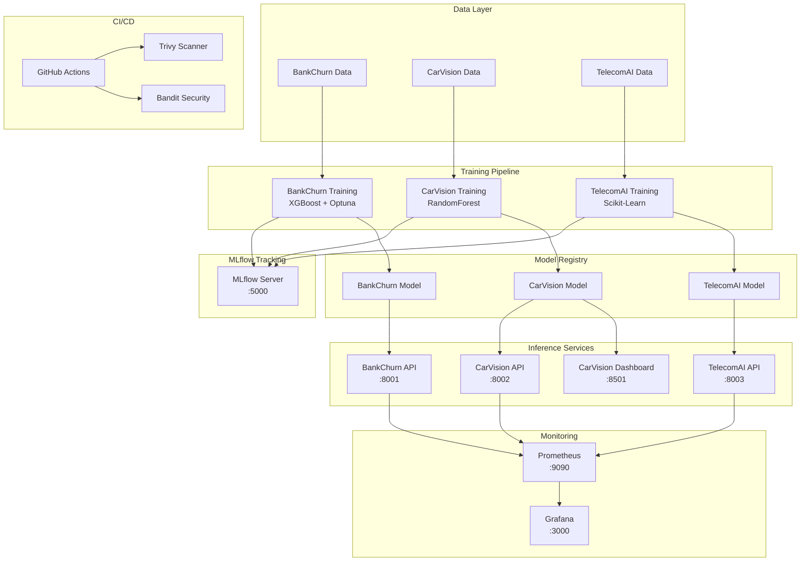
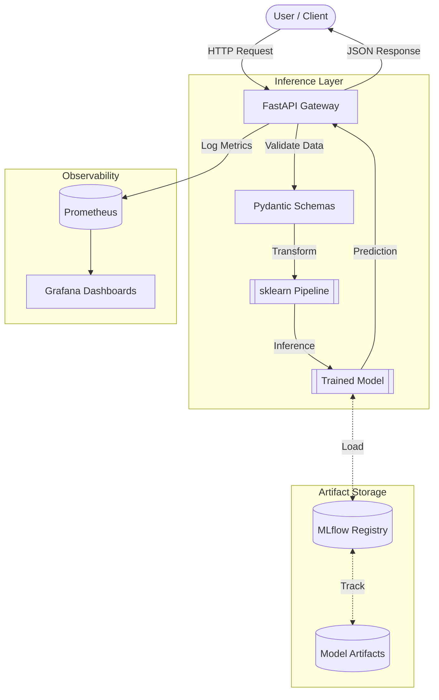

# Architecture Portfolio - ML/MLOps Multi-Project

## System Overview

This portfolio demonstrates a production-grade ML/MLOps architecture integrating three independent machine learning projects under a unified infrastructure and CI/CD pipeline.



## Request/Response Flow



---

## Project Architecture Details

### BankChurn-Predictor
**Domain**: Customer Churn Prediction (Banking)  
**ML Framework**: XGBoost with Optuna hyperparameter optimization  
**Pipeline Architecture**:
```
Raw Data → Feature Engineering → Preprocessing (Pipeline) → XGBoost Model → Predictions
```

**Key Components**:
- `src/bankchurn/data.py`: Data loading and validation
- `src/bankchurn/features.py`: Feature engineering
- `src/bankchurn/preprocessing.py`: Unified sklearn Pipeline
- `src/bankchurn/training.py`: Training loop with MLflow
- `app/fastapi_app.py`: REST API

**Model Pipeline**:
```python
Pipeline([
    ('preprocessor', ColumnTransformer([
        ('num', StandardScaler(), numeric_features),
        ('cat', OneHotEncoder(), categorical_features)
    ])),
    ('model', XGBClassifier(...))
])
```

### CarVision-Market-Intelligence
**Domain**: Vehicle Price Prediction  
**ML Framework**: RandomForest Regressor  
**Pipeline Architecture**:
```
Raw Data → Data Cleaning → Feature Engineering → Preprocessing → RF Model → Price Predictions
```

**Key Components**:
- `src/carvision/data.py`: Data loading with filtering
- `src/carvision/features.py`: Centralized `FeatureEngineer` class
- `src/carvision/training.py`: Model training
- `src/carvision/analysis.py`: Market analysis
- `app/streamlit_app.py`: Interactive dashboard

**Model Pipeline**:
```python
Pipeline([
    ('features', FeatureEngineer()),
    ('pre', ColumnTransformer([...])),
    ('model', RandomForestRegressor(...))
])
```

### TelecomAI-Customer-Intelligence
**Domain**: Telecom Plan Recommendation  
**ML Framework**: Scikit-Learn  
**Pipeline Architecture**:
```
Raw Data → Feature Engineering → Preprocessing → Classifier → Plan Predictions
```

## Infrastructure Architecture

### Docker Multi-Stage Builds
All projects use optimized multi-stage Dockerfiles.

**Benefits**:
- ~50% smaller final image size
- Improved security (no build tools in production)
- Non-root execution
- Layer caching optimization

### Docker Compose Stack
```yaml
services:
  mlflow:       # Port 5000
  bankchurn:    # Port 8001
  carvision:    # Ports 8002, 8501
  telecom:      # Port 8003
  prometheus:   # Port 9090
  grafana:      # Port 3000
```

## CI/CD Pipeline Architecture

### GitHub Actions Workflows

**`.github/workflows/ci-mlops.yml`** (Main Pipeline):
```yaml
jobs:
  tests:              # Matrix: 3 projects × 2 Python versions
  security:           # Gitleaks + Bandit
  docker:             # Build + Trivy scan
  integration-test:   # docker-compose up + pytest
```

## Technology Stack

| Layer | Technologies |
|-------|-------------|
| **ML Frameworks** | scikit-learn, XGBoost |
| **Optimization** | Optuna |
| **API** | FastAPI, uvicorn |
| **Dashboard** | Streamlit |
| **Tracking** | MLflow |
| **Monitoring** | Prometheus, Grafana |
| **Container** | Docker, Docker Compose |
| **CI/CD** | GitHub Actions |
| **Security** | Trivy, Bandit, Gitleaks |
| **Testing** | pytest, pytest-cov |
