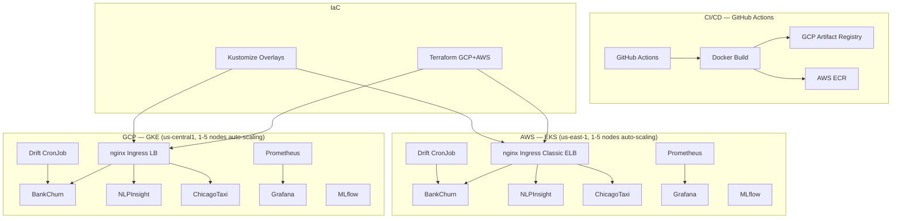

# Portfolio Architecture

**3 ML projects deployed end-to-end** — trained, containerized, served on GKE + EKS, monitored via Prometheus + Grafana.

---

## System Overview

```mermaid
graph TB
    subgraph "CI/CD — GitHub Actions"
        GH[GitHub Actions] --> BUILD[Docker Build]
        BUILD --> AR[GCP Artifact Registry]
        BUILD --> ECR[AWS ECR]
    end

    subgraph "GCP — GKE (us-central1, 1-5 nodes auto-scaling)"
        GCE[nginx Ingress LB] --> BC1[BankChurn] & NL1[NLPInsight] & CT1[ChicagoTaxi]
        P1[Prometheus] --> G1[Grafana]
        D1[Drift CronJob] --> BC1
        M1[MLflow]
    end

    subgraph "AWS — EKS (us-east-1, 1-5 nodes auto-scaling)"
        AWS[nginx Ingress Classic ELB] --> BC2[BankChurn] & NL2[NLPInsight] & CT2[ChicagoTaxi]
        P2[Prometheus] --> G2[Grafana]
        D2[Drift CronJob] --> BC2
        M2[MLflow]
    end

    subgraph "IaC"
        TF[Terraform GCP+AWS] --> GCE & AWS
        KS[Kustomize Overlays] --> GCE & AWS
    end
```

| Principle | Implementation |
|-----------|---------------|
| **Modularity** | Each project is self-contained with its own pipeline |
| **Consistency** | Shared patterns: `src/` layout, Pydantic config, FastAPI |
| **Observability** | MLflow + Prometheus + Grafana |
| **Security** | Gitleaks, Bandit, Trivy, pip-audit |
| **Scalability** | Kubernetes HPA, CPU-based autoscaling |
| **Multi-Cloud** | GKE + EKS with Kustomize overlays ([ADR-013](decisions/013-multicloud-parity-policy.md)) |

## Projects (v3.5.3, Python 3.11.14 + sklearn 1.8.0)

| Project | Algorithm | Primary Metric | In-Pod Latency | Tests | Coverage |
|---------|-----------|----------------|---------------|:-----:|:--------:|
| **BankChurn** | StackingClassifier (RF+GB+XGB+LGB→LR) | AUC 0.87 | 103ms p50 | 199 | 90% |
| **NLPInsight** | TF-IDF + LogReg (prod) / FinBERT (GPU) | Acc 80.6% | 5ms p50 | 74 | 98% |
| **ChicagoTaxi** | PySpark ETL + RandomForest (lag features) | R² 0.96 | 75ms p50 | 122 | 91% |

## Infrastructure

- **Containers**: Multi-stage Docker builds, non-root execution, `--no-deps` for heavy packages
- **Orchestration**: GKE (GCP) + EKS (AWS), both live — Terraform IaC + Kustomize overlays
- **Model Delivery**: GCS/S3 → Init Container → Pod (ConfigMap-driven paths)
- **CI/CD**: GitHub Actions (`deploy-gcp.yml` + `deploy-aws.yml`) → build → push → deploy
- **Monitoring**: Prometheus + Grafana + MLflow — cloud-agnostic, deployed on both clouds
- **Drift Detection**: Daily CronJob checking health + prediction stability (PSI) across all services

## GCP Production Cost (~$51/month)

| Service | Cost | % |
|---------|------|---|
| Compute Engine (4× e2-medium) | $20.50 | 40% |
| GKE management | $13.35 | 26% |
| Container Scanning | $9.10 | 18% |
| Networking | $6.15 | 12% |
| Cloud SQL (MLflow) | $1.70 | 3% |

> Covered by Free Tier credits. Optimized with single-zone cluster, e2-medium nodes, and cleanup policies.

## Technology Stack

| Layer | Technologies |
|-------|-------------|
| **ML** | scikit-learn 1.8.0, LightGBM 4.6+, HuggingFace Transformers, SHAP 0.50.0 |
| **API** | FastAPI, uvicorn, Pydantic |
| **Tracking** | MLflow 3.10, DVC |
| **Monitoring** | Prometheus, Grafana, Evidently AI, OpenTelemetry |
| **Responsible AI** | Fairness audits (×3), drift detection (KS+PSI+Evidently), Pandera validation |
| **Containers** | Docker, Kubernetes (GKE/EKS) |
| **IaC** | Terraform (GCP + AWS modules) |
| **CI/CD** | GitHub Actions, Trivy, Bandit, Gitleaks |
| **Testing** | pytest (90–98% coverage, 295+ tests), Locust (load testing, 2,675 requests, 0% errors) |

## Visual Evidence

### Multi-Cloud Deployment

| GKE vs EKS (HERO) | EKS Cluster Active | EKS Workloads Running |
|-------------------|-------------------|----------------------|
|  |  |  |

### GCP Production

| GKE Workloads | Grafana Monitoring | MLflow Experiments |
|---------------|-------------------|-------------------|
|  |  |  |

### Live Demos

| Demo | File | Description |
|------|------|-------------|
|  | `01-demo-prediccion.gif` | ML predictions: BankChurn (SHAP) + NLPInsight + ChicagoTaxi |
|  | `02-hpa-autoscaling.gif` | HPA auto-scaling under load (1→3 replicas) |
|  | `03-fairness-audit.gif` | Fairness audit CLI (disparate impact ratios) |

> **Video**: [Portfolio Demo (3:30 min)](https://youtu.be/qmw9VlgUcn8) — full multi-cloud walkthrough

## Related Docs

- [Model Catalog](models/catalog.md) — Production model registry
- [Deployment Evidence](DEPLOYMENT_EVIDENCE.md) — Multi-cloud verification
- [Multi-Cloud Comparison](MULTI_CLOUD_COMPARISON.md) — GKE vs EKS performance
- [API Reference](api/rest-apis.md) — REST API documentation
- [ADR-013: Multi-Cloud Parity](decisions/013-multicloud-parity-policy.md) — Parity policy
- [Quick Start](getting-started/quickstart.md) — Get running in 5 minutes

---

*Last Updated: March 2026 — Portfolio v3.5.3 (GKE + EKS deployed, Classic ELB)*
