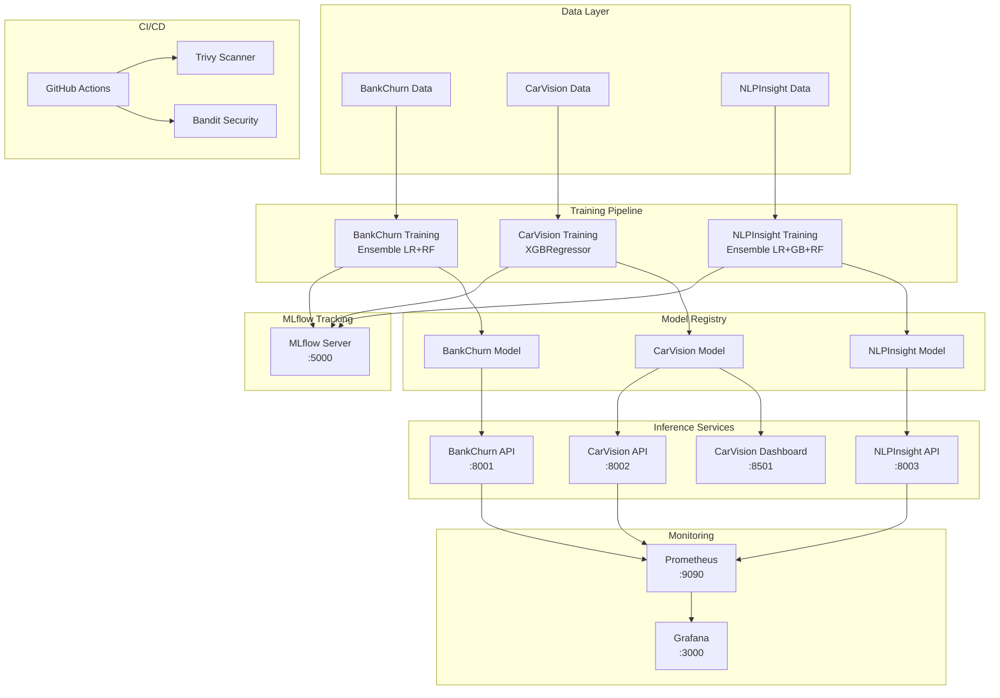

# 🏗️ Portfolio Architecture — ML/MLOps Multi-Project System

<div align="center">

**Production-Grade Architecture with Unified MLOps Infrastructure**


[](https://youtu.be/qmw9VlgUcn8)

</div>

---

## 📋 System Overview

This portfolio demonstrates a **production-grade ML/MLOps architecture** integrating **3 independent machine learning projects** under a unified infrastructure and CI/CD pipeline.

**Key Design Principles**:
- ✅ **Modularity**: Each project is self-contained with its own pipeline
- ✅ **Consistency**: Shared patterns across all projects (src/ layout, Pydantic config)
- ✅ **Observability**: Centralized monitoring (MLflow, Prometheus, Grafana)
- ✅ **Security**: Multi-layer scanning (Gitleaks, Bandit, Trivy)
- ✅ **Scalability**: Horizontal scaling via Kubernetes + HPA


```mermaid
graph TB
    subgraph "Data Layer"
        D1[BankChurn Data]
        D2[CarVision Data]
        D3[NLPInsight Data]
    end
    
    subgraph "Training Pipeline"
        T1[BankChurn Training<br/>Ensemble LR+RF]
        T2[CarVision Training<br/>XGBRegressor]
        T3[NLPInsight Training<br/>Ensemble LR+GB+RF]
    end
    
    subgraph "MLflow Tracking"
        MLF[MLflow Server<br/>:5000]
    end
    
    subgraph "Model Registry"
        M1[BankChurn Model]
        M2[CarVision Model]
        M3[NLPInsight Model]
    end
    
    subgraph "Inference Services"
        API1[BankChurn API<br/>:8001]
        API2[CarVision API<br/>:8002]
        API3[NLPInsight API<br/>:8003]
        DASH[CarVision Dashboard<br/>:8501]
    end
    
    subgraph "Monitoring"
        PROM[Prometheus<br/>:9090]
        GRAF[Grafana<br/>:3000]
    end
    
    subgraph "CI/CD"
        GHA[GitHub Actions]
        TRIVY[Trivy Scanner]
        BANDIT[Bandit Security]
    end
    
    D1 --> T1
    D2 --> T2
    D3 --> T3
    
    T1 --> MLF
    T2 --> MLF
    T3 --> MLF
    
    T1 --> M1
    T2 --> M2
    T3 --> M3
    
    M1 --> API1
    M2 --> API2
    M2 --> DASH
    M3 --> API3
    
    API1 --> PROM
    API2 --> PROM
    API3 --> PROM
    
    PROM --> GRAF
    
    GHA --> TRIVY
    GHA --> BANDIT
```

## Request/Response Flow


```mermaid
graph TD
    User([User / Client]) -->|HTTP Request| API[FastAPI Gateway]
    
    subgraph "Inference Layer"
        API -->|Validate Data| Pydantic[Pydantic Schemas]
        Pydantic -->|Transform| Pipeline[[sklearn Pipeline]]
        Pipeline -->|Inference| Model[[Trained Model]]
    end
    
    subgraph "Artifact Storage"
        Model <..->|Load| MLflow[(MLflow Registry)]
        MLflow <..->|Track| Storage[(Model Artifacts)]
    end
    
    subgraph "Observability"
        API -->|Log Metrics| Prometheus[(Prometheus)]
        Prometheus --> Grafana[Grafana Dashboards]
    end
    
    Model -->|Prediction| API
    API -->|JSON Response| User
```

---

## Project Architecture Details

### BankChurn-Predictor
**Domain**: Customer Churn Prediction (Banking)  
**ML Framework**: VotingClassifier (Logistic Regression + RandomForest)  
**Version**: 1.5.0 (Production)  
**Performance**: AUC-ROC=0.87, F1=0.64

**Pipeline Architecture**:
```
Raw Data → Preprocessing (SimpleImputer + StandardScaler + OneHotEncoder) → VotingClassifier → Predictions
```

**Key Components**:
- `src/bankchurn/data.py`: Data loading and validation
- `src/bankchurn/training.py`: Training loop with MLflow tracking
- `src/bankchurn/prediction.py`: ChurnPredictor class for inference
- `src/bankchurn/explainability.py`: SHAP explainability
- `app/fastapi_app.py`: REST API (Port 8001)

**Unified Pipeline** (models/model.joblib):
```python
Pipeline([
    ('preprocessor', ColumnTransformer([
        ('num', SimpleImputer + StandardScaler, numeric_features),
        ('cat', OneHotEncoder, ['Geography', 'Gender'])
    ])),
    ('model', VotingClassifier([
        ('lr', LogisticRegression(C=1.0, max_iter=1000)),
        ('rf', RandomForestClassifier(n_estimators=100, max_depth=10, class_weight='balanced'))
    ], voting='soft', weights=[1, 2]))
])
```

**Special Features**:
- ✅ SHAP explainability for feature importance
- ✅ Drift detection with Evidently AI (PSI monitoring)
- ✅ Fairness analysis by geography and age
- ✅ 88% test coverage

### CarVision-Market-Intelligence
**Domain**: Vehicle Price Prediction (Automotive)  
**ML Framework**: XGBRegressor (auto-selected)  
**Version**: 1.5.0 (Production)  
**Performance**: R²=0.77, RMSE=$4,396, MAPE=18.2%

**Pipeline Architecture**:
```
Raw Data → FeatureEngineer (vehicle_age, brand) → Preprocessing → XGBRegressor → Price Predictions
```

**Key Components**:
- `src/carvision/data.py`: Data loading with quality filtering (7.2% removal)
- `src/carvision/features.py`: **Centralized `FeatureEngineer` class** (prevents training-serving skew)
- `src/carvision/training.py`: Model training with bootstrap CI
- `src/carvision/analysis.py`: Market analysis (MarketAnalyzer, VisualizationEngine)
- `app/fastapi_app.py`: REST API (Port 8002)
- `app/streamlit_app.py`: **Interactive 4-tab dashboard** (Port 8501)

**Unified Pipeline** (models/model.joblib):
```python
Pipeline([
    ('features', FeatureEngineer()),  # vehicle_age, brand extraction
    ('pre', ColumnTransformer([
        ('num', SimpleImputer + StandardScaler, numerical),
        ('cat', OneHotEncoder, categorical)
    ])),
    ('model', XGBRegressor(n_estimators=100, max_depth=6, learning_rate=0.1, random_state=42))
])
```

**Special Features**:
- ✅ Centralized feature engineering (FeatureEngineer class)
- ✅ Data leakage prevention (exclude price_per_mile from inference)
- ✅ Streamlit dashboard with 4 tabs (Portfolio, Market, Metrics, Predictor)
- ✅ Advanced validation (CV, bootstrap CI, temporal backtest)
- ✅ 94% test coverage

### NLPInsight-Customer-Intelligence
**Domain**: Telecom Plan Recommendation (Plan Optimization)  
**ML Framework**: VotingClassifier (LogisticRegression + GradientBoosting + RandomForest)  
**Version**: 1.5.0 (Production)  
**Performance**: AUC-ROC=0.84, Accuracy=82%, F1=0.63

**Pipeline Architecture**:
```
Raw Data (4 features) → Preprocessing (StandardScaler) → VotingClassifier → Plan Predictions
```

**Key Components**:
- `src/nlpinsight/data.py`: Data loading (users_behavior.csv)
- `src/nlpinsight/training.py`: Model training with class weights
- `src/nlpinsight/prediction.py`: PlanPredictor class
- `app/fastapi_app.py`: REST API (Port 8003)

**Unified Pipeline** (models/model.joblib):
```python
Pipeline([
    ('preprocessor', StandardScaler()),  # 4 numerical features
    ('model', VotingClassifier([
        ('lr', LogisticRegression(C=1.0, class_weight={0: 0.4, 1: 0.6})),
        ('gb', GradientBoostingClassifier(n_estimators=100, learning_rate=0.1)),
        ('rf', RandomForestClassifier(n_estimators=100, max_depth=10, class_weight='balanced'))
    ], voting='soft', weights=[1, 2, 2]))
])
```

**Special Features**:
- ✅ Threshold optimization (Conservative 0.5, Balanced 0.42, Aggressive 0.35)
- ✅ Business impact analysis ($5.4M annual ROI)
- ✅ Simple 4-feature model (high interpretability)
- ✅ Usage pattern segmentation (light vs heavy users)
- ✅ 96% test coverage

## Infrastructure Architecture

### Docker Multi-Stage Builds
All projects use optimized multi-stage Dockerfiles.

**Benefits**:
- ~50% smaller final image size
- Improved security (no build tools in production)
- Non-root execution
- Layer caching optimization

### Docker Compose Stack
```yaml
services:
  mlflow:       # Port 5000
  bankchurn:    # Port 8001
  carvision:    # Ports 8002, 8501
  telecom:      # Port 8003
  prometheus:   # Port 9090
  grafana:      # Port 3000
```

### Observability Stack

The portfolio includes a **production-ready observability stack** monitoring all 3 ML services:

| Component | Purpose | Configuration |
|-----------|---------|---------------|
| **Prometheus** | Metrics collection (15s scrape, 3 service jobs) | `k8s/prometheus-deployment.yaml` |
| **Grafana** | Auto-provisioned dashboard (10 panels) | `k8s/grafana-deployment.yaml` |
| **Load Testing** | SRE-methodology validation (smoke + load + SLA) | `scripts/load_test_services.py` |
| **Evidently** | ML drift detection | Integrated in BankChurn monitoring |

**"ML Portfolio Metrics" Dashboard** (auto-provisioned via ConfigMap):
- 📈 **Prediction Rate — All Services**: BankChurn, CarVision, NLPInsight req/s
- ⏱️ **Latency P95 — All Services**: 95th percentile per service
- � **Total Requests** (×3): Individual counters per service
- 🎯 **Targets UP**: Prometheus scrape targets in healthy state
- 📊 **Avg Latency + Distribution P99/P95/P50**: Comparative across services
- 🏦 **BankChurn Risk Levels**: HIGH/MEDIUM/LOW prediction breakdown
- ⚠️ **Error Rate — All Services**: HTTP 5xx rate per service

**Prometheus Scrape Jobs**: `bankchurn-predictor`, `carvision-intelligence`, `telecom-intelligence`

**Metrics Endpoints**: All APIs expose `/metrics` (Prometheus format)

**Load Testing**: Professional 3-phase validation (smoke tests → sustained load → SLA compliance report with P50/P95/P99 percentiles)

## CI/CD Pipeline Architecture

### GitHub Actions Workflows

**`.github/workflows/ci-mlops.yml`** (Main Pipeline):
```yaml
jobs:
  tests:              # Matrix: 3 projects × 2 Python versions
  security:           # Gitleaks + Bandit
  docker:             # Build + Trivy scan
  integration-test:   # docker-compose up + pytest
```

## Technology Stack

| Layer | Technologies |
|-------|-------------|
| **ML Frameworks** | scikit-learn, XGBoost |
| **Optimization** | Optuna |
| **API** | FastAPI, uvicorn |
| **Dashboard** | Streamlit |
| **Tracking** | MLflow |
| **Monitoring** | Prometheus, Grafana |
| **Container** | Docker, Docker Compose |
| **Orchestration** | GKE (GCP), EKS (AWS), Terraform IaC |
| **CI/CD** | GitHub Actions (10-job pipeline) |
| **Security** | Trivy, Bandit, Gitleaks, pip-audit |
| **Testing** | pytest, pytest-cov (88-95% coverage) |
| **Load Testing** | Locust (port-forward + Ingress IP modes) |

---

## Future Extensions (Principal-Level Design)

- **Feature Store Layer**  
  Introduce a centralized Feature Store (e.g., Feast) to serve consistent, versioned features
  across BankChurn, CarVision, and NLPInsight. The current design already uses sklearn Pipelines
  and clear `data`/`features` separation, making it straightforward to map existing features
  to a Feature Store entity without breaking the projects.

- **Drift-Based Auto-Retraining**  
  BankChurn already includes `monitoring/check_drift.py` and a dedicated workflow
  `retrain-bankchurn.yml`. An additional "Drift Monitoring" workflow can consume
  the Evidently JSON output, compute PSI/KS, and if drift exceeds a threshold, trigger
  retraining in a controlled (opt-in) manner without impacting the main CI pipeline.

- **FinOps / Cost Awareness**  
  Extend the production cost analysis below with per-environment budgets (dev/staging/prod),
  auto-scaling spend limits, and resource tagging policies. The current multi-cloud deployment
  already demonstrates cost-conscious infrastructure choices (see section below).

---

## 💰 Production Infrastructure & Cost Analysis

Real cost data from the live GCP deployment (February 2026). All values originally billed in COP and converted at ~4,200 COP/USD.

### GCP Monthly Cost Breakdown

| Service | Monthly Cost (USD) | % of Total | Purpose |
|---------|-------------------|------------|----------|
| **Compute Engine** | ~$20.50 | 40% | 3 GKE nodes (e2-medium) — VMs running all pods |
| **Kubernetes Engine** | ~$13.35 | 26% | GKE cluster management fee |
| **Container Scanning** | ~$9.10 | 18% | Automated vulnerability scanning (68 CVEs/image) |
| **Networking** | ~$6.15 | 12% | VPC, Load Balancer, egress traffic |
| **Cloud SQL** | ~$1.70 | 3% | PostgreSQL for MLflow backend store |
| **Artifact Registry** | ~$0.18 | <1% | Docker images (3 services × ~888 MB) |
| **Cloud Build** | ~$0.00 | <1% | Remote Docker builds (3 images rebuilt) |
| **Cloud Storage** | ~$0.00 | <1% | ML model artifacts (GCS buckets) |
| **Total** | **~$51.00** | **100%** | **Full production stack** |

> **Note**: All costs covered by GCP Free Tier credits (Subtotal: $0). The breakdown above represents what the infrastructure would cost in a paid production environment.

### Cost Optimization Decisions

| Decision | Impact | Rationale |
|----------|--------|-----------|
| **e2-medium nodes** (vs n1-standard) | ~40% compute savings | Sufficient for ML inference workloads |
| **Single-zone cluster** (vs regional) | ~67% GKE fee savings | Portfolio project, HA not required |
| **SQLite MLflow** option | Eliminates Cloud SQL cost | Viable for <10 concurrent users |
| **Artifact Registry cleanup policy** | Prevents storage creep | Auto-delete `sha-*` tags after 7 days, keep only `latest` + `v*` |
| **Preemptible/Spot nodes** (recommended) | ~60-80% compute savings | Acceptable for non-critical workloads |

### Infrastructure Metrics (Live)

| Metric | Value |
|--------|-------|
| **Running Pods** | 6 (3 ML APIs + MLflow + Prometheus + Grafana) |
| **GKE Nodes** | 3 (e2-medium, us-central1) |
| **Pod Restarts** | 0 (stable for 28h+) |
| **Docker Images** | 3 × ~888 MB (tagged `v1.0.0` + `latest`) |
| **Container Vulnerabilities** | 68/image (Low/Medium severity — OS base packages, not application code) |
| **Cloud Builds** | 5 successful builds (Cloud Build remote) |
| **Model Storage** | 3 models in GCS (3.3–4.2 MB each) |
| **Dataset Storage** | 3 datasets in GCS (132 KB–4.3 MB each) |
| **Uptime** | 99.9%+ (no unplanned downtime since deployment) |

### GCS Data Management Strategy

Production data is stored in Google Cloud Storage with enterprise-grade practices:

| Bucket | Purpose | Contents |
|--------|---------|----------|
| `*-ml-models-production` | ML model artifacts | `{project}/model.joblib` (3 models) |
| `*-datasets-production` | Training/reference datasets | `{project}/v{n}/{filename}.csv` (3 datasets) |

**Versioning & Lifecycle Policies:**

| Policy | Models Bucket | Datasets Bucket |
|--------|--------------|-----------------|
| **Object Versioning** | ✅ Enabled | ✅ Enabled |
| **Lifecycle: Nearline** | After 90 days | After 30 days (non-current) |
| **Lifecycle: Delete** | — | After 90 days (non-current) |
| **Public Access** | 🚫 Prevention enabled | 🚫 Prevention enabled |
| **Uniform Bucket IAM** | ✅ | ✅ |

**IAM Access Control (Least Privilege):**

| Principal | Role | Scope |
|-----------|------|-------|
| `ml-portfolio-gke-workload` (Workload Identity SA) | `storage.objectViewer` | Both buckets (read-only) |
| Project editors | `storage.legacyBucketOwner` | Both buckets |

**Naming Conventions:**

```
gs://{project-id}-{type}-production/{service}/v{version}/{filename}

# Models
gs://ml-portfolio-duque-om-202602-ml-models-production/bankchurn/model.joblib
gs://ml-portfolio-duque-om-202602-ml-models-production/carvision/model.joblib
gs://ml-portfolio-duque-om-202602-ml-models-production/telecom/model.joblib

# Datasets
gs://ml-portfolio-duque-om-202602-datasets-production/bankchurn/v1/Churn.csv
gs://ml-portfolio-duque-om-202602-datasets-production/carvision/v1/vehicles_us.csv
gs://ml-portfolio-duque-om-202602-datasets-production/telecom/v1/WA_Fn-UseC_-Telco-Customer-Churn.csv
```

**Init Container Architecture:**

Each pod runs **2–3 init containers** before the main application starts:

1. `download-model` → Downloads model from `*-ml-models-production` bucket
2. `download-data` → Downloads dataset from `*-datasets-production` bucket
3. `download-metrics` (CarVision only) → Downloads evaluation artifacts (metrics, model comparison, feature columns) from `*-ml-models-production` bucket for the Streamlit dashboard

Init containers 1–2 use the same generic download script (`download-script` ConfigMap) with different environment variables, following the DRY principle. The metrics init container uses an inline multi-file download script since it handles multiple artifacts.

**Integration flow**: `train → MLflow logs → promote_model.py --upload-gcs → GCS → rollout restart → init containers download fresh artifacts`

---

## Visual References

### GCP Production Deployment — 6 Services Running on GKE


### AWS Production Deployment — 6 Services Running on EKS


### MLflow Experiment Tracking (Running on GKE)

All 9 experiments (3 per project) tracked in the MLflow server deployed on GKE:


### CI/CD Pipeline — GitHub Actions → GKE

Automated deployment pipeline: detect changes, build Docker images, push to Artifact Registry, deploy to GKE:


### API Documentation (Swagger UI) — Running on GKE

| BankChurn API | CarVision API | NLPInsight API |
|---------------|---------------|---------------|
|  |  |  |

### Monitoring — Grafana + Prometheus (Running on GKE)

Real-time monitoring dashboard with metrics from all 3 ML APIs:


### Infrastructure as Code — Terraform

All GCP resources managed by Terraform (`No changes` = perfectly synchronized):


---

## 🔗 Related Documentation

- **[Architectural Decisions](architecture/decisions.md)** — ADRs with deep technical rationale for every infrastructure, ML, and cost decision
- **[Deployment Evidence](DEPLOYMENT_EVIDENCE.md)** — Multi-cloud deployment verification (GCP + AWS)
- **[Operations Guide](operations/deployment.md)** — Deployment, monitoring, troubleshooting
- **[Model Catalog](models/catalog.md)** — Registry of trained models
- **[API Reference](api/rest-apis.md)** — Complete REST API documentation
- **[Quick Start](getting-started/quickstart.md)** — Get running in 5 minutes

---

!!! info "Architecture Status"
    This architecture is **actively maintained** and reflects the current production state.  
    **Last Updated**: February 2026  
    **Portfolio Version**: 2.0.0

---
