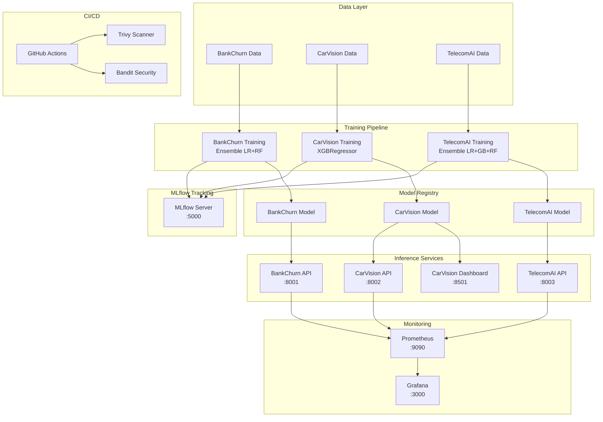
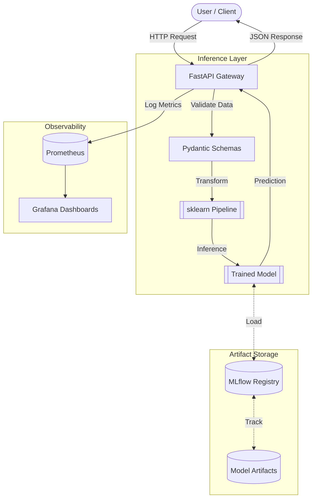

# 🏗️ Portfolio Architecture — ML/MLOps Multi-Project System

<div align="center">

**Production-Grade Architecture with Unified MLOps Infrastructure**


[](https://youtu.be/qmw9VlgUcn8)

</div>

---

## 📋 System Overview

This portfolio demonstrates a **production-grade ML/MLOps architecture** integrating **3 independent machine learning projects** under a unified infrastructure and CI/CD pipeline.

**Key Design Principles**:
- ✅ **Modularity**: Each project is self-contained with its own pipeline
- ✅ **Consistency**: Shared patterns across all projects (src/ layout, Pydantic config)
- ✅ **Observability**: Centralized monitoring (MLflow, Prometheus, Grafana)
- ✅ **Security**: Multi-layer scanning (Gitleaks, Bandit, Trivy)
- ✅ **Scalability**: Horizontal scaling via Kubernetes + HPA


```mermaid
graph TB
    subgraph "Data Layer"
        D1[BankChurn Data]
        D2[CarVision Data]
        D3[TelecomAI Data]
    end
    
    subgraph "Training Pipeline"
        T1[BankChurn Training<br/>Ensemble LR+RF]
        T2[CarVision Training<br/>XGBRegressor]
        T3[TelecomAI Training<br/>Ensemble LR+GB+RF]
    end
    
    subgraph "MLflow Tracking"
        MLF[MLflow Server<br/>:5000]
    end
    
    subgraph "Model Registry"
        M1[BankChurn Model]
        M2[CarVision Model]
        M3[TelecomAI Model]
    end
    
    subgraph "Inference Services"
        API1[BankChurn API<br/>:8001]
        API2[CarVision API<br/>:8002]
        API3[TelecomAI API<br/>:8003]
        DASH[CarVision Dashboard<br/>:8501]
    end
    
    subgraph "Monitoring"
        PROM[Prometheus<br/>:9090]
        GRAF[Grafana<br/>:3000]
    end
    
    subgraph "CI/CD"
        GHA[GitHub Actions]
        TRIVY[Trivy Scanner]
        BANDIT[Bandit Security]
    end
    
    D1 --> T1
    D2 --> T2
    D3 --> T3
    
    T1 --> MLF
    T2 --> MLF
    T3 --> MLF
    
    T1 --> M1
    T2 --> M2
    T3 --> M3
    
    M1 --> API1
    M2 --> API2
    M2 --> DASH
    M3 --> API3
    
    API1 --> PROM
    API2 --> PROM
    API3 --> PROM
    
    PROM --> GRAF
    
    GHA --> TRIVY
    GHA --> BANDIT
```

## Request/Response Flow


```mermaid
graph TD
    User([User / Client]) -->|HTTP Request| API[FastAPI Gateway]
    
    subgraph "Inference Layer"
        API -->|Validate Data| Pydantic[Pydantic Schemas]
        Pydantic -->|Transform| Pipeline[[sklearn Pipeline]]
        Pipeline -->|Inference| Model[[Trained Model]]
    end
    
    subgraph "Artifact Storage"
        Model <..->|Load| MLflow[(MLflow Registry)]
        MLflow <..->|Track| Storage[(Model Artifacts)]
    end
    
    subgraph "Observability"
        API -->|Log Metrics| Prometheus[(Prometheus)]
        Prometheus --> Grafana[Grafana Dashboards]
    end
    
    Model -->|Prediction| API
    API -->|JSON Response| User
```

---

## Project Architecture Details

### BankChurn-Predictor
**Domain**: Customer Churn Prediction (Banking)  
**ML Framework**: VotingClassifier (Logistic Regression + RandomForest)  
**Version**: 1.5.0 (Production)  
**Performance**: AUC-ROC=0.853, F1=0.604

**Pipeline Architecture**:
```
Raw Data → Preprocessing (SimpleImputer + StandardScaler + OneHotEncoder) → VotingClassifier → Predictions
```

**Key Components**:
- `src/bankchurn/data.py`: Data loading and validation
- `src/bankchurn/training.py`: Training loop with MLflow tracking
- `src/bankchurn/prediction.py`: ChurnPredictor class for inference
- `src/bankchurn/explainability.py`: SHAP explainability
- `app/fastapi_app.py`: REST API (Port 8001)

**Unified Pipeline** (models/model.joblib):
```python
Pipeline([
    ('preprocessor', ColumnTransformer([
        ('num', SimpleImputer + StandardScaler, numeric_features),
        ('cat', OneHotEncoder, ['Geography', 'Gender'])
    ])),
    ('model', VotingClassifier([
        ('lr', LogisticRegression(C=1.0, max_iter=1000)),
        ('rf', RandomForestClassifier(n_estimators=100, max_depth=10, class_weight='balanced'))
    ], voting='soft', weights=[1, 2]))
])
```

**Special Features**:
- ✅ SHAP explainability for feature importance
- ✅ Drift detection with Evidently AI (PSI monitoring)
- ✅ Fairness analysis by geography and age
- ✅ 86% test coverage

### CarVision-Market-Intelligence
**Domain**: Vehicle Price Prediction (Automotive)  
**ML Framework**: XGBRegressor (auto-selected)  
**Version**: 1.5.0 (Production)  
**Performance**: R²=0.766, RMSE=$4,794, MAPE=17.8%

**Pipeline Architecture**:
```
Raw Data → FeatureEngineer (vehicle_age, brand) → Preprocessing → XGBRegressor → Price Predictions
```

**Key Components**:
- `src/carvision/data.py`: Data loading with quality filtering (7.2% removal)
- `src/carvision/features.py`: **Centralized `FeatureEngineer` class** (prevents training-serving skew)
- `src/carvision/training.py`: Model training with bootstrap CI
- `src/carvision/analysis.py`: Market analysis (MarketAnalyzer, VisualizationEngine)
- `app/fastapi_app.py`: REST API (Port 8002)
- `app/streamlit_app.py`: **Interactive 4-tab dashboard** (Port 8501)

**Unified Pipeline** (models/model.joblib):
```python
Pipeline([
    ('features', FeatureEngineer()),  # vehicle_age, brand extraction
    ('pre', ColumnTransformer([
        ('num', SimpleImputer + StandardScaler, numerical),
        ('cat', OneHotEncoder, categorical)
    ])),
    ('model', XGBRegressor(n_estimators=100, max_depth=6, learning_rate=0.1, random_state=42))
])
```

**Special Features**:
- ✅ Centralized feature engineering (FeatureEngineer class)
- ✅ Data leakage prevention (exclude price_per_mile from inference)
- ✅ Streamlit dashboard with 4 tabs (Portfolio, Market, Metrics, Predictor)
- ✅ Advanced validation (CV, bootstrap CI, temporal backtest)
- ✅ 94% test coverage

### TelecomAI-Customer-Intelligence
**Domain**: Telecom Plan Recommendation (Plan Optimization)  
**ML Framework**: VotingClassifier (LogisticRegression + GradientBoosting + RandomForest)  
**Version**: 1.5.0 (Production)  
**Performance**: AUC-ROC=0.84, Accuracy=82%, F1=0.63

**Pipeline Architecture**:
```
Raw Data (4 features) → Preprocessing (StandardScaler) → VotingClassifier → Plan Predictions
```

**Key Components**:
- `src/telecom/data.py`: Data loading (users_behavior.csv)
- `src/telecom/training.py`: Model training with class weights
- `src/telecom/prediction.py`: PlanPredictor class
- `app/fastapi_app.py`: REST API (Port 8003)

**Unified Pipeline** (models/model.joblib):
```python
Pipeline([
    ('preprocessor', StandardScaler()),  # 4 numerical features
    ('model', VotingClassifier([
        ('lr', LogisticRegression(C=1.0, class_weight={0: 0.4, 1: 0.6})),
        ('gb', GradientBoostingClassifier(n_estimators=100, learning_rate=0.1)),
        ('rf', RandomForestClassifier(n_estimators=100, max_depth=10, class_weight='balanced'))
    ], voting='soft', weights=[1, 2, 2]))
])
```

**Special Features**:
- ✅ Threshold optimization (Conservative 0.5, Balanced 0.42, Aggressive 0.35)
- ✅ Business impact analysis ($5.4M annual ROI)
- ✅ Simple 4-feature model (high interpretability)
- ✅ Usage pattern segmentation (light vs heavy users)
- ✅ 96% test coverage

## Infrastructure Architecture

### Docker Multi-Stage Builds
All projects use optimized multi-stage Dockerfiles.

**Benefits**:
- ~50% smaller final image size
- Improved security (no build tools in production)
- Non-root execution
- Layer caching optimization

### Docker Compose Stack
```yaml
services:
  mlflow:       # Port 5000
  bankchurn:    # Port 8001
  carvision:    # Ports 8002, 8501
  telecom:      # Port 8003
  prometheus:   # Port 9090
  grafana:      # Port 3000
```

### Observability Stack

The portfolio includes a **production-ready observability stack**:

| Component | Purpose | Configuration |
|-----------|---------|---------------|
| **Prometheus** | Metrics collection (15s scrape) | `infra/prometheus-config.yaml` |
| **Grafana** | Visualization & dashboards | `infra/grafana/dashboards/ml-portfolio-dashboard.json` |
| **Alertmanager** | Alert routing & notifications | `infra/prometheus-rules.yaml` |
| **Evidently** | ML drift detection | Integrated in BankChurn monitoring |

**Pre-built Dashboard Panels**:
- 🎯 **Service Health**: UP/DOWN status for all 4 services
- 📈 **Request Metrics**: Rate (req/s), Latency (P50, P95)
- 🤖 **ML Predictions**: Predictions/hour, price distribution
- ⚠️ **Model Drift**: Drift score gauges (green/yellow/red)
- 💻 **Resources**: CPU utilization, memory usage

**Metrics Endpoints**: All APIs expose `/metrics` (Prometheus format)

## CI/CD Pipeline Architecture

### GitHub Actions Workflows

**`.github/workflows/ci-mlops.yml`** (Main Pipeline):
```yaml
jobs:
  tests:              # Matrix: 3 projects × 2 Python versions
  security:           # Gitleaks + Bandit
  docker:             # Build + Trivy scan
  integration-test:   # docker-compose up + pytest
```

## Technology Stack

| Layer | Technologies |
|-------|-------------|
| **ML Frameworks** | scikit-learn, XGBoost |
| **Optimization** | Optuna |
| **API** | FastAPI, uvicorn |
| **Dashboard** | Streamlit |
| **Tracking** | MLflow |
| **Monitoring** | Prometheus, Grafana |
| **Container** | Docker, Docker Compose |
| **CI/CD** | GitHub Actions |
| **Security** | Trivy, Bandit, Gitleaks |
| **Testing** | pytest, pytest-cov |

---

## Future Extensions (Principal-Level Design)

- **Feature Store Layer**  
  Introduce a centralized Feature Store (e.g., Feast) to serve consistent, versioned features
  across BankChurn, CarVision y TelecomAI. El diseño actual ya usa Pipelines de sklearn
  y separación clara `data`/`features`, lo que facilita mapear features existentes a una
  entidad de Feature Store sin romper los proyectos.

- **Drift-Based Auto-Retraining**  
  BankChurn ya incluye `monitoring/check_drift.py` y un workflow dedicado
  `retrain-bankchurn.yml`. Un workflow adicional de "Drift Monitoring" puede consumir
  el JSON de Evidently, calcular PSI/KS y, si el drift supera un umbral, disparar el
  retraining de forma controlada (opt-in) sin impactar el CI principal.

- **FinOps / Cost Awareness**  
  La infraestructura propuesta (EKS/GKE + RDS/CloudSQL + S3/GCS + Prom/Grafana) debe
  acompañarse de análisis de costos por entorno (dev/stage/prod), límites de auto-scaling
  y etiquetado de recursos. Ver `docs/architecture/infrastructure.md` para recomendaciones
  de dimensionamiento y cómo extender este portfolio con un análisis FinOps básico.

---

## Visual References

### GCP Production Deployment — 6 Services Running on GKE


### MLflow Experiment Tracking (Running on GKE)

All 9 experiments (3 per project) tracked in the MLflow server deployed on GKE:


### CI/CD Pipeline — GitHub Actions → GKE

Automated deployment pipeline: detect changes, build Docker images, push to Artifact Registry, deploy to GKE:


### API Documentation (Swagger UI) — Running on GKE

| BankChurn API | CarVision API | TelecomAI API |
|---------------|---------------|---------------|
|  |  |  |

### Monitoring — Grafana + Prometheus (Running on GKE)

Real-time monitoring dashboard with metrics from all 3 ML APIs:


### Infrastructure as Code — Terraform

All GCP resources managed by Terraform (`No changes` = perfectly synchronized):


---

## 🔗 Related Documentation

- **[Architectural Decisions](architecture/decisions.md)** — ADRs with deep technical rationale for every infrastructure, ML, and cost decision
- **[Operations Guide](OPERATIONS_PORTFOLIO.md)** — Deployment, monitoring, troubleshooting
- **[Model Catalog](models/catalog.md)** — Registry of trained models
- **[API Reference](api/rest-apis.md)** — Complete REST API documentation
- **[Quick Start](getting-started/quickstart.md)** — Get running in 5 minutes

---

!!! info "Architecture Status"
    This architecture is **actively maintained** and reflects the current production state.  
    **Last Updated**: February 2026  
    **Portfolio Version**: 2.0.0

---
