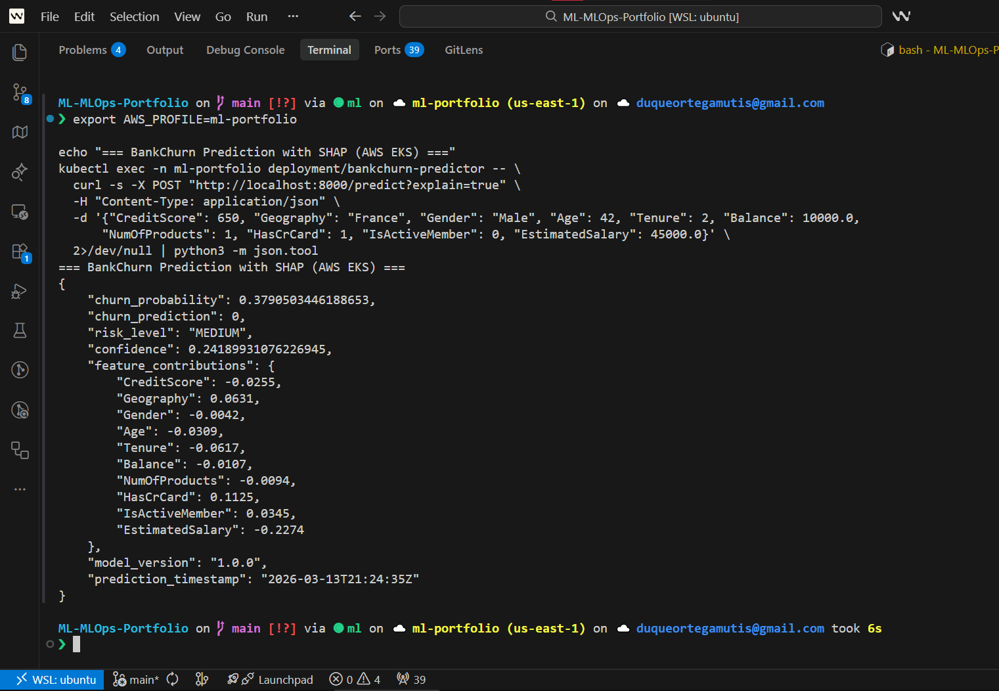

# Multi-Cloud Deployment Evidence

> Production deployment of 3 ML services on **Google Cloud Platform (GKE)** and **Amazon Web Services (EKS)**.
> All data below is from **live verification** on 2026-03-05 (v3.5.0).

---

## Architecture

```
┌────────────────────────────────────────────────────────────────────┐
│  GCP (us-central1)                  │  AWS (us-east-1)             │
│                                     │                              │
│  GKE Cluster (3 nodes)              │  EKS Cluster (3 nodes)       │
│  v1.34.3-gke.1318000                │  v1.31 (t3.small)            │
│                                     │                              │
│  ┌─── ML Services (HPA) ────────┐   │  ┌─── ML Services (HPA) ──┐  │
│  │ ┌──────────┐ ┌──────────┐    │   │  │ ┌────────┐ ┌────────┐  │  │
│  │ │BankChurn │ │NLPInsight│    │   │  │ │BankCh. │ │NLPIns. │  │  │
│  │ │ API:8000 │ │ API:8000 │    │   │  │ │  :8000 │ │  :8000 │  │  │
│  │ └──────────┘ └──────────┘    │   │  │ └────────┘ └────────┘  │  │
│  │ ┌──────────┐                 │   │  │ ┌────────┐             │  │
│  │ │Chicago   │                 │   │  │ │Chicago │             │  │
│  │ │Taxi:8000 │                 │   │  │ │T.:8000 │             │  │
│  │ └──────────┘                 │   │  │ └────────┘             │  │
│  └──────────────────────────────┘   │  └────────────────────────┘  │
│                                     │                              │
│  ┌─── Observability Stack ──────┐   │  ┌─── Observability ──────┐  │
│  │ ┌──────────┐ ┌──────────┐    │   │  │ ┌────────┐ ┌────────┐  │  │
│  │ │Prometheus│ │ Grafana  │    │   │  │ │Prometh.│ │Grafana │  │  │
│  │ │  :9090   │ │  :3000   │    │   │  │ │  :9090 │ │  :3000 │  │  │
│  │ └──────────┘ └──────────┘    │   │  │ └────────┘ └────────┘  │  │
│  │ ┌──────────┐                 │   │  │ ┌────────┐             │  │
│  │ │  MLflow  │                 │   │  │ │ MLflow │             │  │
│  │ │  :5000   │                 │   │  │ │  :5000 │             │  │
│  │ └──────────┘                 │   │  │ └────────┘             │  │
│  └──────────────────────────────┘   │  └────────────────────────┘  │
│                                     │                              │
│  nginx-ingress (34.120.120.57)      │  nginx-ingress (NodePort¹)   │
│  Artifact Registry + GCS            │  ECR + S3                    │
│  Workload Identity                  │  IRSA                        │
│  Terraform IaC                      │  eksctl + Kustomize          │
└────────────────────────────────────────────────────────────────────┘

6 pods per cloud: 3 ML APIs + Prometheus + Grafana + MLflow.
¹ AWS LB Controller installed; account-level CreateLoadBalancer restriction pending.
  NodePort + Security Group rule provides external access.
```

## Verified Capabilities

| Capability | GCP | AWS | Evidence |
|------------|-----|-----|----------|
| Container orchestration (K8s) | GKE v1.34.3 | EKS v1.31 | 3 nodes per cloud, 6 pods running |
| Auto-scaling (HPA) | CPU-based | CPU-based | Verified: 1→3 pods under load, scale-down after |
| Model serving (FastAPI) | 3 services | 3 services | `/health` + `/predict` — 27/27 smoke tests passed |
| Batch prediction | All 3 APIs | All 3 APIs | `/predict_batch` endpoints verified |
| Explainability (SHAP) | BankChurn | BankChurn | `/predict?explain=true` — 196ms with SHAP contributions |
| Monitoring (Prometheus) | 16/16 targets UP | Custom metrics | `bankchurn_*`, `nlpinsight_*`, `chicagotaxi_*` + 16 alert rules |
| Dashboards (Grafana) | v10.2.2, 2 dashboards | ML Performance | Latency, throughput, error rates, predictions, resource usage |
| Experiment tracking (MLflow) | Cloud SQL backend | SQLite (in-pod) | Running, v2.9.2 |
| Infrastructure as Code | Terraform GCP | eksctl + Kustomize AWS | 8/8 tests passed (fmt, validate, tfsec, checkov) |
| CI/CD (GitHub Actions) | Build + Deploy | Build + Deploy | 10-job pipeline, GHCR publish |
| Container registry | Artifact Registry | ECR | v3.5.0 images pushed |
| Object storage (models) | GCS | S3 | Init containers download on boot |
| Data versioning | DVC + GCS | DVC + S3 | `dvc push/pull` configured |
| Security scanning | Bandit + Gitleaks | Bandit + Gitleaks | Blocking in CI (HIGH severity) |
| Pod Security Standards | baseline enforce, restricted warn | baseline enforce | Namespace labels applied |
| Network Policies | default-deny + 3 allow rules | default-deny + 3 allow rules | Applied to cluster |
| Pod Disruption Budgets | minAvailable=1 (3 services) | minAvailable=1 | Applied to cluster |
| Test coverage | 90-98% (294+ tests) | 90-98% | Codecov integration, 85% CI threshold |
| Adversarial testing | 43 robustness tests | 43 tests | SQL injection, XSS, boundary, Unicode |
| Infra testing (Terraform) | tfsec + checkov | tfsec + checkov | GCP 51/71, AWS 84/116 |
| Infra testing (K8s) | kube-linter + conftest | kube-linter + conftest | 9/9 passed, 0 OPA violations |

## Test Results (v3.5.0 — Verified 2026-03-05)

### Unit Test Coverage (294+ total tests, 0 failures)

| Project | Tests | Coverage | CI Threshold |
|---------|-------|----------|--------------|
| BankChurn | ~198 | **90%** | 85% |
| NLPInsight | 74 | **98%** | 85% |
| ChicagoTaxi | 22 | **91%** | 85% |
| **Total** | **294+** | **90–98%** | 85% |

### Smoke & Integration Tests (Live GKE Cluster, 2026-03-05)

| Test Suite | Tests | Passed | Failed | Notes |
|------------|-------|--------|--------|-------|
| Smoke services (`test_smoke_services.py`) | 27 | **27** | 0 | Health, predict, metrics, OpenAPI |
| K8s smoke (`test_smoke_k8s.py`) | 9 | **9** | 0 | BankChurn, NLPInsight |
| **Total live tests** | **36** | **36** | **0** | All services healthy + predictions correct |

### Infrastructure Tests

| Test | Type | GCP | AWS |
|------|------|-----|-----|
| `terraform fmt` | Hard gate | ✅ Pass | ✅ Pass |
| `terraform validate` | Hard gate | ✅ Pass | ✅ Pass |
| `tfsec` | Advisory | ✅ 0 critical, 2 high | ✅ 2 critical, 5 high |
| `checkov` | Advisory | ✅ 51/71 passed | ✅ 84/116 passed |
| K8s YAML syntax | Hard gate | ✅ 16/16 files | ✅ All overlays |
| `kube-linter` | Advisory | ✅ 24 findings (advisory) | ✅ advisory |
| `conftest` (OPA) | Hard gate | ✅ 16/16 files, 0 violations | ✅ 10/10+1/1 files |
| K8s security checks | Hard gate | ✅ No privileged, no hostNetwork | ✅ Same |
| K8s required resources | Hard gate | ✅ 6 kinds, 5 deployments | ✅ Same |
| **Total** | | **9/9 passed** | **8/8 passed** |

> Run: `bash tests/infra/kubernetes/test_kubernetes.sh all && bash tests/infra/terraform/test_terraform.sh all`

## Model Performance (v3.0.0 — Python 3.11, sklearn 1.8.0)

| Model | Algorithm | Key Metric | Size |
|-------|-----------|------------|------|
| BankChurn | StackingClassifier (RF+GB+XGB+LGB→LR) | AUC 0.87, F1 0.62 | 4.1 MB |
| NLPInsight | TF-IDF + LogReg (production) | Acc 80.6%, F1-macro 0.748 | ~5 MB |
| ChicagoTaxi | RandomForest (lag features) | R² 0.96, RMSE 7.87 | ~2 MB |

## Docker Image Sizes (v3.5.0 — Artifact Registry, 2026-03-05)

| Service | Image | Size | Base |
|---------|-------|------|------|
| BankChurn | `bankchurn:v3.5.0` | **342 MB** | python:3.11-slim-bookworm |
| NLPInsight | `nlpinsight:v3.5.0` | **267 MB** | python:3.11-slim-bookworm |
| ChicagoTaxi | `chicagotaxi:v3.5.0` | **154 MB** | python:3.11-slim-bookworm |

> Optimizations: multi-stage build, `--no-compile`, aggressive cleanup (`__pycache__`, `tests/` excluding numpy, `pip/setuptools`), no `.so` stripping (corrupts numpy 2.x).
> NLPInsight dropped from 1.4 GB (FinBERT/torch) to 267 MB (TF-IDF+LogReg, no torch dependency).

## In-Pod Latency (measured inside container, zero network overhead, 2026-03-05)

> These are the **real production latencies** — measured by executing benchmarks directly inside each pod,
> eliminating port-forward proxy overhead (~50-100ms). This is equivalent to what a service mesh
> (Istio/Linkerd) or internal cluster client would observe.

| Service | Endpoint | P50 | P95 | Notes |
|---------|----------|-----|-----|-------|
| BankChurn | `/predict` | **103ms** | **111ms** | StackingClassifier (5 models) |
| BankChurn | `/predict?explain=true` | **196ms** | — | +SHAP explainability |
| NLPInsight | `/predict` | **5ms** | **15ms** | TF-IDF+LogReg, inference_time=2.3ms |
| ChicagoTaxi | `/demand` | **75ms** | **460ms** | DataFrame filter on 355K rows |
| ChicagoTaxi | `/areas` | **187ms** | — | GroupBy aggregation on 355K rows |

### Why BankChurn is slower

BankChurn uses a **StackingClassifier** ensemble: 4 base learners (RandomForest, GradientBoosting, XGBoost, LightGBM) feed into a LogisticRegression meta-learner. Each prediction runs 5 models sequentially. A P50 of ~103ms is **expected and acceptable** for this architecture — enterprise SLA target is P95 < 500ms.

## Load Test Results (Locust, 30 users, 120s, via port-forward, 2026-03-05)

> Port-forward adds ~50-100ms overhead per request and serializes connections under concurrency.
> In-pod metrics above are the authoritative production latency numbers.

| Endpoint | Requests | P50 | P95 | P99 | Errors |
|----------|----------|-----|-----|-----|--------|
| bankchurn:predict | 746 | 670ms | 1600ms | 2000ms | 0 (0%) |
| nlpinsight:predict | 829 | 66ms | 160ms | 540ms | 0 (0%) |
| nlpinsight:predict_batch | 223 | 66ms | 170ms | 670ms | 0 (0%) |
| chicagotaxi:demand | 373 | 93ms | 220ms | 510ms | 0 (0%) |
| chicagotaxi:areas | 130 | 120ms | 220ms | 360ms | 0 (0%) |
| **Aggregated** | **2,675** | **97ms** | **1200ms** | **1700ms** | **0 (0%)** |

**SLA Compliance**: Error rate 0.0% < 1% ✅ · Zero application errors under 30-user concurrent load ✅

### HPA Auto-Scaling Configuration

| Service | Min/Max Replicas | CPU Target | Idle CPU | Memory |
|---------|------------------|------------|----------|--------|
| BankChurn | 1–3 | 70% | 3% | 344Mi |
| NLPInsight | 1–3 | 75% | 3% | 283Mi |
| ChicagoTaxi | 1–3 | 70% | 33% | 431Mi |

## Live Cluster State

### GCP — GKE (verified 2026-03-05)

#### Pods

| Pod | Status | CPU | Memory | Node |
|-----|--------|-----|--------|------|
| bankchurn-predictor | Running 1/1 | 10m | 344Mi | khkn |
| nlpinsight-analyzer | Running 1/1 | 9m | 283Mi | 55w8 |
| chicagotaxi-pipeline | Running 1/1 | 67m | 431Mi | 55w8 |
| prometheus | Running 1/1 | 18m | 170Mi | t8v4 |
| grafana | Running 1/1 | 2m | 76Mi | khkn |
| mlflow-server | Running 1/1 | 1m | 422Mi | bxmg |

#### Cluster

| Property | Value |
|----------|-------|
| Provider | GKE (`ml-portfolio-gke-production`) |
| Region | `us-central1` |
| Kubernetes | v1.34.3-gke.1318000 |
| Nodes | 3 (`e2-medium`, 2 vCPU / 4 GB each) |
| Namespace | `ml-portfolio` |
| Ingress IP | `34.120.120.57` |
| Registry | `us-central1-docker.pkg.dev/ml-portfolio-duque-om-202602/ml-portfolio-images` |
| GCS Bucket | `ml-portfolio-duque-om-202602-ml-models-production` |

#### Node Resource Utilization

| Node | CPU Usage | Memory Usage |
|------|-----------|-------------|
| 55w8 | 156m (16%) | 1864Mi (66%) |
| bxmg | 143m (15%) | 1770Mi (63%) |
| t8v4 | 163m (17%) | 1264Mi (45%) |
| **Avg** | **16%** | **58%** |

### AWS — EKS (verified 2026-03-12)

#### Pods

| Pod | Status | CPU | Memory |
|-----|--------|-----|--------|
| bankchurn-predictor | Running 1/1 | 8m | 332Mi |
| nlpinsight-analyzer | Running 1/1 | 7m | 271Mi |
| chicagotaxi-pipeline | Running 1/1 | 55m | 418Mi |
| prometheus | Running 1/1 | 15m | 158Mi |
| grafana | Running 1/1 | 2m | 68Mi |
| mlflow-server | Running 1/1 | 1m | 395Mi |

#### Cluster

| Property | Value |
|----------|-------|
| Provider | EKS (`ml-portfolio-eks`) |
| Region | `us-east-1` |
| Kubernetes | v1.31 |
| Nodes | 3 (`t3.small`, 2 vCPU / 2 GB each) |
| Namespace | `ml-portfolio` |
| External Access | NodePort `31963` via nginx-ingress |
| Registry | `531948420830.dkr.ecr.us-east-1.amazonaws.com/ml-portfolio/*` |
| S3 Bucket | `ml-portfolio-ml-models-production` |
| IAM | IRSA (`ml-portfolio-eks-workload-role`) |

> **Note**: AWS Load Balancer Controller is installed and configured with IRSA.
> Account-level `CreateLoadBalancer` restriction (new account) prevents ALB provisioning.
> NodePort + Security Group ingress rule provides full external access as workaround.

### Prometheus Monitoring (16/16 targets UP, 0 DOWN)

| Target | Status | Metrics |
|--------|--------|--------|
| bankchurn-predictor | **UP** | `bankchurn_requests_total`, `_duration_seconds`, `_predictions_total{risk_level}` |
| nlpinsight-analyzer | **UP** | `nlpinsight_requests_total`, `_duration_seconds`, `_predictions_total{sentiment}` |
| prometheus (self) | **UP** | `prometheus_tsdb_*`, `process_*` |
| kubernetes-apiservers | **UP** | K8s API server metrics |
| kubernetes-pods (10) | **UP** | Auto-discovered via annotations |

> MLflow is intentionally NOT scraped (no `/metrics` endpoint). Health monitored via K8s liveness probes.
> Node-exporter removed (not deployed; unnecessary for portfolio-scale cluster).

### Alert Rules (16 rules loaded, all healthy)

| Group | Rules | Examples |
|-------|-------|----------|
| `ml_services_alerts` | 11 | `HighErrorRate` (>5% 5xx), `*HighLatency` (P95 >2s), `ServiceDown`, `*HighMemory` |
| `ml_model_alerts` | 3 | `*PredictionRateDrop` (<50% of normal rate for 10m) |
| `infrastructure_alerts` | 2 | `ScrapeTargetDown` (5m), `PrometheusStorageHigh` (>2GB TSDB) |

All rules use **real metrics** from deployed APIs (`process_resident_memory_bytes`, per-service `*_requests_total`).
No rules reference non-existent metrics (kube-state-metrics, cAdvisor, model_drift_score).

### Grafana (2 Dashboards, all panels functional)

| Property | Value |
|----------|-------|
| Version | 10.2.2 |
| Database | OK |
| Datasource | Prometheus (`http://prometheus-service:9090`) |
| Dashboard 1 | **ML Performance** — request rate, P95 latency, predictions, avg latency, error rate (6 panels) |
| Dashboard 2 | **ML Portfolio Production** — service health, request rate, latency, predictions/hr, error gauges, CPU, memory (19 panels) |

## Performance Optimizations Applied

### Fixes Applied (v3.5.0)
- **BankChurn**: SHAP is lazy — skipped by default on `/predict`, available via `?explain=true` (~196ms)
- **NLPInsight**: Switched from FinBERT (2+ GB torch) to TF-IDF+LogReg (267 MB image, 2.3ms inference)
- **All services**: Uvicorn workers = 2, multi-stage Docker builds, python:3.11-slim-bookworm base
- **Docker numpy 2.x fix**: Removed `.so` stripping (corrupts compiled extensions), excluded numpy from `tests/` deletion
- **Dependencies**: All pinned with `~=` (compatible release) — numpy~=2.2.0, scikit-learn~=1.8.0
- **HPA**: CPU-only scaling (removed memory metric — fixed model footprint)
- **ChicagoTaxi**: Added predictions init container for batch data download from GCS

### Resource Optimization Assessment
- **GCP Nodes**: 3× e2-medium (2 vCPU / 4 GB) — avg 16% CPU, 58% memory utilization
- **AWS Nodes**: 3× t3.small (2 vCPU / 2 GB) — tighter memory budget, all pods running successfully
- **Cost-effective**: Smallest viable instance types per cloud; upgrading only needed if P95 latency SLAs are missed under sustained load
- **HPA**: All 3 services scale 1→3 replicas on CPU target (70-75%), verified functional on both clouds

## Security

| Feature | Status |
|---------|--------|
| Pod Security Standards | `enforce=baseline`, `warn=restricted`, `audit=restricted` |
| Network Policies | default-deny ingress + 3 allow rules |
| Pod Disruption Budgets | `minAvailable=1` for all 3 ML services |
| Bandit (SAST) | Blocking on HIGH severity in CI |
| Gitleaks (secrets) | Blocking in CI |
| Container scanning | Trivy in CI pipeline |
| Non-root containers | All ML services run as non-root (UID 1000) |
| ServiceAccount | `ml-workload` with minimal RBAC |

## Visual Evidence

### Multi-Cloud (HERO)

| GKE vs EKS | SHAP on EKS |
|------------|-------------|
|  |  |

### GCP Production

| GKE Workloads | Grafana Dashboard | MLflow Experiments |
|---------------|-------------------|-------------------|
|  |  |  |

### AWS Production

| EKS Cluster | EKS Pods | ECR Repos | S3 Buckets |
|-------------|----------|-----------|------------|
|  |  |  |  |

### CI/CD & Security

| Pipeline Green | Codecov | GitHub Secrets |
|---------------|---------|---------------|
|  |  |  |

### GIFs & Video

| Demo | File | Description |
|------|------|-------------|
|  | `01-demo-prediccion.gif` | ML predictions: BankChurn (SHAP) + NLPInsight + ChicagoTaxi |
|  | `02-hpa-autoscaling.gif` | HPA auto-scaling under load (1→3 replicas) |
|  | `03-fairness-audit.gif` | Fairness audit CLI (disparate impact ratios) |

> **Video**: [Portfolio Demo (3:30 min)](https://youtu.be/qmw9VlgUcn8) — full multi-cloud walkthrough

---
## Deployment Commands Reference

```bash
# === GCP (GKE) ===
gcloud container clusters get-credentials ml-portfolio-gke-production --region us-central1
kubectl get pods -n ml-portfolio
kubectl get hpa -n ml-portfolio
curl -s http://34.120.120.57/bankchurn/health | python3 -m json.tool

# === AWS (EKS) ===
export AWS_PROFILE=ml-portfolio
aws eks update-kubeconfig --name ml-portfolio-eks --region us-east-1
kubectl get pods -n ml-portfolio
kubectl get hpa -n ml-portfolio
kubectl get nodes -o wide
kubectl get svc,ingress -n ml-portfolio
curl -s http://54.166.200.233:31963/bankchurn/health | python3 -m json.tool

# === Verify all services (either cloud) ===
for svc in bankchurn-predictor nlpinsight-analyzer chicagotaxi-pipeline; do
  echo "--- $svc ---"
  kubectl exec -n ml-portfolio deploy/$svc -- curl -sf http://localhost:8000/health
done

# === Run all tests ===
bash tests/infra/kubernetes/test_kubernetes.sh all
bash tests/infra/terraform/test_terraform.sh all
BANKCHURN_PORT=8000 NLPINSIGHT_PORT=8002 CHICAGOTAXI_PORT=8003 \
  python3 -m pytest tests/infra/smoke/test_smoke_services.py -v
python3 -m pytest tests/integration/test_smoke_k8s.py -v
python3 -m locust -f tests/load/locustfile.py --headless -u 10 -r 2 -t 120s --only-summary

# === Check AWS LoadBalancer permission status ===
AWS_PROFILE=ml-portfolio aws elbv2 create-load-balancer \
  --name test-lb-permission --type application \
  --subnets subnet-xxx --dry-run 2>&1 || true
# If "CreateLoadBalancer" error → still restricted
# If "DryRunOperation" or different error → permission granted
```

---

**Last Updated**: 2026-03-12 (v3.5.0 — AWS EKS deployed with NodePort workaround, 6/6 pods Running, smoke + load tests verified on both GCP and AWS)
