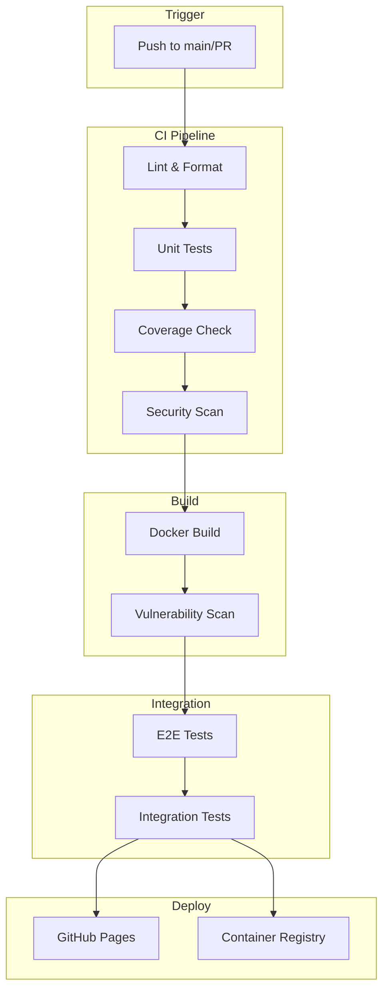
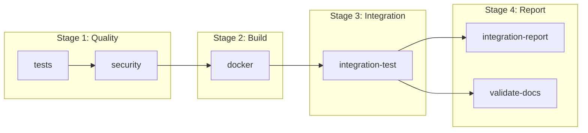
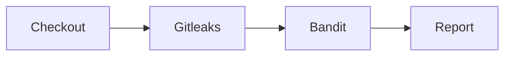
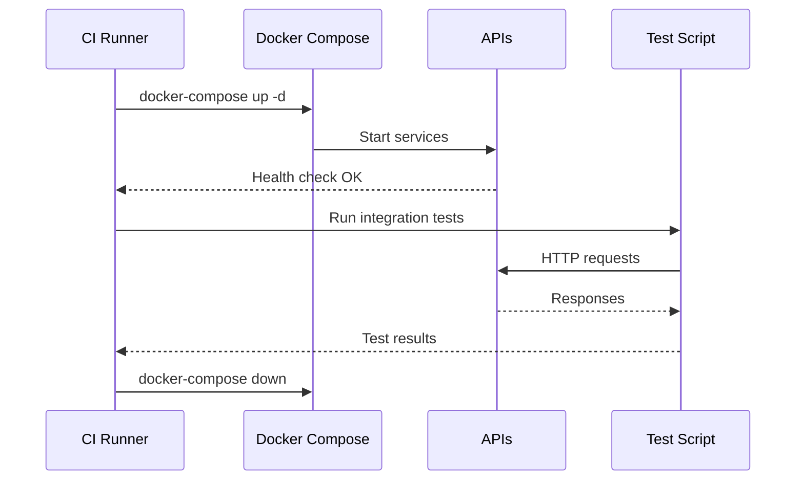
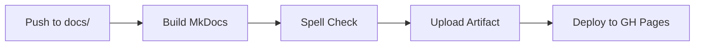

# CI/CD Pipeline

GitHub Actions workflows for testing, building, and deployment of the ML-MLOps Portfolio.

---

## Pipeline Overview



---

## Workflow Files

| Workflow | File | Trigger | Purpose |
|----------|------|---------|---------|
| **Main CI** | `ci-mlops.yml` | Push/PR to main | Tests, security, Docker |
| **Documentation** | `docs.yml` | Push to docs/ | Build and deploy docs |
| **CML Training** | `cml-training-comparison.yml` | Manual | Model comparison reports |
| **Portfolio CI** | `ci-portfolio-top3.yml` | Push/PR | Cross-project validation |

---

## Main CI Pipeline (`ci-mlops.yml`)

### Job Flow



### Job Details

#### 1. Tests Job

Runs unit tests for each project with coverage reporting.

```yaml
tests:
  strategy:
    matrix:
      project:
        - BankChurn-Predictor
        - CarVision-Market-Intelligence
        - TelecomAI-Customer-Intelligence
      python-version: ['3.11', '3.12']
```

**Steps:**
1. Checkout code
2. Setup Python
3. Install dependencies
4. Run linters (flake8, black, isort)
5. Run mypy type checking
6. Execute pytest with coverage
7. Upload coverage to Codecov

#### 2. Security Job

Scans for secrets and vulnerabilities.



**Tools:**
- **Gitleaks**: Secret detection
- **Bandit**: Python security linter

#### 3. Docker Job

Builds Docker images for each service.

```yaml
docker:
  strategy:
    matrix:
      service:
        - bankchurn
        - carvision
        - telecom
```

**Steps:**
1. Build multi-stage Docker image
2. Run Trivy vulnerability scan
3. Push to GitHub Container Registry (on main)

#### 4. Integration Test Job

Runs end-to-end tests with all services.



---

## Documentation Pipeline (`docs.yml`)

### Workflow



### Configuration

```yaml
on:
  push:
    branches: [main]
    paths:
      - 'docs/**'
      - 'mkdocs.yml'
```

---

## Matrix Strategy

The pipeline uses matrix builds for efficiency:

```yaml
strategy:
  matrix:
    project: [BankChurn, CarVision, TelecomAI]
    python-version: ['3.11', '3.12']
  fail-fast: false
```

This produces 6 parallel jobs (3 projects × 2 Python versions).

---

## Caching Strategy

### Pip Cache

```yaml
- uses: actions/setup-python@v5
  with:
    python-version: ${{ matrix.python-version }}
    cache: 'pip'
```

### Docker Layer Cache

```yaml
- uses: docker/build-push-action@v5
  with:
    cache-from: type=gha
    cache-to: type=gha,mode=max
```

---

## Secrets Management

| Secret | Purpose | Scope |
|--------|---------|-------|
| `GITHUB_TOKEN` | Automatic | Push to registry |
| `CODECOV_TOKEN` | Coverage upload | Repository |
| `DOCKERHUB_TOKEN` | Docker Hub push | Optional |

---

## Branch Protection

Recommended settings for `main` branch:

- [x] Require pull request before merging
- [x] Require status checks to pass
  - [x] `tests (BankChurn-Predictor, 3.12)`
  - [x] `tests (CarVision-Market-Intelligence, 3.12)`
  - [x] `tests (TelecomAI-Customer-Intelligence, 3.12)`
  - [x] `security`
- [x] Require branches to be up to date
- [x] Do not allow bypassing settings

---

## Pipeline Metrics

| Metric | Target | Current |
|--------|--------|---------|
| Build Time | <10 min | ~8 min |
| Test Coverage | >70% | 78-96% |
| Security Findings | 0 critical | ✅ Pass |
| Docker Size | <1 GB | ~500 MB |

---

## Troubleshooting CI

### Common Failures

| Error | Cause | Solution |
|-------|-------|----------|
| `ModuleNotFoundError` | Missing dependency | Check requirements.txt |
| `flake8 failed` | Style violation | Run `black .` locally |
| `coverage below threshold` | Insufficient tests | Add more tests |
| `Trivy HIGH findings` | Vulnerable package | Update dependencies |

### Re-running Workflows

```bash
# Via GitHub CLI
gh run rerun <run-id>

# Or via GitHub UI
# Actions → Select run → Re-run jobs
```

---

## Local CI Simulation

Run CI checks locally before pushing:

```bash
# Install pre-commit
pip install pre-commit
pre-commit install

# Run all checks
pre-commit run --all-files

# Run tests
pytest tests/ -v --cov

# Build Docker
docker build -t myproject .
```

---

## Future Enhancements

- [ ] Add model performance regression tests
- [ ] Implement canary deployments
- [ ] Add load testing with Locust
- [ ] Integrate MLflow model registry promotion
