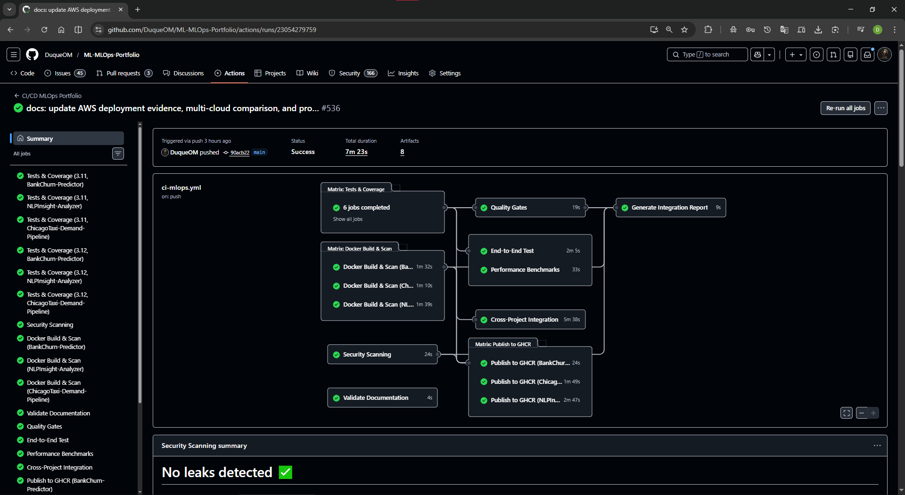

# CI/CD Pipeline

GitHub Actions workflows for testing, building, and deploying across GCP and AWS.

## Pipeline Evidence

| CI Pipeline (10 jobs) | Job Details | Codecov Dashboard |
|:---:|:---:|:---:|
|  |  |  |

## Workflows

| Workflow | File | Trigger | Purpose |
|----------|------|---------|---------|
| **Main CI** | `ci-mlops.yml` | Push/PR to main | Tests, security, Docker, integration |
| **Deploy GCP** | `deploy-gcp.yml` | Push to main / manual | Build → push to Artifact Registry → deploy to GKE |
| **Deploy AWS** | `deploy-aws.yml` | Push to main / manual | Build → push to ECR → deploy to EKS |
| **Docs** | `docs.yml` | Push to docs/ | Build and deploy GitHub Pages |
| **CML Training** | `cml-training-comparison.yml` | Manual | Model comparison reports |

## Deploy Workflows

| Deploy GCP (GKE) | Deploy AWS (EKS) |
|:---:|:---:|
|  |  |

Both deploy workflows: build Docker images → push to registry (AR / ECR) → `kubectl apply` manifests → verify rollout → health checks → notify.

## Main Pipeline (`ci-mlops.yml`)

**10 jobs**: tests → security → docker → integration-test → integration-report → validate-docs

### Matrix Strategy

```yaml
matrix:
  project: [BankChurn-Predictor, NLPInsight-Analyzer, ChicagoTaxi-Demand-Pipeline]
  python-version: ['3.11', '3.12']
```

6 parallel test jobs (3 projects × 2 Python versions).

### Jobs

| Job | Tools | Purpose |
|-----|-------|---------|
| **tests** | pytest, flake8, black, isort, mypy | Unit tests + linting + coverage |
| **security** | Gitleaks, Bandit | Secret detection + Python security |
| **docker** | Docker, Trivy | Multi-stage build + vulnerability scan |
| **integration-test** | docker-compose, pytest | Full-stack E2E validation |

### Caching

- **pip**: `actions/setup-python` with `cache: 'pip'`
- **Docker layers**: `docker/build-push-action` with GHA cache

## Pipeline Metrics

| Metric | Target | Current |
|--------|--------|---------|
| Build Time | <10 min | ~8 min |
| Test Coverage | >85% | 90–98% (295+ tests) |
| Security | 0 critical | Pass |

## Security Scanning

| Tool | Stage | Policy |
|------|-------|--------|
| **Gitleaks** | CI | Block on any detected secret |
| **Bandit** | CI | Block on HIGH severity |
| **Trivy** | Docker build | Block on CRITICAL CVEs |
| **pip-audit** | CI | Block on HIGH severity |


*GitHub Secrets configured for multi-cloud deployment (GCP + AWS credentials, registry tokens).*

## Local CI

```bash
pre-commit run --all-files    # Lint + format + security
pytest tests/ -v --cov        # Tests + coverage
```

---

*Last Updated: March 2026 — v3.5.3*
