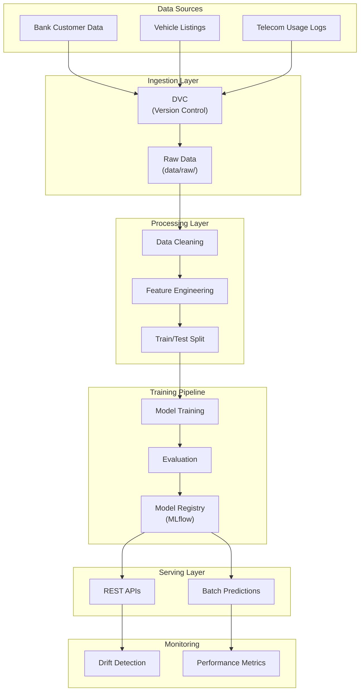
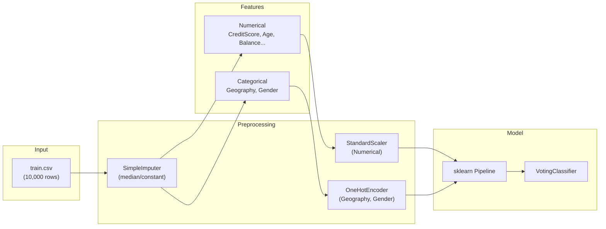
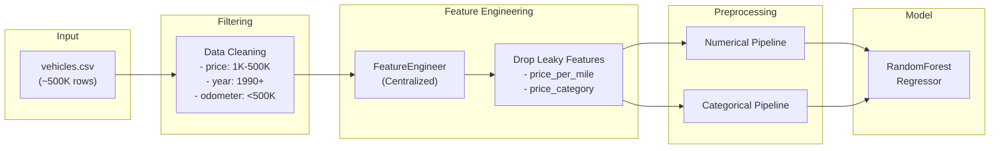
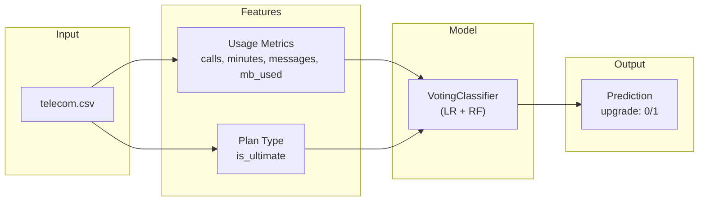
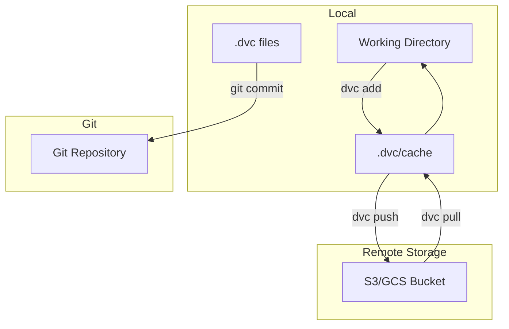
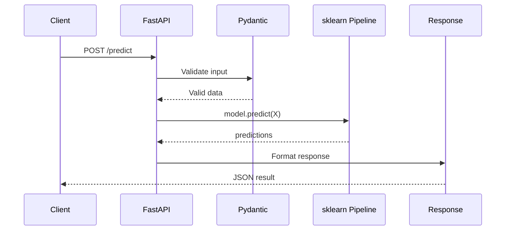

# Data Flow

Data pipeline architecture from ingestion to serving across all projects.

---

## High-Level Data Flow



---

## Project-Specific Data Flows

### BankChurn Predictor



**Data Schema:**

| Column | Type | Description |
|--------|------|-------------|
| CreditScore | int | 300-850 |
| Geography | str | France, Germany, Spain |
| Gender | str | Male, Female |
| Age | int | Customer age |
| Tenure | int | Years with bank |
| Balance | float | Account balance |
| NumOfProducts | int | Number of products |
| HasCrCard | int | 0 or 1 |
| IsActiveMember | int | 0 or 1 |
| EstimatedSalary | float | Annual salary |
| Exited | int | Target (0/1) |

### CarVision Market Intelligence



**Key Design Decisions:**

!!! warning "Data Leakage Prevention"
    `price_per_mile` and `price_category` are dropped from features because they 
    are derived from the target variable (`price`) and would cause data leakage.

### TelecomAI Customer Intelligence



---

## Data Versioning with DVC

### Architecture



### Commands

```bash
# Track data file
dvc add data/raw/train.csv

# Push to remote
dvc push

# Pull on another machine
dvc pull
```

---

## Feature Engineering Pipeline

### Centralized Approach (CarVision Example)

```python
# src/carvision/features.py
class FeatureEngineer:
    """Centralized feature engineering for training and inference."""
    
    def fit_transform(self, df: pd.DataFrame) -> pd.DataFrame:
        """Fit and transform training data."""
        ...
    
    def transform(self, df: pd.DataFrame) -> pd.DataFrame:
        """Transform inference data."""
        ...
```

**Benefits:**
- Single source of truth for feature logic
- Consistent features in training and serving
- Easy to update and version

---

## Inference Data Flow

### Real-time (API)



### Batch Processing


---

## Data Quality Checks

### Validation Rules

| Project | Check | Action |
|---------|-------|--------|
| BankChurn | CreditScore ∈ [300, 850] | Reject |
| BankChurn | Age ∈ [18, 100] | Reject |
| CarVision | Price > 0 | Filter |
| CarVision | Year ≥ 1900 | Filter |
| Telecom | mb_used ≥ 0 | Coerce to 0 |

### Evidently Monitoring

```python
from evidently import ColumnDriftMetric
from evidently.report import Report

# Create drift report
report = Report(metrics=[ColumnDriftMetric(column_name="CreditScore")])
report.run(reference_data=train_df, current_data=prod_df)
```

---

## Data Storage Locations

| Type | Path | Format |
|------|------|--------|
| Raw Data | `data/raw/` | CSV |
| Processed | `data/processed/` | Parquet |
| Model Artifacts | `models/` | Pickle |
| MLflow Artifacts | `mlruns/` | Various |
| Predictions | `results/` | CSV/JSON |

---

## Data Retention Policy

| Data Type | Retention | Notes |
|-----------|-----------|-------|
| Raw training data | Permanent | Versioned via DVC |
| Model artifacts | 90 days | Keep last 5 versions |
| Prediction logs | 30 days | For monitoring |
| MLflow experiments | Permanent | Historical record |
