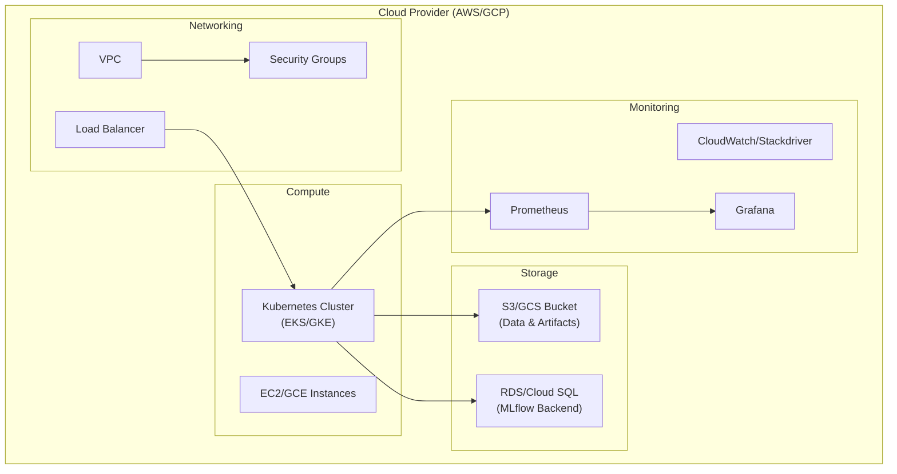

# Infrastructure

Infrastructure as Code (IaC) configuration for deploying the ML-MLOps Portfolio on cloud platforms.

---

## Infrastructure Overview



---

## Directory Structure

```
infra/
├── terraform/
│   ├── aws/                  # AWS-specific configuration
│   │   ├── main.tf
│   │   ├── variables.tf
│   │   ├── outputs.tf
│   │   └── eks.tf
│   ├── gcp/                  # GCP-specific configuration
│   │   ├── main.tf
│   │   └── gke.tf
│   └── README.md
├── docker-compose-mlflow.yml # MLflow stack
├── prometheus-config.yaml    # Prometheus configuration
├── alertmanager-config.yaml  # Alerting rules
└── .env.example              # Environment template
```

---

## Terraform Configuration

### AWS Provider Setup

```hcl
# infra/terraform/aws/main.tf

terraform {
  required_version = ">= 1.0.0"
  
  required_providers {
    aws = {
      source  = "hashicorp/aws"
      version = "~> 5.0"
    }
  }
  
  backend "s3" {
    bucket = "ml-mlops-terraform-state"
    key    = "infrastructure/terraform.tfstate"
    region = "us-east-1"
  }
}

provider "aws" {
  region = var.aws_region
  
  default_tags {
    tags = {
      Project     = "ML-MLOps-Portfolio"
      Environment = var.environment
      ManagedBy   = "Terraform"
    }
  }
}
```

### Variables

```hcl
# infra/terraform/aws/variables.tf

variable "aws_region" {
  description = "AWS region"
  type        = string
  default     = "us-east-1"
}

variable "environment" {
  description = "Environment name"
  type        = string
  default     = "production"
}

variable "cluster_name" {
  description = "EKS cluster name"
  type        = string
  default     = "ml-mlops-cluster"
}

variable "node_instance_type" {
  description = "EC2 instance type for nodes"
  type        = string
  default     = "t3.medium"
}

variable "min_nodes" {
  description = "Minimum number of nodes"
  type        = number
  default     = 2
}

variable "max_nodes" {
  description = "Maximum number of nodes"
  type        = number
  default     = 5
}
```

### EKS Cluster

```hcl
# infra/terraform/aws/eks.tf

module "eks" {
  source  = "terraform-aws-modules/eks/aws"
  version = "~> 19.0"
  
  cluster_name    = var.cluster_name
  cluster_version = "1.28"
  
  vpc_id     = module.vpc.vpc_id
  subnet_ids = module.vpc.private_subnets
  
  eks_managed_node_groups = {
    ml_workloads = {
      min_size     = var.min_nodes
      max_size     = var.max_nodes
      desired_size = var.min_nodes
      
      instance_types = [var.node_instance_type]
      capacity_type  = "ON_DEMAND"
      
      labels = {
        workload = "ml-inference"
      }
    }
  }
}
```

### S3 for Artifacts

```hcl
# S3 bucket for MLflow artifacts and DVC data
resource "aws_s3_bucket" "ml_artifacts" {
  bucket = "ml-mlops-artifacts-${var.environment}"
  
  tags = {
    Name = "ML Artifacts"
  }
}

resource "aws_s3_bucket_versioning" "ml_artifacts" {
  bucket = aws_s3_bucket.ml_artifacts.id
  
  versioning_configuration {
    status = "Enabled"
  }
}
```

---

## Kubernetes Configuration

### Deployment Manifests

All Kubernetes manifests are located in `k8s/`:

| File | Resource | Purpose |
|------|----------|---------|
| `bankchurn-deployment.yaml` | Deployment + Service | BankChurn API |
| `carvision-deployment.yaml` | Deployment + Service | CarVision API |
| `telecom-deployment.yaml` | Deployment + Service | TelecomAI API |
| `mlflow-deployment.yaml` | Deployment + Service | MLflow server |
| `grafana-deployment.yaml` | Deployment + Service | Monitoring dashboard |
| `prometheus-deployment.yaml` | Deployment + Service | Metrics collection |
| `ingress.yaml` | Ingress | External access |
| `hpa.yaml` | HPA | Auto-scaling |
| `namespace.yaml` | Namespace | Isolation |

### Sample Deployment

```yaml
# k8s/bankchurn-deployment.yaml
apiVersion: apps/v1
kind: Deployment
metadata:
  name: bankchurn-api
  namespace: ml-portfolio
spec:
  replicas: 2
  selector:
    matchLabels:
      app: bankchurn-api
  template:
    metadata:
      labels:
        app: bankchurn-api
    spec:
      containers:
        - name: bankchurn-api
          image: ghcr.io/duqueom/ml-portfolio-bankchurn:latest
          ports:
            - containerPort: 8000
          resources:
            requests:
              memory: "256Mi"
              cpu: "250m"
            limits:
              memory: "512Mi"
              cpu: "500m"
          livenessProbe:
            httpGet:
              path: /health
              port: 8000
            initialDelaySeconds: 30
            periodSeconds: 10
          readinessProbe:
            httpGet:
              path: /health
              port: 8000
            initialDelaySeconds: 5
            periodSeconds: 5
          env:
            - name: MLFLOW_TRACKING_URI
              value: "http://mlflow:5000"
```

### Horizontal Pod Autoscaler

```yaml
# k8s/hpa.yaml
apiVersion: autoscaling/v2
kind: HorizontalPodAutoscaler
metadata:
  name: bankchurn-hpa
  namespace: ml-portfolio
spec:
  scaleTargetRef:
    apiVersion: apps/v1
    kind: Deployment
    name: bankchurn-api
  minReplicas: 2
  maxReplicas: 10
  metrics:
    - type: Resource
      resource:
        name: cpu
        target:
          type: Utilization
          averageUtilization: 70
```

### Ingress

```yaml
# k8s/ingress.yaml
apiVersion: networking.k8s.io/v1
kind: Ingress
metadata:
  name: ml-portfolio-ingress
  namespace: ml-portfolio
  annotations:
    kubernetes.io/ingress.class: nginx
    cert-manager.io/cluster-issuer: letsencrypt-prod
spec:
  tls:
    - hosts:
        - api.ml-portfolio.example.com
      secretName: ml-portfolio-tls
  rules:
    - host: api.ml-portfolio.example.com
      http:
        paths:
          - path: /bankchurn
            pathType: Prefix
            backend:
              service:
                name: bankchurn-api
                port:
                  number: 8000
```

---

## Docker Compose (Development)

### MLflow Stack

```yaml
# infra/docker-compose-mlflow.yml
version: '3.8'

services:
  mlflow:
    image: ghcr.io/mlflow/mlflow:v2.8.0
    ports:
      - "5000:5000"
    environment:
      - MLFLOW_BACKEND_STORE_URI=sqlite:///mlflow.db
      - MLFLOW_DEFAULT_ARTIFACT_ROOT=/mlflow/artifacts
    volumes:
      - mlflow-data:/mlflow
    command: >
      mlflow server
      --backend-store-uri sqlite:///mlflow/mlflow.db
      --default-artifact-root /mlflow/artifacts
      --host 0.0.0.0
      --port 5000

volumes:
  mlflow-data:
```

---

## Monitoring Stack

### Prometheus Configuration

```yaml
# infra/prometheus-config.yaml
global:
  scrape_interval: 15s
  evaluation_interval: 15s

scrape_configs:
  - job_name: 'bankchurn-api'
    static_configs:
      - targets: ['bankchurn-api:8000']
    metrics_path: /metrics
    
  - job_name: 'carvision-api'
    static_configs:
      - targets: ['carvision-api:8000']
    metrics_path: /metrics
    
  - job_name: 'telecom-api'
    static_configs:
      - targets: ['telecom-api:8000']
    metrics_path: /metrics
```

---

## Deployment Commands

### Terraform

```bash
cd infra/terraform/aws

# Initialize
terraform init

# Plan
terraform plan -out=tfplan

# Apply
terraform apply tfplan

# Destroy (careful!)
terraform destroy
```

### Kubernetes

```bash
# Create namespace
kubectl apply -f k8s/namespace.yaml

# Deploy all services
kubectl apply -f k8s/

# Check status
kubectl get pods -n ml-portfolio

# View logs
kubectl logs -f deployment/bankchurn-api -n ml-portfolio
```

---

## Cost Estimation

### AWS (Monthly)

| Resource | Configuration | Estimated Cost |
|----------|---------------|----------------|
| EKS Cluster | 1 cluster | $73 |
| EC2 (t3.medium) | 2-5 nodes | $60-150 |
| S3 (100 GB) | Standard | $2.50 |
| RDS (db.t3.micro) | PostgreSQL | $15 |
| ALB | 1 load balancer | $20 |
| **Total** | | **$170-260** |

### Cost Optimization Tips

1. Use Spot instances for non-critical workloads
2. Implement auto-scaling to reduce off-peak costs
3. Use S3 lifecycle policies for old artifacts
4. Consider reserved instances for predictable workloads

---

## Security Considerations

- [ ] Enable encryption at rest (S3, RDS)
- [ ] Use IAM roles for service accounts
- [ ] Implement network policies in Kubernetes
- [ ] Enable audit logging
- [ ] Use secrets management (AWS Secrets Manager)
- [ ] Implement least-privilege access
