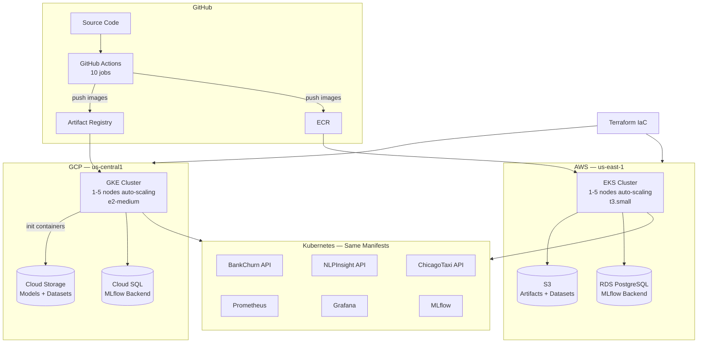
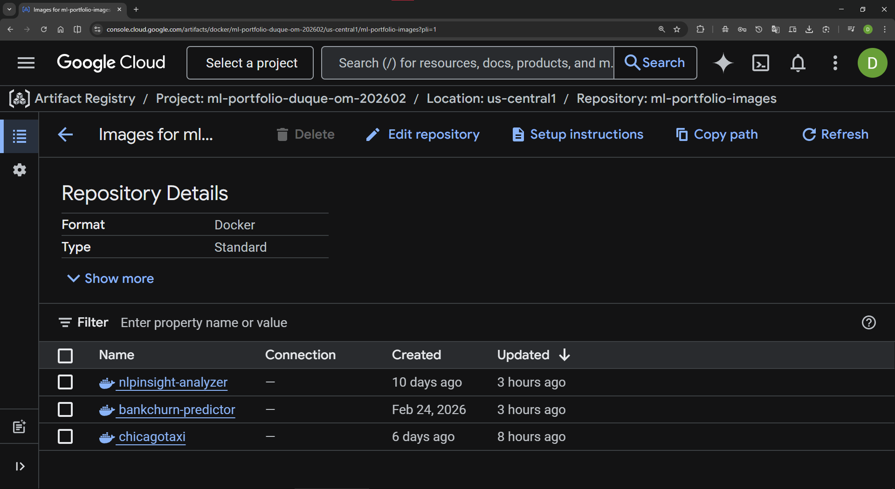
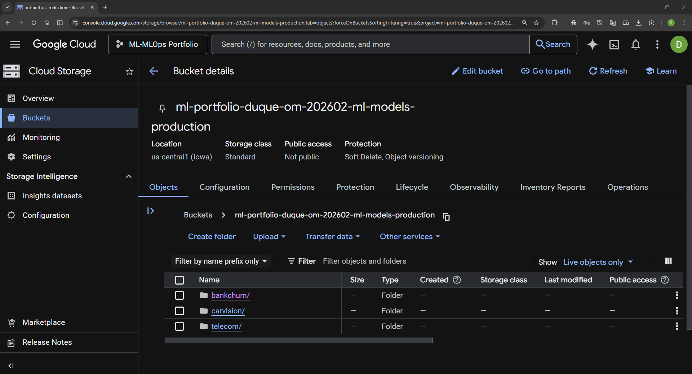

<div class="portfolio-page" markdown="1">

# Infrastructure

Terraform-managed, multi-cloud (GCP + AWS) infrastructure for the ML-MLOps Portfolio.

## Multi-Cloud Architecture


```mermaid
flowchart TB
    subgraph GH ["GitHub"]
        Code[Source Code] --> CI[GitHub Actions\n10 jobs]
        CI --> |push images| AR[Artifact Registry]
        CI --> |push images| ECR[ECR]
    end

    subgraph GCP ["GCP — us-central1"]
        AR --> GKE[GKE Cluster\n1-5 nodes auto-scaling\ne2-medium]
        GCS[(Cloud Storage\nModels + Datasets)]
        CSQL[(Cloud SQL\nMLflow Backend)]
        GKE --> |init containers| GCS
        GKE --> CSQL
    end

    subgraph AWS ["AWS — us-east-1"]
        ECR --> EKS[EKS Cluster\n1-5 nodes auto-scaling\nt3.small]
        S3[(S3\nArtifacts + Datasets)]
        RDS[(RDS PostgreSQL\nMLflow Backend)]
        EKS --> S3
        EKS --> RDS
    end

    subgraph K8s ["Kubernetes — Same Manifests"]
        direction LR
        BC[BankChurn API] ~~~ NLP[NLPInsight API] ~~~ CT[ChicagoTaxi API]
        PROM[Prometheus] ~~~ GRAF[Grafana] ~~~ MLF[MLflow]
    end

    GKE --> K8s
    EKS --> K8s

    TF[Terraform IaC] --> GCP
    TF --> AWS
```

## Side-by-Side: GCP vs AWS

| Component | GCP (Live Production) | AWS (Live Production) |
|-----------|----------------------|------------------|
| **Cluster** | GKE `ml-portfolio-gke-production` (us-central1) | EKS `ml-portfolio-eks` (us-east-1) |
| **Nodes** | 1 baseline, auto-scales to 5 (e2-medium, 2 vCPU / 4 GB) | 1 baseline, auto-scales to 5 (t3.small, 2 vCPU / 2 GB) |
| **Container Registry** | Artifact Registry | ECR |
| **Object Storage** | Cloud Storage (versioned, lifecycle) | S3 (versioned) |
| **Database** | Cloud SQL PostgreSQL | SQLite (in-pod) |
| **Networking** | VPC + Private Subnets + VPC Peering | VPC (eksctl-managed) |
| **Ingress** | nginx + GCE LB (IP: `136.111.152.72`) | nginx + NLB (AWS Load Balancer Controller) |
| **IaC** | Terraform (GCP modules) | Terraform + eksctl + Kustomize |
| **K8s Manifests** | Shared base + GCP overlays | Shared base + AWS Kustomize overlays |
| **Cost** | **~$51/month** | ~$124/month |
| **Status** | ✅ Running (6 pods) | ✅ Running (6 pods) |

> **Cloud-agnostic design**: The same K8s base manifests deploy to both clouds. Only image registry URLs and storage class annotations differ (via Kustomize overlays).

## Cloud Resources

### GCP (Live Production)

| Resource | Configuration |
|----------|---------------|
| **GKE Cluster** | `ml-portfolio-gke-production`, us-central1, 1-5 nodes (auto-scaling, e2-medium) |
| **Artifact Registry** | 3 Docker images (bankchurn, nlpinsight, chicagotaxi) |
| **Cloud Storage** | Models bucket + Datasets bucket (versioned, lifecycle policies) |
| **Cloud SQL** | PostgreSQL for MLflow backend |
| **VPC** | Custom network with private subnets, VPC peering for Cloud SQL |
| **Cost** | ~$51/month (covered by Free Tier credits) |

### AWS (Live Production)

| Resource | Configuration |
|----------|---------------|
| **EKS Cluster** | `ml-portfolio-eks`, us-east-1, 1 node baseline, auto-scales to 5 (t3.small) |
| **ECR** | 3 Docker images (bankchurn, nlpinsight, chicagotaxi) |
| **S3** | Models + datasets (versioned, lifecycle policies) |
| **NLB** | nginx-ingress LoadBalancer via AWS Load Balancer Controller (path routing) |
| **Cost** | ~$124/month |

| GKE Workloads | EKS Workloads | Container Registries |
|:---:|:---:|:---:|
|  |  |  |

| Artifact Registry (GCP) | S3 Buckets (AWS) | GCS Models (GCP) |
|:---:|:---:|:---:|
|  |  |  |

## Kubernetes

| Manifest | Purpose |
|----------|---------|
| `k8s/base/` | Cloud-agnostic: namespace, storage, monitoring, network policies, PDBs, drift cronjobs |
| `k8s/overlays/gcp/` | GCP overlay: GKE deployments, GCS configmaps, Workload Identity SA, ingress |
| `k8s/overlays/aws/` | AWS overlay: EKS deployments, S3 configmaps, IRSA SA, ingress |

### Resource Calibration (1 uvicorn worker per pod — [ADR-014](../decisions/014-single-worker-pod-ml-inference.md))

| Service | Memory (real/limit) | CPU Target | HPA |
|---------|-------------------|-----------|-----|
| BankChurn | ~344Mi / 1Gi | 50% | 1–5 pods |
| NLPInsight | ~283Mi / 1Gi | 60% | 1–3 pods |
| ChicagoTaxi | ~431Mi / 512Mi | 60% | 1–3 pods |

> CPU-only HPA: ML models have fixed memory footprint. Memory-based scaling would never scale down.

## Terraform Commands

```bash
cd infra/terraform/gcp    # or aws/
terraform init
terraform plan -var-file=terraform.tfvars
terraform apply -var-file=terraform.tfvars
```

## Infrastructure Testing

Automated validation suite in `tests/infra/`:

| Test | Type | GCP | AWS |
|------|------|-----|-----|
| `terraform fmt` | Hard gate | ✅ | ✅ |
| `terraform validate` | Hard gate | ✅ | ✅ |
| `tfsec` | Advisory | ✅ (51/71) | ✅ (84/116) |
| `checkov` | Advisory | ✅ (51/71) | ✅ (84/116) |
| YAML syntax | Hard gate | ✅ 24/24 | ✅ 24/24 |
| `kube-linter` | Advisory | ✅ 17 findings | ✅ 17 findings |
| `conftest` (OPA) | Hard gate | ✅ 0 violations | ✅ 0 violations |

```bash
bash tests/infra/run_all_tests.sh
```

| Terraform Multi-Cloud | K8s Overlays | Infra Tests |
|:---:|:---:|:---:|
|  |  |  |

## Security

- Encryption at rest (GCS, Cloud SQL, S3, RDS)
- Workload Identity (GCP) / IRSA (AWS) for pod-level IAM
- Non-root containers (UID 1000)
- Private database networking
- CI/CD scanning: Trivy, Bandit, Gitleaks, pip-audit
- Least-privilege: `storage.objectViewer` for GKE pods
- IaC scanning: tfsec, checkov (advisory findings documented in `.tfsec.yml`)

### Security Hardening (Terraform — Production-Grade)

The Terraform configuration includes **security hardening** that goes beyond what is applied to the running demo cluster:

| Feature | GCP (`main.tf`) | AWS (`main.tf`) |
|---------|-----------------|-----------------|
| Private cluster | `private_cluster_config` (private nodes, public endpoint) | `endpoint_private_access = true` |
| Authorized networks | `master_authorized_networks_config` (VPC CIDR only) | `endpoint_public_access_cidrs` |
| Network policy | Calico CNI | Calico CNI |
| VPC-native | `ip_allocation_policy` (secondary pod/service ranges) | VPC CNI (native) |
| Flow logs | VPC Flow Logs enabled | VPC Flow Logs enabled |
| Encryption | GCS/Cloud SQL at-rest | S3 KMS + public access blocks |

> **Architecture Decision**: The running GKE demo cluster was provisioned before the security hardening was added to the Terraform code. Applying these changes would **force cluster recreation** (`private_cluster_config` and `ip_allocation_policy` are ForceNew attributes in the GCP provider), destroying all 6 running pods and requiring full redeployment.
>
> Additionally, `master_authorized_networks_config` restricts API access to the VPC subnet (`10.10.0.0/24`), which would require a bastion host or Cloud Shell for kubectl access — appropriate for production but impractical for a portfolio demo that requires frequent local interaction.
>
> **The Terraform code represents the production-ready target state.** The running cluster demonstrates deployment capabilities (APIs, monitoring, autoscaling, CI/CD). Both are valid portfolio artifacts — the code shows security engineering, the cluster shows operational execution. A real production deployment would apply the hardened configuration from initial provisioning.

## Monitoring Stack

| Grafana — ML Production Dashboard | Prometheus — 16/16 Targets UP |
|:---:|:---:|
|  |  |
| *Request rate, P95 latency, predictions/hr, error rate, CPU, memory* | *All ML services + K8s auto-discovered pods* |

---

*Last Updated: April 2026 — v3.6.0 (both clouds live with LoadBalancer Ingress)*

</div>
