# Infrastructure

Infrastructure as Code (IaC) configuration for deploying the ML-MLOps Portfolio on cloud platforms.

---

## Infrastructure Overview

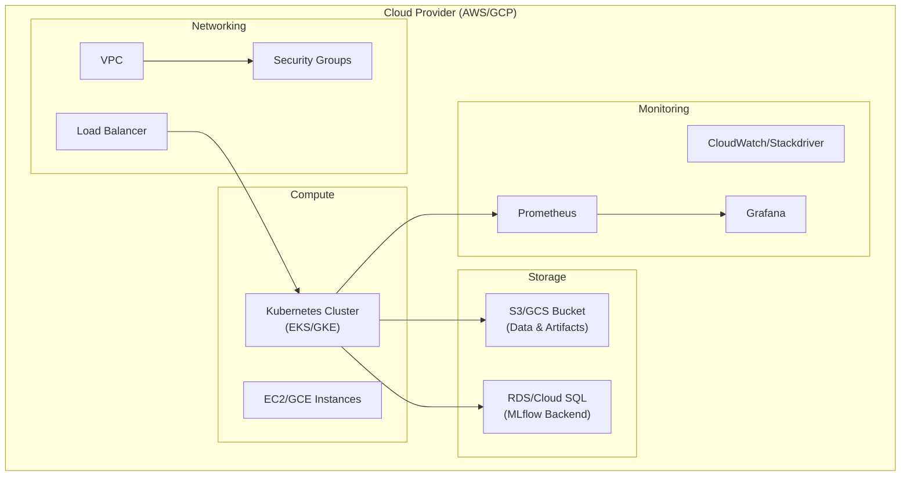
```mermaid
graph TB
    subgraph "Cloud Provider (AWS/GCP)"
        subgraph "Compute"
            EKS["Kubernetes Cluster<br/>(EKS/GKE)"]
            EC2["EC2/GCE Instances"]
        end
        
        subgraph "Storage"
            S3["S3/GCS Bucket<br/>(Data & Artifacts)"]
            RDS["RDS/Cloud SQL<br/>(MLflow Backend)"]
        end
        
        subgraph "Networking"
            VPC["VPC"]
            ALB["Load Balancer"]
            SG["Security Groups"]
        end
        
        subgraph "Monitoring"
            CW["CloudWatch/Stackdriver"]
            PROM["Prometheus"]
            GRAF["Grafana"]
        end
    end
    
    ALB --> EKS
    EKS --> S3
    EKS --> RDS
    EKS --> PROM
    PROM --> GRAF
    VPC --> SG
```

---

## GCP Production Deployment (Live) 

This portfolio is **actively deployed on Google Cloud Platform**. The infrastructure below was created with Terraform and is currently running.


*6 workloads running on GKE: 3 ML APIs + MLflow + Prometheus + Grafana*

<details>
<summary><strong>GCP Console Evidence (click to expand)</strong></summary>

#### Project Overview
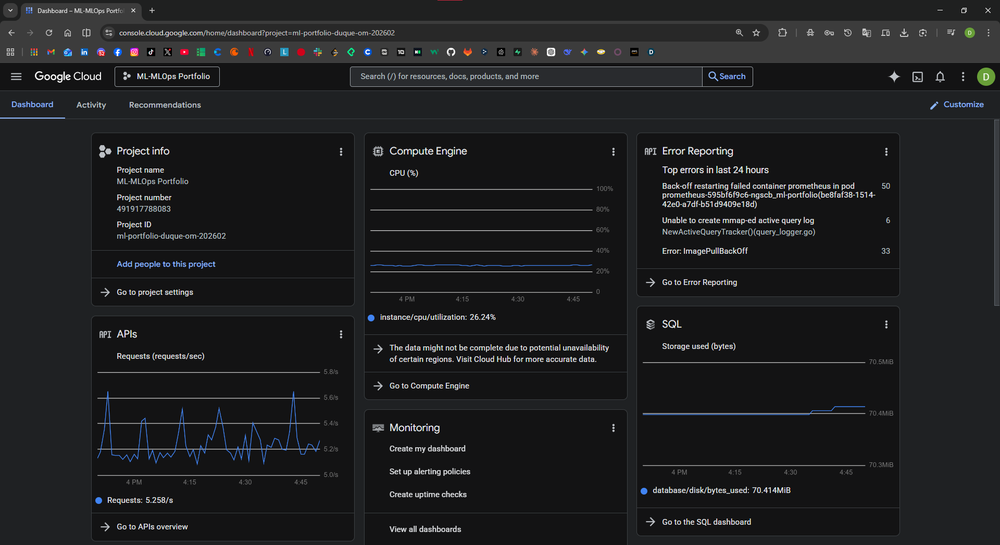
*GCP project dashboard: ml-portfolio-duque-om-202602*

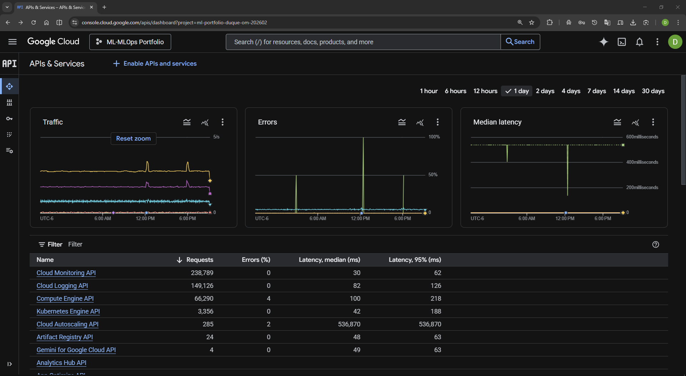
*Enabled APIs: Kubernetes Engine, Cloud Storage, Artifact Registry, Cloud SQL, Cloud Build*

#### GKE Cluster
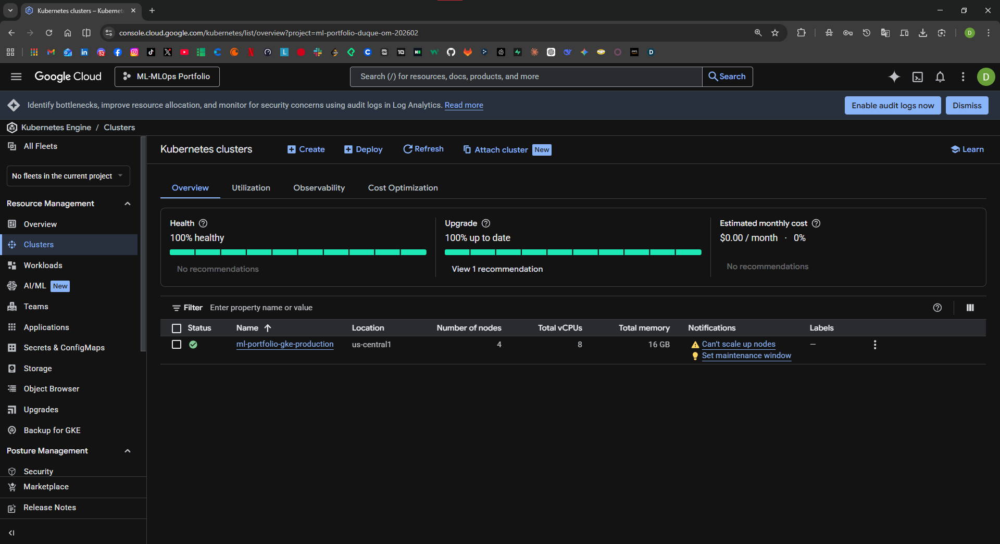
*GKE clusters list: ml-portfolio-gke-production running in us-central1*

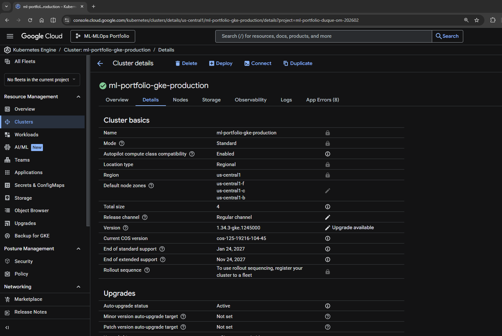
*GKE cluster configuration: 3 nodes, e2-medium, us-central1*

#### Artifact Registry

*3 Docker images versioned in Artifact Registry*

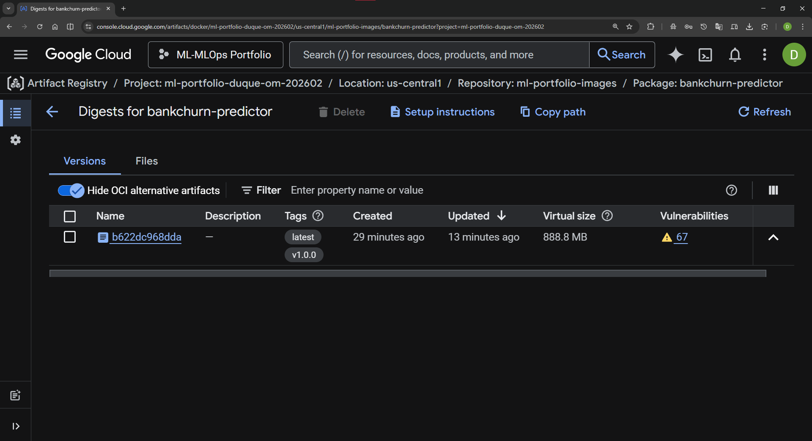
*Image tags: v1.0.0 + latest for each project*

#### Cloud Storage

*GCS bucket with production models (model.joblib per project)*

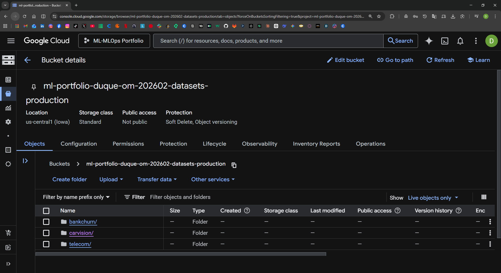
*GCS bucket with versioned datasets*

#### IAM & Billing
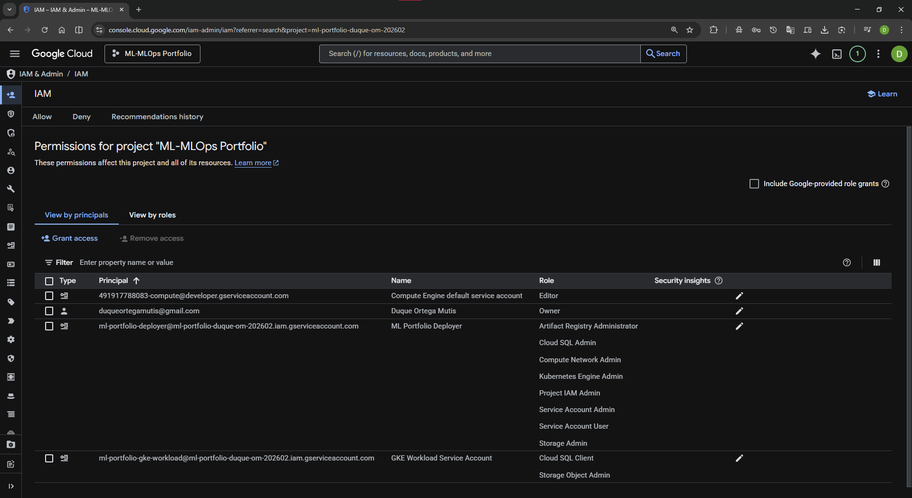
*Workload Identity service account for GKE pods*

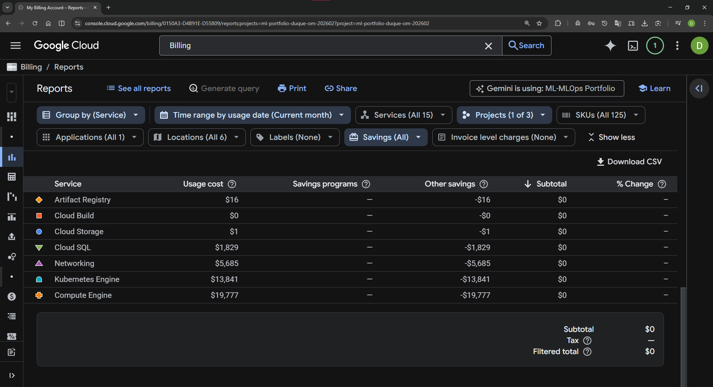
*Monthly cost ~$51 USD for full production stack*

#### GKE Services & Ingress
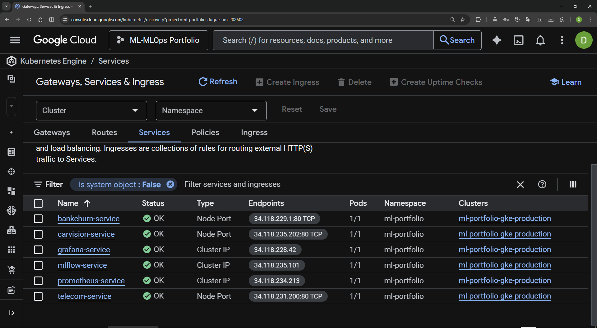
*K8s services listed in GCP Console*

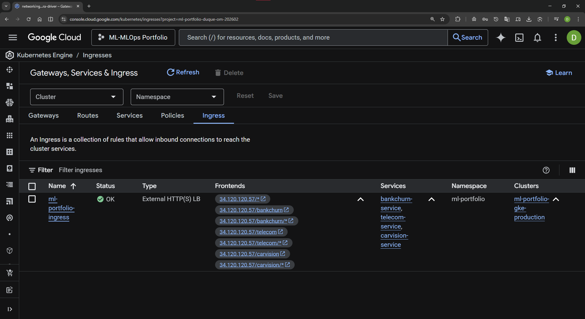
*Ingress with public external IP for load balancing*

#### Terminal Verification

*All pods running and healthy (0 restarts)*

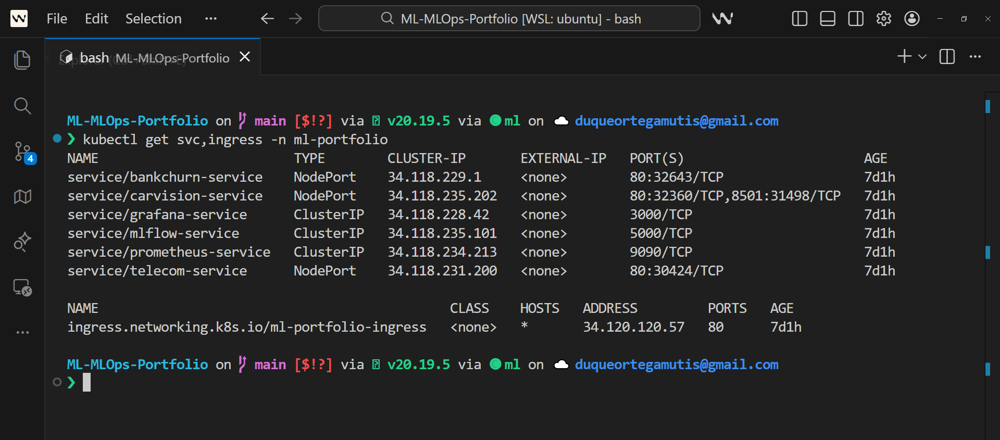
*K8s services with external IP via Ingress*


*Resource usage: CPU and memory per pod*

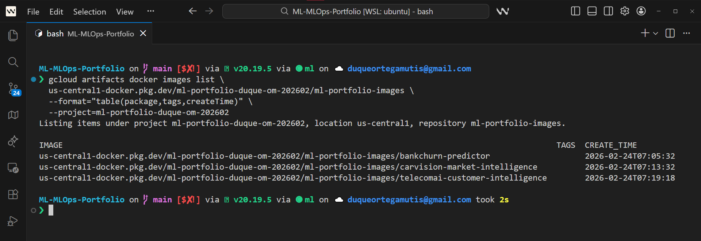
*Docker images listed in Artifact Registry via gcloud CLI*

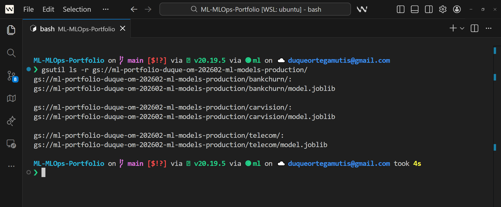
*GCS bucket contents: model.joblib files per project*

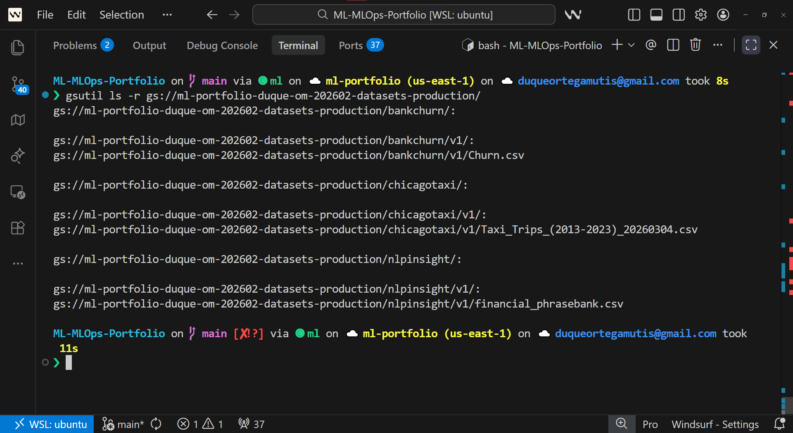
*GCS bucket contents: versioned dataset files*

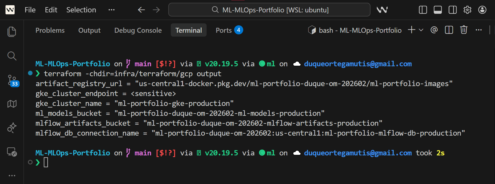
*Terraform output showing cluster name, registry URL, bucket names*

</details>

### GCP Resources (Terraform-managed)

| Resource | Type | Details |
|----------|------|---------|
| **GKE Cluster** | `google_container_cluster` | `ml-portfolio-gke-production`, us-central1, 1-5 nodes (e2-medium) |
| **Node Pool** | `google_container_node_pool` | 30GB SSD, autoscaling 1-5 nodes |
| **VPC Network** | `google_compute_network` | Custom VPC with private subnets |
| **Cloud Storage** | `google_storage_bucket` | ML models bucket + MLflow artifacts bucket |
| **Artifact Registry** | `google_artifact_registry_repository` | 3 Docker images (bankchurn, carvision, telecom) |
| **Cloud SQL** | `google_sql_database_instance` | PostgreSQL for MLflow backend |
| **Service Account** | `google_service_account` | GKE workload identity |
| **Private VPC Peering** | `google_service_networking_connection` | Cloud SQL private IP |

### GCP Terraform Code

```hcl
# infra/terraform/gcp/main.tf (simplified)

resource "google_container_cluster" "primary" {
  name     = "${var.project_name}-gke-production"
  location = var.region

  initial_node_count       = 1
  remove_default_node_pool = true
  deletion_protection      = false

  network    = google_compute_network.vpc.name
  subnetwork = google_compute_subnetwork.subnet.name
}

resource "google_container_node_pool" "primary_nodes" {
  name       = "${var.project_name}-node-pool"
  cluster    = google_container_cluster.primary.name
  location   = var.region
  node_count = var.node_count

  node_config {
    machine_type = "e2-medium"
    disk_size_gb = 30
    oauth_scopes = ["https://www.googleapis.com/auth/cloud-platform"]
  }

  autoscaling {
    min_node_count = 1
    max_node_count = var.max_node_count
  }
}

resource "google_storage_bucket" "ml_models" {
  name     = "${var.project_id}-ml-models"
  location = var.region
}

resource "google_artifact_registry_repository" "ml_portfolio" {
  location      = var.region
  repository_id = "ml-portfolio"
  format        = "DOCKER"
}
```

### GCP Terraform Commands

```bash
cd infra/terraform/gcp

# Initialize
terraform init

# Plan (verify no unexpected changes)
terraform plan -var-file=terraform.tfvars

# Apply infrastructure
terraform apply -var-file=terraform.tfvars

# List managed resources
terraform state list

# View outputs (cluster name, registry URL, bucket names)
terraform output
```


*Terraform outputs: cluster endpoint, registry URL, bucket names*

### CI/CD: GitHub Actions → GKE

The deployment pipeline (`.github/workflows/deploy-gcp.yml`) automates:

1. **Detect changes** — only build modified projects
2. **Build Docker images** — multi-stage builds
3. **Push to Artifact Registry** — versioned with git SHA
4. **Deploy to GKE** — `kubectl apply` with rolling updates
5. **Smoke tests** — verify health endpoints

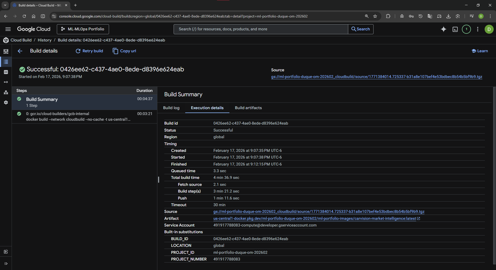
*Cloud Build: automated Docker image builds for all 3 services*

---

## Directory Structure

```
infra/
├── terraform/
│   ├── gcp/                  # GCP configuration (LIVE ✅)
│   │   ├── main.tf           # GKE, GCS, Artifact Registry, VPC, Cloud SQL
│   │   ├── variables.tf      # Variable definitions
│   │   ├── outputs.tf        # Exported values
│   │   ├── terraform.tfvars  # Environment-specific values
│   │   └── terraform.tfvars.example  # Template for new users
│   ├── aws/                  # AWS configuration (reference)
│   │   ├── main.tf
│   │   ├── variables.tf
│   │   └── outputs.tf
│   └── README.md
├── prometheus-config.yaml    # Prometheus scrape configuration
├── grafana/                  # Grafana dashboards and datasources
├── alertmanager-config.yaml  # Alerting rules
└── .env.example              # Environment template
```

---

## Terraform Configuration

### AWS Provider Setup (Reference)

```hcl
# infra/terraform/aws/main.tf

terraform {
  required_version = ">= 1.0.0"
  
  required_providers {
    aws = {
      source  = "hashicorp/aws"
      version = "~> 5.0"
    }
  }
  
  backend "s3" {
    bucket = "ml-mlops-terraform-state"
    key    = "infrastructure/terraform.tfstate"
    region = "us-east-1"
  }
}

provider "aws" {
  region = var.aws_region
  
  default_tags {
    tags = {
      Project     = "ML-MLOps-Portfolio"
      Environment = var.environment
      ManagedBy   = "Terraform"
    }
  }
}
```

### Variables

```hcl
# infra/terraform/aws/variables.tf

variable "aws_region" {
  description = "AWS region"
  type        = string
  default     = "us-east-1"
}

variable "environment" {
  description = "Environment name"
  type        = string
  default     = "production"
}

variable "cluster_name" {
  description = "EKS cluster name"
  type        = string
  default     = "ml-mlops-cluster"
}

variable "node_instance_type" {
  description = "EC2 instance type for nodes"
  type        = string
  default     = "t3.medium"
}

variable "min_nodes" {
  description = "Minimum number of nodes"
  type        = number
  default     = 2
}

variable "max_nodes" {
  description = "Maximum number of nodes"
  type        = number
  default     = 5
}
```

### EKS Cluster

```hcl
# infra/terraform/aws/eks.tf

module "eks" {
  source  = "terraform-aws-modules/eks/aws"
  version = "~> 19.0"
  
  cluster_name    = var.cluster_name
  cluster_version = "1.28"
  
  vpc_id     = module.vpc.vpc_id
  subnet_ids = module.vpc.private_subnets
  
  eks_managed_node_groups = {
    ml_workloads = {
      min_size     = var.min_nodes
      max_size     = var.max_nodes
      desired_size = var.min_nodes
      
      instance_types = [var.node_instance_type]
      capacity_type  = "ON_DEMAND"
      
      labels = {
        workload = "ml-inference"
      }
    }
  }
}
```

### S3 for Artifacts

```hcl
# S3 bucket for MLflow artifacts and DVC data
resource "aws_s3_bucket" "ml_artifacts" {
  bucket = "ml-mlops-artifacts-${var.environment}"
  
  tags = {
    Name = "ML Artifacts"
  }
}

resource "aws_s3_bucket_versioning" "ml_artifacts" {
  bucket = aws_s3_bucket.ml_artifacts.id
  
  versioning_configuration {
    status = "Enabled"
  }
}
```

---

## Kubernetes Configuration

### Deployment Manifests

All Kubernetes manifests are located in `k8s/`:

| File | Resource | Purpose |
|------|----------|---------|
| `bankchurn-deployment.yaml` | Deployment + Service | BankChurn API |
| `carvision-deployment.yaml` | Deployment + Service | CarVision API |
| `telecom-deployment.yaml` | Deployment + Service | TelecomAI API |
| `mlflow-deployment.yaml` | Deployment + Service | MLflow server |
| `grafana-deployment.yaml` | Deployment + Service | Monitoring dashboard |
| `prometheus-deployment.yaml` | Deployment + Service | Metrics collection |
| `ingress.yaml` | Ingress | External access |
| `hpa.yaml` | HPA | Auto-scaling |
| `namespace.yaml` | Namespace | Isolation |

### Sample Deployment

```yaml
# k8s/bankchurn-deployment.yaml (simplified — see actual file for full config)
apiVersion: apps/v1
kind: Deployment
metadata:
  name: bankchurn-predictor
  namespace: ml-portfolio
spec:
  replicas: 1  # HPA manages actual replica count
  selector:
    matchLabels:
      app: bankchurn-predictor
  template:
    metadata:
      labels:
        app: bankchurn-predictor
      annotations:
        prometheus.io/scrape: "true"
        prometheus.io/port: "8000"
    spec:
      containers:
        - name: bankchurn-api
          image: <REGION>-docker.pkg.dev/<PROJECT>/ml-portfolio-images/bankchurn-predictor:latest
          ports:
            - containerPort: 8000
          resources:
            requests:
              memory: "448Mi"   # Calibrated: ~300Mi real + headroom
              cpu: "250m"
            limits:
              memory: "1Gi"
              cpu: "1000m"
          livenessProbe:
            httpGet:
              path: /health
              port: 8000
            initialDelaySeconds: 30
            periodSeconds: 10
          readinessProbe:
            httpGet:
              path: /health
              port: 8000
            initialDelaySeconds: 10
            periodSeconds: 5
```

**Resource calibration per service** (based on `kubectl top pods` at steady state, 2 uvicorn workers):

| Service | Real Usage | Request | Limit | Workers | Utilization |
|---------|-----------|---------|-------|---------|-------------|
| BankChurn (ensemble) | ~300Mi / 5m CPU | 512Mi / 300m | 1Gi / 1000m | 2 | 59% mem |
| CarVision (API) | ~550Mi / 8m CPU | 768Mi / 300m | 1536Mi / 1000m | 2 | 72% mem |
| CarVision (Streamlit) | ~200Mi / 3m CPU | 256Mi / 100m | 512Mi / 500m | — | 78% mem |
| TelecomAI | ~140Mi / 4m CPU | 384Mi / 300m | 768Mi / 800m | 2 | 36% mem |

> **v6.3 Changes**: All ML services now run 2 uvicorn workers (was 1). Memory requests increased to accommodate dual-worker model loading. CPU requests normalized to 300m.

### Horizontal Pod Autoscaler

```yaml
# HPA embedded in each *-deployment.yaml (all 3 ML services)
apiVersion: autoscaling/v2
kind: HorizontalPodAutoscaler
metadata:
  name: bankchurn-hpa
  namespace: ml-portfolio
spec:
  scaleTargetRef:
    apiVersion: apps/v1
    kind: Deployment
    name: bankchurn-predictor
  minReplicas: 1
  maxReplicas: 3
  metrics:
  - type: Resource
    resource:
      name: cpu
      target:
        type: Utilization
        averageUtilization: 70    # 75% for TelecomAI
  behavior:
    scaleDown:
      stabilizationWindowSeconds: 300   # 5min cooldown prevents thrashing
      policies:
      - type: Percent
        value: 50
        periodSeconds: 60
    scaleUp:
      stabilizationWindowSeconds: 60    # 1min delay avoids transient spikes
      policies:
      - type: Percent
        value: 100
        periodSeconds: 30
      - type: Pods
        value: 2
        periodSeconds: 30
      selectPolicy: Max
```

> **Why CPU-only?** ML inference services have fixed memory footprint (model loaded in RAM). Memory-based HPA prevents scale-down: `ceil(3 × 67%/80%) = 3`. CPU correlates with traffic.

**HPA standardization** — all 3 ML services use CPU-only autoscaling:

| Service | CPU Target | Min | Max | scaleDown | scaleUp |
|---------|-----------|-----|-----|-----------|--------|
| BankChurn | 70% | 1 | 3 | 300s / 50% | 60s / max(100%, +2) |
| CarVision | 70% | 1 | 3 | 300s / 50% | 60s / max(100%, +2) |
| TelecomAI | 75% | 1 | 3 | 300s / 50% | 60s / max(100%, +2) |

### Ingress

```yaml
# k8s/ingress.yaml
apiVersion: networking.k8s.io/v1
kind: Ingress
metadata:
  name: ml-portfolio-ingress
  namespace: ml-portfolio
  annotations:
    kubernetes.io/ingress.class: nginx
    cert-manager.io/cluster-issuer: letsencrypt-prod
spec:
  tls:
    - hosts:
        - api.ml-portfolio.example.com
      secretName: ml-portfolio-tls
  rules:
    - host: api.ml-portfolio.example.com
      http:
        paths:
          - path: /bankchurn
            pathType: Prefix
            backend:
              service:
                name: bankchurn-api
                port:
                  number: 8000
```

---

## Docker Compose (Development)

### MLflow Stack

```yaml
# infra/docker-compose-mlflow.yml
version: '3.8'

services:
  mlflow:
    image: ghcr.io/mlflow/mlflow:v2.8.0
    ports:
      - "5000:5000"
    environment:
      - MLFLOW_BACKEND_STORE_URI=sqlite:///mlflow.db
      - MLFLOW_DEFAULT_ARTIFACT_ROOT=/mlflow/artifacts
    volumes:
      - mlflow-data:/mlflow
    command: >
      mlflow server
      --backend-store-uri sqlite:///mlflow/mlflow.db
      --default-artifact-root /mlflow/artifacts
      --host 0.0.0.0
      --port 5000

volumes:
  mlflow-data:
```

---

## Monitoring Stack

### Prometheus Configuration

```yaml
# infra/prometheus-config.yaml
global:
  scrape_interval: 15s
  evaluation_interval: 15s

scrape_configs:
  - job_name: 'bankchurn-api'
    static_configs:
      - targets: ['bankchurn-api:8000']
    metrics_path: /metrics
    
  - job_name: 'carvision-api'
    static_configs:
      - targets: ['carvision-api:8000']
    metrics_path: /metrics
    
  - job_name: 'telecom-api'
    static_configs:
      - targets: ['telecom-api:8000']
    metrics_path: /metrics
```

---

## Deployment Commands

### Terraform

```bash
cd infra/terraform/aws

# Initialize
terraform init

# Plan
terraform plan -out=tfplan

# Apply
terraform apply tfplan

# Destroy (careful!)
terraform destroy
```

---

## Cost & FinOps Considerations

This portfolio is designed to be cloud-agnostic, but running a full production stack
has non-trivial cost. The goal is to keep the **architecture realistic** while
encouraging **cost awareness** from day one.

### Environments

- **dev**: minimal replicas, small instance types, spot/preemptible nodes when possible.
- **stage**: mirrors production topology, but with lower traffic and smaller node groups.
- **prod**: HPA enabled, reserved/committed capacity for critical workloads.

### Main Cost Drivers

- **Compute (EKS/GKE nodes)**  
  Right-size node types (e.g. `t3.medium`/`e2-standard-2`) and use Horizontal Pod
  Autoscaling to avoid overprovisioning.

- **Storage (S3/GCS + MLflow + DVC)**  
  Versioned artifacts and datasets should use lifecycle policies (e.g. move old
  versions to cheaper tiers or delete obsolete experiment data).

- **Database (RDS/Cloud SQL)**  
  MLflow backend DB can start on small instance classes and scale up only when
  experiment volume justifies it.

- **Monitoring (Prometheus/Grafana)**  
  Scrape intervals and retention windows should balance observability with storage
  usage. For small teams, a few days of high-resolution metrics is usually enough.

### Best Practices

- Tag all resources with `Project`, `Environment`, and `Owner` to enable cost
  allocation reports.
- Use a single shared MLflow instance for all projects in this portfolio to avoid
  duplicating infrastructure.
- Start with conservative autoscaling limits and adjust based on real traffic
  instead of theoretical peak load.
- Periodically review S3/GCS buckets and MLflow runs to clean up unused artifacts
  and stale experiments.

### Kubernetes

```bash
# Create namespace
kubectl apply -f k8s/namespace.yaml

# Deploy all services
kubectl apply -f k8s/

# Check status
kubectl get pods -n ml-portfolio

# View logs
kubectl logs -f deployment/bankchurn-api -n ml-portfolio
```

---

## Cost Estimation

### AWS (Monthly)

| Resource | Configuration | Estimated Cost |
|----------|---------------|----------------|
| EKS Cluster | 1 cluster | $73 |
| EC2 (t3.medium) | 2-5 nodes | $60-150 |
| S3 (100 GB) | Standard | $2.50 |
| RDS (db.t3.micro) | PostgreSQL | $15 |
| ALB | 1 load balancer | $20 |
| **Total** | | **$170-260** |

### Cost Optimization Tips

1. Use Spot instances for non-critical workloads
2. Implement auto-scaling to reduce off-peak costs
3. Use S3 lifecycle policies for old artifacts
4. Consider reserved instances for predictable workloads

---

## Security Considerations

- [ ] Enable encryption at rest (S3, RDS)
- [ ] Use IAM roles for service accounts
- [ ] Implement network policies in Kubernetes
- [ ] Enable audit logging
- [ ] Use secrets management (AWS Secrets Manager)
- [ ] Implement least-privilege access

---

**Last Updated**: February 2026
