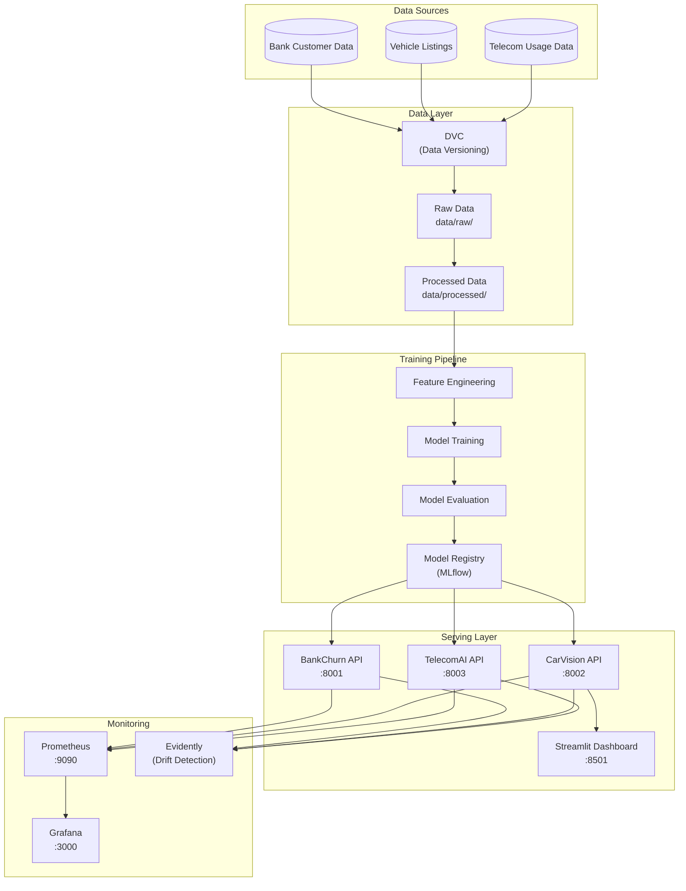
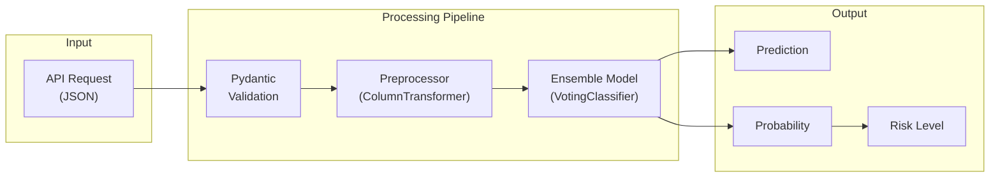
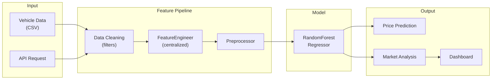
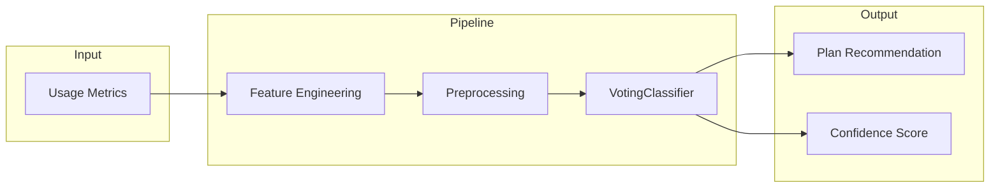
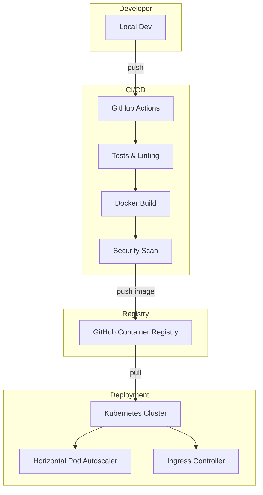

# System Architecture Overview

This document describes the high-level architecture of the ML-MLOps Portfolio, including system components, data flow, and deployment infrastructure.

## System Diagram

## Component Overview

### Data Layer

| Component | Purpose | Technology |
|-----------|---------|------------|
| **DVC** | Data versioning and remote storage | DVC + S3/GCS |
| **Raw Data** | Original datasets | CSV/Parquet |
| **Processed Data** | Cleaned and transformed data | Pandas DataFrames |

### Training Pipeline

| Component | Purpose | Technology |
|-----------|---------|------------|
| **Feature Engineering** | Transform raw data into features | Scikit-learn Pipelines |
| **Model Training** | Train ML models | XGBoost, RandomForest, Ensemble |
| **Evaluation** | Compute metrics and validate | Pytest, Custom metrics |
| **Model Registry** | Version and store models | MLflow |

### Serving Layer

| Component | Purpose | Technology |
|-----------|---------|------------|
| **REST APIs** | Serve predictions | FastAPI + Uvicorn |
| **Dashboard** | Interactive visualization | Streamlit |
| **Containers** | Package applications | Docker (multi-stage) |

### Monitoring

| Component | Purpose | Technology |
|-----------|---------|------------|
| **Prometheus** | Metrics collection | Prometheus + exporters |
| **Grafana** | Dashboards and alerting | Grafana |
| **Evidently** | ML model monitoring | Evidently AI |

## Project-Specific Architectures

### BankChurn Predictor

**Key Design Decisions:**

- **Unified Pipeline**: Preprocessor + Model in single sklearn Pipeline
- **Config Validation**: Pydantic for strict configuration
- **Imbalance Handling**: SMOTE and class weights support

### CarVision Market Intelligence

**Key Design Decisions:**

- **Centralized Feature Engineering**: Single `FeatureEngineer` class for training, inference, and analysis
- **No Data Leakage**: `price_per_mile` and `price_category` dropped from features (they depend on target)
- **Dual Interface**: FastAPI for programmatic access, Streamlit for interactive exploration

### TelecomAI Customer Intelligence

**Key Design Decisions:**

- **Voting Classifier**: Combines multiple base models for robust predictions
- **Domain Features**: Telecom-specific feature engineering

## Deployment Architecture

## Technology Stack Summary

| Layer | Technologies |
|-------|--------------|
| **Languages** | Python 3.11+, Bash |
| **ML Frameworks** | Scikit-learn, XGBoost, LightGBM |
| **Web Frameworks** | FastAPI, Streamlit |
| **MLOps** | MLflow, DVC, Evidently |
| **Containers** | Docker, Docker Compose |
| **Orchestration** | Kubernetes, GitHub Actions |
| **Monitoring** | Prometheus, Grafana |
| **Infrastructure** | Terraform (AWS/GCP) |

---

!!! note "Diagram Source"
    All diagrams are written in Mermaid and can be edited directly in the markdown files.
    Source files are located in `docs/architecture/`.
