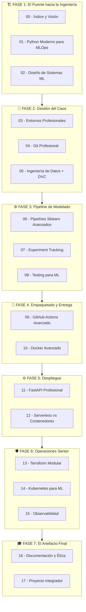

# ════════════════════════════════════════════════════════════════════════════════
# MÓDULO 00: ÍNDICE GENERAL Y ROADMAP
# Guía MLOps v5.0: Senior Edition
# Autor: DuqueOM | Noviembre 2025
# ════════════════════════════════════════════════════════════════════════════════

<div align="center">

# 📚 Guía MLOps: De Cero a Lead/Senior Engineer

## El Manual de Construcción para Ingenieros de ML Profesionales

*"No solo leas código. Escríbelo, rómpelo, arréglalo, despliégalo... y entiende cuándo NO usar cada herramienta."*

| Nivel Inicial          | Nivel Final              | Metodología              | Duración              |
| :--------------------: | :----------------------: | :----------------------: | :-------------------: |
| **Python Básico**      | **Lead/Senior MLOps**    | **Learning by Building** | **16-20 semanas**     |

</div>

---

## 🎯 Visión Ejecutiva: ¿Por Qué Esta Guía?

### El Problema del Mercado

```
╔═══════════════════════════════════════════════════════════════════════════════╗
║                        🚨 REALIDAD DEL MERCADO 2024-2025                      ║
╠═══════════════════════════════════════════════════════════════════════════════╣
║                                                                               ║
║   87% de proyectos ML NUNCA llegan a producción (Gartner)                    ║
║   73% de Data Scientists NO saben desplegar modelos (Stack Overflow Survey)  ║
║   Salario promedio MLOps Engineer: $150K-$200K USD (Levels.fyi)              ║
║                                                                               ║
║   GAP CRÍTICO: Hay millones de Data Scientists...                            ║
║                pero muy pocos saben OPERACIONALIZAR modelos.                  ║
║                                                                               ║
╚═══════════════════════════════════════════════════════════════════════════════╝
```

### La Propuesta de Valor de Esta Guía

| Guías Tradicionales                          | Esta Guía (Senior Edition)                           |
| :------------------------------------------- | :--------------------------------------------------- |
| "Usa DVC para versionar datos"               | "¿Cuándo usar DVC vs Git LFS vs Delta Lake?"         |
| Código funcional                             | Código **tipado, testeado y production-ready**       |
| Despliegue "Hello World"                     | Despliegue con **Secrets, Escalado y FinOps**        |
| Diagramas ASCII básicos                      | **Diagramas Mermaid** + Metáforas para conceptos     |
| Instrucciones lineales                       | **Trade-offs y ADRs** en cada decisión               |

---

## 🗺️ El Mapa de Ruta: 7 Fases hacia Senior

Esta guía no es un libro de texto; es un **manual de construcción progresivo**. Cada fase añade una capa de **sofisticación técnica** y **mentalidad Senior**.



---

## 🏗️ FASE 1: El Puente hacia la Ingeniería (Semanas 1-3)

**Objetivo**: Convertir a un scripter en un desarrollador que piensa en sistemas.

> **🎯 Mentalidad Senior**: Un Senior no escribe código que "funciona". Escribe código que **otros pueden mantener, testear y escalar**.

| Módulo | Archivo | Contenido Clave | Entregable |
| :----: | ------- | --------------- | ---------- |
| **00** | [00_INDICE.md](00_INDICE.md) | Visión de negocio, ROI de MLOps, estructura de la guía | Entender el "por qué" |
| **01** | [01_PYTHON_MODERNO.md](01_PYTHON_MODERNO.md) | **NUEVO**: Typing, Pydantic, Decoradores, OOP para ML, `src/` layout | Código tipado y modular |
| **02** | [02_DISENO_SISTEMAS.md](02_DISENO_SISTEMAS.md) | ML Canvas, C4 Model, Diseño de Arquitectura de Datos | `ML_CANVAS.md` + Diagrama |

### ADR de Fase 1: ¿Por qué empezar con Python Moderno?

```
╔═══════════════════════════════════════════════════════════════════════════════╗
║  ADR-001: Incluir módulo de Python Moderno antes de herramientas MLOps        ║
╠═══════════════════════════════════════════════════════════════════════════════╣
║  CONTEXTO:                                                                    ║
║  La mayoría de guías MLOps asumen que el usuario sabe estructurar código      ║
║  profesionalmente. Esto genera "deuda de aprendizaje" cuando el usuario       ║
║  intenta implementar patrones avanzados.                                      ║
║                                                                               ║
║  DECISIÓN:                                                                    ║
║  Incluir un módulo puente que cubra: Type Hints, Pydantic, OOP aplicado a    ║
║  ML, y estructura de paquetes Python (`src/` layout).                         ║
║                                                                               ║
║  CONSECUENCIAS:                                                               ║
║  (+) El usuario puede escribir código que pasa code review de Senior          ║
║  (+) Las herramientas MLOps se integran mejor con código tipado               ║
║  (-) Añade 1-2 semanas al programa                                            ║
║                                                                               ║
║  ALTERNATIVAS RECHAZADAS:                                                     ║
║  - Asumir conocimiento previo (genera frustración y deuda técnica)            ║
║  - Poner como anexo (usuarios lo saltan y sufren después)                     ║
╚═══════════════════════════════════════════════════════════════════════════════╝
```

---

## 🧪 FASE 2: Gestión del Caos (Semanas 4-6)

**Objetivo**: Dominar la reproducibilidad a nivel código, datos y entornos.

> **🎯 Mentalidad Senior**: Si no puedo reproducir tu resultado en MI máquina, tu trabajo no existe.

| Módulo | Archivo | Contenido Clave | Entregable |
| :----: | ------- | --------------- | ---------- |
| **03** | [03_ENTORNOS.md](03_ENTORNOS.md) | venv vs Conda vs Poetry vs Docker Dev Envs - **Análisis comparativo** | `pyproject.toml` o `requirements.txt` |
| **04** | [04_GIT_PROFESIONAL.md](04_GIT_PROFESIONAL.md) | Conventional Commits, Git Hooks, pre-commit, Estrategias de Branching | `.pre-commit-config.yaml` |
| **05** | [05_INGENIERIA_DATOS.md](05_INGENIERIA_DATOS.md) | DVC avanzado, `dvc.yaml` DAGs, **Cuándo NO usar DVC** | Pipeline DVC funcional |

### Trade-offs: ¿Cuándo NO usar DVC?

| Escenario | ¿Usar DVC? | Alternativa | Razón |
| --------- | :--------: | ----------- | ----- |
| Datos < 100MB, equipo pequeño | ❌ | Git LFS | Simplicidad, sin infra adicional |
| Datos streaming (Kafka, etc.) | ❌ | Delta Lake / Lakehouse | DVC es para batch |
| Empresa con Data Lake existente | ⚠️ | Integrar con existente | Evitar duplicación de esfuerzos |
| Datos > 1TB, múltiples versiones | ✅ | DVC + Remote Storage | Para esto fue diseñado |

---

## ⚙️ FASE 3: El Pipeline de Modelado (Semanas 7-9)

**Objetivo**: Transformar notebooks experimentales en código de producción testeable.

> **🎯 Mentalidad Senior**: Un modelo sin tests es una bomba de tiempo en producción.

| Módulo | Archivo | Contenido Clave | Entregable |
| :----: | ------- | --------------- | ---------- |
| **06** | [06_PIPELINES_AVANZADOS.md](06_PIPELINES_AVANZADOS.md) | Custom Transformers, FeatureUnion, **Prevención de Data Leakage** | `pipeline.pkl` robusto |
| **07** | [07_EXPERIMENT_TRACKING.md](07_EXPERIMENT_TRACKING.md) | MLflow a fondo: Registry, Signatures, **vs W&B/Neptune** | Experimentos en MLflow |
| **08** | [08_TESTING_ML.md](08_TESTING_ML.md) | Unit vs Integration vs **Data Tests vs Model Tests** | >80% coverage |

### Capas de Testing para ML (Progresivo)

```
╔═══════════════════════════════════════════════════════════════════════════════╗
║                        PIRÁMIDE DE TESTING PARA ML                            ║
╠═══════════════════════════════════════════════════════════════════════════════╣
║                                                                               ║
║                          ┌─────────────────┐                                  ║
║                          │   E2E Tests     │  ← Pocos, costosos, lentos       ║
║                          │ (API + Modelo)  │                                  ║
║                        ┌─┴─────────────────┴─┐                                ║
║                        │  Integration Tests  │  ← Pipeline completo           ║
║                        │  (Data → Predict)   │                                ║
║                    ┌───┴─────────────────────┴───┐                            ║
║                    │      Model Tests            │  ← Métricas, drift         ║
║                    │  (Performance, Fairness)    │                            ║
║                ┌───┴─────────────────────────────┴───┐                        ║
║                │          Data Tests                 │  ← Great Expectations  ║
║                │  (Schema, Nulls, Ranges, Dist)      │                        ║
║            ┌───┴─────────────────────────────────────┴───┐                    ║
║            │              Unit Tests                     │  ← Muchos, rápidos ║
║            │  (Funciones individuales, transformers)     │                    ║
║            └─────────────────────────────────────────────┘                    ║
║                                                                               ║
╚═══════════════════════════════════════════════════════════════════════════════╝
```

---

## 🚀 FASE 4: Empaquetado y Entrega (Semanas 10-11)

**Objetivo**: Automatizar la integración y crear artefactos deployables y seguros.

> **🎯 Mentalidad Senior**: Si tu pipeline de CI tarda 30 minutos, nadie lo va a correr.

| Módulo | Archivo | Contenido Clave | Entregable |
| :----: | ------- | --------------- | ---------- |
| **09** | [09_GITHUB_ACTIONS.md](09_GITHUB_ACTIONS.md) | CI robusto, **Caching**, Matrix testing, Secrets | `.github/workflows/` |
| **10** | [10_DOCKER_AVANZADO.md](10_DOCKER_AVANZADO.md) | Multi-stage builds, Distroless, **Escaneo de vulnerabilidades** | `Dockerfile` optimizado |

### Niveles de Complejidad Docker

| Nivel | Nombre | Características | Imagen Size | Seguridad |
| :---: | ------ | --------------- | :---------: | :-------: |
| 1 | **Funcional** | `FROM python:3.11`, instala todo | ~1.2GB | ⚠️ Básica |
| 2 | **Optimizado** | Multi-stage, slim base | ~400MB | ✅ Mejor |
| 3 | **Production** | Distroless, non-root, CVE scan | ~150MB | 🛡️ Hardened |

---

## 🌐 FASE 5: Despliegue (Semanas 12-13)

**Objetivo**: Llevar el modelo a producción con APIs profesionales y decisiones de infraestructura.

> **🎯 Mentalidad Senior**: ¿Serverless o Kubernetes? Depende del tráfico, costo y equipo. No hay respuesta universal.

| Módulo | Archivo | Contenido Clave | Entregable |
| :----: | ------- | --------------- | ---------- |
| **11** | [11_FASTAPI_PRO.md](11_FASTAPI_PRO.md) | Async, Dependency Injection, Middleware, **Error Handling** | API Production-Ready |
| **12** | [12_DESPLIEGUE_HIBRIDO.md](12_DESPLIEGUE_HIBRIDO.md) | **Lambda vs ECS vs K8s**: Cuándo usar cada uno | Decisión documentada |

### Matriz de Decisión: ¿Dónde Desplegar?

| Factor | AWS Lambda | ECS/Fargate | Kubernetes |
| ------ | :--------: | :---------: | :--------: |
| **Tráfico** | < 1M req/mes | 1M-100M | > 100M o picos |
| **Latencia** | Cold starts (100ms-3s) | Consistente | Consistente |
| **Costo bajo tráfico** | 💰 Barato | 💰💰 Medio | 💰💰💰 Alto |
| **Costo alto tráfico** | 💰💰💰 Caro | 💰💰 Medio | 💰 Barato |
| **Complejidad Ops** | Baja | Media | Alta |
| **Equipo necesario** | 1 persona | 2-3 personas | 5+ personas |

---

## 🛡️ FASE 6: Operaciones Senior (Semanas 14-16)

**Objetivo**: Operar el sistema en producción con infraestructura como código, orquestación y observabilidad.

> **🎯 Mentalidad Senior**: Si no lo puedo ver en un dashboard, no sé si está funcionando.

| Módulo | Archivo | Contenido Clave | Entregable |
| :----: | ------- | --------------- | ---------- |
| **13** | [13_TERRAFORM_MODULAR.md](13_TERRAFORM_MODULAR.md) | Módulos, State Management, **Workspaces multi-env** | Infra reproducible |
| **14** | [14_KUBERNETES_ML.md](14_KUBERNETES_ML.md) | Deployments, Ingress, **Secrets, Resource Limits** | Manifiestos K8s |
| **15** | [15_OBSERVABILIDAD.md](15_OBSERVABILIDAD.md) | Logging estructurado, Tracing, **Drift Detection** | Dashboard Grafana |

### Las 3 Capas de Observabilidad

```
╔═══════════════════════════════════════════════════════════════════════════════╗
║                         OBSERVABILIDAD = VISIBILIDAD                          ║
╠═══════════════════════════════════════════════════════════════════════════════╣
║                                                                               ║
║   ┌─────────────────────────────────────────────────────────────────────┐     ║
║   │  LOGS (¿Qué pasó?)                                                  │     ║
║   │  • Structured logging (JSON)                                        │     ║
║   │  • Herramientas: ELK, Loki                                          │     ║
║   └─────────────────────────────────────────────────────────────────────┘     ║
║                                                                               ║
║   ┌─────────────────────────────────────────────────────────────────────┐     ║
║   │  METRICS (¿Cómo está rindiendo?)                                    │     ║
║   │  • Latencia, throughput, error rate, model metrics                  │     ║
║   │  • Herramientas: Prometheus + Grafana                               │     ║
║   └─────────────────────────────────────────────────────────────────────┘     ║
║                                                                               ║
║   ┌─────────────────────────────────────────────────────────────────────┐     ║
║   │  TRACES (¿Por dónde pasó la request?)                               │     ║
║   │  • Distributed tracing                                               │     ║
║   │  • Herramientas: Jaeger, OpenTelemetry                               │     ║
║   └─────────────────────────────────────────────────────────────────────┘     ║
║                                                                               ║
║   ┌─────────────────────────────────────────────────────────────────────┐     ║
║   │  🔴 ML-ESPECÍFICO: Model Monitoring                                 │     ║
║   │  • Data Drift, Concept Drift, Performance Decay                     │     ║
║   │  • Herramientas: Evidently, NannyML, WhyLabs                         │     ║
║   └─────────────────────────────────────────────────────────────────────┘     ║
║                                                                               ║
╚═══════════════════════════════════════════════════════════════════════════════╝
```

---

## 🎓 FASE 7: El Artefacto Final (Semanas 17-18)

**Objetivo**: Documentar, presentar y destacar en el mercado laboral.

> **🎯 Mentalidad Senior**: Tu código no vale nada si nadie puede entenderlo ni usarlo.

| Módulo | Archivo | Contenido Clave | Entregable |
| :----: | ------- | --------------- | ---------- |
| **16** | [16_DOCS_ETICA.md](16_DOCS_ETICA.md) | MkDocs, Model Cards, **Responsible AI** | Documentación publicada |
| **17** | [17_PROYECTO_INTEGRADOR.md](17_PROYECTO_INTEGRADOR.md) | Demo, Pitch, **Preparación para entrevistas** | Video demo + Portfolio |

---

## 📚 Recursos Adicionales

| Recurso | Descripción |
| ------- | ----------- |
| [18_GLOSARIO.md](18_GLOSARIO.md) | Diccionario completo de términos MLOps |
| [19_ADR_DECISIONES.md](19_ADR_DECISIONES.md) | Architecture Decision Records consolidados |
| [20_PLAN_ESTUDIOS.md](20_PLAN_ESTUDIOS.md) | Syllabus detallado por semana |
| [21_PLANTILLAS.md](21_PLANTILLAS.md) | Templates (CI, Docker, Makefiles, ADRs) |
| [22_CHECKLIST.md](22_CHECKLIST.md) | Lista de verificación final |
| [23_RECURSOS.md](23_RECURSOS.md) | Bibliografía y cursos recomendados |

---

## 💡 Filosofía de la Guía (Los 5 Principios Senior)

```
╔═══════════════════════════════════════════════════════════════════════════════╗
║                    LOS 5 PRINCIPIOS DE LA GUÍA SENIOR                         ║
╠═══════════════════════════════════════════════════════════════════════════════╣
║                                                                               ║
║  1️⃣  JUSTIFICACIÓN RADICAL                                                    ║
║      No solo decimos QUÉ, explicamos POR QUÉ y CUÁNDO NO.                     ║
║      Cada herramienta tiene un ADR con trade-offs documentados.               ║
║                                                                               ║
║  2️⃣  COMPLEJIDAD PROGRESIVA                                                   ║
║      Nivel 1: Funcional → Nivel 2: Seguro → Nivel 3: Escalable               ║
║      Nunca añadimos complejidad sin justificar el ROI.                        ║
║                                                                               ║
║  3️⃣  CÓDIGO TIPADO Y DOCUMENTADO                                              ║
║      Si mypy se queja, tu código no pasa. Docstrings obligatorios.           ║
║      El código es la documentación que nunca miente.                          ║
║                                                                               ║
║  4️⃣  TESTING NO NEGOCIABLE                                                    ║
║      Sin tests no hay deployment. >80% coverage como mínimo.                  ║
║      Tests de datos, modelo Y sistema.                                        ║
║                                                                               ║
║  5️⃣  VISIÓN DE NEGOCIO                                                        ║
║      Un Senior entiende el impacto económico de sus decisiones.               ║
║      FinOps, ROI, y métricas de negocio son parte del diseño.                 ║
║                                                                               ║
╚═══════════════════════════════════════════════════════════════════════════════╝
```

---

## 🚀 Comenzar el Viaje

**¿Listo para transformarte de scripter a Senior MLOps Engineer?**

El primer paso es entender el código que escribirás. Un Senior no copia y pega código; escribe código que otros pueden mantener.

**[▶️ Comenzar con Módulo 01: Python Moderno para MLOps →](01_PYTHON_MODERNO.md)**

---

<div align="center">

*© 2025 DuqueOM - Guía MLOps v5.0: Senior Edition*

*"El viaje de mil deploys comienza con un solo `git commit`"*

</div>
