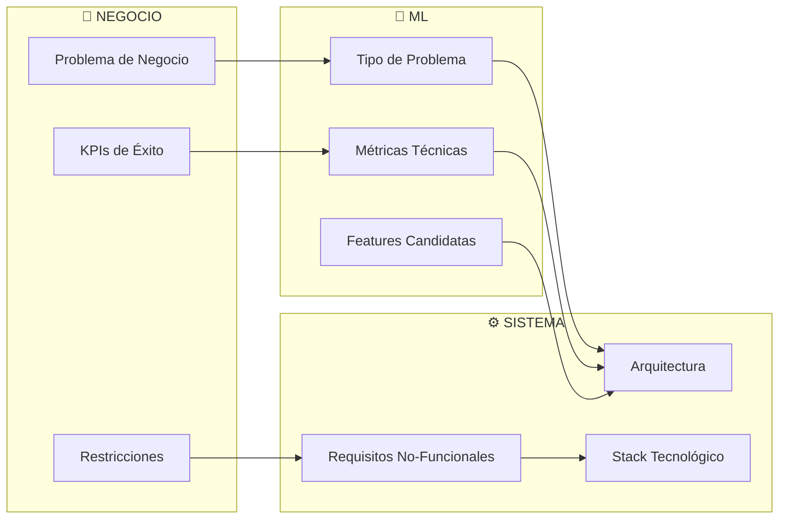
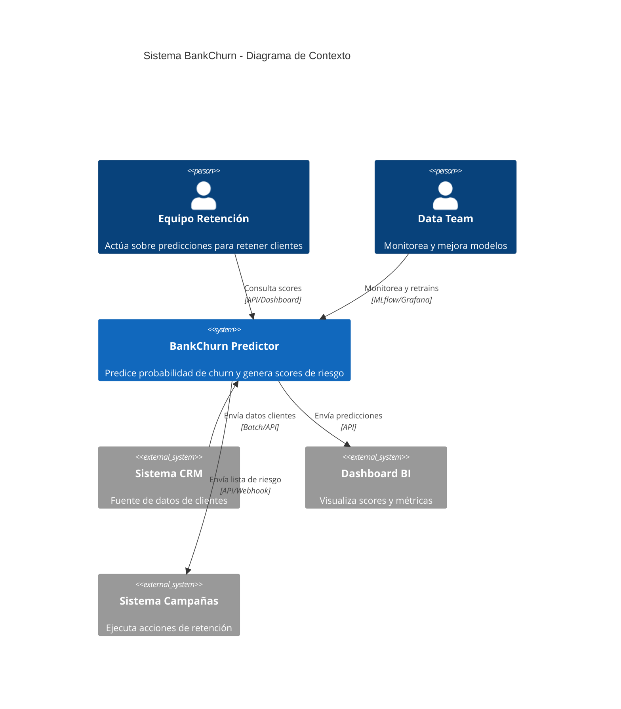
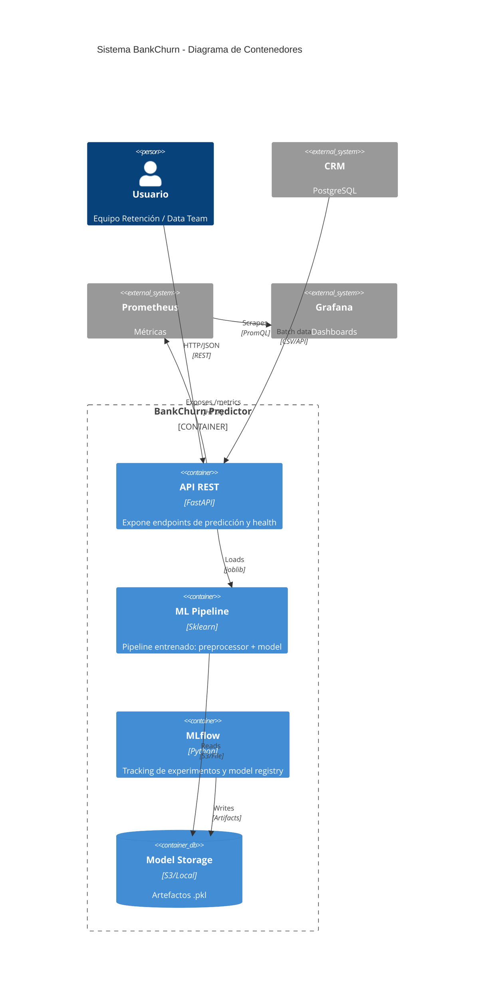
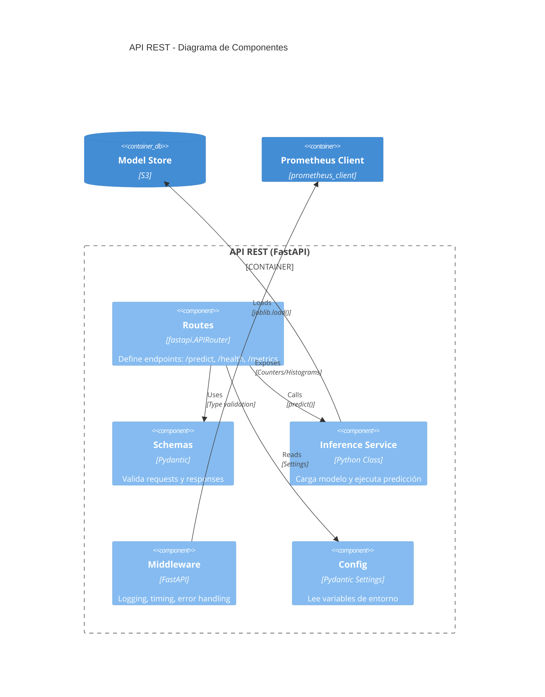
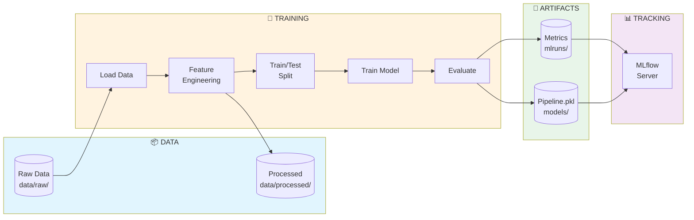
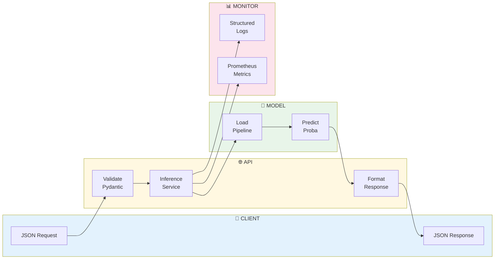
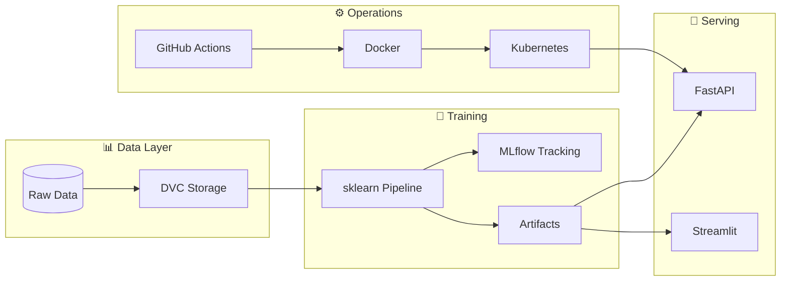
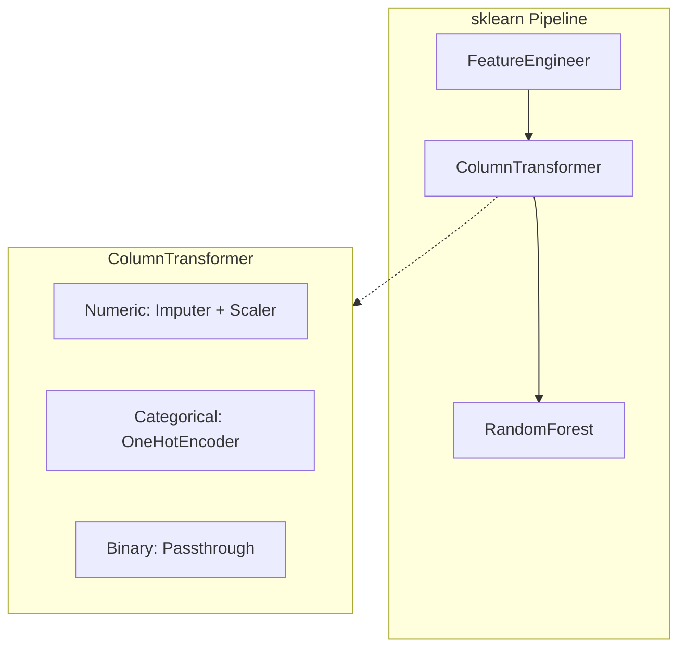
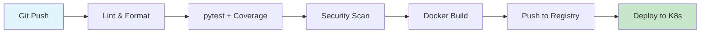

# ════════════════════════════════════════════════════════════════════════════════
# MÓDULO 02: DISEÑO DE SISTEMAS ML
# Del Problema de Negocio a la Arquitectura Técnica
# Guía MLOps v5.0: Senior Edition | DuqueOM | Noviembre 2025
# ════════════════════════════════════════════════════════════════════════════════

<div align="center">

# 📐 MÓDULO 02: Diseño de Sistemas ML

### Del Problema de Negocio a la Arquitectura Técnica

*"Un arquitecto Senior no dibuja casas bonitas; diseña sistemas que sobreviven*
*a terremotos, a cambios de requisitos y a desarrolladores que se van."*

| Duración             | Teoría               | Práctica             |
| :------------------: | :------------------: | :------------------: |
| **5-6 horas**        | 40%                  | 60%                  |

</div>

---

## 🎯 ADR de Inicio: ¿Por Qué Diseñar Antes de Codificar?

```
╔═══════════════════════════════════════════════════════════════════════════════╗
║  ADR-002: Diseño Obligatorio Antes del Código                                 ║
╠═══════════════════════════════════════════════════════════════════════════════╣
║                                                                               ║
║  CONTEXTO:                                                                    ║
║  El 73% de proyectos ML que fallan lo hacen por problemas de DISEÑO,          ║
║  no de algoritmos (Sculley et al., "Hidden Technical Debt in ML Systems").    ║
║                                                                               ║
║  DECISIÓN:                                                                    ║
║  Todo proyecto debe completar: ML Canvas + Diagrama de Arquitectura +         ║
║  ADRs para decisiones técnicas clave ANTES de escribir código.                ║
║                                                                               ║
║  CONSECUENCIAS:                                                               ║
║  (+) Alineamiento stakeholders-equipo desde el inicio                         ║
║  (+) Documentación de trade-offs para futuros desarrolladores                 ║
║  (+) Menor retrabajo por requisitos mal entendidos                            ║
║  (-) Añade 1-2 semanas al inicio del proyecto                                 ║
║                                                                               ║
╚═══════════════════════════════════════════════════════════════════════════════╝
```

### Lo Que Lograrás en Este Módulo

1. **Traducir** problemas de negocio a problemas de ML con métricas claras
2. **Completar** un ML Canvas profesional
3. **Diseñar** arquitectura usando el modelo C4
4. **Documentar** decisiones técnicas con ADRs
5. **Crear** un diagrama de flujo de datos

---

## 2.1 Traducción Negocio → ML (El Arte del Senior)

### El Anti-Patrón: "Tengo Datos, Voy a Hacer ML"

```
╔═══════════════════════════════════════════════════════════════════════════════╗
║                         ⚠️ EL ERROR DEL JUNIOR                                ║
╠═══════════════════════════════════════════════════════════════════════════════╣
║                                                                               ║
║   JUNIOR:                                                                     ║
║   "Tengo datos de clientes → Voy a probar XGBoost → Algo saldrá"              ║
║                                                                               ║
║   PROBLEMA:                                                                   ║
║   • No sabe qué métrica optimizar (¿accuracy? ¿F1? ¿costo de negocio?)        ║
║   • No sabe si el modelo genera valor                                         ║
║   • No puede priorizar features porque no entiende el negocio                 ║
║   • Cuando el proyecto "termina", nadie lo usa                                ║
║                                                                               ║
╠═══════════════════════════════════════════════════════════════════════════════╣
║                         ✅ EL ENFOQUE DEL SENIOR                              ║
╠═══════════════════════════════════════════════════════════════════════════════╣
║                                                                               ║
║   SENIOR:                                                                     ║
║   "El banco pierde $2M/año por churn → Predecir top 10% de riesgo →           ║
║    Campaña de retención → ROI esperado $400K → Métricas:                      ║
║    Precision@10% > 50%, AUC > 0.85, Latencia < 100ms"                         ║
║                                                                               ║
║   VENTAJAS:                                                                   ║
║   • Métrica clara conectada a $$$                                             ║
║   • Sabe cuándo el modelo es "suficientemente bueno"                          ║
║   • Puede justificar inversión en infraestructura                             ║
║   • El proyecto genera valor medible                                          ║
║                                                                               ║
╚═══════════════════════════════════════════════════════════════════════════════╝
```

### Framework de Traducción: Negocio → ML → Sistema



### Tabla de Traducción (Ejemplos)

| Problema de Negocio | Tipo ML | Métrica Negocio | Métrica Técnica | Requisito Sistema |
| :------------------ | :------ | :-------------- | :-------------- | :---------------- |
| Reducir abandono de clientes | Clasificación Binaria | $ retenido/año | AUC-ROC, Precision@K | Batch diario o API < 100ms |
| Estimar precio de vehículos | Regresión | % error en valuación | RMSE, MAPE | API síncrona < 200ms |
| Detectar fraude en tarjetas | Anomaly Detection | $ fraude evitado | Precision, Recall | Streaming < 50ms |
| Recomendar productos | Ranking/RecSys | Lift en ventas | NDCG@10, MAP | API < 100ms, cold-start handling |
| Predecir demanda | Series Temporales | % reducción stockout | MAPE, Bias | Batch semanal |

### Ejercicio 2.1: Traduce Tu Problema

Para el proyecto que elegiste (BankChurn, CarVision, TelecomAI o propio):

1. **Problema de Negocio**: ¿Qué duele? ¿Cuánto cuesta?
2. **Tipo de ML**: ¿Clasificación, regresión, clustering, etc.?
3. **Métrica de Negocio**: ¿Cómo se mide el éxito en $$$?
4. **Métrica Técnica**: ¿Qué optimizamos? (AUC, RMSE, etc.)
5. **Requisito de Sistema**: ¿Batch o real-time? ¿Latencia?

---

## 2.2 ML Canvas: El Blueprint del Proyecto

### ¿Qué es el ML Canvas?

El **ML Canvas** es un framework de 1 página que captura todas las decisiones clave de un proyecto ML. Es como el Business Model Canvas pero para sistemas de ML.

```
╔═══════════════════════════════════════════════════════════════════════════════════════════════════════╗
║                                      ML CANVAS: BANKCHURN PREDICTOR                                   ║
╠═══════════════════════════════════════════════════════════════════════════════════════════════════════╣
║                                                                                                       ║
║  ┌───────────────────────────────────────────┐   ┌─────────────────────────────────────────────────┐  ║
║  │ 1. 🎯 PROBLEMA DE NEGOCIO                 │   │ 2. 💰 PROPUESTA DE VALOR                       │  ║
║  │                                           │   │                                                 │  ║
║  │ • El banco pierde $2M/año por clientes    │   │ • Reducir churn 20% = $400K ahorro/año          │  ║
║  │   que abandonan sin previo aviso          │   │ • Identificar top 10% clientes en riesgo        │  ║
║  │ • Equipo de retención actúa reactivamente │   │ • Tiempo de acción: de 0 días a 30 días previo  │  ║
║  │ • Costo de adquisición 5x vs retención    │   │ • Campañas personalizadas por segmento riesgo   │  ║
║  │                                           │   │                                                 │  ║
║  └───────────────────────────────────────────┘   └─────────────────────────────────────────────────┘  ║
║                                                                                                       ║
║  ┌───────────────────────────────────────────┐   ┌─────────────────────────────────────────────────┐  ║
║  │ 3. 📊 DATOS DISPONIBLES                   │   │ 4. 🔧 FEATURES CANDIDATAS                      │  ║
║  │                                           │   │                                                 │  ║
║  │ FUENTE: Sistema CRM (PostgreSQL)          │   │ DEMOGRÁFICAS:                                   │  ║
║  │ • 10,000 registros históricos (2 años)    │   │ • Age, Gender, Geography                        │  ║
║  │ • Label: Exited (0=activo, 1=abandonó)    │   │                                                 │  ║
║  │ • Frecuencia: Snapshot mensual            │   │ FINANCIERAS:                                    │  ║
║  │ • Latencia: T-1 día                       │   │ • CreditScore, Balance, EstimatedSalary         │  ║
║  │                                           │   │                                                 │  ║
║  │ CALIDAD:                                  │   │ COMPORTAMIENTO:                                 │  ║
║  │ • Nulos: < 1%                             │   │ • Tenure, NumOfProducts, HasCrCard              │  ║
║  │ • Desbalanceo: 20% churn (manejable)      │   │ • IsActiveMember                                │  ║
║  │ • Data drift: Estacional (navidad)        │   │                                                 │  ║
║  │                                           │   │ DERIVADAS (Feature Engineering):                │  ║
║  │ RESTRICCIONES LEGALES:                    │   │ • BalancePerProduct = Balance / NumOfProducts   │  ║
║  │ • GDPR: Pseudonimización requerida        │   │ • BalanceSalaryRatio = Balance / Salary         │  ║
║  │ • No usar: Raza, Religión, etc.           │   │ • TenureAgeRatio = Tenure / Age                 │  ║
║  │                                           │   │                                                 │  ║
║  └───────────────────────────────────────────┘   └─────────────────────────────────────────────────┘  ║
║                                                                                                       ║
║  ┌───────────────────────────────────────────┐   ┌─────────────────────────────────────────────────┐  ║
║  │ 5. 🤖 MODELO                              │   │ 6. 📏 MÉTRICAS DE ÉXITO                        │  ║
║  │                                           │   │                                                 │  ║
║  │ TIPO: Clasificación Binaria               │   │ NEGOCIO:                                        │  ║
║  │                                           │   │ • $ Retenido por Campaña > $400K/año            │  ║
║  │ BASELINE:                                 │   │ • Lift vs random > 3x                           │  ║
║  │ • Logistic Regression (interpretable)     │   │                                                 │  ║
║  │ • Umbral: 50% churn rate                  │   │ MODELO:                                         │  ║
║  │                                           │   │ • AUC-ROC > 0.85 (target)                       │  ║
║  │ TARGET:                                   │   │ • Precision@10% > 50%                           │  ║
║  │ • Random Forest / XGBoost                 │   │ • Recall > 60% (no perder churners)             │  ║
║  │ • Con class_weight='balanced'             │   │                                                 │  ║
║  │                                           │   │ SISTEMA:                                        │  ║
║  │ APPROACH:                                 │   │ • Latencia P99 < 100ms                          │  ║
║  │ • Train/Test split temporal (no random)   │   │ • Throughput > 100 req/s                        │  ║
║  │ • Cross-validation: TimeSeriesSplit       │   │ • Uptime > 99.5%                                │  ║
║  │ • Hyperparameter tuning: Optuna           │   │ • Coverage > 80%                                │  ║
║  │                                           │   │                                                 │  ║
║  └───────────────────────────────────────────┘   └─────────────────────────────────────────────────┘  ║
║                                                                                                       ║
║  ┌───────────────────────────────────────────┐   ┌─────────────────────────────────────────────────┐  ║
║  │ 7. ⚠️ RIESGOS Y MITIGACIONES              │   │ 8. 🚀 PLAN DE DESPLIEGUE                       │  ║
║  │                                           │   │                                                 │  ║
║  │ TÉCNICOS:                                 │   │ MVP (Semana 10):                                │  ║
║  │ • Desbalanceo → class_weight, SMOTE       │   │ • API REST (FastAPI)                            │  ║
║  │ • Data leakage → Validación temporal      │   │ • Docker container                              │  ║
║  │ • Overfitting → Regularización, CV        │   │ • Consumidor: Dashboard BI (PowerBI)            │  ║
║  │                                           │   │ • Batch scoring diario                          │  ║
║  │ OPERACIONALES:                            │   │                                                 │  ║
║  │ • Model decay → Monitoreo + retrain       │   │ V2 (Mes 3):                                     │  ║
║  │ • Data drift → Evidently/NannyML          │   │ • Kubernetes deployment                         │  ║
║  │ • Latencia alta → Caching, async          │   │ • Integración CRM real-time                     │  ║
║  │                                           │   │ • A/B testing framework                         │  ║
║  │ ÉTICOS:                                   │   │ • Reentrenamiento mensual automatizado          │  ║
║  │ • Sesgo geográfico → Fairness metrics     │   │                                                 │  ║
║  │ • Explicabilidad → SHAP values            │   │ CONSUMIDORES:                                   │  ║
║  │                                           │   │ • Equipo de Retención (principal)               │  ║
║  │                                           │   │ • Dashboard Ejecutivo (secundario)              │  ║
║  │                                           │   │ • CRM para campañas automatizadas               │  ║
║  │                                           │   │                                                 │  ║
║  └───────────────────────────────────────────┘   └─────────────────────────────────────────────────┘  ║
║                                                                                                       ║
╚═══════════════════════════════════════════════════════════════════════════════════════════════════════╝
```

### Template Vacío para Tu Proyecto

```markdown
# ML CANVAS: [NOMBRE DEL PROYECTO]

## 1. 🎯 Problema de Negocio
- ¿Qué duele?
- ¿Cuánto cuesta el problema actual?
- ¿Quién sufre?

## 2. 💰 Propuesta de Valor
- ¿Cómo ML alivia el dolor?
- ¿Cuál es el ROI esperado?
- ¿Qué decisiones habilita?

## 3. 📊 Datos Disponibles
- Fuente:
- Volumen:
- Frecuencia:
- Calidad (nulos, duplicados):
- Restricciones legales:

## 4. 🔧 Features Candidatas
- Demográficas:
- Transaccionales:
- Comportamiento:
- Derivadas (feature engineering):

## 5. 🤖 Modelo
- Tipo de problema:
- Baseline:
- Target:
- Approach de validación:

## 6. 📏 Métricas de Éxito
- Negocio:
- Modelo:
- Sistema:

## 7. ⚠️ Riesgos y Mitigaciones
- Técnicos:
- Operacionales:
- Éticos:

## 8. 🚀 Plan de Despliegue
- MVP:
- V2:
- Consumidores:
```

---

## 2.3 Arquitectura con el Modelo C4

### ¿Qué es C4?

El **modelo C4** (Context, Container, Component, Code) es un framework para documentar arquitectura de software en 4 niveles de zoom.

```
╔═══════════════════════════════════════════════════════════════════════════════╗
║                         MODELO C4: 4 NIVELES DE ZOOM                          ║
╠═══════════════════════════════════════════════════════════════════════════════╣
║                                                                               ║
║   NIVEL 1: CONTEXTO (System Context)                                          ║
║   • Vista de pájaro: El sistema y sus usuarios/sistemas externos              ║
║   • Audiencia: Todos (stakeholders, devs, ops)                                ║
║   • Pregunta: "¿Qué es esto y quién lo usa?"                                  ║
║                                                                               ║
║   NIVEL 2: CONTENEDORES (Container)                                           ║
║   • Zoom in: Aplicaciones, bases de datos, servicios                          ║
║   • Audiencia: Arquitectos, tech leads                                        ║
║   • Pregunta: "¿Qué partes tiene el sistema?"                                 ║
║                                                                               ║
║   NIVEL 3: COMPONENTES (Component)                                            ║
║   • Zoom in++: Módulos dentro de cada contenedor                              ║
║   • Audiencia: Desarrolladores                                                ║
║   • Pregunta: "¿Cómo está organizado internamente?"                           ║
║                                                                               ║
║   NIVEL 4: CÓDIGO (Code)                                                      ║
║   • Máximo zoom: Clases, funciones                                            ║
║   • Audiencia: Desarrolladores (el que va a implementar)                      ║
║   • Nota: Usualmente se genera desde el código, no se dibuja                  ║
║                                                                               ║
╚═══════════════════════════════════════════════════════════════════════════════╝
```

### Nivel 1: Contexto del Sistema BankChurn



### Nivel 2: Contenedores



### Nivel 3: Componentes (API Container)



---

## 2.4 Diagrama de Flujo de Datos

### Training Pipeline



### Inference Pipeline



---

## 2.5 Architecture Decision Records (ADRs)

### ¿Qué es un ADR?

Un **ADR** documenta una decisión arquitectónica importante: el contexto, la decisión tomada, y las consecuencias.

### Template ADR

```markdown
# ADR-XXX: [Título de la Decisión]

## Estado
[Propuesto | Aceptado | Deprecado | Superseded por ADR-YYY]

## Contexto
¿Cuál es el problema que estamos tratando de resolver?
¿Qué restricciones tenemos?

## Decisión
¿Qué decidimos hacer?

## Consecuencias

### Positivas
- 

### Negativas
-

### Neutras
-

## Alternativas Consideradas
| Alternativa | Pros | Contras | Razón de Rechazo |
| ----------- | ---- | ------- | ---------------- |
|             |      |         |                  |

## Referencias
- Links a documentación, papers, etc.
```

### ADRs Ejemplo para BankChurn

#### ADR-003: FastAPI sobre Flask

```markdown
# ADR-003: Usar FastAPI para la API REST

## Estado
Aceptado

## Contexto
Necesitamos exponer el modelo como API REST. Las opciones principales son:
- Flask (maduro, amplia adopción)
- FastAPI (moderno, async, tipado)
- Django REST (batteries-included, pero pesado)

## Decisión
Usaremos **FastAPI** para la API REST.

## Consecuencias

### Positivas
- Validación automática con Pydantic (ya usamos para config)
- Documentación OpenAPI generada automáticamente
- Soporte nativo async (mejor performance bajo carga)
- Type hints forzados (consistente con nuestro código)
- Mejor performance que Flask (Starlette + Uvicorn)

### Negativas
- Menos tutoriales/recursos que Flask (aunque creciendo rápidamente)
- Requiere entender async/await para features avanzados
- Algunos desarrolladores pueden no estar familiarizados

### Neutras
- Similar curva de aprendizaje inicial que Flask

## Alternativas Consideradas
| Alternativa | Pros | Contras | Razón de Rechazo |
| ----------- | ---- | ------- | ---------------- |
| Flask | Maduro, muchos recursos | Sin async, sin tipos, docs manual | Performance y DX inferior |
| Django REST | Batteries-included | Muy pesado para API simple, ORM no necesario | Overkill para nuestro caso |

## Referencias
- [FastAPI vs Flask Benchmark](https://fastapi.tiangolo.com/benchmarks/)
- [Why FastAPI](https://fastapi.tiangolo.com/features/)
```

#### ADR-004: DVC sobre Git LFS

```markdown
# ADR-004: Usar DVC para Versionado de Datos

## Estado
Aceptado

## Contexto
Necesitamos versionar:
- Dataset de entrenamiento (CSV ~50MB)
- Modelos entrenados (PKL ~10MB)
- Posible crecimiento a GB en el futuro

## Decisión
Usaremos **DVC** (Data Version Control) con remote storage en S3/GCS.

## Consecuencias

### Positivas
- Integración nativa con Git (cada versión de datos linked a commit)
- Pipelines declarativos (dvc.yaml)
- Múltiples backends de storage (local, S3, GCS, Azure)
- Reproducibilidad con `dvc repro`
- Comunidad activa, bien documentado

### Negativas
- Curva de aprendizaje adicional
- Requiere setup de remote storage para colaboración
- Puede ser overkill para datasets muy pequeños

### Neutras
- CLI similar a Git (familiar)

## Alternativas Consideradas
| Alternativa | Pros | Contras | Razón de Rechazo |
| ----------- | ---- | ------- | ---------------- |
| Git LFS | Simple, integrado en Git | No soporta pipelines, costoso para archivos grandes | Sin reproducibilidad de pipelines |
| Delta Lake | Excelente para data lakes | Requiere Spark, overkill para nuestro caso | Complejidad innecesaria |
| DagsHub | DVC + MLflow hosted | Vendor lock-in, costo | Preferimos self-hosted |

## Referencias
- [DVC vs Git LFS](https://dvc.org/doc/user-guide/large-dataset-optimization)
```

---

## 2.6 Ejercicio Integrador: Diseña Tu Sistema

### Entregables

Para tu proyecto elegido, crea los siguientes archivos en `docs/`:

1. **`ML_CANVAS.md`**: ML Canvas completo (usa el template)
2. **`ARCHITECTURE.md`**: Diagramas C4 (al menos Contexto y Contenedores)
3. **`decisions/ADR-001.md`**: Al menos 2 ADRs para decisiones clave

### Criterios de Evaluación

| Criterio | Básico (60-69) | Competente (70-84) | Destacado (85-100) |
| -------- | -------------- | ------------------ | ------------------ |
| ML Canvas | Secciones incompletas | Todas las secciones, algunos detalles vagos | Completo con métricas específicas y cuantificadas |
| Diagramas | Solo texto descriptivo | Diagramas ASCII o básicos | Mermaid/PlantUML correctos y claros |
| ADRs | Sin ADRs | 1 ADR básico | 2+ ADRs con alternativas y trade-offs |

---

## 🧨 Errores habituales y cómo depurarlos en el diseño de sistemas ML

Este módulo es de **arquitectura y diseño**, así que muchos errores no se ven como *stack traces*, sino como **malas decisiones** que explotan meses después. La idea es aprender a detectarlos temprano.

### 1) ML Canvas bonito pero inútil (problema de negocio vago)

**Síntomas típicos**

- El ML Canvas está lleno de buzzwords: *“mejorar la experiencia del usuario”, “optimizar procesos”*.
- No hay números: ni costo actual, ni ROI esperado, ni objetivo cuantitativo.
- Nadie del negocio puede decir si el modelo “valió la pena” o no.

**Cómo identificarlo**

- Relee tus secciones **1. Problema de Negocio** y **2. Propuesta de Valor**:
  - ¿Hay cantidades concretas? (`$`, %, horas, tickets, churn…)
  - ¿Existe una hipótesis de mejora *medible*?
- Pregúntate: *“si mañana entrego el modelo, ¿cómo sabría si impactó algo?”*.

**Cómo corregirlo**

- Fuerza al menos:
  - 1 métrica de negocio actual (ej: *churn 20%*, *tiempo de resolución 48h*).
  - 1 objetivo de mejora (*reducir churn a 16%*, *bajar a 24h*).
  - 1 métrica técnica alineada (AUC, RMSE, etc.).
- Usa como referencia los ejemplos de **BankChurn**, **CarVision** y **TelecomAI**:
  - Revisa sus READMEs y métricas en MLflow para ver cómo se conectan a objetivos claros.

---

### 2) Diagramas C4 que no reflejan el código real

**Síntomas típicos**

- El diagrama de contenedores muestra 10 microservicios, pero en el repo solo hay 1 API monolítica.
- Aparecen bases de datos o colas que **no existen** en `docker-compose.demo.yml` ni en `k8s/`.
- Personas nuevas en el equipo se confunden porque “la arquitectura del doc no coincide con la realidad”.

**Cómo identificarlo**

- Abre simultáneamente:
  - `docs/architecture/*.md` en la raíz del portafolio.
  - `BankChurn-Predictor/docs/ARCHITECTURE.md`, `CarVision-Market-Intelligence/docs/ARCHITECTURE.md`, `TelecomAI-Customer-Intelligence/docs/ARCHITECTURE.md`.
  - `docker-compose.demo.yml` y los manifests de `k8s/`.
- Recorre tu diagrama C4 y marca:
  - ¿Existe un **mapeo 1:1** entre contenedores y artefactos reales (servicio Docker, deployment de K8s, app FastAPI/Streamlit)?

**Cómo corregirlo**

- Primero, **documenta la arquitectura que realmente existe hoy** (MVP), no la ideal de dentro de 1 año.
- Asegúrate de que cada contenedor en el diagrama:
  - Tiene un `Dockerfile` o entrada en `docker-compose.demo.yml`.
  - O es un servicio externo claramente etiquetado (MLflow, Prometheus, Grafana, CRM, etc.).
- Para la arquitectura futura, sepárala explícitamente como **“V2 / visión”** para no confundir.

---

### 3) Ignorar requisitos no funcionales (latencia, throughput, observabilidad)

**Síntomas típicos**

- El modelo en notebook va bien, pero la API en producción tiene:
  - Latencias > 2–3s.
  - Timeouts bajo carga.
  - Métricas inexistentes o imposibles de interpretar.
- No hay líneas claras en el ML Canvas ni en C4 sobre **SLAs/SLIs**.

**Cómo identificarlo**

- Revisa las secciones **6. Métricas de Éxito** y tus diagramas:
  - ¿Hablaste de *latencia*, *throughput*, *uptime*, *métricas de observabilidad*?
  - ¿Tu diagrama de inferencia incluye Prometheus/Grafana/Logging como en `GUIA_AUDIOVISUAL.md` y los manifests de `k8s/`?

**Cómo corregirlo**

- Añade explícitamente en el ML Canvas:
  - **Métricas de sistema** (latencia P95/P99, QPS, uptime, tiempo de warmup).
  - **Métricas de monitoreo** (errores 5xx, requests por endpoint, uso de CPU/memoria).
- Refleja esos componentes en C4:
  - Contenedores Prometheus/Grafana.
  - Endpoints `/metrics` en las APIs FastAPI.
- Conecta esto al futuro módulo de **Observabilidad (16_OBSERVABILIDAD)** para que el diseño no sea “ciego”.

---

### 4) ADRs inexistentes o que nadie lee

**Síntomas típicos**

- Decisiones importantes viven solo en la cabeza de alguien: *“eso lo decidió X hace meses”*.
- Existen ADRs, pero:
  - Están vacíos, sin alternativas ni consecuencias.
  - Nadie los actualiza cuando se revierte una decisión.

**Cómo identificarlo**

- Revisa `DECISIONES_TECH.md` y cualquier carpeta `docs/decisions/`.
- Pregúntate para cada sección del sistema:
  - ¿Por qué FastAPI y no Flask?
  - ¿Por qué DVC y no Git LFS?
  - ¿Por qué MLflow y no W&B?
  - Si la respuesta no está escrita en un ADR, tienes una **decisión tácita** peligrosa.

**Cómo corregirlo**

- Para cada decisión grande (API, tracking, versionado de datos, infraestructura):
  - Crea un ADR corto siguiendo el template de este módulo.
  - Añade al menos **1 alternativa rechazada** y la razón.
- Marca el estado (`Aceptado`, `Deprecado`, `Superseded`) cuando cambies de opinión.
- Enlaza los ADRs desde `DECISIONES_TECH.md` y desde la documentación de cada proyecto.

---

### 5) Patrón de debugging de diseño

1. **Empieza en el negocio**: revisa si el problema y el ROI están cuantificados.
2. **Sigue con el Canvas**: ¿están completas las 8 secciones? ¿faltan riesgos o restricciones legales?
3. **Baja a C4**: verifica que contextos y contenedores existen realmente en código/infra.
4. **Cierra con ADRs**: asegúrate de que las decisiones clave no viven solo en la memoria del equipo.

Si recorres este pipeline de pensamiento cada vez que diseñas (o revisas) un sistema, pensarás como un arquitecto Senior incluso en proyectos pequeños.

---

## 2.7 Autoevaluación

### Checklist

```
TRADUCCIÓN NEGOCIO → ML:
[ ] Puedo identificar el problema de negocio detrás de un proyecto ML
[ ] Sé calcular ROI esperado de una solución ML
[ ] Puedo elegir la métrica técnica correcta según el problema

ML CANVAS:
[ ] Puedo completar las 8 secciones del ML Canvas
[ ] Sé identificar riesgos técnicos, operacionales y éticos
[ ] Puedo definir métricas de negocio, modelo y sistema

ARQUITECTURA C4:
[ ] Entiendo los 4 niveles del modelo C4
[ ] Puedo dibujar diagramas de Contexto y Contenedores
[ ] Sé usar Mermaid para diagramas

ADRs:
[ ] Entiendo el propósito de los ADRs
[ ] Puedo documentar decisiones con alternativas y trade-offs
[ ] Sé cuándo crear un nuevo ADR vs actualizar uno existente
```

### Preguntas de Reflexión

1. ¿Por qué es importante cuantificar el problema de negocio antes de empezar?
2. ¿Qué pasa si no documentas las decisiones arquitectónicas?
3. ¿Cuándo es apropiado NO usar ML para resolver un problema?

---

## 📦 Cómo se Usó en el Portafolio

El diseño de sistemas no es solo teoría. Aquí está cómo se aplicó en el portafolio real:

### ML Canvas del Portafolio

Cada proyecto tiene su Canvas implícito en la documentación:

| Proyecto | Problema de Negocio | Métrica de Negocio | Métrica ML |
|----------|--------------------|--------------------|------------|
| BankChurn | Reducir pérdida de clientes | Retención +5% | AUC-ROC, Recall |
| CarVision | Pricing automatizado de autos | Error de precio <10% | MAE, R² |
| TelecomAI | Segmentación de clientes | Campañas personalizadas | Accuracy, F1 |

### Arquitectura C4 del Portafolio

```
┌─────────────────────────────────────────────────────────────────┐
│                    ML-MLOps-Portfolio (CONTEXTO)                │
├─────────────────────────────────────────────────────────────────┤
│                                                                 │
│  ┌─────────────────┐  ┌─────────────────┐  ┌─────────────────┐  │
│  │   BankChurn     │  │   CarVision     │  │   TelecomAI     │  │
│  │   Predictor     │  │   Market Intel  │  │   Customer Int  │  │
│  └────────┬────────┘  └────────┬────────┘  └────────┬────────┘  │
│           │                    │                    │           │
│           └────────────────────┴────────────────────┘           │
│                               │                                 │
│                    ┌──────────▼──────────┐                      │
│                    │   common_utils/     │                      │
│                    │   (logger, seed)    │                      │
│                    └──────────┬──────────┘                      │
│                               │                                 │
│           ┌───────────────────┴───────────────────┐             │
│           │          GitHub Actions CI            │             │
│           │   (ci-mlops.yml, matrix testing)      │             │
│           └───────────────────────────────────────┘             │
│                                                                 │
└─────────────────────────────────────────────────────────────────┘
```

### ADRs del Portafolio

Las decisiones arquitectónicas están documentadas en:
- `docs/guia_mlops/DECISIONES_TECH.md` → ADRs globales
- `*/docs/ARCHITECTURE.md` → ADRs por proyecto

**Ejemplo ADR real del portafolio:**
```markdown
# ADR-001: Pipeline Unificado vs Artefactos Separados

## Contexto
Inicialmente BankChurn guardaba preprocessor.pkl y model.pkl por separado.

## Decisión
Unificar todo en un solo pipeline.pkl

## Consecuencias
✅ Elimina training-serving skew
✅ Un solo artefacto para deploy
❌ Archivo más grande
```

### 🔧 Ejercicio: Revisa la Arquitectura Real

```bash
# Ver la arquitectura de BankChurn
cat BankChurn-Predictor/docs/architecture.md

# Ver las decisiones técnicas globales
cat docs/guia_mlops/DECISIONES_TECH.md
```

---

## 📊 Diagramas Mermaid de Arquitectura

### Flujo de Datos MLOps



### Pipeline de ML (C4 - Container)



### CI/CD Pipeline



---

## 💼 Consejos Profesionales

> **Recomendaciones para destacar en entrevistas y proyectos reales**

### Para Entrevistas de System Design

1. **Siempre empieza con requisitos**: Antes de dibujar, pregunta sobre escala, latencia esperada, y casos de uso principales.

2. **Conoce los trade-offs**: "¿Por qué elegiste esta arquitectura?" es la pregunta que siempre viene. Ten lista tu justificación.

3. **Menciona observabilidad**: Pocos candidatos hablan de logs, métricas y alertas. Hacerlo te diferencia.

### Para Proyectos Reales

| Situación | Consejo |
|-----------|---------|
| Sistema nuevo | Empieza simple (monolito), escala después |
| Alta disponibilidad | Diseña para fallos: circuit breakers, retries, fallbacks |
| Decisiones de arquitectura | Documenta en ADRs (Architecture Decision Records) |
| Integración con ML | Separa serving de training, usa feature stores |

### Patrones que Debes Conocer

- **Batch vs Streaming**: Cuándo usar cada uno para ML pipelines
- **Event-Driven**: Para sistemas desacoplados y escalables
- **CQRS**: Cuando lectura y escritura tienen requisitos muy diferentes
- **Saga Pattern**: Para transacciones distribuidas


---

## 📺 Recursos Externos Recomendados

> Ver [RECURSOS_POR_MODULO.md](RECURSOS_POR_MODULO.md) para la lista completa.

| 🏷️ | Recurso | Tipo |
|:--:|:--------|:-----|
| 🔴 | [System Design for ML - Chip Huyen](https://www.youtube.com/watch?v=2h2Z2j8PmKc) | Video |
| 🟡 | [C4 Model - Simon Brown](https://www.youtube.com/watch?v=x2-rSnhpw0g) | Video |
| 🟢 | [ML Canvas](https://www.ownml.co/machine-learning-canvas) | Herramienta |

---

## 🔗 Referencias del Glosario

Ver [21_GLOSARIO.md](21_GLOSARIO.md) para definiciones de:
- **ADR**: Architecture Decision Record
- **C4 Model**: Modelo de documentación de arquitectura
- **ML Canvas**: Plantilla para diseño de proyectos ML

---

## ✅ Ejercicios

Ver [EJERCICIOS.md](EJERCICIOS.md) - Módulo 02:
- **2.1**: Completar ML Canvas para un proyecto
- **2.2**: Escribir un ADR para una decisión técnica

---

## 🔜 Siguiente Paso

Con el diseño completo, es hora de configurar un **entorno de desarrollo profesional**.

**[Ir a Módulo 03: Estructura de Proyecto →](03_ESTRUCTURA_PROYECTO.md)**

---

<div align="center">

[← Volver al Índice](00_INDICE.md) | [Siguiente: Estructura de Proyecto →](03_ESTRUCTURA_PROYECTO.md)

</div>
