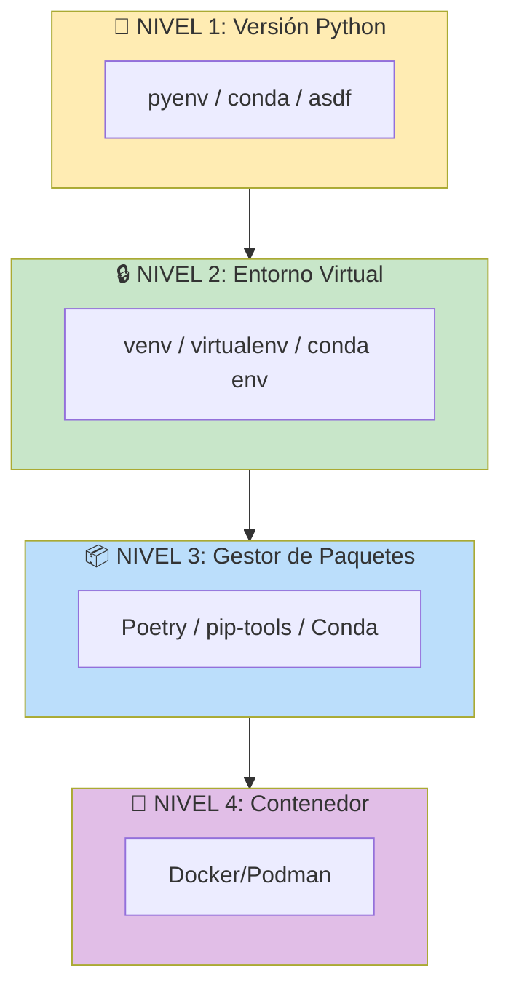

# ════════════════════════════════════════════════════════════════════════════════
# MÓDULO 03: ENTORNOS PROFESIONALES
# Virtualenv vs Conda vs Poetry vs Docker: Análisis Comparativo
# Guía MLOps v5.0: Senior Edition | DuqueOM | Noviembre 2025
# ════════════════════════════════════════════════════════════════════════════════

<div align="center">

# 🔧 MÓDULO 03: Entornos Profesionales

### El Arte de la Reproducibilidad a Nivel de Dependencias

*"'Funciona en mi máquina' es la excusa más cara de la industria."*

| Duración             | Teoría               | Práctica             |
| :------------------: | :------------------: | :------------------: |
| **4-5 horas**        | 30%                  | 70%                  |

</div>

---

## 🎯 ADR de Inicio: ¿Por Qué Importan los Entornos?

```
╔═══════════════════════════════════════════════════════════════════════════════╗
║  ADR-005: Gestión de Entornos como Práctica Obligatoria                       ║
╠═══════════════════════════════════════════════════════════════════════════════╣
║                                                                               ║
║  CONTEXTO:                                                                    ║
║  El 30% de bugs en producción ML se deben a diferencias de versiones         ║
║  entre desarrollo y producción (Google ML Engineering Best Practices).        ║
║                                                                               ║
║  DECISIÓN:                                                                    ║
║  Todo proyecto DEBE tener un sistema de gestión de dependencias con          ║
║  versiones pinneadas y un método documentado de reproducir el entorno.        ║
║                                                                               ║
║  CONSECUENCIAS:                                                               ║
║  (+) Reproducibilidad garantizada entre máquinas                              ║
║  (+) Onboarding de nuevos desarrolladores en minutos, no días                 ║
║  (+) CI/CD confiable (mismas versiones siempre)                               ║
║  (-) Setup inicial requiere más tiempo                                        ║
║                                                                               ║
╚═══════════════════════════════════════════════════════════════════════════════╝
```

### Lo Que Lograrás en Este Módulo

1. **Entender** las diferencias entre venv, Conda, Poetry y Docker
2. **Elegir** la herramienta correcta según tu proyecto
3. **Configurar** un entorno profesional con lockfiles
4. **Integrar** el entorno con CI/CD

---

## 3.1 El Problema: "Funciona en Mi Máquina"

```
╔═══════════════════════════════════════════════════════════════════════════════╗
║                         😱 EL HORROR DE LAS DEPENDENCIAS                      ║
╠═══════════════════════════════════════════════════════════════════════════════╣
║                                                                               ║
║   ESCENARIO TÍPICO:                                                           ║
║                                                                               ║
║   Developer A (laptop):                                                       ║
║   • Python 3.11.4                                                             ║
║   • scikit-learn 1.3.0                                                        ║
║   • pandas 2.0.3                                                              ║
║   • numpy 1.24.3                                                              ║
║   → "Todo funciona perfecto" ✅                                                ║
║                                                                               ║
║   Developer B (otra laptop):                                                  ║
║   • Python 3.9.7                                                              ║
║   • scikit-learn 1.0.2                                                        ║
║   • pandas 1.4.0                                                              ║
║   • numpy 1.21.0                                                              ║
║   → "AttributeError: module 'sklearn' has no attribute 'X'" ❌                 ║
║                                                                               ║
║   Servidor de producción:                                                     ║
║   • Python 3.8.10                                                             ║
║   • Versiones "whatever pip installed"                                        ║
║   → CRASH EN PRODUCCIÓN 💥                                                    ║
║                                                                               ║
╚═══════════════════════════════════════════════════════════════════════════════╝
```

### Las 4 Capas de Reproducibilidad



---

## 3.2 Comparativa de Herramientas

### Matriz de Decisión

| Criterio | venv + pip | Conda | Poetry | Docker Dev |
| :------- | :--------: | :---: | :----: | :--------: |
| **Simplicidad** | ⭐⭐⭐⭐⭐ | ⭐⭐⭐ | ⭐⭐⭐⭐ | ⭐⭐ |
| **Reproducibilidad** | ⭐⭐ | ⭐⭐⭐ | ⭐⭐⭐⭐⭐ | ⭐⭐⭐⭐⭐ |
| **Deps no-Python** | ❌ | ✅ | ❌ | ✅ |
| **Lockfile nativo** | ❌ (req pip-tools) | ❌ | ✅ | N/A |
| **Speed** | ⭐⭐⭐⭐⭐ | ⭐⭐ | ⭐⭐⭐⭐ | ⭐⭐⭐ |
| **CI/CD friendly** | ✅ | ⚠️ | ✅ | ✅ |
| **Espacio disco** | Bajo | Alto | Bajo | Medio-Alto |
| **Curva aprendizaje** | Baja | Media | Baja | Media |

### ¿Cuándo Usar Cada Uno?

```
╔═══════════════════════════════════════════════════════════════════════════════╗
║                    GUÍA DE SELECCIÓN DE HERRAMIENTA                           ║
╠═══════════════════════════════════════════════════════════════════════════════╣
║                                                                               ║
║  USA venv + pip-tools SI:                                                     ║
║  • Proyecto simple, solo dependencias Python                                  ║
║  • Equipo pequeño, ya conoce pip                                              ║
║  • CI/CD en GitHub Actions (pip es más rápido)                                ║
║  • No necesitas lockfile sofisticado                                          ║
║                                                                               ║
║  USA Conda SI:                                                                ║
║  • Necesitas librerías con dependencias C/C++ (CUDA, MKL, OpenCV)            ║
║  • Trabajas en Data Science pesado (numpy, scipy optimizados)                 ║
║  • Tu equipo ya usa Conda                                                     ║
║  • Necesitas múltiples versiones de Python fácilmente                         ║
║                                                                               ║
║  USA Poetry SI:                                                               ║
║  • Proyecto serio que necesita reproducibilidad exacta                        ║
║  • Quieres publicar en PyPI                                                   ║
║  • Valoras lockfiles y dependency resolution robusta                          ║
║  • Equipo moderno que aprecia herramientas bien diseñadas                     ║
║                                                                               ║
║  USA Docker Dev Containers SI:                                                ║
║  • Reproducibilidad TOTAL es crítica                                          ║
║  • Múltiples servicios (DB, Redis, etc.) en desarrollo                        ║
║  • Onboarding debe ser "clone & run"                                          ║
║  • Equipo usa VS Code con extensión Dev Containers                            ║
║                                                                               ║
╚═══════════════════════════════════════════════════════════════════════════════╝
```

---

## 3.3 Opción 1: venv + pip-tools (Simple y Efectivo)

### Setup Básico

```bash
# Crear entorno virtual
python3.11 -m venv .venv

# Activar
source .venv/bin/activate  # Linux/Mac
# .venv\Scripts\activate   # Windows

# Instalar pip-tools para lockfiles
pip install pip-tools
```

### Estructura de Archivos

```
project/
├── requirements.in        # Dependencias directas (lo que escribes)
├── requirements.txt       # Lockfile generado (no editar manualmente)
├── requirements-dev.in    # Dependencias de desarrollo
├── requirements-dev.txt   # Lockfile de desarrollo
└── .python-version        # Versión de Python (para pyenv)
```

### requirements.in (Lo que escribes)

```
# requirements.in - Dependencias directas
# Solo especifica las que usas directamente, pip-tools resuelve el resto

pandas>=2.0.0,<3.0.0
scikit-learn>=1.3.0
pydantic>=2.0.0
fastapi>=0.100.0
mlflow>=2.8.0
pyyaml>=6.0
```

### Generar Lockfile

```bash
# Genera requirements.txt con TODAS las versiones exactas
pip-compile requirements.in --output-file=requirements.txt

# Para desarrollo
pip-compile requirements-dev.in --output-file=requirements-dev.txt

# Instalar desde lockfile
pip-sync requirements.txt requirements-dev.txt
```

### requirements.txt Generado (NO EDITAR)

```
# This file is autogenerated by pip-compile with Python 3.11
# Do not edit manually.

annotated-types==0.6.0
    # via pydantic
anyio==4.0.0
    # via
    #   httpx
    #   starlette
certifi==2023.11.17
    # via httpx
fastapi==0.104.1
    # via -r requirements.in
numpy==1.26.2
    # via
    #   pandas
    #   scikit-learn
pandas==2.1.3
    # via -r requirements.in
pydantic==2.5.2
    # via
    #   -r requirements.in
    #   fastapi
# ... etc (versiones EXACTAS)
```

### Makefile para Automatización

```makefile
# Makefile
.PHONY: venv install lock sync clean

PYTHON := python3.11
VENV := .venv
BIN := $(VENV)/bin

venv:
	$(PYTHON) -m venv $(VENV)
	$(BIN)/pip install --upgrade pip pip-tools

lock: venv
	$(BIN)/pip-compile requirements.in -o requirements.txt
	$(BIN)/pip-compile requirements-dev.in -o requirements-dev.txt

sync: venv
	$(BIN)/pip-sync requirements.txt requirements-dev.txt

install: venv lock sync

clean:
	rm -rf $(VENV)
	rm -f requirements.txt requirements-dev.txt
```

---

## 3.4 Opción 2: Poetry (Moderno y Robusto)

### Instalación

```bash
# Instalar Poetry (método oficial)
curl -sSL https://install.python-poetry.org | python3 -

# Verificar
poetry --version
```

### Inicializar Proyecto

```bash
# En proyecto existente
poetry init

# O crear nuevo proyecto
poetry new bankchurn-predictor
```

### pyproject.toml Completo

```toml
[tool.poetry]
name = "bankchurn"
version = "0.1.0"
description = "Predictor de churn bancario con MLOps"
authors = ["Tu Nombre <tu@email.com>"]
readme = "README.md"
packages = [{include = "bankchurn", from = "src"}]

[tool.poetry.dependencies]
python = "^3.10"
pandas = "^2.0.0"
scikit-learn = "^1.3.0"
pydantic = "^2.0.0"
fastapi = "^0.104.0"
uvicorn = "^0.24.0"
mlflow = "^2.8.0"
pyyaml = "^6.0"
joblib = "^1.3.0"

[tool.poetry.group.dev.dependencies]
pytest = "^7.4.0"
pytest-cov = "^4.1.0"
mypy = "^1.6.0"
ruff = "^0.1.0"
pre-commit = "^3.5.0"
ipython = "^8.0.0"

[tool.poetry.group.docs.dependencies]
mkdocs = "^1.5.0"
mkdocs-material = "^9.4.0"

[tool.poetry.scripts]
bankchurn-train = "bankchurn.cli:train"
bankchurn-predict = "bankchurn.cli:predict"

[build-system]
requires = ["poetry-core"]
build-backend = "poetry.core.masonry.api"

# ════════════════════════════════════════════════════════════════════
# CONFIGURACIÓN DE HERRAMIENTAS
# ════════════════════════════════════════════════════════════════════

[tool.ruff]
line-length = 100
select = ["E", "F", "I", "W", "B", "C4", "UP"]
ignore = ["E501"]
src = ["src"]

[tool.mypy]
python_version = "3.11"
warn_return_any = true
disallow_untyped_defs = true
ignore_missing_imports = true

[tool.pytest.ini_options]
testpaths = ["tests"]
addopts = "-v --cov=src/bankchurn --cov-report=term-missing"

[tool.coverage.run]
source = ["src"]
omit = ["tests/*"]
```

### Comandos Esenciales

```bash
# Instalar dependencias (crea poetry.lock automáticamente)
poetry install

# Añadir dependencia
poetry add pandas
poetry add --group dev pytest

# Actualizar dependencias
poetry update

# Ejecutar comando en el entorno
poetry run python src/bankchurn/main.py
poetry run pytest

# Activar shell en el entorno
poetry shell

# Exportar a requirements.txt (para Docker)
poetry export -f requirements.txt --output requirements.txt --without-hashes

# Build del paquete
poetry build
```

### poetry.lock (Generado Automáticamente)

El archivo `poetry.lock` contiene TODAS las versiones exactas de TODAS las dependencias (directas y transitivas). **SIEMPRE** commitear este archivo.

---

## 3.5 Opción 3: Conda (Para Data Science Pesado)

### Cuándo Conda es la Mejor Opción

```
╔═══════════════════════════════════════════════════════════════════════════════╗
║                         ✅ USA CONDA SI NECESITAS:                             ║
╠═══════════════════════════════════════════════════════════════════════════════╣
║                                                                               ║
║   • CUDA / cuDNN para GPU computing                                           ║
║   • NumPy/SciPy compilados con MKL (Intel) o OpenBLAS optimizado             ║
║   • OpenCV con dependencias de sistema                                        ║
║   • R + Python en el mismo entorno                                            ║
║   • Librerías geoespaciales (GDAL, GEOS, PROJ)                               ║
║   • Dependencias de sistema que pip no puede instalar                         ║
║                                                                               ║
╚═══════════════════════════════════════════════════════════════════════════════╝
```

### environment.yml

```yaml
# environment.yml
name: bankchurn
channels:
  - conda-forge  # Preferir conda-forge sobre defaults
  - defaults

dependencies:
  # Python version
  - python=3.11
  
  # Core data science (optimizados con MKL)
  - numpy=1.26.*
  - pandas=2.1.*
  - scikit-learn=1.3.*
  
  # Si necesitas GPU
  # - pytorch
  # - cudatoolkit=11.8
  
  # Dependencias que tienen componentes C
  - pyyaml
  - joblib
  
  # pip dependencies (las que no están en conda o prefieres de PyPI)
  - pip
  - pip:
    - pydantic>=2.0.0
    - fastapi>=0.104.0
    - uvicorn>=0.24.0
    - mlflow>=2.8.0
    - pytest>=7.4.0
    - mypy>=1.6.0
    - ruff>=0.1.0
```

### Comandos Conda

```bash
# Crear entorno desde archivo
conda env create -f environment.yml

# Activar
conda activate bankchurn

# Exportar entorno exacto (para reproducibilidad)
conda env export > environment-lock.yml

# Exportar solo dependencias explícitas
conda env export --from-history > environment.yml

# Actualizar entorno
conda env update -f environment.yml --prune

# Listar entornos
conda env list

# Eliminar entorno
conda env remove -n bankchurn
```

### Mamba: Conda Acelerado

```bash
# Instalar mamba (resolver mucho más rápido)
conda install -c conda-forge mamba

# Usar mamba en lugar de conda
mamba env create -f environment.yml
mamba install numpy
```

---

## 3.6 Opción 4: Docker Dev Containers

### ¿Por Qué Docker para Desarrollo?

```
╔═══════════════════════════════════════════════════════════════════════════════╗
║                       DOCKER DEV CONTAINERS: PROS/CONS                        ║
╠═══════════════════════════════════════════════════════════════════════════════╣
║                                                                               ║
║   ✅ PROS:                                                                     ║
║   • Reproducibilidad TOTAL (mismo OS, mismas versiones de todo)               ║
║   • Onboarding = "git clone && code ." (con VS Code Dev Containers)           ║
║   • Mismo entorno en dev, CI y producción                                     ║
║   • Puedes incluir servicios (PostgreSQL, Redis, MLflow server)               ║
║                                                                               ║
║   ❌ CONS:                                                                     ║
║   • Overhead de Docker (memoria, CPU)                                         ║
║   • Más complejo de configurar inicialmente                                   ║
║   • Debugging puede ser más difícil                                           ║
║   • Performance de I/O en volúmenes (especialmente macOS)                     ║
║                                                                               ║
╚═══════════════════════════════════════════════════════════════════════════════╝
```

### .devcontainer/devcontainer.json

```json
{
    "name": "BankChurn Dev",
    "dockerComposeFile": "docker-compose.yml",
    "service": "app",
    "workspaceFolder": "/workspace",
    
    "customizations": {
        "vscode": {
            "extensions": [
                "ms-python.python",
                "ms-python.vscode-pylance",
                "charliermarsh.ruff",
                "ms-toolsai.jupyter",
                "redhat.vscode-yaml",
                "GitHub.copilot"
            ],
            "settings": {
                "python.defaultInterpreterPath": "/workspace/.venv/bin/python",
                "python.formatting.provider": "none",
                "editor.formatOnSave": true,
                "[python]": {
                    "editor.defaultFormatter": "charliermarsh.ruff"
                }
            }
        }
    },
    
    "postCreateCommand": "make install",
    
    "forwardPorts": [8000, 5000, 3000],
    
    "remoteUser": "vscode"
}
```

### .devcontainer/docker-compose.yml

```yaml
version: '3.8'

services:
  app:
    build:
      context: ..
      dockerfile: .devcontainer/Dockerfile
    volumes:
      - ..:/workspace:cached
      - venv:/workspace/.venv
    environment:
      - PYTHONDONTWRITEBYTECODE=1
      - PYTHONUNBUFFERED=1
    command: sleep infinity
    
  mlflow:
    image: ghcr.io/mlflow/mlflow:v2.8.0
    ports:
      - "5000:5000"
    volumes:
      - mlflow-data:/mlflow
    command: mlflow server --host 0.0.0.0 --backend-store-uri sqlite:///mlflow/mlflow.db --default-artifact-root /mlflow/artifacts
    
  postgres:
    image: postgres:15
    environment:
      POSTGRES_USER: bankchurn
      POSTGRES_PASSWORD: bankchurn
      POSTGRES_DB: bankchurn
    volumes:
      - postgres-data:/var/lib/postgresql/data
    ports:
      - "5432:5432"

volumes:
  venv:
  mlflow-data:
  postgres-data:
```

### .devcontainer/Dockerfile

```dockerfile
FROM python:3.11-slim

# Dependencias del sistema
RUN apt-get update && apt-get install -y --no-install-recommends \
    git \
    curl \
    make \
    && rm -rf /var/lib/apt/lists/*

# Usuario no-root
ARG USERNAME=vscode
ARG USER_UID=1000
ARG USER_GID=$USER_UID

RUN groupadd --gid $USER_GID $USERNAME \
    && useradd --uid $USER_UID --gid $USER_GID -m $USERNAME

# Workspace
WORKDIR /workspace

# Cambiar a usuario no-root
USER $USERNAME

# Pre-instalar pip-tools
RUN pip install --user pip-tools

ENV PATH="/home/${USERNAME}/.local/bin:${PATH}"
```

---

## 3.7 Integración con CI/CD

### GitHub Actions con pip

```yaml
# .github/workflows/ci.yml
name: CI

on: [push, pull_request]

jobs:
  test:
    runs-on: ubuntu-latest
    
    steps:
      - uses: actions/checkout@v4
      
      - name: Set up Python
        uses: actions/setup-python@v5
        with:
          python-version: '3.11'
          cache: 'pip'  # Cachea dependencias
      
      - name: Install dependencies
        run: |
          pip install -r requirements.txt
          pip install -r requirements-dev.txt
      
      - name: Run tests
        run: pytest tests/ -v --cov
```

### GitHub Actions con Poetry

```yaml
name: CI

on: [push, pull_request]

jobs:
  test:
    runs-on: ubuntu-latest
    
    steps:
      - uses: actions/checkout@v4
      
      - name: Set up Python
        uses: actions/setup-python@v5
        with:
          python-version: '3.11'
      
      - name: Install Poetry
        uses: snok/install-poetry@v1
        with:
          version: 1.7.0
          virtualenvs-create: true
          virtualenvs-in-project: true
      
      - name: Load cached venv
        uses: actions/cache@v3
        with:
          path: .venv
          key: venv-${{ runner.os }}-${{ hashFiles('poetry.lock') }}
      
      - name: Install dependencies
        run: poetry install --no-interaction
      
      - name: Run tests
        run: poetry run pytest tests/ -v --cov
```

---

## 3.8 Ejercicio Práctico: Configura Tu Entorno

### Opción A: pip-tools (Recomendado para empezar)

```bash
# 1. Crear estructura
mkdir -p bankchurn-predictor && cd bankchurn-predictor

# 2. Crear archivos
cat > requirements.in << 'EOF'
pandas>=2.0.0
scikit-learn>=1.3.0
pydantic>=2.0.0
fastapi>=0.104.0
uvicorn>=0.24.0
mlflow>=2.8.0
pyyaml>=6.0
joblib>=1.3.0
EOF

cat > requirements-dev.in << 'EOF'
-r requirements.in
pytest>=7.4.0
pytest-cov>=4.1.0
mypy>=1.6.0
ruff>=0.1.0
pre-commit>=3.5.0
EOF

# 3. Crear entorno y lockfiles
python3.11 -m venv .venv
source .venv/bin/activate
pip install pip-tools
pip-compile requirements.in
pip-compile requirements-dev.in
pip-sync requirements.txt requirements-dev.txt

# 4. Verificar
python -c "import pandas; print(pandas.__version__)"
```

### Opción B: Poetry

```bash
# 1. Crear proyecto
poetry new bankchurn-predictor --src
cd bankchurn-predictor

# 2. Añadir dependencias
poetry add pandas scikit-learn pydantic fastapi uvicorn mlflow pyyaml joblib
poetry add --group dev pytest pytest-cov mypy ruff pre-commit

# 3. Instalar
poetry install

# 4. Verificar
poetry run python -c "import pandas; print(pandas.__version__)"
```

### Checklist de Verificación

```
[ ] Entorno virtual creado y activable
[ ] Lockfile generado con versiones exactas
[ ] Lockfile commiteado en Git
[ ] Puedo recrear el entorno desde cero
[ ] CI puede instalar las mismas versiones
```

---

## 3.9 Autoevaluación

### Checklist de Competencias

```
CONCEPTOS:
[ ] Entiendo la diferencia entre dependencias directas y transitivas
[ ] Sé qué es un lockfile y por qué es importante
[ ] Puedo explicar cuándo usar Conda vs pip vs Poetry

pip-tools:
[ ] Puedo crear requirements.in con restricciones de versión
[ ] Sé usar pip-compile y pip-sync
[ ] Entiendo el formato del lockfile generado

Poetry:
[ ] Puedo crear un pyproject.toml funcional
[ ] Sé añadir dependencias y grupos de dependencias
[ ] Puedo exportar a requirements.txt para Docker

CI/CD:
[ ] Puedo configurar caching de dependencias en GitHub Actions
[ ] Sé cómo asegurar reproducibilidad en CI
```

### Preguntas de Reflexión

1. ¿Por qué no basta con `pip install pandas` sin especificar versión?
2. ¿Cuál es la diferencia entre `requirements.in` y `requirements.txt`?
3. ¿Cuándo preferirías Conda sobre Poetry?
4. ¿Por qué es importante cachear dependencias en CI?

---

## 🔜 Siguiente Paso

Con el entorno configurado, es hora de dominar **Git profesionalmente**.

**[Ir a Módulo 04: Git Profesional →](04_GIT_PROFESIONAL.md)**

---

<div align="center">

*Módulo 03 completado. "Funciona en mi máquina" ya no es excusa.*

*© 2025 DuqueOM - Guía MLOps v5.0: Senior Edition*

</div>
