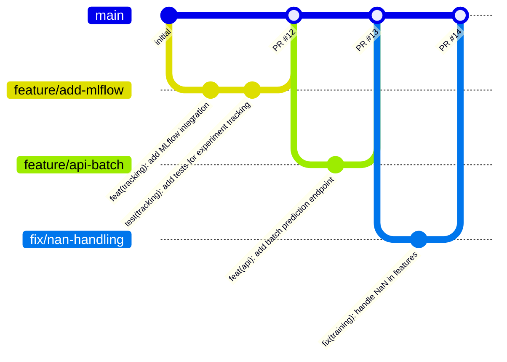

# ════════════════════════════════════════════════════════════════════════════════
# MÓDULO 04: GIT PROFESIONAL
# Más Allá del Commit: Conventional Commits, Hooks y Branching
# Guía MLOps v5.0: Senior Edition | DuqueOM | Noviembre 2025
# ════════════════════════════════════════════════════════════════════════════════

<div align="center">

# 🌿 MÓDULO 04: Git Profesional

### Control de Versiones que Impresiona en Code Review

*"Un historial de Git limpio es la documentación que nunca miente."*

| Duración             | Teoría               | Práctica             |
| :------------------: | :------------------: | :------------------: |
| **4-5 horas**        | 25%                  | 75%                  |

</div>

---

## 🎯 Lo Que Lograrás en Este Módulo

1. **Escribir** commits que cuentan una historia clara
2. **Configurar** pre-commit hooks que previenen errores
3. **Aplicar** estrategias de branching profesionales
4. **Dominar** comandos avanzados (rebase, cherry-pick, bisect)

### 🧩 Cómo se aplica en este portafolio

- El repositorio `ML-MLOps-Portfolio` y los tres proyectos
  (`BankChurn-Predictor`, `CarVision-Market-Intelligence`, `TelecomAI-Customer-Intelligence`)
  ya usan:
  - Historial basado en **Conventional Commits**.
  - Hooks de **pre-commit** configurados en `.pre-commit-config.yaml`.
  - Escaneo de seguridad con **Gitleaks** vía `.gitleaks.toml` y workflows de CI.
- Usa este módulo como guía para entender y ajustar esos flujos en tu propio fork del portafolio
  y para mantener un historial que soporte entrevistas técnicas Senior/Staff.

---

## 4.1 Conventional Commits: El Estándar de Industria

### ¿Por Qué Importa el Formato del Commit?

```
╔═══════════════════════════════════════════════════════════════════════════════╗
║                    ❌ HISTORIAL TÍPICO (CAÓTICO)                              ║
╠═══════════════════════════════════════════════════════════════════════════════╣
║                                                                               ║
║   * fix                                                                       ║
║   * wip                                                                       ║
║   * más cambios                                                               ║
║   * asdfgh                                                                    ║
║   * funcionaaaa                                                               ║
║   * ahora sí                                                                  ║
║   * merge conflict resuelto                                                   ║
║   * updates                                                                   ║
║                                                                               ║
║   PROBLEMAS:                                                                  ║
║   • Imposible saber qué cambió sin leer el código                             ║
║   • No puedes generar changelog automático                                    ║
║   • git bisect es inútil                                                      ║
║   • Code review es un infierno                                                ║
║                                                                               ║
╠═══════════════════════════════════════════════════════════════════════════════╣
║                    ✅ HISTORIAL PROFESIONAL (CONVENTIONAL)                    ║
╠═══════════════════════════════════════════════════════════════════════════════╣
║                                                                               ║
║   * feat(api): add /predict endpoint with batch support                       ║
║   * fix(training): handle NaN values in CreditScore column                    ║
║   * test(pipeline): add integration tests for full pipeline                   ║
║   * docs(readme): update installation instructions                            ║
║   * refactor(config): migrate from dict to Pydantic models                    ║
║   * ci(actions): add caching for pip dependencies                             ║
║   * perf(inference): reduce latency from 150ms to 45ms                        ║
║                                                                               ║
║   BENEFICIOS:                                                                 ║
║   • Changelog generado automáticamente                                        ║
║   • Semantic versioning automático                                            ║
║   • git bisect encuentra bugs rápidamente                                     ║
║   • Code review enfocado                                                      ║
║                                                                               ║
╚═══════════════════════════════════════════════════════════════════════════════╝
```

### Anatomía de un Conventional Commit

```
<type>(<scope>): <description>

[optional body]

[optional footer(s)]
```

### Tipos Permitidos

| Tipo | Cuándo Usar | Ejemplo |
| :--- | :---------- | :------ |
| `feat` | Nueva funcionalidad | `feat(api): add batch prediction endpoint` |
| `fix` | Corrección de bug | `fix(training): handle missing values in Age` |
| `docs` | Solo documentación | `docs(readme): add API usage examples` |
| `style` | Formato (no afecta lógica) | `style: apply ruff formatting` |
| `refactor` | Refactor sin cambio funcional | `refactor(config): use Pydantic BaseSettings` |
| `test` | Añadir o corregir tests | `test(inference): add unit tests for predictor` |
| `perf` | Mejora de performance | `perf(pipeline): cache preprocessor transformations` |
| `ci` | Cambios en CI/CD | `ci(actions): add Python 3.12 to test matrix` |
| `build` | Cambios en build/deps | `build(deps): upgrade scikit-learn to 1.4.0` |
| `chore` | Mantenimiento general | `chore: update .gitignore` |

### Scopes Comunes en MLOps

```
# Por componente
feat(training): ...
feat(inference): ...
feat(api): ...
feat(config): ...
feat(data): ...

# Por capa
feat(model): ...
feat(features): ...
feat(pipeline): ...

# Por herramienta
ci(actions): ...
ci(docker): ...
ci(dvc): ...
```

### Ejemplos Completos

```bash
# Simple
git commit -m "feat(api): add health check endpoint"

# Con body explicativo
git commit -m "fix(training): handle class imbalance in target variable

The training was failing silently when class ratio exceeded 1:10.
Added class_weight='balanced' to RandomForestClassifier.

Fixes #123"

# Breaking change (incrementa MAJOR version)
git commit -m "feat(api)!: change response format to include confidence scores

BREAKING CHANGE: The /predict response now returns an object instead of
a single float. Clients must update to handle the new format:
{\"probability\": 0.85, \"confidence\": 0.92, \"prediction\": \"churn\"}"
```

### Configurar Commitlint (Validación Automática)

```bash
# Instalar commitlint
npm install -g @commitlint/cli @commitlint/config-conventional

# Crear config
cat > commitlint.config.js << 'EOF'
module.exports = {
  extends: ['@commitlint/config-conventional'],
  rules: {
    'scope-enum': [2, 'always', [
      'api', 'training', 'inference', 'config', 'data',
      'pipeline', 'model', 'features', 'tests', 'docs',
      'ci', 'docker', 'dvc', 'deps'
    ]],
    'subject-case': [2, 'always', 'lower-case'],
  }
};
EOF
```

---

## 4.2 Pre-commit Hooks: Prevenir Errores Antes del Commit

### ¿Qué Son los Pre-commit Hooks?

```
╔═══════════════════════════════════════════════════════════════════════════════╗
║                         PRE-COMMIT: EL GUARDIÁN                               ║
╠═══════════════════════════════════════════════════════════════════════════════╣
║                                                                               ║
║                        git commit -m "feat: ..."                              ║
║                                    │                                          ║
║                                    ▼                                          ║
║                    ┌───────────────────────────────┐                          ║
║                    │      PRE-COMMIT HOOKS         │                          ║
║                    │                               │                          ║
║                    │  ✓ Formatear código (ruff)    │                          ║
║                    │  ✓ Lint (ruff check)          │                          ║
║                    │  ✓ Type check (mypy)          │                          ║
║                    │  ✓ Tests rápidos              │                          ║
║                    │  ✓ Validar YAML/JSON          │                          ║
║                    │  ✓ Detectar secretos          │                          ║
║                    │  ✓ Validar commit message     │                          ║
║                    │                               │                          ║
║                    └───────────────────────────────┘                          ║
║                                    │                                          ║
║                         ┌─────────┴─────────┐                                 ║
║                         ▼                   ▼                                 ║
║                    ALL PASS ✅          ANY FAIL ❌                          ║
║                    Commit OK            Commit BLOCKED                        ║
║                                                                               ║
╚═══════════════════════════════════════════════════════════════════════════════╝
```

### Instalación y Setup

```bash
# Instalar pre-commit
pip install pre-commit

# Instalar hooks en el repo
pre-commit install
pre-commit install --hook-type commit-msg  # Para commitlint

# Ejecutar en todos los archivos (primera vez)
pre-commit run --all-files
```

### .pre-commit-config.yaml Completo

```yaml
# .pre-commit-config.yaml
repos:
  # ════════════════════════════════════════════════════════════════════
  # FORMATEO Y LINTING
  # ════════════════════════════════════════════════════════════════════
  - repo: https://github.com/astral-sh/ruff-pre-commit
    rev: v0.1.6
    hooks:
      - id: ruff
        args: [--fix, --exit-non-zero-on-fix]
      - id: ruff-format

  # ════════════════════════════════════════════════════════════════════
  # TYPE CHECKING
  # ════════════════════════════════════════════════════════════════════
  - repo: https://github.com/pre-commit/mirrors-mypy
    rev: v1.7.0
    hooks:
      - id: mypy
        args: [--ignore-missing-imports]
        additional_dependencies:
          - pydantic>=2.0.0
          - types-PyYAML

  # ════════════════════════════════════════════════════════════════════
  # GENERAL
  # ════════════════════════════════════════════════════════════════════
  - repo: https://github.com/pre-commit/pre-commit-hooks
    rev: v4.5.0
    hooks:
      - id: trailing-whitespace
      - id: end-of-file-fixer
      - id: check-yaml
        args: [--unsafe]  # Para YAML con tags como !ref
      - id: check-json
      - id: check-toml
      - id: check-added-large-files
        args: [--maxkb=1000]
      - id: check-merge-conflict
      - id: detect-private-key
      - id: no-commit-to-branch
        args: [--branch, main, --branch, master]

  # ════════════════════════════════════════════════════════════════════
  # SEGURIDAD
  # ════════════════════════════════════════════════════════════════════
  - repo: https://github.com/Yelp/detect-secrets
    rev: v1.4.0
    hooks:
      - id: detect-secrets
        args: [--baseline, .secrets.baseline]

  - repo: https://github.com/PyCQA/bandit
    rev: 1.7.5
    hooks:
      - id: bandit
        args: [-c, pyproject.toml]
        additional_dependencies: ["bandit[toml]"]

  # ════════════════════════════════════════════════════════════════════
  # CONVENTIONAL COMMITS
  # ════════════════════════════════════════════════════════════════════
  - repo: https://github.com/compilerla/conventional-pre-commit
    rev: v3.0.0
    hooks:
      - id: conventional-pre-commit
        stages: [commit-msg]
        args: [feat, fix, docs, style, refactor, test, perf, ci, build, chore]

  # ════════════════════════════════════════════════════════════════════
  # JUPYTER NOTEBOOKS
  # ════════════════════════════════════════════════════════════════════
  - repo: https://github.com/kynan/nbstripout
    rev: 0.6.1
    hooks:
      - id: nbstripout  # Limpia outputs de notebooks

  # ════════════════════════════════════════════════════════════════════
  # DOCKER
  # ════════════════════════════════════════════════════════════════════
  - repo: https://github.com/hadolint/hadolint
    rev: v2.12.0
    hooks:
      - id: hadolint-docker
        args: [--ignore, DL3008, --ignore, DL3013]

# Configuración global
default_language_version:
  python: python3.11

ci:
  autofix_commit_msg: "style: auto-fix by pre-commit hooks"
  autoupdate_commit_msg: "chore: update pre-commit hooks"
```

### pyproject.toml Sección Bandit

```toml
# pyproject.toml
[tool.bandit]
exclude_dirs = ["tests", "scripts"]
skips = ["B101"]  # Skip assert warnings in tests
```

### Comandos Pre-commit Útiles

```bash
# Ejecutar en archivos staged
pre-commit run

# Ejecutar en todos los archivos
pre-commit run --all-files

# Ejecutar hook específico
pre-commit run ruff --all-files
pre-commit run mypy --all-files

# Actualizar hooks a últimas versiones
pre-commit autoupdate

# Skip hooks temporalmente (emergencia)
git commit --no-verify -m "hotfix: emergency fix"
# ⚠️ USAR SOLO EN EMERGENCIAS
```

---

## 4.3 Estrategias de Branching

### Git Flow vs GitHub Flow vs Trunk-Based

```
╔═══════════════════════════════════════════════════════════════════════════════╗
║                         COMPARATIVA DE ESTRATEGIAS                            ║
╠═══════════════════════════════════════════════════════════════════════════════╣
║                                                                               ║
║  GIT FLOW (Complejo, releases programados)                                    ║
║  ─────────────────────────────────────────                                    ║
║  main ──●────────────────────●────────────────●──                             ║
║          \                  / \              /                                ║
║  develop  ●──●──●──●──●──●──●   ●──●──●──●──●                                 ║
║              \     /                  /                                       ║
║  feature      ●──●                   /                                        ║
║                    \                /                                         ║
║  release            ●──●──●────────●                                          ║
║                                                                               ║
║  ✅ Para: Apps con releases programados, equipos grandes                      ║
║  ❌ No para: MLOps (demasiado overhead), startups                             ║
║                                                                               ║
╠═══════════════════════════════════════════════════════════════════════════════╣
║                                                                               ║
║  GITHUB FLOW (Simple, CD continuo) ← RECOMENDADO PARA MLOPS                   ║
║  ───────────────────────────────────────────────────────────                  ║
║  main ──●────●────●────●────●────●────●──                                     ║
║          \  /      \  /      \  /                                             ║
║  feature  ●         ●         ●                                               ║
║           PR       PR        PR                                               ║
║                                                                               ║
║  ✅ Para: MLOps, CI/CD frecuente, equipos pequeños-medianos                   ║
║  ✅ Simple: Solo main + feature branches                                      ║
║                                                                               ║
╠═══════════════════════════════════════════════════════════════════════════════╣
║                                                                               ║
║  TRUNK-BASED (Avanzado, feature flags)                                        ║
║  ─────────────────────────────────────                                        ║
║  main ──●──●──●──●──●──●──●──●──●──●──                                        ║
║         │  │  │  │  │  │  │  │  │                                             ║
║         └──┴──┴──┴──┴──┴──┴──┴──┘                                             ║
║         Commits directos a main (con feature flags)                           ║
║                                                                               ║
║  ✅ Para: Equipos muy maduros, deploys múltiples/día                          ║
║  ❌ No para: Equipos nuevos, sin feature flags robustos                       ║
║                                                                               ║
╚═══════════════════════════════════════════════════════════════════════════════╝
```

### GitHub Flow para MLOps (Recomendado)



### Convenciones de Naming para Branches

```bash
# Features
feature/add-mlflow-tracking
feature/api-batch-prediction
feature/JIRA-123-user-auth

# Fixes
fix/nan-handling
fix/memory-leak-inference
fix/JIRA-456-login-error

# Refactors
refactor/config-pydantic
refactor/training-pipeline

# Experiments (para ML)
experiment/xgboost-vs-rf
experiment/feature-selection

# Releases (si usas Git Flow)
release/1.2.0
hotfix/1.2.1
```

---

## 4.4 Comandos Avanzados que Todo Senior Debe Conocer

### Rebase Interactivo: Limpiar Historial

```bash
# Últimos 3 commits
git rebase -i HEAD~3

# Opciones en el editor:
# pick   = usar commit as-is
# reword = cambiar mensaje
# edit   = pausar para editar
# squash = combinar con anterior
# fixup  = combinar sin mensaje
# drop   = eliminar commit

# Ejemplo: Combinar 3 commits WIP en uno
# pick abc123 feat(api): add endpoint
# squash def456 wip
# squash ghi789 fix typo
# → Se convierten en un solo commit limpio
```

### Cherry-pick: Traer Commits Específicos

```bash
# Traer un commit de otra rama
git cherry-pick abc123

# Traer varios commits
git cherry-pick abc123 def456

# Traer sin commitear (para combinar)
git cherry-pick --no-commit abc123
```

### Bisect: Encontrar el Commit que Rompió Algo

```bash
# Iniciar bisect
git bisect start

# Marcar estado actual como malo
git bisect bad

# Marcar un commit conocido como bueno
git bisect good v1.0.0

# Git te lleva a un commit intermedio
# Testear y marcar:
git bisect good  # Si funciona
git bisect bad   # Si está roto

# Repetir hasta encontrar el commit culpable
# Al final:
git bisect reset
```

### Stash: Guardar Cambios Temporalmente

```bash
# Guardar cambios actuales
git stash

# Con mensaje descriptivo
git stash push -m "WIP: refactoring config"

# Listar stashes
git stash list

# Aplicar último stash
git stash pop

# Aplicar stash específico
git stash apply stash@{2}

# Crear branch desde stash
git stash branch feature/from-stash
```

### Reflog: Recuperar lo "Perdido"

```bash
# Ver historial de operaciones
git reflog

# Recuperar commit "perdido" después de reset
git reflog
# abc123 HEAD@{3}: commit: feat: important change
git checkout abc123
# o
git reset --hard abc123
```

---

## 4.5 .gitignore Profesional para MLOps

```gitignore
# .gitignore para proyectos MLOps

# ════════════════════════════════════════════════════════════════════
# PYTHON
# ════════════════════════════════════════════════════════════════════
__pycache__/
*.py[cod]
*$py.class
*.so
.Python
build/
develop-eggs/
dist/
downloads/
eggs/
.eggs/
lib/
lib64/
parts/
sdist/
var/
wheels/
*.egg-info/
.installed.cfg
*.egg

# ════════════════════════════════════════════════════════════════════
# ENTORNOS VIRTUALES
# ════════════════════════════════════════════════════════════════════
.venv/
venv/
ENV/
env/
.conda/

# ════════════════════════════════════════════════════════════════════
# IDEs
# ════════════════════════════════════════════════════════════════════
.idea/
.vscode/
*.swp
*.swo
*~
.spyderproject
.spyproject

# ════════════════════════════════════════════════════════════════════
# JUPYTER NOTEBOOKS
# ════════════════════════════════════════════════════════════════════
.ipynb_checkpoints/
*.ipynb_checkpoints/

# ════════════════════════════════════════════════════════════════════
# DATOS Y MODELOS (gestionados por DVC)
# ════════════════════════════════════════════════════════════════════
data/raw/*
data/processed/*
models/*.pkl
models/*.joblib
!data/raw/.gitkeep
!data/processed/.gitkeep
!models/.gitkeep

# DVC
/data/*.csv
/data/*.parquet

# ════════════════════════════════════════════════════════════════════
# MLFLOW
# ════════════════════════════════════════════════════════════════════
mlruns/
mlartifacts/

# ════════════════════════════════════════════════════════════════════
# SECRETOS Y CONFIGURACIÓN LOCAL
# ════════════════════════════════════════════════════════════════════
.env
.env.*
!.env.example
*.pem
*.key
secrets/
credentials/

# ════════════════════════════════════════════════════════════════════
# TESTING Y COVERAGE
# ════════════════════════════════════════════════════════════════════
.coverage
.pytest_cache/
htmlcov/
.tox/
.nox/
coverage.xml
*.cover
.hypothesis/

# ════════════════════════════════════════════════════════════════════
# BUILDS Y DOCS
# ════════════════════════════════════════════════════════════════════
site/
docs/_build/
*.log

# ════════════════════════════════════════════════════════════════════
# OS
# ════════════════════════════════════════════════════════════════════
.DS_Store
Thumbs.db
```

---

## 4.6 Ejercicio Integrador: Setup Completo de Git

### Paso 1: Configurar Git Global

```bash
# Identidad
git config --global user.name "Tu Nombre"
git config --global user.email "tu@email.com"

# Editor (VS Code)
git config --global core.editor "code --wait"

# Alias útiles
git config --global alias.st "status -sb"
git config --global alias.co "checkout"
git config --global alias.br "branch"
git config --global alias.cm "commit -m"
git config --global alias.lg "log --oneline --graph --all"
git config --global alias.last "log -1 HEAD --stat"
git config --global alias.unstage "reset HEAD --"

# Auto-setup remote tracking
git config --global push.autoSetupRemote true

# Default branch
git config --global init.defaultBranch main
```

### Paso 2: Inicializar Proyecto

```bash
# Crear repo
mkdir bankchurn-predictor && cd bankchurn-predictor
git init

# Crear estructura
mkdir -p src/bankchurn/{data,models,utils} tests/{unit,integration} configs docs

# Archivos base
touch src/bankchurn/__init__.py
touch .gitignore .pre-commit-config.yaml pyproject.toml README.md

# Primer commit
git add .
git commit -m "chore: initial project structure"
```

### Paso 3: Configurar Pre-commit

```bash
# Instalar
pip install pre-commit

# Copiar el .pre-commit-config.yaml de la sección 4.2

# Instalar hooks
pre-commit install
pre-commit install --hook-type commit-msg

# Ejecutar en todos los archivos
pre-commit run --all-files
```

### Paso 4: Crear Feature Branch y PR

```bash
# Crear branch
git checkout -b feature/add-config

# Hacer cambios...
# Commit con conventional commits
git commit -m "feat(config): add Pydantic configuration models"

# Push
git push -u origin feature/add-config

# Crear PR en GitHub
# (usar template de PR si existe)
```

### Checklist de Verificación

```
CONFIGURACIÓN:
[ ] Git configurado con nombre y email
[ ] Alias útiles configurados
[ ] Default branch es main

PRE-COMMIT:
[ ] pre-commit instalado
[ ] Hooks activos (commit + commit-msg)
[ ] Todos los hooks pasan en --all-files

 FLUJO:
 [ ] Puedo crear feature branches correctamente
 [ ] Commits siguen Conventional Commits
 [ ] .gitignore excluye archivos correctos
 ```

 ---

## 🧨 Errores habituales y cómo depurarlos en Git

Git aquí no es solo “guardar versiones”, sino soportar **flujos de trabajo profesionales** con branches, hooks y CI. Estos son los errores más frecuentes en el portafolio y cómo atacarlos.

### 1) Commits que rompen el formato (Conventional Commits / commitlint / pre-commit)

**Síntomas típicos**

- `git commit` falla con mensajes como:
  ```text
  ⧗   input: fix: arreglos varios
  ✖   subject may not be empty [subject-empty]
  ✖   type must be one of [feat, fix, docs, style, ...]
  ```
- Hooks de `conventional-pre-commit` o `commitlint` bloquean el commit.

**Cómo identificarlo**

- Mira el mensaje de error completo del hook (no solo la última línea).
- Abre `commitlint.config.js` o `.pre-commit-config.yaml` y revisa:
  - Tipos permitidos (`feat`, `fix`, `docs`, etc.).
  - Scopes permitidos, si hay regla `scope-enum`.

**Cómo corregirlo**

- Ajusta tu mensaje al formato:
  ```bash
  git commit -m "feat(api): add /predict endpoint"
  git commit -m "fix(training): handle NaN in CreditScore"
  ```
- Si necesitas un scope nuevo (ej. `monitoring`), añádelo explícitamente a la regla de `scope-enum` y commitea ese cambio primero.

---

### 2) Hooks de pre-commit que “rompen todo” o tardan demasiado

**Síntomas típicos**

- Hacer `git commit` tarda mucho porque corre todos los tests y linters siempre.
- No entiendes qué hook falla; solo ves “pre-commit failed”.

**Cómo identificarlo**

- Ejecuta manualmente:
  ```bash
  pre-commit run --all-files
  ```
  y revisa qué hook está fallando (ruff, mypy, bandit, etc.).
- Abre `.pre-commit-config.yaml` y verifica qué rutas cubre cada hook.

**Cómo corregirlo**

- Para hooks muy pesados (tests completos, mypy en todo el repo):
  - Limita los paths relevantes (`files:` o `types:`) o muévelos a CI.
- Usa `pre-commit autoupdate` si un hook da errores por versiones muy viejas.
- Solo en emergencias, puedes hacer `git commit --no-verify`, pero documenta el motivo y arregla los hooks después.

---

### 3) Ramas desincronizadas y merges sucios

**Síntomas típicos**

- `git push` falla con `non-fast-forward`.
- Merge commits llenos de conflictos y mensajes genéricos.

**Cómo identificarlo**

- Revisa el historial con:
  ```bash
  git log --oneline --graph --all
  ```
  y mira si tu rama feature está muy alejada de `main`.

**Cómo corregirlo**

- Mantén tu feature branch fresca:
  ```bash
  git checkout feature/mi-feature
  git fetch origin
  git rebase origin/main
  ```
- Si el equipo prefiere `merge` sobre `rebase`, al menos haz `git pull --rebase` para evitar merges de “merge commits vacíos”.
- Usa PRs pequeños y frecuentes en lugar de ramas gigantes de semanas.

---

### 4) Archivos enormes, datos o secretos en el historial

**Síntomas típicos**

- El repo pesa cientos de MB; `git clone` es lento.
- `detect-secrets` o `gitleaks` encuentran claves/API keys en el historial.

**Cómo identificarlo**

- Ejecuta:
  ```bash
  git lfs track
  git rev-list --objects --all | sort -k 2 | tail -n 20
  ```
  para ver los blobs más grandes.
- Corre los hooks de seguridad (`detect-secrets`, `gitleaks`) y revisa sus reportes.

**Cómo corregirlo**

- Añade en `.gitignore` lo que no deba ir a Git (`data/`, `artifacts/`, `mlruns/`, etc.).
- Para secretos ya commiteados:
  - Rota la credencial en el proveedor (AWS, GCP, etc.).
  - Usa herramientas como `git filter-repo` para limpiar el historial (mencionado solo como referencia; normalmente se hace una vez y con cuidado).

---

### 5) Patrón de debugging de Git en el portafolio

1. **Inspecciona el historial** con `git log --oneline --graph --all`.
2. **Verifica configuración local** (`git config --list --show-origin`).
3. **Reproduce el problema** (hook que falla, merge conflict, etc.) y lee el mensaje completo.
4. **Conecta el problema** con el concepto del módulo:
   - Formato de commits → Conventional Commits + commitlint.
   - Calidad del código → hooks de pre-commit.
   - Flujo de ramas → GitHub Flow (main + feature branches).
5. **Aplica el patrón de solución** que ya tienes documentado en este módulo.

Con este enfoque, Git deja de ser “magia negra” y se convierte en una herramienta predecible y aliada de tu flujo MLOps.

---

## 4.7 Autoevaluación

### Preguntas de Reflexión

1. ¿Por qué Conventional Commits permite generar changelogs automáticamente?
2. ¿Cuál es la diferencia entre `git rebase` y `git merge`?
3. ¿Cuándo usarías `git stash` vs crear un branch?
4. ¿Por qué `no-commit-to-branch` es un hook útil?

### Comandos que Debes Dominar

```bash
# Básicos
git status, add, commit, push, pull

# Branching
git branch, checkout -b, merge

# Historial
git log --oneline --graph, diff, show

# Avanzados
git rebase -i, cherry-pick, bisect, stash, reflog

# Pre-commit
pre-commit run, --all-files, autoupdate
```

---

## 📦 Cómo se Usó en el Portafolio

El portafolio implementa todas las prácticas de Git profesional descritas:

### .pre-commit-config.yaml Real

```yaml
# ML-MLOps-Portfolio/.pre-commit-config.yaml (extracto)
repos:
  - repo: https://github.com/pre-commit/pre-commit-hooks
    rev: v4.5.0
    hooks:
      - id: trailing-whitespace
      - id: end-of-file-fixer
      - id: check-yaml
      - id: check-added-large-files
        args: ['--maxkb=5000']

  - repo: https://github.com/astral-sh/ruff-pre-commit
    rev: v0.1.9
    hooks:
      - id: ruff
        args: [--fix]
      - id: ruff-format

  - repo: https://github.com/gitleaks/gitleaks
    rev: v8.18.1
    hooks:
      - id: gitleaks
```

### Conventional Commits del Portafolio

Ejemplos de commits reales en el historial:

```bash
# Ejemplos del historial real del portafolio
feat(bankchurn): add unified sklearn pipeline
fix(carvision): prevent data leakage in FeatureEngineer
docs(guia): add module 11 Testing ML
test(telecomai): increase coverage to 97%
ci(actions): add matrix testing for Python 3.10/3.11
refactor(config): migrate to Pydantic v2
```

### Branching Strategy

El portafolio usa **GitHub Flow** simplificado:

```
main ────────────────────────────────────────────────►
       │                    │
       └── feature/xyz ─────┘ (PR + CI verde + merge)
```

### 🔧 Ejercicio: Configura Pre-commit

```bash
# 1. Ve a la raíz del portafolio
cd ML-MLOps-Portfolio

# 2. Instala pre-commit
pip install pre-commit

# 3. Instala los hooks
pre-commit install

# 4. Ejecuta en todos los archivos
pre-commit run --all-files

# 5. Haz un commit y verifica que los hooks se ejecutan
echo "# test" >> test.md
git add test.md
git commit -m "test: verify pre-commit hooks"  # Los hooks se ejecutan aquí
git reset --soft HEAD~1  # Deshaz el commit de prueba
rm test.md
```

---

## 💼 Consejos Profesionales

> **Recomendaciones para destacar en entrevistas y proyectos reales**

### Para Entrevistas

1. **Conventional Commits**: Explica por qué `feat:`, `fix:`, `docs:` facilitan changelogs automáticos.

2. **Git Flow vs Trunk-Based**: Conoce ambos y cuándo usar cada uno.

3. **Rebase vs Merge**: Pregunta clásica. Respuesta: rebase para historia limpia, merge para preservar contexto.

### Para Proyectos Reales

| Situación | Consejo |
|-----------|---------|
| Commits grandes | Divide en commits atómicos con `git add -p` |
| Historia sucia | Usa `git rebase -i` antes de PR |
| Secretos en repo | Usa git-secrets o gitleaks en pre-commit |
| Colaboración | PRs pequeños (< 400 líneas) se revisan mejor |

### Comandos que Debes Dominar

```bash
git stash push -m "descripción"  # Guardar trabajo temporal
git bisect start                 # Encontrar commit que introdujo bug
git reflog                       # Recuperar commits "perdidos"
git cherry-pick <commit>         # Aplicar commit específico
```


---

## 📺 Recursos Externos Recomendados

> Ver [RECURSOS_POR_MODULO.md](RECURSOS_POR_MODULO.md) para la lista completa.

| 🏷️ | Recurso | Tipo |
|:--:|:--------|:-----|
| 🔴 | [Git for Professionals - freeCodeCamp](https://www.youtube.com/watch?v=Uszj_k0DGsg) | Video |
| 🟡 | [Conventional Commits](https://www.conventionalcommits.org/) | Docs |

---

## 🔗 Referencias del Glosario

Ver [21_GLOSARIO.md](21_GLOSARIO.md) para definiciones de:
- **pre-commit**: Hooks de validación antes de commit
- **Conventional Commits**: Formato estándar de mensajes
- **GitHub Flow**: Workflow de branching

---

## ✅ Ejercicios

Ver [EJERCICIOS.md](EJERCICIOS.md) - Módulo 05:
- **5.1**: Configurar .gitignore profesional
- **5.2**: Instalar pre-commit hooks

---

## 🔜 Siguiente Paso

Con Git dominado, es hora de versionar **datos** profesionalmente.

**[Ir a Módulo 06: Versionado de Datos →](06_VERSIONADO_DATOS.md)**

---

<div align="center">

[← Entornos](04_ENTORNOS.md) | [Siguiente: Versionado de Datos →](06_VERSIONADO_DATOS.md)

</div>
