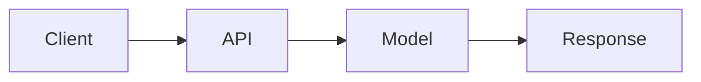

# ════════════════════════════════════════════════════════════════════════════════
# MÓDULO 16: DOCUMENTACIÓN Y ÉTICA
# MkDocs, Model Cards y Responsible AI
# Guía MLOps v5.0: Senior Edition | DuqueOM | Noviembre 2025
# ════════════════════════════════════════════════════════════════════════════════

<div align="center">

# 📚 MÓDULO 16: Documentación y Ética

### Tu Trabajo No Existe Si No Está Documentado

*"La documentación es el regalo que le haces a tu yo del futuro."*

| Duración             | Teoría               | Práctica             |
| :------------------: | :------------------: | :------------------: |
| **4-5 horas**        | 30%                  | 70%                  |

</div>

---

## 🎯 Lo Que Lograrás

1. **Crear** documentación técnica con MkDocs
2. **Escribir** Model Cards profesionales
3. **Implementar** prácticas de Responsible AI
4. **Publicar** docs en GitHub Pages

---

## 16.1 MkDocs con Material Theme

### Estructura de Docs

```
docs/
├── index.md                # Home
├── getting-started/
│   ├── installation.md
│   ├── quickstart.md
│   └── configuration.md
├── architecture/
│   ├── overview.md
│   ├── data-flow.md
│   └── decisions.md
├── api/
│   ├── endpoints.md
│   └── schemas.md
├── development/
│   ├── contributing.md
│   └── testing.md
└── model/
    └── model-card.md

mkdocs.yml                  # Configuración
```

### mkdocs.yml

```yaml
site_name: BankChurn Predictor
site_description: API para predicción de churn bancario
site_author: Tu Nombre
site_url: https://username.github.io/bankchurn

theme:
  name: material
  language: es
  palette:
    - scheme: default
      primary: indigo
      accent: indigo
      toggle:
        icon: material/brightness-7
        name: Cambiar a modo oscuro
    - scheme: slate
      primary: indigo
      accent: indigo
      toggle:
        icon: material/brightness-4
        name: Cambiar a modo claro
  features:
    - navigation.tabs
    - navigation.sections
    - navigation.expand
    - search.suggest
    - content.code.copy
    - content.tabs.link

nav:
  - Home: index.md
  - Getting Started:
    - Instalación: getting-started/installation.md
    - Quick Start: getting-started/quickstart.md
    - Configuración: getting-started/configuration.md
  - Arquitectura:
    - Overview: architecture/overview.md
    - Flujo de Datos: architecture/data-flow.md
    - Decisiones: architecture/decisions.md
  - API Reference:
    - Endpoints: api/endpoints.md
    - Schemas: api/schemas.md
  - Desarrollo:
    - Contribuir: development/contributing.md
    - Testing: development/testing.md
  - Model Card: model/model-card.md

markdown_extensions:
  - pymdownx.highlight:
      anchor_linenums: true
  - pymdownx.superfences:
      custom_fences:
        - name: mermaid
          class: mermaid
          format: !!python/name:pymdownx.superfences.fence_code_format
  - pymdownx.tabbed:
      alternate_style: true
  - admonition
  - pymdownx.details
  - attr_list
  - md_in_html
  - tables

plugins:
  - search
  - mkdocstrings:
      handlers:
        python:
          options:
            show_source: true

extra:
  social:
    - icon: fontawesome/brands/github
      link: https://github.com/username/bankchurn
```

### Comandos MkDocs

```bash
# Instalar
pip install mkdocs mkdocs-material mkdocstrings[python]

# Desarrollo local
mkdocs serve

# Build
mkdocs build

# Deploy a GitHub Pages
mkdocs gh-deploy
```

---

## 16.2 Model Card Profesional

```markdown
# Model Card: BankChurn Predictor

## Información del Modelo

| Campo | Valor |
|-------|-------|
| **Nombre** | BankChurn Predictor |
| **Versión** | 1.2.3 |
| **Tipo** | Clasificación Binaria |
| **Framework** | Scikit-learn 1.3.0 |
| **Fecha de Entrenamiento** | 2024-01-15 |
| **Autor** | Tu Nombre |

## Propósito

### Uso Previsto
- **Caso de uso principal**: Identificar clientes con alta probabilidad de abandonar el banco
- **Usuarios objetivo**: Equipo de Retención de Clientes
- **Decisiones habilitadas**: Campañas de retención personalizadas

### Uso No Previsto
- ❌ No usar para decisiones crediticias
- ❌ No usar como único criterio para cancelar servicios
- ❌ No usar en mercados fuera de Europa (entrenado solo con datos de FR/DE/ES)

## Datos de Entrenamiento

### Dataset
- **Fuente**: Sistema CRM interno
- **Período**: 2022-01-01 a 2023-12-31
- **Tamaño**: 10,000 registros
- **Split**: 80% train, 20% test (estratificado)

### Features
| Feature | Tipo | Descripción |
|---------|------|-------------|
| CreditScore | Numérica | Score crediticio (300-850) |
| Age | Numérica | Edad del cliente |
| Geography | Categórica | País (France, Germany, Spain) |
| ... | ... | ... |

### Distribución del Target
- **Churn (1)**: 20%
- **No Churn (0)**: 80%
- **Estrategia**: class_weight='balanced'

## Métricas de Performance

### Métricas Globales
| Métrica | Train | Test | Threshold |
|---------|-------|------|-----------|
| AUC-ROC | 0.89 | 0.87 | > 0.85 ✅ |
| Precision | 0.72 | 0.68 | > 0.60 ✅ |
| Recall | 0.78 | 0.74 | > 0.70 ✅ |
| F1 | 0.75 | 0.71 | > 0.65 ✅ |

### Métricas por Subgrupo (Fairness)
| Subgrupo | AUC-ROC | Precision | Recall |
|----------|---------|-----------|--------|
| Gender: Male | 0.86 | 0.67 | 0.73 |
| Gender: Female | 0.88 | 0.69 | 0.75 |
| Geography: France | 0.87 | 0.68 | 0.74 |
| Geography: Germany | 0.85 | 0.66 | 0.72 |
| Geography: Spain | 0.88 | 0.70 | 0.76 |

**Nota**: La diferencia máxima de AUC entre subgrupos es 0.03 (< 0.05 threshold).

## Limitaciones

### Limitaciones Conocidas
1. **Temporal**: Modelo entrenado con datos hasta 2023. Puede degradarse con cambios económicos.
2. **Geográfico**: Solo válido para Francia, Alemania y España.
3. **Demográfico**: Menos preciso para clientes < 25 años (pocos datos).

### Cuándo NO Usar
- Datos con > 30% de valores faltantes
- Clientes corporativos (solo entrenado con personas físicas)
- Períodos de crisis económica (cambio de distribución)

## Consideraciones Éticas

### Fairness
- Se monitorean métricas por género y geografía
- Diferencias de performance < 5% entre grupos
- No se usan features protegidas directamente (pero Geography correlaciona con cultura)

### Privacidad
- Datos pseudonimizados (no PII en features)
- Cumple con GDPR (Art. 22 - derecho a explicación)
- Retención de datos: 24 meses

### Transparencia
- SHAP values disponibles para explicabilidad
- Documentación de limitaciones pública
- Proceso de feedback habilitado

## Mantenimiento

### Monitoreo
- Data drift monitoreado diariamente (Evidently)
- Alerta si drift > 10%
- Performance evaluada mensualmente con ground truth

### Retraining
- **Frecuencia**: Trimestral o si drift detectado
- **Proceso**: Automatizado vía GitHub Actions
- **Aprobación**: Requiere validación de Data Science Lead

## Historial de Versiones

| Versión | Fecha | Cambios | AUC |
|---------|-------|---------|-----|
| 1.0.0 | 2023-06-01 | Versión inicial | 0.82 |
| 1.1.0 | 2023-09-01 | Feature engineering | 0.85 |
| 1.2.0 | 2024-01-01 | Retraining con datos 2023 | 0.87 |
| 1.2.3 | 2024-01-15 | Fix en preprocessing | 0.87 |

## Contacto

- **Responsable**: tu.email@company.com
- **Equipo**: ML Platform Team
- **Escalación**: data-ethics@company.com
```

---

## 16.3 Responsible AI Checklist

```
╔═══════════════════════════════════════════════════════════════════════════════╗
║                    CHECKLIST DE RESPONSIBLE AI                                ║
╠═══════════════════════════════════════════════════════════════════════════════╣
║                                                                               ║
║   FAIRNESS:                                                                   ║
║   [ ] Métricas calculadas por subgrupos demográficos                          ║
║   [ ] Diferencias de performance < 5% entre grupos                            ║
║   [ ] Features sensibles identificadas y documentadas                         ║
║   [ ] Estrategia de mitigación si hay sesgo                                   ║
║                                                                               ║
║   TRANSPARENCIA:                                                              ║
║   [ ] Model Card completo y público                                           ║
║   [ ] Explicabilidad disponible (SHAP/LIME)                                   ║
║   [ ] Limitaciones claramente documentadas                                    ║
║   [ ] Usuarios saben que interactúan con ML                                   ║
║                                                                               ║
║   PRIVACIDAD:                                                                 ║
║   [ ] No PII en features                                                      ║
║   [ ] Cumplimiento GDPR/CCPA documentado                                      ║
║   [ ] Política de retención de datos                                          ║
║   [ ] Proceso de eliminación de datos                                         ║
║                                                                               ║
║   ACCOUNTABILITY:                                                             ║
║   [ ] Responsable del modelo identificado                                     ║
║   [ ] Proceso de escalación definido                                          ║
║   [ ] Auditoría periódica programada                                          ║
║   [ ] Canal de feedback para usuarios                                         ║
║                                                                               ║
╚═══════════════════════════════════════════════════════════════════════════════╝
```

---

## 16.4 README Profesional

```markdown
# 🏦 BankChurn Predictor

[](https://github.com/username/bankchurn/actions)
[](https://codecov.io/gh/username/bankchurn)
[](LICENSE)
[](https://python.org)

> API para predicción de churn bancario con MLOps completo.

## 🚀 Quick Start

```bash
# Clonar
git clone https://github.com/username/bankchurn.git
cd bankchurn

# Instalar
pip install -e ".[dev]"

# Ejecutar tests
pytest

# Iniciar API
uvicorn app.main:app --reload
```

## 📖 Documentation

- [Documentación Completa](https://username.github.io/bankchurn)
- [API Reference](https://username.github.io/bankchurn/api/endpoints)
- [Model Card](https://username.github.io/bankchurn/model/model-card)

## 🏗️ Architecture



## 📊 Metrics

| Metric | Value |
|--------|-------|
| AUC-ROC | 0.87 |
| Latency P99 | 45ms |
| Coverage | 85% |

## 📜 License

MIT © Tu Nombre
```

---

## 16.5 Ejercicio: Crea Tu Documentación

### Checklist

```
MKDOCS:
[ ] mkdocs.yml configurado
[ ] Home page con overview
[ ] Getting started completo
[ ] API documentada

MODEL CARD:
[ ] Información del modelo
[ ] Datos de entrenamiento
[ ] Métricas de performance
[ ] Limitaciones y ética

README:
[ ] Badges de CI/Coverage
[ ] Quick Start
[ ] Links a docs
[ ] Arquitectura visual
```

---

## 🔜 Siguiente Paso

Con documentación lista, es hora del **Proyecto Integrador**.

**[Ir a Módulo 17: Proyecto Integrador →](17_PROYECTO_INTEGRADOR.md)**

---

<div align="center">

*Módulo 16 completado. Tu trabajo ahora está documentado profesionalmente.*

*© 2025 DuqueOM - Guía MLOps v5.0: Senior Edition*

</div>
