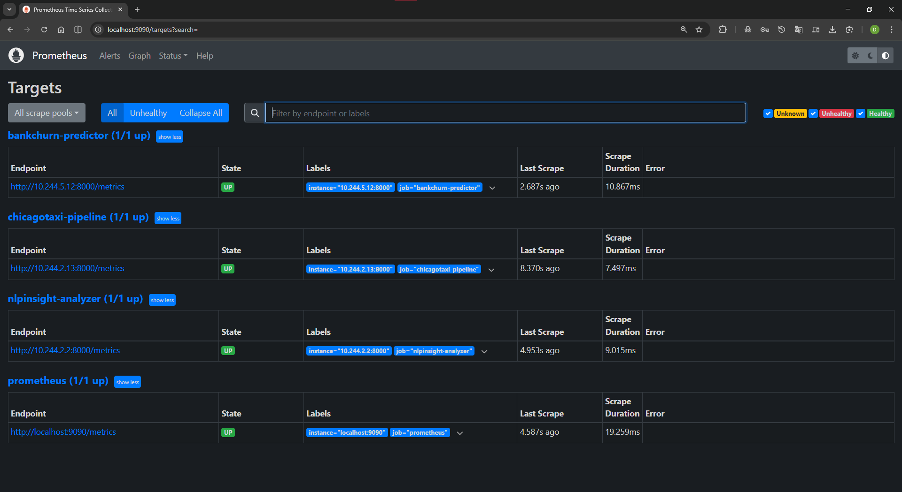

# ML/MLOps Portfolio — Production-Ready

<div style="text-align: center; margin-bottom: 1em;">
<strong>3 ML Models &bull; Multi-Cloud (GKE + EKS) &bull; CI/CD &bull; Prometheus + Grafana + MLflow</strong>
</div>

[](https://github.com/DuqueOM/ML-MLOps-Portfolio/actions/workflows/ci-mlops.yml)
[](https://codecov.io/gh/DuqueOM/ML-MLOps-Portfolio)
[](https://python.org)
[](https://kubernetes.io)
[](https://terraform.io)

[](https://github.com/DuqueOM/ML-MLOps-Portfolio)
[](https://youtu.be/7dFFqq2ROPw)

---

## Multi-Cloud: GKE vs EKS — Live


*Same 6 services running on GCP (GKE, us-central1) and AWS (EKS, us-east-1) — multi-cloud deployed and verified.*

---

## ML Projects

| Project | Algorithm | Metric | Coverage | Latency p50 (GCP / AWS) |
|---------|-----------|--------|:--------:|:---------:|
| **[BankChurn](projects/bankchurn.md)** | StackingClassifier (RF+GB+XGB+LGB→LR) + SHAP | AUC **0.87** | 90% | 200ms / 110ms |
| **[NLPInsight](projects/nlpinsight.md)** | TF-IDF + LogReg (dual-backend) | Acc **80.6%** | 98% | 78ms / 100ms |
| **[ChicagoTaxi](projects/chicagotaxi.md)** | PySpark ETL (6.3M rows) + LightGBM | R² **0.96** | 91% | 100ms / 120ms |

> **395+ tests** across all projects, **0 failures**, **85% CI threshold enforced**.


*End-to-end: API predictions with SHAP explainability, sentiment analysis, and demand forecasting.*

---

## Production Infrastructure

| Component | GCP (GKE) | AWS (EKS) |
|-----------|-----------|-----------|
| **Cluster** | GKE 1 node baseline, auto-scales to 5 (e2-medium, `us-central1`) | EKS 1 node baseline, auto-scales to 5 (t3.small, `us-east-1`) |
| **Pods** | 6 Running, 0 restarts | 6 Running, 0 restarts |
| **Ingress** | nginx + static IP (`136.111.152.72`) | nginx + NLB (AWS Load Balancer Controller) |
| **Registry** | Artifact Registry | ECR (3 repos) |
| **Storage** | GCS (versioned) | S3 (encrypted, versioned) |
| **IAM** | Workload Identity | IRSA |
| **Drift Detection** | CronJob (daily 06:00 UTC) | CronJob (daily 06:00 UTC) |
| **Load Test** | 0% errors, p95 190ms | 0% errors, p95 450ms |

| GKE Workloads (6 pods) | EKS Cluster Active |
|:---:|:---:|
|  |  |

---

## Observability Stack

| Grafana ML Dashboard | Prometheus Targets (UP) | MLflow Experiments |
|:---:|:---:|:---:|
|  |  |  |

- **Prometheus**: 16 targets UP, 16 alert rules, 15s scrape interval
- **Grafana**: 2 dashboards, 26 panels (latency, throughput, predictions, errors, resources)
- **MLflow**: 9 experiments tracked across 3 projects

---

## CI/CD Pipeline

| GitHub Actions (10 jobs) | Deploy Workflows (GCP + AWS) | Codecov Dashboard |
|:---:|:---:|:---:|
|  |  |  |

- **CI**: tests (matrix) → security (Gitleaks, Bandit) → Docker build (Trivy) → integration tests
- **CD**: `deploy-gcp.yml` + `deploy-aws.yml` — automated multi-cloud deployment
- **Coverage**: 90–98% enforced at 85% threshold via Codecov

---

## Infrastructure as Code

| Terraform Multi-Cloud | K8s Overlays (GCP vs AWS) | Infra Tests |
|:---:|:---:|:---:|
|  |  |  |

- **Terraform**: GCP + AWS modules, remote state, `terraform plan` = no drift
- **Kustomize**: Shared base manifests + cloud-specific overlays
- **Testing**: `tfsec` + `checkov` + `conftest` (OPA) + `kube-linter` — 9/9 GCP, 8/8 AWS

---

## API Evidence

| BankChurn (SHAP) | NLPInsight (Sentiment) | ChicagoTaxi (Demand) |
|:---:|:---:|:---:|
|  |  |  |

All services expose FastAPI with Swagger UI, Prometheus `/metrics`, and structured health checks.

---

## Security & Automation

| Feature | Status |
|---------|--------|
| **Pod Security Standards** | `enforce=baseline`, `warn=restricted` |
| **Network Policies** | default-deny + 3 allow rules |
| **Pod Disruption Budgets** | `minAvailable=1` (3 ML services) |
| **Drift Detection** | Daily CronJob on both clouds |
| **Retraining Trigger** | Automated CronJob → GitHub Actions dispatch |
| **Scanning** | Gitleaks + Bandit + Trivy + pip-audit (blocking on HIGH) |
| **Non-root** | All containers run as UID 1000 |

---

## HPA Auto-Scaling


*CPU-based HPA: 1→3 replicas under load, automatic scale-down after traffic subsides.*

| Service | CPU Target | Pods | Memory |
|---------|-----------|------|--------|
| BankChurn | 50% | 1–5 | ~396Mi |
| NLPInsight | 60% | 1–3 | ~283Mi |
| ChicagoTaxi | 60% | 1–3 | ~288Mi |

---

## Responsible AI


- **Fairness Audits**: Disparate impact ratio + equal opportunity (BankChurn by Gender/Geography)
- **Drift Detection**: KS + PSI + Evidently per feature, automated alerting
- **Data Validation**: Pandera schemas for all projects (training + inference)
- **Adversarial Testing**: 43 robustness tests (SQL injection, XSS, boundary, Unicode)

---

## Technology Stack

| Layer | Technologies |
|-------|-------------|
| **ML/DS** | scikit-learn 1.8.0, XGBoost, LightGBM, PySpark, Dask, SHAP, Optuna |
| **API** | FastAPI, Pydantic, uvicorn (1 worker per pod — [ADR-014](architecture/decisions.md)) |
| **MLOps** | MLflow, DVC, Evidently AI, OpenTelemetry |
| **Cloud** | GCP (GKE, GCS, AR, Cloud SQL), AWS (EKS, S3, ECR) |
| **IaC** | Terraform (GCP + AWS), Kustomize overlays |
| **Monitoring** | Prometheus, Grafana (25 panels), 16 alert rules |
| **CI/CD** | GitHub Actions (CI + deploy-gcp + deploy-aws), Codecov |
| **Security** | Gitleaks, Bandit, Trivy, pip-audit, Network Policies, PDBs |
| **Testing** | pytest (395+ tests, 90–98%), Locust load testing |
| **Managed ML** | AWS SageMaker + GCP Vertex AI (BankChurn) — [Guide](MANAGED_ML_GUIDE.md) |

---

## Quick Start

```bash
git clone https://github.com/DuqueOM/ML-MLOps-Portfolio.git
cd ML-MLOps-Portfolio
bash scripts/setup_demo_models.sh
docker compose -f docker-compose.demo.yml up -d --build
```

| Service | URL |
|---------|-----|
| BankChurn API | [localhost:8001/docs](http://localhost:8001/docs) |
| NLPInsight API | [localhost:8003/docs](http://localhost:8003/docs) |
| ChicagoTaxi API | [localhost:8004/docs](http://localhost:8004/docs) |
| MLflow UI | [localhost:5000](http://localhost:5000) |

---

<div style="text-align: center;">

**Built by [Duque Ortega Mutis](https://github.com/DuqueOM)** | [LinkedIn](https://linkedin.com/in/duqueom) | [Video Demo](https://youtu.be/7dFFqq2ROPw)

*Portfolio v3.6.0 — April 2026 — Deployed on GCP (GKE) + AWS (EKS)*

</div>
