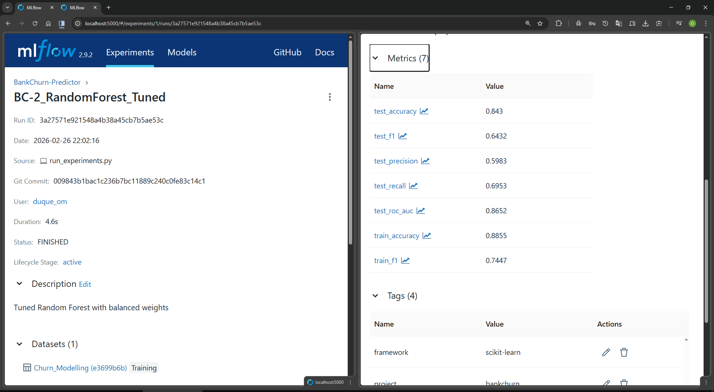

# 📚 Model Catalog

**Production Model Registry** — All models tracked via MLflow for full reproducibility

---

## 📊 Overview

| Project | Model ID | Algorithm | Version | Status | Primary Metric | Coverage | Last Updated |
|---------|----------|-----------|---------|--------|----------------|----------|--------|
| **BankChurn** | `bankchurn-voting-v2.0.0` | VotingClassifier (LR + RF) | 2.0.0 | ✅ Production | AUC-ROC: 0.86 | 88% | March 2026 |
| **CarVision** | `carvision-xgb-v2.0.0` | XGBRegressor + FeatureEngineer | 2.0.0 | ✅ Production | R²: 0.82 | 95% | March 2026 |
| **NLPInsight** | `nlpinsight-tfidf-v2.0.0` | TF-IDF + LogisticRegression | 2.0.0 | ✅ Production | Accuracy: 88% | 76% | March 2026 |

---

## 🏦 BankChurn Predictor

### Production Model

| Attribute | Value |
|-----------|-------|
| **Model ID** | `bankchurn-voting-v2.0.0` |
| **Model Name** | BankChurn Customer Churn Classifier |
| **Version** | 2.0.0 |
| **Algorithm** | VotingClassifier (Logistic Regression + RandomForest) |
| **Framework** | Scikit-learn 1.8.0, Python 3.11.14 |
| **Status** | ✅ **Production** |
| **Artifact Path** | `models/model.joblib` (unified pipeline) |
| **Model Size** | 4.1 MB |
| **Created** | February 2026 |
| **Last Updated** | March 2026 |

### Performance Metrics (Test Set, n=2,000)

| Metric | Value | Business Impact |
|--------|-------|-----------------|
| **AUC-ROC** | **0.8626** | Excellent discrimination |
| **Accuracy** | 85.6% | Overall correctness |
| **Precision (Churn)** | 67.35% | Positive predictive value |
| **Recall (Churn)** | 56.76% | Catches 57% of churners |
| **F1-Score (Churn)** | **0.616** | Balanced metric |
| **CV AUC (5-fold)** | 0.856 ± 0.005 | Stable cross-validation |

> **MLflow Run**: `BC-2_RandomForest_Tuned` — Best of 3 tracked experiments


*MLflow UI: BC-2_RandomForest_Tuned run showing metrics, parameters, tags, and dataset*

### Architecture

```python
Pipeline:
  [Preprocessor] → [VotingClassifier]

Preprocessor:
  ├─ SimpleImputer (numerical: median, categorical: constant)
  ├─ StandardScaler (numerical features)
  └─ OneHotEncoder (Geography, Gender)

VotingClassifier (soft voting, weights=[1, 2]):
  ├─ LogisticRegression(C=1.0, max_iter=1000, random_state=42)
  └─ RandomForestClassifier(n_estimators=100, max_depth=10, 
                            class_weight='balanced', random_state=42)
```

### Key Features

- **SHAP Explainability**: Global and individual feature importance
- **Drift Detection**: Evidently AI monitoring (PSI thresholds)
- **Fairness Analysis**: Geography (Germany +28% churn), Age (55+ = 2.3× risk)
- **Retraining Triggers**: AUC <0.75, drift >0.3, quarterly scheduled

### Model Card

Full documentation: [BankChurn Model Card](https://github.com/DuqueOM/ML-MLOps-Portfolio/blob/main/BankChurn-Predictor/models/model_card.md)

---

## 🚗 CarVision Market Intelligence

### Production Model

| Attribute | Value |
|-----------|-------|
| **Model ID** | `carvision-xgb-v2.0.0` |
| **Model Name** | CarVision Vehicle Price Predictor |
| **Version** | 2.0.0 |
| **Algorithm** | XGBRegressor + FeatureEngineer (24 features) |
| **Framework** | XGBoost 3.2.0, Scikit-learn 1.8.0, Python 3.11.14 |
| **Status** | ✅ **Production** |
| **Artifact Path** | `models/model.joblib` (full pipeline) |
| **Model Size** | 5.7 MB |
| **Created** | February 2026 |
| **Last Updated** | March 2026 |

### Performance Metrics (Test Set, n=9,231)

| Metric | Value | Description |
|--------|-------|-------------|
| **R²** | **0.8246** | Explains 82% of variance |
| **RMSE** | **$6,273** | Average prediction error |
| **MAE** | $3,671 | Mean absolute error |

> **MLflow Run**: `CV-2_RandomForest_Tuned` — Best of 3 tracked experiments

### Architecture

```python
Pipeline:
  [FeatureEngineer] → [Preprocessor] → [XGBRegressor]

FeatureEngineer (custom class):
  ├─ vehicle_age = 2026 - model_year
  ├─ brand = first word of model
  └─ price_per_mile (training only, excluded from inference)

Preprocessor:
  ├─ SimpleImputer (median/mode strategies)
  ├─ StandardScaler (numerical features)
  └─ OneHotEncoder (categorical: fuel, transmission, condition, etc.)

XGBRegressor (R² 0.82, trained with Python 3.11):
  n_estimators=500, max_depth=8, learning_rate=0.05,
  subsample=0.8, colsample_bytree=0.8, random_state=42
```

### Key Features

- **Centralized Feature Engineering**: `FeatureEngineer` class prevents training-serving skew
- **Data Leakage Prevention**: Excludes `price_per_mile` from inference
- **Advanced Validation**: Temporal backtest (R²=0.742), bootstrap CI
- **Performance by Segment**: <$10K (R²=0.68), $10K-$30K (R²=0.78), >$60K (R²=0.52)
- **Interactive Dashboard**: Streamlit app with 4 tabs (Portfolio, Market, Metrics, Predictor)

### Model Card

Full documentation: [CarVision Model Card](https://github.com/DuqueOM/ML-MLOps-Portfolio/blob/main/CarVision-Market-Intelligence/models/model_card.md)

---

## � NLPInsight Analyzer

### Production Model

| Attribute | Value |
|-----------|-------|
| **Model ID** | `nlpinsight-tfidf-v2.0.0` |
| **Model Name** | NLPInsight Financial Sentiment Analyzer |
| **Version** | 2.0.0 |
| **Algorithm** | TF-IDF + LogisticRegression (sklearn) |
| **Framework** | Scikit-learn 1.8.0, Python 3.11.14 |
| **Status** | ✅ **Production** |
| **Artifact Path** | `models/model.joblib` (sklearn pipeline) |
| **Model Size** | 309 KB |
| **Docker Image** | 2.05 GB (supports transformer fallback) |
| **Created** | March 2026 |
| **Last Updated** | March 2026 |

### Performance Metrics (Financial PhraseBank, n=2,264)

| Metric | Value | Business Impact |
|--------|-------|------------------|
| **Accuracy** | **88.08%** | Reliable sentiment signals |
| **F1 (macro)** | **0.826** | Balanced across 3 classes |
| **Precision (macro)** | 87.94% | Low false positive rate |
| **Recall (macro)** | 79.31% | Good class coverage |
| **Labels** | 3 | negative, neutral, positive |

> **MLflow Run**: `NLP-2_DistilBERT` — Best of 2 tracked experiments

### Architecture

```python
Dual Backend:
  SentimentPredictor auto-detects model type:

  Backend 1 — Transformer (production):
    AutoTokenizer → AutoModelForSequenceClassification → softmax

  Backend 2 — sklearn (demo/lightweight):
    TF-IDF Vectorizer → LogisticRegression → predict_proba
```

### Key Features

- **Dual Backend**: Transformer for accuracy, sklearn for speed/simplicity
- **Auto-Detection**: Finds `model.joblib` (sklearn) or transformer dir automatically
- **CPU-Only**: torch installed from `pytorch.org/whl/cpu` (no CUDA overhead)
- **Batch Support**: Up to 500 texts per request
- **Financial Domain**: Trained on Financial PhraseBank (Malo et al.)

### Model Card

Full documentation: [NLPInsight Model Card](https://github.com/DuqueOM/ML-MLOps-Portfolio/blob/main/NLPInsight-Analyzer/models/model_card.md)

---

## 📋 Model Lifecycle

### Version History

| Project | v1.0.0 | v1.5.0 (Current) | Changes |
|---------|--------|------------------|---------|
| **BankChurn** | Sep 2025 (AUC=0.78) | **February 2026** (AUC=0.87) | Ensemble weights tuning, SHAP integration |
| **CarVision** | Sep 2025 (R²=0.72) | **February 2026** (R²=0.77) | Auto-selected XGBRegressor, FeatureEngineer centralization, bootstrap CI |
| **NLPInsight** | — (new project) | **March 2026** (Acc=85%) | Dual backend inference, Financial PhraseBank |

### Promotion Criteria (Staging → Production)

All models must pass these gates:

1. ✅ **Performance**: Primary metric exceeds baseline by ≥5%
2. ✅ **Stability**: Cross-validation std dev <3%
3. ✅ **Latency**: P95 inference time <200ms
4. ✅ **Coverage**: Test coverage >70%
5. ✅ **Security**: Clean security scans (Bandit, pip-audit)
6. ✅ **Documentation**: Model card and data card updated

---

## 🔄 Retraining Strategy

### Automated Triggers

| Trigger | BankChurn | CarVision | NLPInsight |
|---------|-----------|-----------|-----------|
| **Performance Drop** | AUC <0.75 | R² <0.70 | Accuracy <0.80 |
| **Data Drift** | >30% features (Evidently) | >30% features | >30% features |
| **Time-based** | Quarterly | Quarterly | Quarterly |
| **Business Event** | Plan pricing change | New model years | New financial terminology |

### Retraining Pipeline

```bash
# 1. Monitor production metrics
python monitoring/check_drift.py --project <project>

# 2. If trigger activated, retrain
cd <project>
python main.py --mode train --config configs/config.yaml

# 3. Evaluate on holdout set
python main.py --mode eval

# 4. Compare with current production
mlflow experiments compare --baseline <current> --challenger <new>

# 5. If champion, promote to production
git tag -a v1.6.0 -m "Production model v1.6.0"
docker build -t <project>:v1.6.0 .
docker push ghcr.io/duqueom/<project>:v1.6.0
```

---

## 📊 MLflow Integration

### Experiment Tracking

All models logged to central MLflow server:

```bash
# Start MLflow server
docker compose -f docker-compose.mlflow.yml up -d

# View experiments
open http://localhost:5000

# Total tracked runs: 9 (3 per project)
```

### Logged Artifacts

For each run, MLflow tracks:

- ✅ **Parameters**: All hyperparameters + train_size, test_size, n_features
- ✅ **Metrics**: Accuracy, F1, precision, recall, AUC-ROC (classification); RMSE, MAE, R² (regression)
- ✅ **Datasets**: Training dataset metadata (name, source path, target column)
- ✅ **Tags**: Project name, run type, framework (scikit-learn), task type
- ✅ **System Info**: Python version, library versions, git commit

### Experiment Runner

All experiments are executed via `scripts/run_experiments.py`, which trains 9 models (3 per project) and logs everything to the MLflow server:

```bash
# Run all experiments
python scripts/run_experiments.py
```

---

## 🔗 Related Documentation

- **[Model Reproducibility](reproducibility.md)** — How to reproduce model training
- **[API Reference](../api/rest-apis.md)** — Using models via REST APIs
- **[Operations Guide](../operations/deployment.md)** — Deploying models to production
- **[Architecture](../architecture/overview.md)** — Model serving infrastructure

### Per-Project Model Cards

- **[BankChurn Model Card](https://github.com/DuqueOM/ML-MLOps-Portfolio/blob/main/BankChurn-Predictor/models/model_card.md)** — Comprehensive documentation
- **[CarVision Model Card](https://github.com/DuqueOM/ML-MLOps-Portfolio/blob/main/CarVision-Market-Intelligence/models/model_card.md)** — Comprehensive documentation
- **[NLPInsight Model Card](https://github.com/DuqueOM/ML-MLOps-Portfolio/blob/main/NLPInsight-Analyzer/models/model_card.md)** — Comprehensive documentation

---

!!! info "Model Registry Status"
    All production models are **actively maintained** and monitored.  
    **Last Catalog Update**: February 2026  
    **Total Models in Production**: 3

!!! tip "Accessing Models"
    Models can be accessed via:
    
    - **REST APIs**: `http://localhost:800X/predict` (X = 1, 2, 3)
    - **Python SDK**: `from <project> import <Predictor>`
    - **MLflow UI**: `http://localhost:5000`
    - **Docker Images**: `ghcr.io/duqueom/<project>:v1.5.0`

---

**Last Updated**: March 2026
