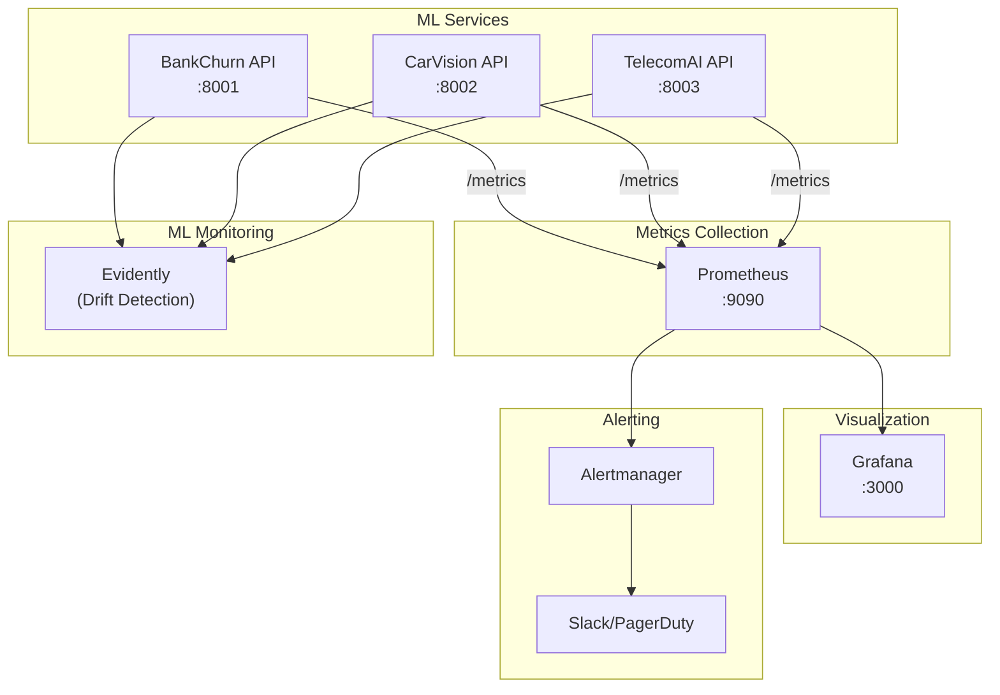

# Monitoring Guide

Comprehensive monitoring for ML services in production using Prometheus, Grafana, and Evidently.

---

## Monitoring Architecture



---

## Prometheus Metrics

### Exposed Metrics

All APIs expose metrics at the `/metrics` endpoint:

| Metric | Type | Description |
|--------|------|-------------|
| `http_requests_total` | Counter | Total HTTP requests |
| `http_request_duration_seconds` | Histogram | Request latency |
| `http_request_size_bytes` | Histogram | Request body size |
| `http_response_size_bytes` | Histogram | Response body size |
| `model_prediction_duration_seconds` | Histogram | Model inference time |
| `model_predictions_total` | Counter | Total predictions |
| `model_prediction_errors_total` | Counter | Prediction errors |

### Example Metric Output

```
# HELP http_requests_total Total HTTP requests
# TYPE http_requests_total counter
http_requests_total{method="POST",endpoint="/predict",status="200"} 1523
http_requests_total{method="POST",endpoint="/predict",status="422"} 12
http_requests_total{method="GET",endpoint="/health",status="200"} 45678

# HELP model_prediction_duration_seconds Model inference time
# TYPE model_prediction_duration_seconds histogram
model_prediction_duration_seconds_bucket{model="bankchurn",le="0.01"} 1200
model_prediction_duration_seconds_bucket{model="bankchurn",le="0.05"} 1500
model_prediction_duration_seconds_bucket{model="bankchurn",le="0.1"} 1520
model_prediction_duration_seconds_bucket{model="bankchurn",le="+Inf"} 1523
```

### Prometheus Configuration

```yaml
# prometheus.yml
global:
  scrape_interval: 15s
  evaluation_interval: 15s

rule_files:
  - "alerts.yml"

alerting:
  alertmanagers:
    - static_configs:
        - targets: ['alertmanager:9093']

scrape_configs:
  - job_name: 'ml-apis'
    static_configs:
      - targets:
          - 'bankchurn-api:8000'
          - 'carvision-api:8000'
          - 'telecom-api:8000'
    metrics_path: /metrics
    scrape_interval: 10s
```

---

## Grafana Dashboards

### Quick Start

```bash
# Start monitoring stack
docker-compose -f docker-compose.demo.yml --profile monitoring up -d

# Access Grafana
open http://localhost:3000
# Default credentials: admin / admin
```

### Dashboard Panels

<!-- MEDIA PLACEHOLDER: Grafana dashboard screenshot -->
<!-- To add: Screenshot of the ML Portfolio monitoring dashboard -->
<!-- Path: media/screenshots/grafana-dashboard.png -->

#### 1. Request Rate Panel

```sql
-- PromQL query
rate(http_requests_total{job="ml-apis"}[5m])
```

#### 2. Latency Percentiles Panel

```sql
-- P50, P95, P99 latencies
histogram_quantile(0.50, rate(http_request_duration_seconds_bucket[5m]))
histogram_quantile(0.95, rate(http_request_duration_seconds_bucket[5m]))
histogram_quantile(0.99, rate(http_request_duration_seconds_bucket[5m]))
```

#### 3. Error Rate Panel

```sql
-- Error percentage
sum(rate(http_requests_total{status=~"5.."}[5m])) 
/ sum(rate(http_requests_total[5m])) * 100
```

#### 4. Model Inference Time Panel

```sql
-- Average inference time per model
avg(rate(model_prediction_duration_seconds_sum[5m]) 
/ rate(model_prediction_duration_seconds_count[5m])) by (model)
```

### Dashboard JSON Export

```json
{
  "dashboard": {
    "title": "ML-MLOps Portfolio",
    "panels": [
      {
        "title": "Requests per Second",
        "type": "graph",
        "targets": [
          {"expr": "rate(http_requests_total[5m])", "legendFormat": "{{endpoint}}"}
        ]
      },
      {
        "title": "P95 Latency",
        "type": "stat",
        "targets": [
          {"expr": "histogram_quantile(0.95, rate(http_request_duration_seconds_bucket[5m]))"}
        ]
      }
    ]
  }
}
```

---

## Alerting Rules

### Alert Configuration

```yaml
# alerts.yml
groups:
  - name: ml-apis
    rules:
      - alert: HighErrorRate
        expr: |
          sum(rate(http_requests_total{status=~"5.."}[5m])) 
          / sum(rate(http_requests_total[5m])) > 0.05
        for: 5m
        labels:
          severity: critical
        annotations:
          summary: "High error rate detected"
          description: "Error rate is above 5% for the last 5 minutes"
      
      - alert: HighLatency
        expr: |
          histogram_quantile(0.95, rate(http_request_duration_seconds_bucket[5m])) > 1
        for: 5m
        labels:
          severity: warning
        annotations:
          summary: "High latency detected"
          description: "P95 latency is above 1 second"
      
      - alert: ServiceDown
        expr: up{job="ml-apis"} == 0
        for: 1m
        labels:
          severity: critical
        annotations:
          summary: "ML API service is down"
          description: "{{ $labels.instance }} has been down for more than 1 minute"
```

### Notification Channels

| Channel | Use Case | Configuration |
|---------|----------|---------------|
| Slack | Team notifications | Webhook URL |
| PagerDuty | On-call alerts | Integration key |
| Email | Fallback | SMTP settings |

---

## Evidently ML Monitoring

### Data Drift Detection

Evidently monitors for changes in data distribution that may affect model performance.

```python
from evidently import ColumnDriftMetric
from evidently.report import Report
from evidently.metric_preset import DataDriftPreset

# Create drift report
report = Report(metrics=[
    DataDriftPreset(),
])

# Run on reference (training) vs current (production) data
report.run(
    reference_data=train_df,
    current_data=production_df
)

# Save HTML report
report.save_html("drift_report.html")
```

### Model Performance Monitoring

```python
from evidently.metric_preset import ClassificationPreset

# For classification models
report = Report(metrics=[
    ClassificationPreset(),
])

report.run(
    reference_data=train_df,
    current_data=production_df
)
```

### Drift Metrics

| Metric | Threshold | Action |
|--------|-----------|--------|
| Dataset Drift | >50% features drifted | Investigate |
| Feature Drift (any) | p-value < 0.05 | Log warning |
| Target Drift | Significant change | Retrain model |
| Prediction Drift | >10% change | Alert team |

### Scheduled Monitoring

```python
# Run daily drift check
from datetime import datetime, timedelta

def check_drift():
    """Daily drift detection job."""
    # Get yesterday's predictions
    yesterday = datetime.now() - timedelta(days=1)
    production_data = get_predictions(date=yesterday)
    
    # Compare with reference
    report = Report(metrics=[DataDriftPreset()])
    report.run(reference_data=reference_df, current_data=production_data)
    
    # Check for drift
    results = report.as_dict()
    if results['metrics'][0]['result']['dataset_drift']:
        send_alert("Dataset drift detected!")
```

---

## Log Monitoring

### Log Format

All services use structured JSON logging:

```json
{
  "timestamp": "2025-11-25T12:00:00Z",
  "level": "INFO",
  "service": "bankchurn-api",
  "message": "Prediction request processed",
  "request_id": "abc123",
  "duration_ms": 45,
  "model_version": "1.0.0"
}
```

### Log Aggregation

```yaml
# Loki configuration for log aggregation
auth_enabled: false

server:
  http_listen_port: 3100

ingester:
  lifecycler:
    ring:
      kvstore:
        store: inmemory
      replication_factor: 1

schema_config:
  configs:
    - from: 2020-10-24
      store: boltdb-shipper
      object_store: filesystem
      schema: v11
      index:
        prefix: index_
        period: 24h

storage_config:
  boltdb_shipper:
    active_index_directory: /loki/index
    cache_location: /loki/cache
  filesystem:
    directory: /loki/chunks
```

---

## Health Checks

### Endpoint Monitoring

```bash
# Check all services
for port in 8001 8002 8003; do
  echo "Checking port $port..."
  curl -s "http://localhost:$port/health" | jq .
done
```

### Expected Response

```json
{
  "status": "healthy",
  "version": "1.0.0",
  "checks": {
    "model_loaded": true,
    "database": "connected"
  },
  "timestamp": "2025-11-25T12:00:00Z"
}
```

---

## SLI/SLO Definitions

### Service Level Indicators (SLIs)

| SLI | Measurement |
|-----|-------------|
| Availability | `up{job="ml-apis"} == 1` |
| Latency | `histogram_quantile(0.95, ...)` |
| Error Rate | `rate(errors) / rate(total)` |
| Throughput | `rate(requests_total[5m])` |

### Service Level Objectives (SLOs)

| Service | Availability | P95 Latency | Error Rate |
|---------|--------------|-------------|------------|
| BankChurn | 99.9% | <200ms | <1% |
| CarVision | 99.5% | <500ms | <2% |
| TelecomAI | 99.9% | <100ms | <1% |

---

## Runbook: Common Issues

### High Error Rate

1. Check logs: `docker-compose logs --tail 100 bankchurn-api`
2. Verify model loaded: Check `/health` endpoint
3. Check input validation: Review 422 errors
4. Check resource usage: `docker stats`

### High Latency

1. Check concurrent requests: May need scaling
2. Check model size: Large models = slow inference
3. Check feature engineering: Complex transformations
4. Consider caching: For repeated predictions

### Service Down

1. Check container status: `docker-compose ps`
2. Check resource limits: OOM kills
3. Check dependencies: MLflow, databases
4. Review restart count: Crash loops
