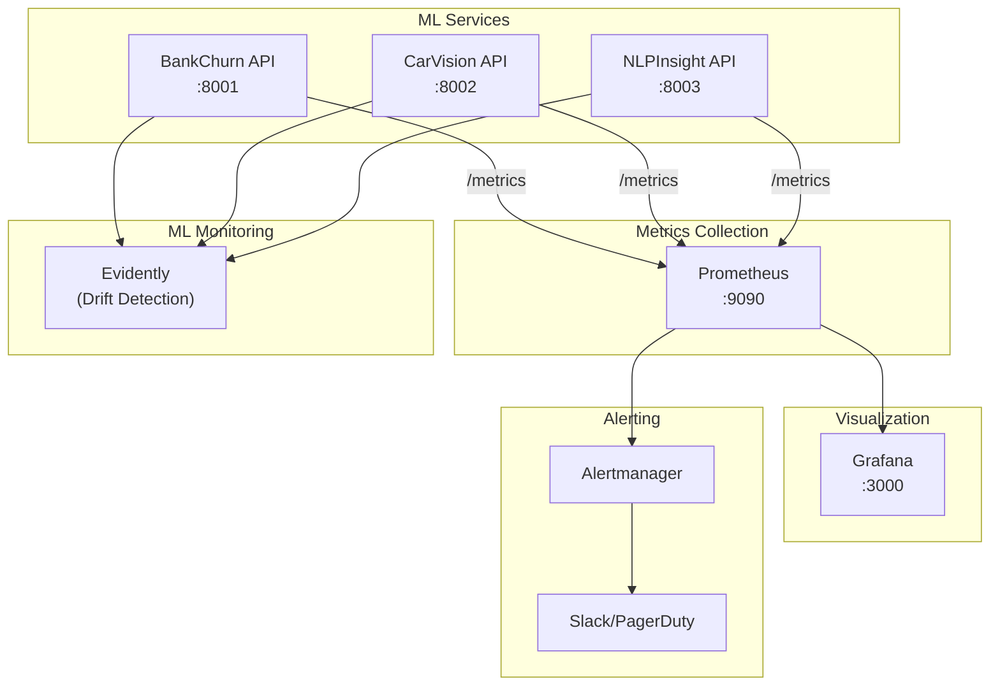
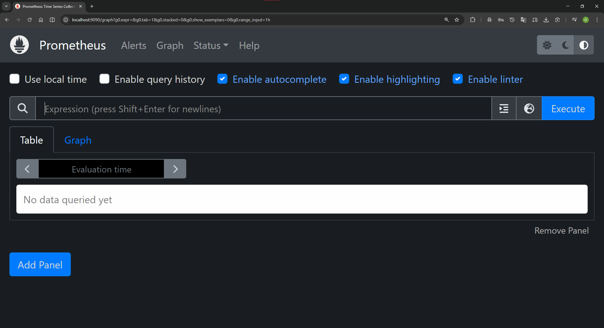
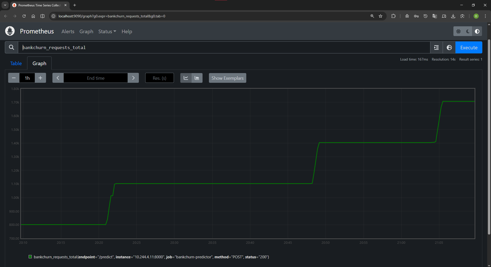
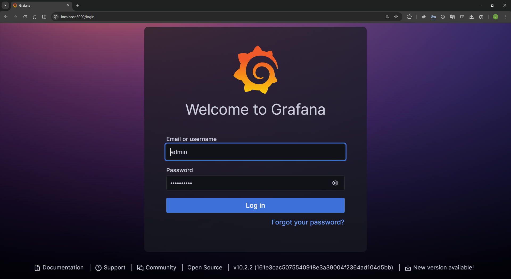
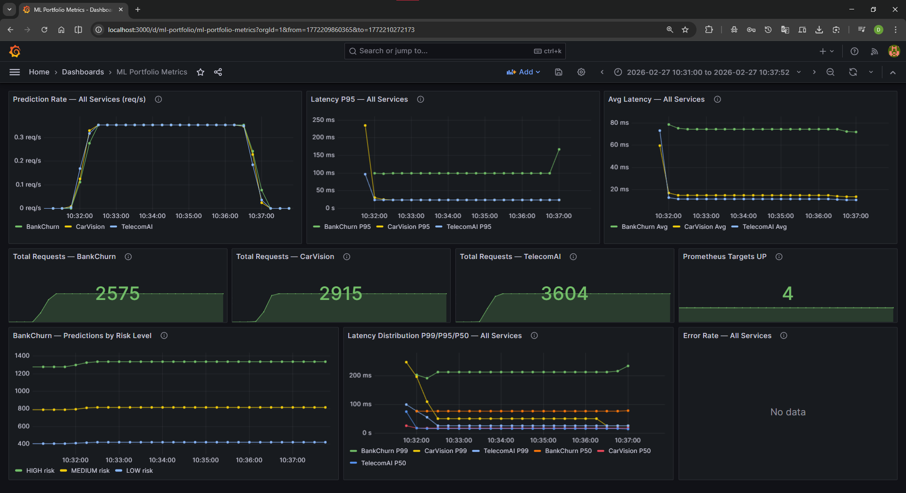
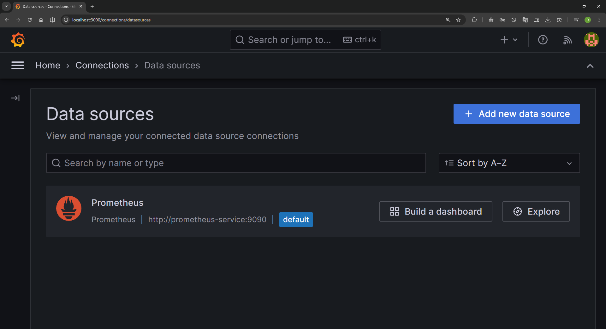
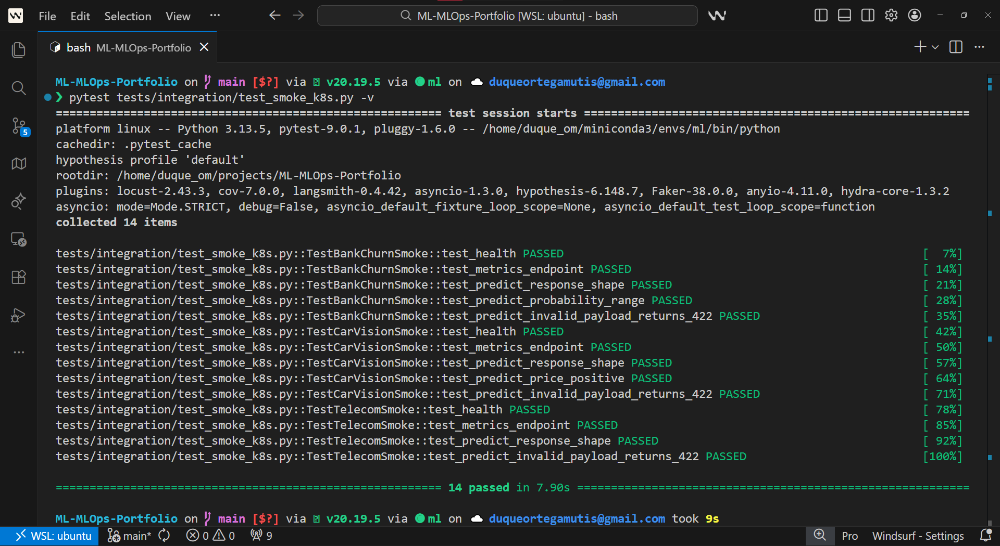

# Monitoring Guide

Comprehensive monitoring for ML services in production using Prometheus, Grafana, MLflow, and Evidently. Deployed on both **GCP (GKE)** and **AWS (EKS)**.


*Production Grafana dashboard showing request rates, latency, and resource usage across all ML services*

---

## Monitoring Architecture


```mermaid
graph TB
    subgraph "ML Services"
        BC["BankChurn API<br/>:8001"]
        CV["CarVision API<br/>:8002"]
        TC["NLPInsight API<br/>:8003"]
    end
    
    subgraph "Metrics Collection"
        PROM["Prometheus<br/>:9090"]
    end
    
    subgraph "Visualization"
        GRAF["Grafana<br/>:3000"]
    end
    
    subgraph "ML Monitoring"
        EVID["Evidently<br/>(Drift Detection)"]
    end
    
    subgraph "Alerting"
        ALERT["Alertmanager"]
        SLACK["Slack/PagerDuty"]
    end
    
    BC --> |"/metrics"| PROM
    CV --> |"/metrics"| PROM
    TC --> |"/metrics"| PROM
    PROM --> GRAF
    PROM --> ALERT
    ALERT --> SLACK
    BC --> EVID
    CV --> EVID
    TC --> EVID
```

---

## Prometheus Metrics

### Exposed Metrics

Each ML API exposes project-specific metrics at the `/metrics` endpoint:

| Metric | Type | Description | Services |
|--------|------|-------------|----------|
| `bankchurn_requests_total` | Counter | Total HTTP requests | BankChurn |
| `bankchurn_predictions_total` | Counter | Total predictions made | BankChurn |
| `bankchurn_request_duration_seconds` | Histogram | Request latency | BankChurn |
| `carvision_requests_total` | Counter | Total HTTP requests | CarVision |
| `telecom_requests_total` | Counter | Total HTTP requests | NLPInsight |


*Prometheus web UI for ad-hoc metric queries*


*All Prometheus scrape targets UP and healthy*

### Example Metric Output

```
# HELP bankchurn_requests_total Total HTTP requests
# TYPE bankchurn_requests_total counter
bankchurn_requests_total{method="POST",endpoint="/predict",status="200"} 802

# HELP bankchurn_request_duration_seconds Request latency
# TYPE bankchurn_request_duration_seconds histogram
bankchurn_request_duration_seconds_bucket{le="0.01"} 650
bankchurn_request_duration_seconds_bucket{le="0.05"} 790
bankchurn_request_duration_seconds_bucket{le="+Inf"} 802

# HELP carvision_requests_total Total HTTP requests
# TYPE carvision_requests_total counter
carvision_requests_total{method="POST",endpoint="/predict",status="200"} 300
```

### Prometheus Configuration (Kubernetes)

```yaml
# infra/prometheus-config.yaml (deployed via ConfigMap)
global:
  scrape_interval: 15s
  evaluation_interval: 15s

scrape_configs:
  - job_name: 'bankchurn-predictor'
    static_configs:
      - targets: ['bankchurn-predictor-service:8000']
    metrics_path: /metrics
    scrape_interval: 15s

  - job_name: 'carvision-intelligence'
    static_configs:
      - targets: ['carvision-intelligence-service:8000']
    metrics_path: /metrics
    scrape_interval: 15s

  - job_name: 'telecom-intelligence'
    static_configs:
      - targets: ['telecom-intelligence-service:8000']
    metrics_path: /metrics
    scrape_interval: 15s
```


*Prometheus query graph showing request rate over time*

---

## Grafana Dashboards

### Quick Start

```bash
# Start monitoring stack
docker compose -f docker-compose.demo.yml --profile monitoring up -d

# Access Grafana
open http://localhost:3000
# Credentials: stored in K8s secret 'grafana-credentials'
```


*Grafana login page — credentials stored in K8s secret `grafana-credentials`*

### Pre-built Dashboard

The portfolio includes a **production-ready Grafana dashboard** with service-specific panels:

| Panel | PromQL Query | Description |
|-------|-------------|-------------|
| **BankChurn Requests** | `rate(bankchurn_requests_total[5m])` | Request rate over time |
| **CarVision Requests** | `rate(carvision_requests_total[5m])` | Request rate over time |
| **NLPInsight Requests** | `rate(telecom_requests_total[5m])` | Request rate over time |
| **BankChurn Latency** | `bankchurn_request_duration_seconds` | P50/P95 latency |


*Grafana dashboard showing traffic spike during load testing (900 requests, 0% errors)*

**Dashboard Locations**:

- `k8s/grafana-deployment.yaml` — Grafana deployment with embedded dashboard JSON
- `infra/grafana/dashboards/ml-performance.json` — Standalone dashboard file

**Provisioning**: Grafana auto-provisions the Prometheus datasource and dashboard via ConfigMaps in the K8s deployment.


*Prometheus datasource auto-provisioned in Grafana*

### Dashboard Panels

#### 1. Request Rate Panel

```promql
# Per-service request rate
rate(bankchurn_requests_total[5m])
rate(carvision_requests_total[5m])
rate(telecom_requests_total[5m])
```

#### 2. Latency Panel

```promql
# BankChurn P95 latency
histogram_quantile(0.95, rate(bankchurn_request_duration_seconds_bucket[5m]))
```

#### 3. Error Rate Panel

```promql
# BankChurn error rate
sum(rate(bankchurn_requests_total{status=~"5.."}[5m]))
/ sum(rate(bankchurn_requests_total[5m])) * 100
```

---

## Alerting Rules

### Alert Configuration

```yaml
# alerts.yml
groups:
  - name: ml-apis
    rules:
      - alert: HighErrorRate
        expr: |
          sum(rate(http_requests_total{status=~"5.."}[5m])) 
          / sum(rate(http_requests_total[5m])) > 0.05
        for: 5m
        labels:
          severity: critical
        annotations:
          summary: "High error rate detected"
          description: "Error rate is above 5% for the last 5 minutes"
      
      - alert: HighLatency
        expr: |
          histogram_quantile(0.95, rate(http_request_duration_seconds_bucket[5m])) > 1
        for: 5m
        labels:
          severity: warning
        annotations:
          summary: "High latency detected"
          description: "P95 latency is above 1 second"
      
      - alert: ServiceDown
        expr: up{job="ml-apis"} == 0
        for: 1m
        labels:
          severity: critical
        annotations:
          summary: "ML API service is down"
          description: "{{ $labels.instance }} has been down for more than 1 minute"
```

### Notification Channels

| Channel | Use Case | Configuration |
|---------|----------|---------------|
| Slack | Team notifications | Webhook URL |
| PagerDuty | On-call alerts | Integration key |
| Email | Fallback | SMTP settings |

---

## Evidently ML Monitoring

### Data Drift Detection

Evidently monitors for changes in data distribution that may affect model performance.

```python
from evidently import ColumnDriftMetric
from evidently.report import Report
from evidently.metric_preset import DataDriftPreset

# Create drift report
report = Report(metrics=[
    DataDriftPreset(),
])

# Run on reference (training) vs current (production) data
report.run(
    reference_data=train_df,
    current_data=production_df
)

# Save HTML report
report.save_html("drift_report.html")
```

### Model Performance Monitoring

```python
from evidently.metric_preset import ClassificationPreset

# For classification models
report = Report(metrics=[
    ClassificationPreset(),
])

report.run(
    reference_data=train_df,
    current_data=production_df
)
```

### Drift Metrics

| Metric | Threshold | Action |
|--------|-----------|--------|
| Dataset Drift | >50% features drifted | Investigate |
| Feature Drift (any) | p-value < 0.05 | Log warning |
| Target Drift | Significant change | Retrain model |
| Prediction Drift | >10% change | Alert team |

### Scheduled Monitoring

```python
# Run daily drift check
from datetime import datetime, timedelta

def check_drift():
    """Daily drift detection job."""
    # Get yesterday's predictions
    yesterday = datetime.now() - timedelta(days=1)
    production_data = get_predictions(date=yesterday)
    
    # Compare with reference
    report = Report(metrics=[DataDriftPreset()])
    report.run(reference_data=reference_df, current_data=production_data)
    
    # Check for drift
    results = report.as_dict()
    if results['metrics'][0]['result']['dataset_drift']:
        send_alert("Dataset drift detected!")
```

---

## MLflow Experiment Tracking

MLflow runs as a dedicated service in the K8s cluster, tracking experiments for all 3 projects.


*MLflow UI showing 3 experiments with 9 total runs across BankChurn, CarVision, and NLPInsight*

### MLflow Experiments Summary

| Experiment | Runs | Best Model | Key Metric |
|------------|------|------------|------------|
| **BankChurn-Predictor** | 3 | BC-2_RandomForest_Tuned | AUC 0.8652, F1 0.6432 |
| **CarVision-Market-Intelligence** | 3 | CV-2_RandomForest_Tuned | R² 0.7692, RMSE $4,396 |
| **NLPInsight-Customer-Intelligence** | 3 | TL-3_RandomForest | Acc 0.818, F1 0.6309 |

### What Gets Tracked

- **Parameters**: All model hyperparameters, train/test sizes, feature counts
- **Metrics**: Accuracy, F1, precision, recall, AUC-ROC (classification); RMSE, MAE, R² (regression)
- **Datasets**: Training dataset metadata (name, source, target column)
- **Tags**: Project name, run type (baseline/tuned/alternative), framework, task type

### Running Experiments

```bash
# Port-forward to MLflow (if on K8s)
kubectl port-forward svc/mlflow-service 5000:5000 -n ml-portfolio

# Run all 9 experiments
python scripts/run_experiments.py

# View results
open http://localhost:5000
```

---

## Smoke & Load Testing

The portfolio includes automated testing infrastructure for production validation.

### Smoke Tests (pytest)


*14/14 smoke tests passing — health checks, predictions, and metrics for all services*

```bash
# Run smoke tests against live cluster
pytest tests/integration/test_smoke_k8s.py -v
```

### Load Tests (Locust)


*Load test results: 900 requests, 0% error rate, ~50ms average latency*

```bash
# Option 1: Port-forward mode (development)
locust -f tests/load/locustfile.py --host http://localhost:8001

# Option 2: Real Ingress IP mode (production-grade)
INGRESS_HOST=34.120.120.57 locust -f tests/load/locustfile.py --host http://34.120.120.57

# Option 3: Legacy smoke + load script
python scripts/load_test_services.py
```

> **Locust modes**: The `tests/load/locustfile.py` supports both `kubectl port-forward` (default) and real Ingress/ALB IP via the `INGRESS_HOST` environment variable. Production mode uses path-based routing (`/bankchurn/*`, `/carvision/*`, `/telecom/*`).

---

## Log Monitoring

### Log Format

All services use structured JSON logging:

```json
{
  "timestamp": "2026-02-26T20:00:00Z",
  "level": "INFO",
  "service": "bankchurn-api",
  "message": "Prediction request processed",
  "request_id": "abc123",
  "duration_ms": 45,
  "model_version": "1.0.0"
}
```

### Log Aggregation

```yaml
# Loki configuration for log aggregation
auth_enabled: false

server:
  http_listen_port: 3100

ingester:
  lifecycler:
    ring:
      kvstore:
        store: inmemory
      replication_factor: 1

schema_config:
  configs:
    - from: 2020-10-24
      store: boltdb-shipper
      object_store: filesystem
      schema: v11
      index:
        prefix: index_
        period: 24h

storage_config:
  boltdb_shipper:
    active_index_directory: /loki/index
    cache_location: /loki/cache
  filesystem:
    directory: /loki/chunks
```

---

## Health Checks

### Endpoint Monitoring

```bash
# Check all services
for port in 8001 8002 8003; do
  echo "Checking port $port..."
  curl -s "http://localhost:$port/health" | jq .
done
```

### Expected Response

```json
{
  "status": "healthy",
  "version": "1.0.0",
  "checks": {
    "model_loaded": true,
    "database": "connected"
  },
  "timestamp": "2025-11-25T12:00:00Z"
}
```

---

## SLI/SLO Definitions

### Service Level Indicators (SLIs)

| SLI | Measurement |
|-----|-------------|
| Availability | `up{job="ml-apis"} == 1` |
| Latency | `histogram_quantile(0.95, ...)` |
| Error Rate | `rate(errors) / rate(total)` |
| Throughput | `rate(requests_total[5m])` |

### Service Level Objectives (SLOs)

| Service | Availability | P95 Latency | Error Rate |
|---------|--------------|-------------|------------|
| BankChurn | 99.9% | <200ms | <1% |
| CarVision | 99.5% | <500ms | <2% |
| NLPInsight | 99.9% | <100ms | <1% |

---

## Runbook: Common Issues

### High Error Rate

1. Check logs: `docker compose logs --tail 100 bankchurn-api`
2. Verify model loaded: Check `/health` endpoint
3. Check input validation: Review 422 errors
4. Check resource usage: `docker stats`

### High Latency

1. Check concurrent requests: May need scaling
2. Check model size: Large models = slow inference
3. Check feature engineering: Complex transformations
4. Consider caching: For repeated predictions

### Service Down

1. Check container status: `docker compose ps`
2. Check resource limits: OOM kills
3. Check dependencies: MLflow, databases
4. Review restart count: Crash loops

---

## HPA Autoscaling

All ML services use CPU-only Horizontal Pod Autoscaling. Memory-based scaling was removed because ML models have fixed memory footprints (model loaded in RAM).

| Service | CPU Target | Min Pods | Max Pods | Memory Footprint |
|---------|-----------|----------|----------|------------------|
| **BankChurn** | 70% | 1 | 3 | ~300Mi (fixed) |
| **CarVision** | 70% | 1 | 3 | ~550Mi (fixed) |
| **NLPInsight** | 75% | 1 | 3 | ~140Mi (fixed) |

> **Design Decision**: ML inference services load models into RAM at startup. Memory usage is constant regardless of traffic, so memory-based HPA would never scale down. CPU scales proportionally with request volume, making it the correct scaling signal.

---

**Last Updated**: February 2026
