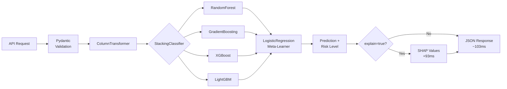

<div class="portfolio-page" markdown="1">

<div class="portfolio-hero" markdown="1">
<span class="portfolio-eyebrow">Banking churn service</span>

# BankChurn Predictor

Predict which bank customers are likely to leave — and quantify the cost of getting it wrong.

<div class="portfolio-actions" markdown="1">
[Debugging deep dive](bankchurn-debugging.md){ .portfolio-button .portfolio-button--primary }
[Technical evidence](../technical-evidence.md){ .portfolio-button }
</div>
</div>

<div class="portfolio-stat-strip" markdown="1">
<div class="portfolio-stat">
<small>Model quality</small>
<strong>AUC 0.87</strong>
<span>Cost-aware churn ranking with a production threshold.</span>
</div>
<div class="portfolio-stat">
<small>Coverage</small>
<strong>90%</strong>
<span>199 tests with CI threshold discipline.</span>
</div>
<div class="portfolio-stat">
<small>Incident</small>
<strong>81% -> 0%</strong>
<span>Error-rate fix documented as a serving-pattern lesson.</span>
</div>
<div class="portfolio-stat">
<small>Explainability</small>
<strong>Kernel SHAP</strong>
<span>StackingClassifier explanations in original feature space.</span>
</div>
</div>

<div class="portfolio-media portfolio-media--project-hero" markdown="1">
<video autoplay muted loop playsinline controls preload="metadata" poster="../../media/videos/bankchurn-api-demo-poster.jpg" aria-label="BankChurn Predictor API demo clip">
  <source src="../../media/videos/bankchurn-api-demo.mp4" type="video/mp4">
</video>
</div>

## The Problem

A bank with 100K customers and a 20% annual churn rate loses ~$30M/year in lifetime value. The question isn't "can we predict churn?" — it's "at what threshold do we act, and what does each error cost?"

## Business Translation

<div class="portfolio-card-grid" markdown="1">
<div class="portfolio-card" markdown="1">
<small>Problem</small>
<h3>Retention budget is limited</h3>
<p>The useful question is which customers deserve intervention, not whether the
model can produce a score.</p>
</div>

<div class="portfolio-card" markdown="1">
<small>Decision</small>
<h3>Favor recall with a lower threshold</h3>
<p>A missed churner is much more expensive than an unnecessary retention offer,
so the threshold is tuned around cost of error.</p>
</div>

<div class="portfolio-card" markdown="1">
<small>Impact</small>
<h3>Predictions become operational</h3>
<p>The output supports action: probability, risk category, threshold rationale
and explanation path.</p>
</div>

<div class="portfolio-card" markdown="1">
<small>Trade-off</small>
<h3>More complexity for explainability</h3>
<p>The ensemble improves performance, but it requires careful SHAP handling and
serving-path discipline.</p>
</div>
</div>

## Why AUC-ROC, Not Accuracy

The dataset is 80/20 retained/churned. A model predicting "no churn" for everyone scores 79.6% accuracy — and catches zero churners. AUC-ROC measures **rank-ordering quality** across all thresholds, independently of class imbalance.

| Metric | Value | Why It Matters |
|--------|-------|----------------|
| **AUC-ROC** | 0.87 | Rank-ordering: 87% of the time, a churner scores higher than a non-churner |
| **F1** | 0.62 | Harmonic mean at default threshold (0.50) |
| **Precision** | 0.73 | 73% of flagged customers actually churn |
| **Recall** | 0.54 | 54% of actual churners caught (at 0.50); **78% at production threshold 0.35** |

**Production threshold: 0.35** — a missed churner costs ~$1,500 LTV; an unnecessary retention offer costs ~$50. At 30:1 cost ratio, we favor recall over precision.

## Architecture



**Why StackingClassifier**: 4 diverse base learners capture complementary patterns (bagging + boosting + tree + gradient). AUC improved from 0.84 (best single model) to 0.87. CV variance is tight (±0.006), confirming generalization over memorization. See [ADR-003](../decisions/003-stacking-classifier-bankchurn.md).

## Engineering Trade-Off

<div class="portfolio-callout" markdown="1">
<strong>Chosen:</strong> StackingClassifier + FastAPI serving + async executor pattern.
<strong>Rejected:</strong> a simpler single-model API that would be easier to
serve but less useful as a portfolio signal for ensemble modeling,
explainability and inference-path debugging.

The StackingClassifier also forced a concrete explainability fix:
TreeExplainer produced unusable all-zero outputs for this ensemble/pipeline
shape, so the service moved to KernelExplainer through a predict-proba wrapper
in the original feature space.

[Read the debugging deep dive](bankchurn-debugging.md)
</div>

## Code Review Shortcuts

<div class="portfolio-actions" markdown="1">
[FastAPI app](https://github.com/DuqueOM/ML-MLOps-Portfolio/blob/main/BankChurn-Predictor/app/fastapi_app.py){ .portfolio-button .portfolio-button--primary }
[Dockerfile](https://github.com/DuqueOM/ML-MLOps-Portfolio/blob/main/BankChurn-Predictor/Dockerfile){ .portfolio-button }
[Tests](https://github.com/DuqueOM/ML-MLOps-Portfolio/tree/main/BankChurn-Predictor/tests){ .portfolio-button }
[K8s manifest](https://github.com/DuqueOM/ML-MLOps-Portfolio/blob/main/k8s/overlays/gcp/bankchurn-deployment.yaml){ .portfolio-button }
[CI pipeline](https://github.com/DuqueOM/ML-MLOps-Portfolio/blob/main/.github/workflows/ci-mlops.yml){ .portfolio-button }
</div>

## Operational

| Metric | Value | Context |
|--------|-------|---------|
| Test Coverage | 90% (199 tests) | CI threshold: 85% |
| Docker Image | 342 MB | `bankchurn:v3.6.0` on Artifact Registry (python:3.11-slim-bookworm) |
| Model Size | 4.1 MB | Joblib compress=3; includes preprocessor + 4 base learners + meta-learner |
| P50 / P95 Latency | 200ms / 410ms (GCP), 110ms / 140ms (AWS) | Through ingress, Locust smoke test (6 users) |
| SHAP | Lazy, CPU-only | `?explain=true` adds ~4.5s (KernelExplainer); skipped by default |
| HPA correction | Memory -> CPU-only | Replicas reduced from 3 to 1 in 8 minutes after rejecting memory as the scaling signal |

## Responsible AI

- **Fairness**: Disparate impact ratio and equal opportunity difference audited by Gender and Geography
- **Drift**: Evidently AI monitors PSI/KS per feature; alert fires if >30% features drift
- **Validation**: Pandera schemas reject invalid inputs (CreditScore ∈ [300, 850], Age > 0)

## Live Prediction

| BankChurn Prediction | SHAP Explanation |
|:---:|:---:|
|  |  |

## Try It

=== "Basic Prediction"

    ```bash
    curl -s -X POST http://localhost:8001/predict \
      -H "Content-Type: application/json" \
      -d '{"CreditScore":650,"Geography":"France","Gender":"Male","Age":40,"Tenure":5,"Balance":60000,"NumOfProducts":2,"HasCrCard":1,"IsActiveMember":1,"EstimatedSalary":50000}' | python3 -m json.tool
    ```

    Expected: `churn_probability`, `risk_category` (low/medium/high), `churn_prediction` (0/1)

=== "With SHAP Explanation"

    ```bash
    curl -s -X POST "http://localhost:8001/predict?explain=true" \
      -H "Content-Type: application/json" \
      -d '{"CreditScore":450,"Geography":"Germany","Gender":"Female","Age":55,"Tenure":1,"Balance":0,"NumOfProducts":1,"HasCrCard":0,"IsActiveMember":0,"EstimatedSalary":30000}' | python3 -m json.tool
    ```

    Expected: Same fields + `feature_contributions` (SHAP values per feature). This high-risk customer should show Age and NumOfProducts as top churn drivers.

=== "Health Check"

    ```bash
    curl -s http://localhost:8001/health | python3 -m json.tool
    ```

📄 [Full Model Card](https://github.com/DuqueOM/ML-MLOps-Portfolio/blob/main/BankChurn-Predictor/models/model_card.md) — includes metric rationale, performance benchmarks, and production decision narrative.

## Related Operating Evidence

- [BankChurn debugging deep dive](bankchurn-debugging.md)
- [Technical evidence overview](../technical-evidence.md)
- [ADR-015: Async inference thread pool](../decisions/015-async-inference-threadpool.md)

---

*Last Updated: April 2026 — v3.6.0*

</div>
