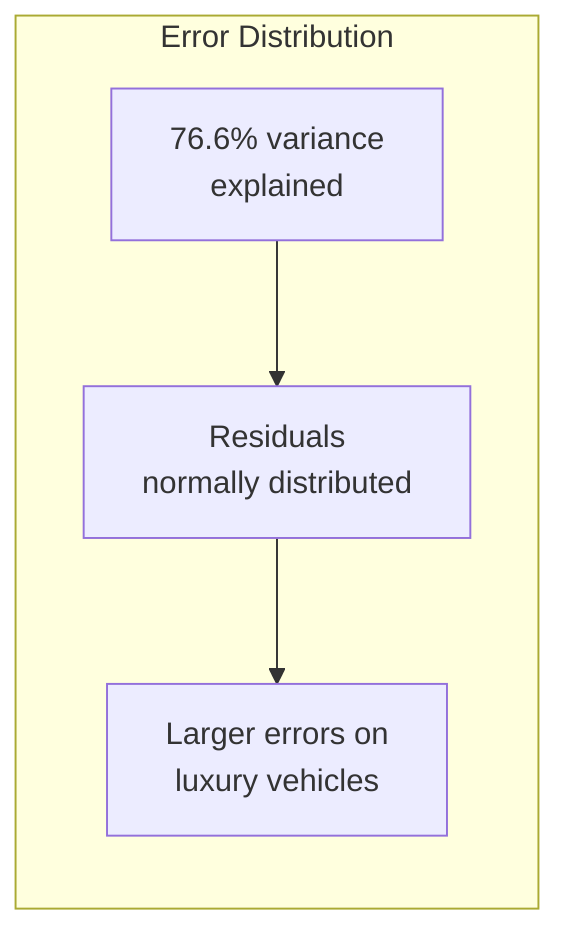
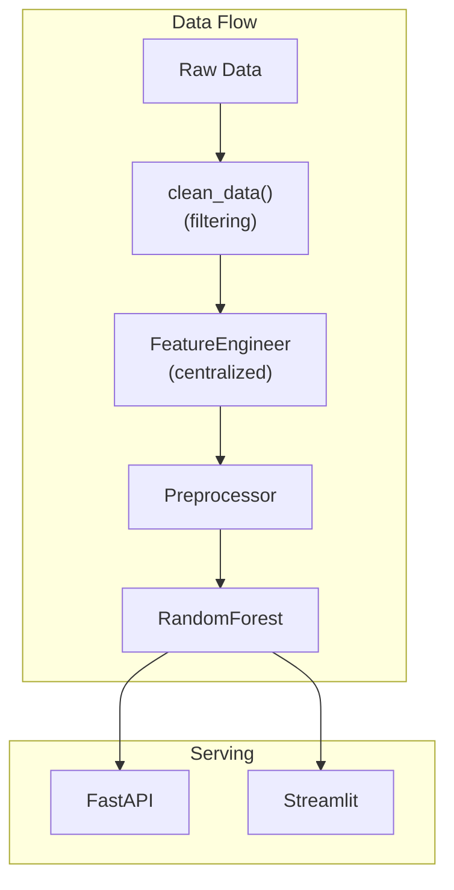

# CarVision Market Intelligence

Vehicle price prediction platform with interactive dashboard.

<!-- MEDIA PLACEHOLDER: Demo GIF pending -->
<!-- To add: Record 6-8 second GIF showing Streamlit dashboard -->
<!-- Path: media/gifs/carvision-demo.gif -->
<!-- { .off-glb } -->

## Overview

**CarVision Market Intelligence** is a comprehensive vehicle valuation platform featuring both a REST API and an interactive Streamlit dashboard. It demonstrates advanced feature engineering, market analysis capabilities, and dual-interface design.

## Model Performance

### Production Metrics

| Metric | Value | Description |
|--------|-------|-------------|
| **R²** | 0.766 | Coefficient of determination |
| **RMSE** | $4,794 | Root mean squared error |
| **MAE** | $2,371 | Mean absolute error |
| **MAPE** | 27.6% | Mean absolute percentage error |

### Performance Analysis



!!! info "Model Insights"
    - Best performance on vehicles priced $10K-$40K
    - Higher errors on luxury/collector vehicles (>$100K)
    - Odometer and model year are top predictors

### Operational Metrics

| Metric | Value | Description |
|--------|-------|-------------|
| **Test Coverage** | 96% | Unit + integration tests |
| **P95 Latency** | <100ms | Inference time |
| **Model Size** | ~5 MB | Serialized pipeline |

## Quick Start

### Using Docker

```bash
cd CarVision-Market-Intelligence
docker build -t carvision:latest .
docker run -p 8000:8000 -p 8501:8501 carvision:latest
```

### Access Points

- **API**: http://localhost:8002/docs
- **Dashboard**: http://localhost:8501

## API Reference

### Predict Endpoint

**POST** `/predict`

```bash
curl -X POST "http://localhost:8002/predict" \
  -H "Content-Type: application/json" \
  -d '{
    "model_year": 2020,
    "model": "ford f-150",
    "condition": "excellent",
    "odometer": 25000,
    "fuel": "gas",
    "transmission": "automatic"
  }'
```

**Response:**

```json
{
  "predicted_price": 35420.50,
  "confidence_interval": {
    "lower": 32500.00,
    "upper": 38340.00
  }
}
```

## Dashboard Features

The Streamlit dashboard provides four main sections:

1. **Overview**: Dataset statistics and key metrics
2. **Market Analysis**: Brand comparisons, price distributions
3. **Model Metrics**: Performance visualization, feature importance
4. **Price Predictor**: Interactive prediction interface

## Architecture



### Key Design Decisions

1. **Centralized Feature Engineering**: The `FeatureEngineer` class handles all feature transformations for training, inference, and analysis. This ensures consistency across the entire pipeline.

2. **No Data Leakage**: Features like `price_per_mile` and `price_category` are excluded from model input since they depend on the target variable (`price`).

3. **Dual Interface**: Both API and dashboard share the same model and preprocessing logic.

## Configuration

```yaml
# configs/config.yaml
data:
  train_path: "data/raw/vehicles.csv"
  target: "price"
  filters:
    min_price: 1000
    max_price: 500000
    min_year: 1990
    max_odometer: 500000
  drop_columns:
    - price_per_mile
    - price_category

model:
  type: "random_forest"
  n_estimators: 100
  max_depth: 15
```

## Training

```bash
# Train model
python main.py train --config configs/config.yaml

# Evaluate model
python main.py evaluate --config configs/config.yaml
```

## Project Structure

```
CarVision-Market-Intelligence/
├── src/carvision/
│   ├── __init__.py
│   ├── data.py           # Data loading and cleaning
│   ├── features.py       # FeatureEngineer class
│   ├── training.py       # Model training
│   ├── prediction.py     # Inference
│   ├── evaluation.py     # Metrics
│   ├── analysis.py       # Market analysis
│   └── visualization.py  # Charts and plots
├── app/
│   ├── fastapi_app.py    # REST API
│   └── streamlit_app.py  # Dashboard
├── tests/
├── configs/
└── Dockerfile
```

## Known Limitations

1. **Vehicle Scope**: Focused on US market vehicles
2. **Image Features**: No image-based valuation (text features only)
3. **Real-time Data**: Uses static dataset, not live listings

## Related Documentation

- [Model Card](https://github.com/DuqueOM/ML-MLOps-Portfolio/blob/main/CarVision-Market-Intelligence/models/model_card.md)
- [Architecture Overview](../architecture/overview.md)
