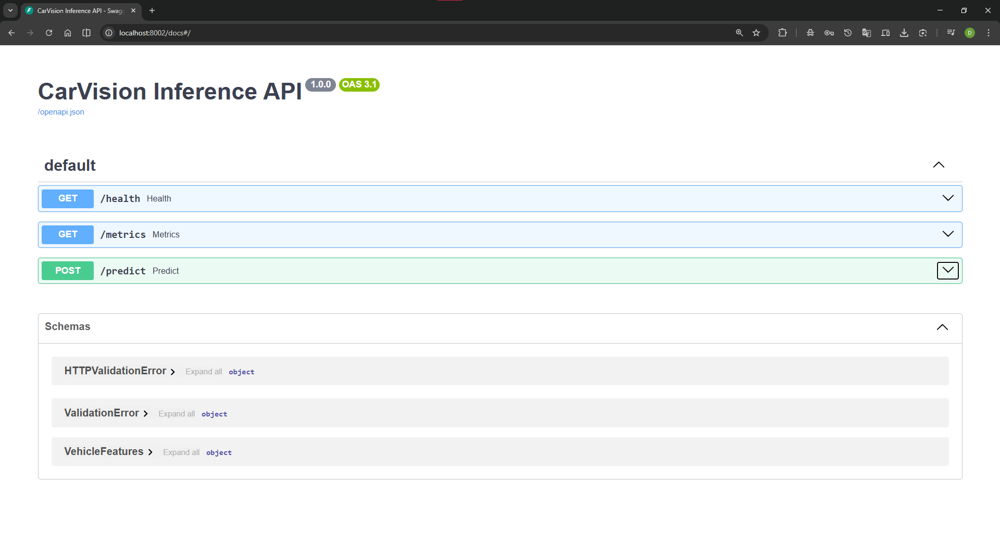
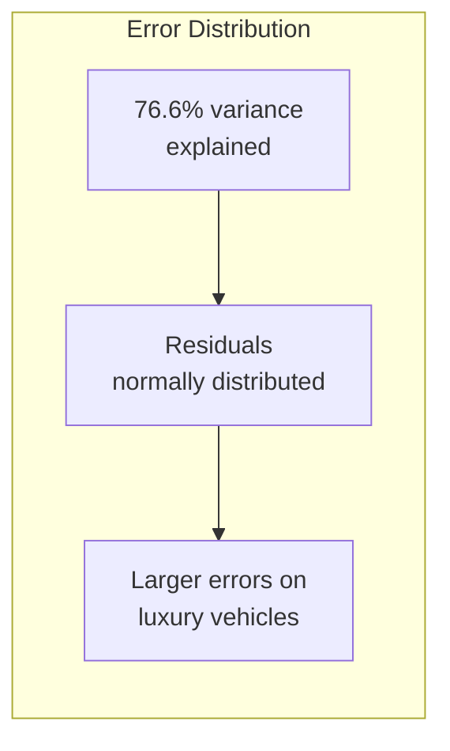
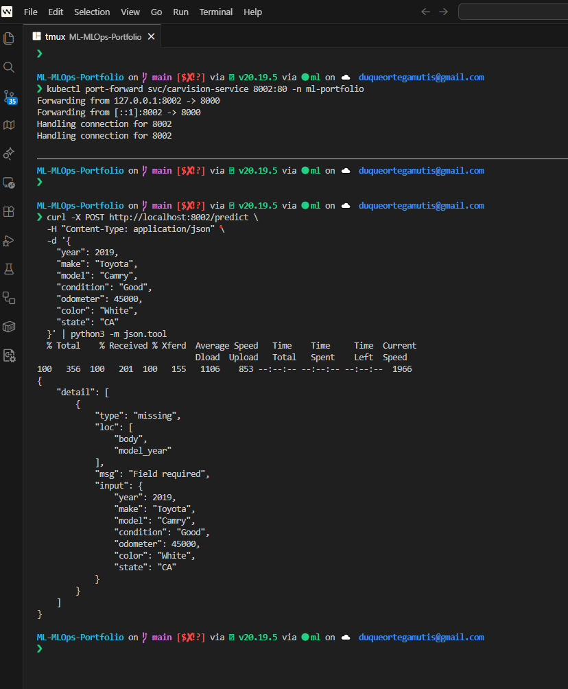
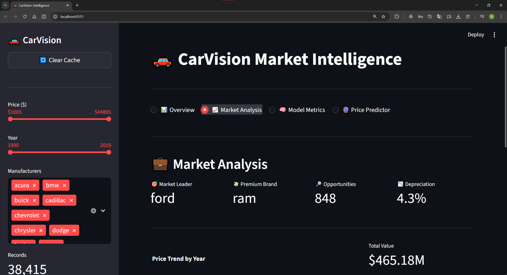
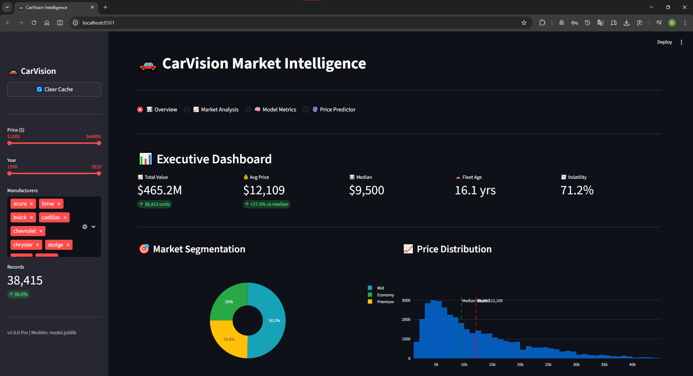
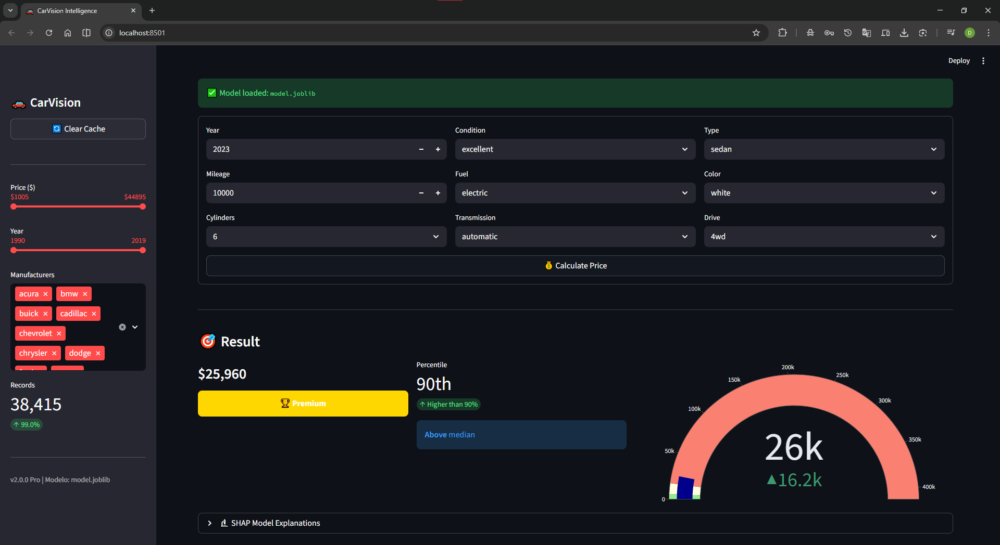
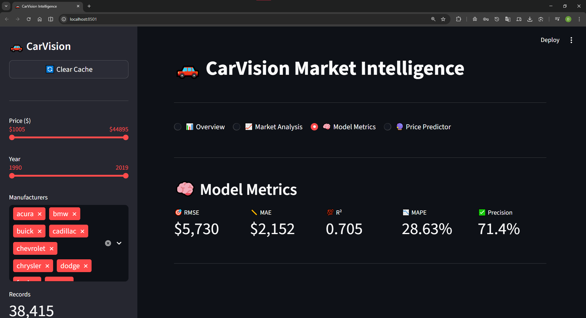
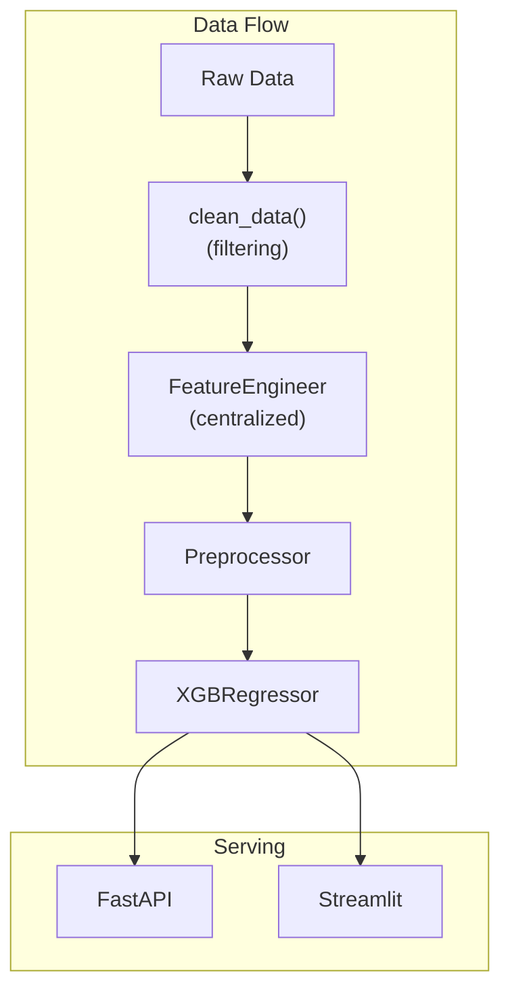
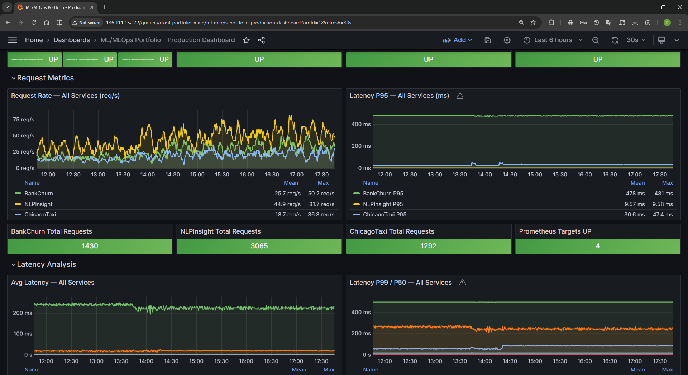

# CarVision Market Intelligence

Vehicle price prediction platform with interactive dashboard.




## Overview

**CarVision Market Intelligence** is a comprehensive vehicle valuation platform featuring both a REST API and an interactive Streamlit dashboard. It demonstrates advanced feature engineering, market analysis capabilities, and dual-interface design.

## Model Performance

### Production Metrics

| Metric | Value | Description |
|--------|-------|-------------|
| **R²** | 0.7692 | Coefficient of determination |
| **RMSE** | $4,396 | Root mean squared error |
| **MAE** | $3,124 | Mean absolute error |
| **MAPE** | 18.2% | Mean absolute percentage error |

### Performance Analysis


```mermaid
graph LR
    subgraph "Error Distribution"
        A["76.6% variance<br/>explained"] --> B["Residuals<br/>normally distributed"]
        B --> C["Larger errors on<br/>luxury vehicles"]
    end
```

!!! info "Model Insights"
    - Best performance on vehicles priced $10K-$40K
    - Higher errors on luxury/collector vehicles (>$100K)
    - Odometer and model year are top predictors

### MLflow Experiments

| Run | Model | Test RMSE | Test R² | Purpose |
|-----|-------|-----------|----------|---------|
| CV-1_Baseline_Ridge | Ridge Regression | $5,591 | 0.6266 | Linear baseline |
| **CV-2_RF_Tuned** | **RandomForest** | **$4,396** | **0.7692** | **Production model** |
| CV-3_GradientBoosting | GradientBoosting | $4,416 | 0.7671 | Ensemble comparison |

### Operational Metrics

| Metric | Value | Description |
|--------|-------|-------------|
| **Test Coverage** | 95% | 37 tests ([Codecov verified](https://app.codecov.io/gh/DuqueOM/ML-MLOps-Portfolio)) |
| **P95 Latency** | <30ms | Inference time |
| **Model Size** | ~968 KB | Serialized pipeline |

### Production Screenshots


*CarVision FastAPI Swagger UI*


*Real vehicle price prediction response*

## Quick Start

### Using Docker

```bash
cd CarVision-Market-Intelligence
docker build -t ml-portfolio-carvision:latest .
docker run -p 8002:8000 -p 8501:8501 ml-portfolio-carvision:latest
```

### Access Points

- **API**: http://localhost:8002/docs
- **Dashboard**: http://localhost:8501

## API Reference

### Predict Endpoint

**POST** `/predict`

```bash
curl -X POST "http://localhost:8002/predict" \
  -H "Content-Type: application/json" \
  -d '{
    "model_year": 2020,
    "model": "ford f-150",
    "condition": "excellent",
    "odometer": 25000,
    "fuel": "gas",
    "transmission": "automatic"
  }'
```

**Response:**

```json
{
  "predicted_price": 35420.50,
  "confidence_interval": {
    "lower": 32500.00,
    "upper": 38340.00
  }
}
```

## Dashboard Features

The Streamlit dashboard provides four main sections:

1. **Overview**: Dataset statistics and key metrics
2. **Market Analysis**: Brand comparisons, price distributions
3. **Model Metrics**: Performance visualization, feature importance
4. **Price Predictor**: Interactive prediction interface


*Full Streamlit dashboard with 4 interactive tabs*

<details>
<summary><strong>Dashboard Screenshots (click to expand)</strong></summary>


*Data Explorer tab: dataset statistics, filtering, and distribution charts*


*Price Predictor tab: interactive vehicle valuation form*


*Model Metrics tab: R²=0.77, RMSE=$4,396, actual vs predicted plot*

</details>

## Architecture


```mermaid
graph TB
    subgraph "Data Flow"
        CSV["Raw Data"] --> CLEAN["clean_data()<br/>(filtering)"]
        CLEAN --> FEAT["FeatureEngineer<br/>(centralized)"]
        FEAT --> PREP["Preprocessor"]
        PREP --> MODEL["XGBRegressor"]
    end

    subgraph "Serving"
        MODEL --> API["FastAPI"]
        MODEL --> DASH["Streamlit"]
    end
```

### Key Design Decisions

1. **Centralized Feature Engineering**: The `FeatureEngineer` class handles all feature transformations for training, inference, and analysis. This ensures consistency across the entire pipeline.

2. **No Data Leakage**: Features like `price_per_mile` and `price_category` are excluded from model input since they depend on the target variable (`price`).

3. **Dual Interface**: Both API and dashboard share the same model and preprocessing logic.

## Configuration

```yaml
# configs/config.yaml
data:
  train_path: "data/raw/vehicles.csv"
  target: "price"
  filters:
    min_price: 1000
    max_price: 500000
    min_year: 1990
    max_odometer: 500000
  drop_columns:
    - price_per_mile
    - price_category

model:
  type: "random_forest"
  n_estimators: 100
  max_depth: 15
```

## Training

```bash
# Train model
python main.py train --config configs/config.yaml

# Evaluate model
python main.py evaluate --config configs/config.yaml
```

## Project Structure

```
CarVision-Market-Intelligence/
├── src/carvision/
│   ├── __init__.py
│   ├── data.py           # Data loading and cleaning
│   ├── features.py       # FeatureEngineer class
│   ├── training.py       # Model training
│   ├── prediction.py     # Inference
│   ├── evaluation.py     # Metrics
│   ├── analysis.py       # Market analysis
│   └── visualization.py  # Charts and plots
├── app/
│   ├── fastapi_app.py    # REST API
│   └── streamlit_app.py  # Dashboard
├── tests/
├── configs/
└── Dockerfile
```

## Monitoring


*Grafana dashboard showing CarVision request rate panel*

## Known Limitations

1. **Vehicle Scope**: Focused on US market vehicles
2. **Image Features**: No image-based valuation (text features only)
3. **Real-time Data**: Uses static dataset, not live listings

## Related Documentation

- [Model Card](https://github.com/DuqueOM/ML-MLOps-Portfolio/blob/main/CarVision-Market-Intelligence/models/model_card.md)
- [API Reference](../api/rest-apis.md)
- [Architecture Overview](../architecture/overview.md)
- [Deployment Guide](../operations/deployment.md)

---

**Last Updated**: February 2026
