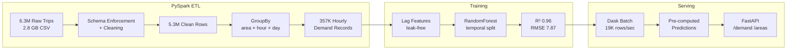

<div class="portfolio-page" markdown="1">

<div class="portfolio-hero" markdown="1">
<canvas data-neural-field="editorial" aria-hidden="true"></canvas>
<span class="portfolio-eyebrow">Demand forecasting pipeline</span>

# ChicagoTaxi Demand Pipeline

Process 6.3 million taxi trips into hourly demand predictions — the data engineering complement to the portfolio's online inference services.

<div class="portfolio-actions" markdown="1">
[Technical evidence](../technical-evidence.md){ .portfolio-button }
</div>
</div>

<div class="portfolio-stat-strip" markdown="1">
<div class="portfolio-stat">
<small>Data volume</small>
<strong>6.3M rows</strong>
<span>Chicago taxi trips processed into hourly demand records.</span>
</div>
<div class="portfolio-stat">
<small>Model quality</small>
<strong>R2 0.96</strong>
<span>Temporal and spatial lag features explain most variance.</span>
</div>
<div class="portfolio-stat">
<small>Compression</small>
<strong>2.8 GB -> 95 MB</strong>
<span>Columnar Parquet output with snappy compression.</span>
</div>
<div class="portfolio-stat">
<small>Batch scoring</small>
<strong>19K rows/s</strong>
<span>Dask prediction path for scheduled workloads.</span>
</div>
</div>

<div class="portfolio-media portfolio-media--project-hero" markdown="1">
<video autoplay muted loop playsinline controls preload="metadata" poster="../../media/videos/chicagotaxi-api-demo-poster.jpg" aria-label="ChicagoTaxi Pipeline API demo clip">
  <source src="../../media/videos/chicagotaxi-api-demo.mp4" type="video/mp4">
</video>
</div>

## The Problem

Chicago has 77 community areas, each with different taxi demand patterns by hour, day, and season. Predicting hourly demand per area enables driver allocation optimization. The dataset is 2.8 GB (too large for pandas), requiring distributed processing.

## Business Translation

<div class="portfolio-card-grid" markdown="1">
<div class="portfolio-card" markdown="1">
<small>Problem</small>
<h3>Demand changes by place and time</h3>
<p>Driver allocation needs area/hour forecasts, not a single city-wide demand
number.</p>
</div>

<div class="portfolio-card" markdown="1">
<small>Decision</small>
<h3>Separate ETL from serving</h3>
<p>PySpark handles heavy historical processing; FastAPI serves precomputed
predictions so requests stay lightweight.</p>
</div>

<div class="portfolio-card" markdown="1">
<small>Impact</small>
<h3>Large data becomes usable</h3>
<p>Millions of raw trips become compact hourly demand records that can support
planning or downstream dashboards.</p>
</div>

<div class="portfolio-card" markdown="1">
<small>Trade-off</small>
<h3>Batch realism over live inference</h3>
<p>The API avoids request-time model inference because this workload is better
served as a scheduled batch prediction problem.</p>
</div>
</div>

## Architecture



## Why PySpark + Dask

| Stage | Tool | Reason |
|-------|------|--------|
| ETL | PySpark | Schema enforcement, distributed cleaning, partitioned Parquet export |
| Aggregation | PySpark | GroupBy over 5.3M rows into 357K hourly demand records |
| Batch Predict | Dask | Parallel inference across 4 partitions (19K rows/sec) |
| Serving | FastAPI | Query pre-computed predictions by area/hour |

pandas would OOM on the full CSV. PySpark handles the heavy ETL; Dask handles the embarrassingly parallel batch prediction. FastAPI serves the pre-computed results — no model inference at request time.

## Engineering Trade-Off

<div class="portfolio-callout" markdown="1">
<strong>Chosen:</strong> PySpark ETL, Dask batch prediction and FastAPI lookup
serving.
<strong>Rejected:</strong> forcing online model inference into a demand pipeline
where precomputed forecasts are simpler, cheaper and easier to operate.

The reliability mindset is the same as in the
[BankChurn debugging deep dive](bankchurn-debugging.md): match the serving
pattern to the workload instead of using one architecture everywhere.
</div>

## Code Review Shortcuts

<div class="portfolio-actions" markdown="1">
[FastAPI app](https://github.com/DuqueOM/ML-MLOps-Portfolio/blob/main/ChicagoTaxi-Demand-Pipeline/app/fastapi_app.py){ .portfolio-button .portfolio-button--primary }
[Dockerfile](https://github.com/DuqueOM/ML-MLOps-Portfolio/blob/main/ChicagoTaxi-Demand-Pipeline/Dockerfile){ .portfolio-button }
[Batch prediction](https://github.com/DuqueOM/ML-MLOps-Portfolio/blob/main/ChicagoTaxi-Demand-Pipeline/scripts/batch_predict.py){ .portfolio-button }
[Tests](https://github.com/DuqueOM/ML-MLOps-Portfolio/tree/main/ChicagoTaxi-Demand-Pipeline/tests){ .portfolio-button }
[K8s manifest](https://github.com/DuqueOM/ML-MLOps-Portfolio/blob/main/k8s/overlays/gcp/chicagotaxi-deployment.yaml){ .portfolio-button }
</div>

## Pipeline Metrics

| Metric | Value | Context |
|--------|-------|---------|
| Raw rows | 6,364,313 | Chicago Open Data Portal, 2013–2023 |
| Clean rows | 5,369,172 | 15.6% dropped (invalid duration, distance, area) |
| Hourly demand rows | 357,055 | Aggregated by area × hour × day |
| CSV → Parquet | 2.8 GB → 95 MB | 97% compression via columnar + snappy |
| ETL throughput | 4,741 rows/sec | PySpark local[*], 4g driver memory |
| Model R² | 0.9649 | RandomForest with lag features, temporal split |
| RMSE | 7.87 trips | On hourly demand counts |
| Batch prediction | 19,061 rows/sec | Dask, 4 partitions |

## Why R² 0.96 Is Strong

This is a regression problem on aggregated hourly counts. R² 0.9649 means 96.5% of demand variance is explained by temporal + spatial lag features alone — without weather, events, or holiday calendars. RMSE of 7.87 on hourly counts means predictions are off by ~8 trips per hour per area on average. The model benefits from strong temporal periodicity and leak-free lag features (historical counts only).

## Operational

| Metric | Value |
|--------|-------|
| Test Coverage | 91% (122 tests) |
| CI Threshold | 85% |
| Docker Image | 154 MB (`chicagotaxi:v3.6.0`, python:3.11-slim-bookworm) |
| Model Size | ~2 MB (RandomForest, joblib) |
| P50 Latency | 100ms `/demand`, 130ms `/areas` (GCP); 120ms / 130ms (AWS) — through ingress |
| API Endpoints | `/demand`, `/areas`, `/pipeline/status`, `/health`, `/metrics` |

## Data Cleaning Rules

| Rule | Threshold | Rows Affected |
|------|-----------|---------------|
| Trip duration | 60s < t < 86,400s | ~8% |
| Trip distance | 0.1 ≤ d ≤ 500 miles | ~3% |
| Community area | 1 ≤ area ≤ 77 | ~4% |
| Fare range | $0 ≤ fare ≤ $10,000 | <1% |
| Comma stripping | `"1,326"` → `1326` | All numeric fields |

## Live Prediction

| Swagger UI | Demand Prediction |
|:---:|:---:|
|  |  |

## Try It

=== "Demand Query"

    ```bash
    curl -s "http://localhost:8004/demand?area=8&hour=17&day_of_week=4&limit=5" \
      | python3 -m json.tool
    ```

    Expected: Predicted trips for Loop area (#8) at 5pm on Friday — peak demand window.

=== "Top Areas"

    ```bash
    curl -s "http://localhost:8004/areas" | python3 -m json.tool
    ```

    Expected: All 77 community areas ranked by total predicted demand.

=== "Pipeline Status"

    ```bash
    curl -s "http://localhost:8004/pipeline/status" | python3 -m json.tool
    ```

    Expected: ETL metadata — rows processed, model version, last prediction batch timestamp.

=== "Health Check"

    ```bash
    curl -s http://localhost:8004/health | python3 -m json.tool
    ```

📄 [Full Model Card](https://github.com/DuqueOM/ML-MLOps-Portfolio/blob/main/ChicagoTaxi-Demand-Pipeline/model_card.md)

## Related Operating Evidence

- [BankChurn debugging deep dive](bankchurn-debugging.md)
- [Technical evidence overview](../technical-evidence.md)
- [Projects overview](../index.md)

---

*Source: [Chicago Data Portal — Taxi Trips](https://data.cityofchicago.org/Transportation/Taxi-Trips/wrvz-psew)*

</div>
