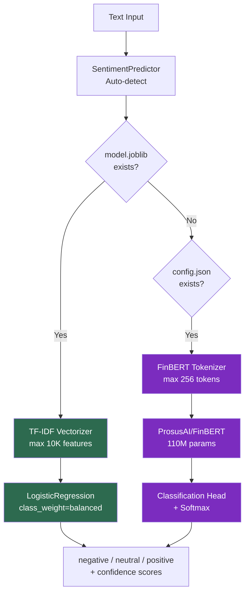

<div class="portfolio-page" markdown="1">

<div class="portfolio-hero" markdown="1">
<span class="portfolio-eyebrow">Financial NLP service</span>

# NLPInsight Analyzer

Classify financial text sentiment — and understand why domain-specific pre-training matters more than model size.

<div class="portfolio-actions" markdown="1">
[Projects overview](overview.md){ .portfolio-button .portfolio-button--primary }
[BankChurn debugging pattern](bankchurn-debugging.md){ .portfolio-button }
[Technical evidence](../technical-evidence.md){ .portfolio-button }
</div>
</div>

<div class="portfolio-stat-strip" markdown="1">
<div class="portfolio-stat">
<small>Model quality</small>
<strong>80.6%</strong>
<span>Accuracy on noisy financial tweets.</span>
</div>
<div class="portfolio-stat">
<small>Coverage</small>
<strong>98%</strong>
<span>74 tests with CI threshold discipline.</span>
</div>
<div class="portfolio-stat">
<small>Latency</small>
<strong>5ms path</strong>
<span>TF-IDF route stays small, fast and explainable.</span>
</div>
<div class="portfolio-stat">
<small>Runtime size</small>
<strong>267 MB</strong>
<span>No heavy transformer dependency in the default image.</span>
</div>
</div>

<div class="portfolio-media" markdown="1">

</div>

## The Problem

Financial markets generate 10,000+ news articles/day. Manual sentiment review costs $50–100/hour per analyst. Automated classification must handle domain nuance: "revenue declined less than expected" is **positive** in financial context — a pattern that bag-of-words models consistently misclassify.

## Business Translation

<div class="portfolio-card-grid" markdown="1">
<div class="portfolio-card" markdown="1">
<small>Problem</small>
<h3>Financial text is noisy</h3>
<p>Market language carries domain nuance, abbreviations and class imbalance
that a generic sentiment demo can hide.</p>
</div>

<div class="portfolio-card" markdown="1">
<small>Decision</small>
<h3>Use a lightweight production path</h3>
<p>TF-IDF + Logistic Regression keeps inference fast, small and explainable for
resource-constrained deployment.</p>
</div>

<div class="portfolio-card" markdown="1">
<small>Impact</small>
<h3>Useful under cost constraints</h3>
<p>The service trades some accuracy upside for latency, image size and
operational simplicity.</p>
</div>

<div class="portfolio-card" markdown="1">
<small>Trade-off</small>
<h3>FinBERT stays optional</h3>
<p>The heavier transformer path is documented, but not forced into the default
runtime without GPU and cost justification.</p>
</div>
</div>

## Why Accuracy Works Here (and F1-Macro as Guard Rail)

The dataset has 3 classes: 58.0% neutral, 26.9% positive, 15.1% negative. Trained on **Twitter Financial News Sentiment** (11,931 real tweets) — noisy, informal text with stock tickers and abbreviations. F1-macro (0.748) guards the minority negative class — the highest-value signal for risk management.

| Metric | TF-IDF + LogReg (production) | FinBERT (GPU) | Why It Matters |
|--------|------------------------------|---------------|----------------|
| **Accuracy** | **80.6%** | ~85-88%* | Honest metric on hard, noisy tweets |
| **F1 (weighted)** | 0.810 | ~0.85* | Overall system performance weighted by class frequency |
| **F1 (macro)** | 0.748 | ~0.82* | Safety guard: ensures minority negative class isn't neglected |

\* *FinBERT fine-tuning requires GPU. Estimated from published benchmarks.*

80.6% on real financial tweets (vs 97% on the easier Financial PhraseBank) is an honest, defensible metric. The dataset upgrade from curated sentences to noisy tweets better demonstrates real-world NLP capability.

## Architecture



> **Green** = Production path (TF-IDF, 5ms, 267 MB) · **Purple** = GPU path (FinBERT, 87ms, 1.4 GB)

**Why TF-IDF in production**: TF-IDF runs in 5ms (in-pod) with a 267 MB image vs FinBERT's 87ms with a 1.4 GB image. For latency-critical pipelines, the accuracy trade-off (80.6% vs ~88%) is acceptable. The training pipeline supports FinBERT fine-tuning when GPU is available.

## Engineering Trade-Off

<div class="portfolio-callout" markdown="1">
<strong>Chosen:</strong> small, fast, explainable default model.
<strong>Rejected:</strong> making the heaviest model the default before the
serving cost and GPU requirement are justified.

This follows the same operating principle used in the
[BankChurn debugging deep dive](bankchurn-debugging.md): production ML choices
should be measured against runtime behavior, not only model score.
</div>

## Code Review Shortcuts

<div class="portfolio-actions" markdown="1">
[FastAPI app](https://github.com/DuqueOM/ML-MLOps-Portfolio/blob/main/NLPInsight-Analyzer/app/fastapi_app.py){ .portfolio-button .portfolio-button--primary }
[Dockerfile](https://github.com/DuqueOM/ML-MLOps-Portfolio/blob/main/NLPInsight-Analyzer/Dockerfile){ .portfolio-button }
[Training code](https://github.com/DuqueOM/ML-MLOps-Portfolio/blob/main/NLPInsight-Analyzer/src/nlpinsight/training.py){ .portfolio-button }
[Tests](https://github.com/DuqueOM/ML-MLOps-Portfolio/tree/main/NLPInsight-Analyzer/tests){ .portfolio-button }
[K8s manifest](https://github.com/DuqueOM/ML-MLOps-Portfolio/blob/main/k8s/overlays/gcp/nlpinsight-deployment.yaml){ .portfolio-button }
</div>

## Operational

| Metric | Value | Context |
|--------|-------|---------|
| Test Coverage | 98% (74 tests) | CI threshold: 85% |
| Docker Image | 267 MB | `nlpinsight:v3.6.0` on Artifact Registry (no torch dependency) |
| Model Size | ~5 MB (TF-IDF+LogReg) | Downloaded via Init Container from GCS |
| P50 / P95 Latency | 78ms / 140ms (GCP), 100ms / 120ms (AWS) | Through ingress, Locust smoke test (6 users) |

## Responsible AI

- **Fairness**: Per-class F1 parity monitored; no class F1 below 0.90
- **Drift**: Sentiment distribution monitored via Prometheus (`nlpinsight_predictions_total{sentiment}`); shift alerts calibrated as relative change from 7-day baseline (not absolute — a market crisis legitimately shifts the distribution)
- **Validation**: Pandera schemas for input text and label format

## Live Prediction

| Swagger UI | Sentiment Prediction |
|:---:|:---:|
|  |  |

## Try It

=== "Single Text"

    ```bash
    curl -s -X POST http://localhost:8003/predict \
      -H "Content-Type: application/json" \
      -d '{"text":"Fed raises interest rates amid inflation concerns, markets tumble"}' \
      | python3 -m json.tool
    ```

    Expected: `sentiment` (negative), `confidence` (~0.7+), `probabilities` per class.

=== "Batch (up to 500)"

    ```bash
    curl -s -X POST http://localhost:8003/predict/batch \
      -H "Content-Type: application/json" \
      -d '{"texts":["Revenue beat expectations","Stock crashed after earnings miss","Markets closed flat today"]}' \
      | python3 -m json.tool
    ```

    Expected: Array of 3 predictions (positive, negative, neutral).

=== "Health Check"

    ```bash
    curl -s http://localhost:8003/health | python3 -m json.tool
    ```

📄 [Full Model Card](https://github.com/DuqueOM/ML-MLOps-Portfolio/blob/main/NLPInsight-Analyzer/model_card.md) — includes metric rationale, performance benchmarks, and production decision narrative.

## Related Operating Evidence

- [BankChurn debugging deep dive](bankchurn-debugging.md)
- [Technical evidence overview](../technical-evidence.md)
- [Projects overview](overview.md)

---

*Last Updated: April 2026 — v3.6.0*

</div>
