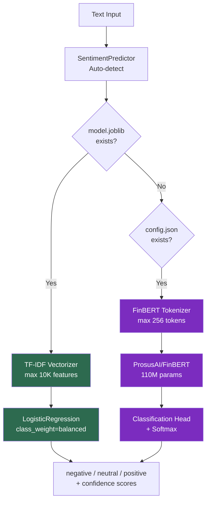

# NLPInsight Analyzer

Classify financial text sentiment — and understand why domain-specific pre-training matters more than model size.


## The Problem

Financial markets generate 10,000+ news articles/day. Manual sentiment review costs $50–100/hour per analyst. Automated classification must handle domain nuance: "revenue declined less than expected" is **positive** in financial context — a pattern that bag-of-words models consistently misclassify.

## Why Accuracy Works Here (and F1-Macro as Guard Rail)

The dataset has 3 classes: 58.0% neutral, 26.9% positive, 15.1% negative. Trained on **Twitter Financial News Sentiment** (11,931 real tweets) — noisy, informal text with stock tickers and abbreviations. F1-macro (0.748) guards the minority negative class — the highest-value signal for risk management.

| Metric | TF-IDF + LogReg (production) | FinBERT (GPU) | Why It Matters |
|--------|------------------------------|---------------|----------------|
| **Accuracy** | **80.6%** | ~85-88%* | Honest metric on hard, noisy tweets |
| **F1 (weighted)** | 0.810 | ~0.85* | Overall system performance weighted by class frequency |
| **F1 (macro)** | 0.748 | ~0.82* | Safety guard: ensures minority negative class isn't neglected |

\* *FinBERT fine-tuning requires GPU. Estimated from published benchmarks.*

80.6% on real financial tweets (vs 97% on the easier Financial PhraseBank) is an honest, defensible metric. The dataset upgrade from curated sentences to noisy tweets better demonstrates real-world NLP capability.

## Architecture



> **Green** = Production path (TF-IDF, 5ms, 267 MB) · **Purple** = GPU path (FinBERT, 87ms, 1.4 GB)

**Why TF-IDF in production**: TF-IDF runs in 5ms (in-pod) with a 267 MB image vs FinBERT's 87ms with a 1.4 GB image. For latency-critical pipelines, the accuracy trade-off (80.6% vs ~88%) is acceptable. The training pipeline supports FinBERT fine-tuning when GPU is available.

## Operational

| Metric | Value | Context |
|--------|-------|---------|
| Test Coverage | 98% (74 tests) | CI threshold: 85% |
| Docker Image | 267 MB | `nlpinsight:v3.5.0` on Artifact Registry (no torch dependency) |
| Model Size | ~5 MB (TF-IDF+LogReg) | Downloaded via Init Container from GCS |
| P50 / P95 Latency | 5ms / 15ms | In-pod (GKE), zero network overhead |

## Responsible AI

- **Fairness**: Per-class F1 parity monitored; no class F1 below 0.90
- **Drift**: Sentiment distribution monitored via Prometheus (`nlpinsight_predictions_total{sentiment}`); shift alerts calibrated as relative change from 7-day baseline (not absolute — a market crisis legitimately shifts the distribution)
- **Validation**: Pandera schemas for input text and label format

## Live Prediction

| Swagger UI | Sentiment Prediction |
|:---:|:---:|
|  |  |

## Try It

=== "Single Text"

    ```bash
    curl -s -X POST http://localhost:8003/predict \
      -H "Content-Type: application/json" \
      -d '{"text":"Fed raises interest rates amid inflation concerns, markets tumble"}' \
      | python3 -m json.tool
    ```

    Expected: `sentiment` (negative), `confidence` (~0.7+), `probabilities` per class.

=== "Batch (up to 500)"

    ```bash
    curl -s -X POST http://localhost:8003/predict/batch \
      -H "Content-Type: application/json" \
      -d '{"texts":["Revenue beat expectations","Stock crashed after earnings miss","Markets closed flat today"]}' \
      | python3 -m json.tool
    ```

    Expected: Array of 3 predictions (positive, negative, neutral).

=== "Health Check"

    ```bash
    curl -s http://localhost:8003/health | python3 -m json.tool
    ```

📄 [Full Model Card](https://github.com/DuqueOM/ML-MLOps-Portfolio/blob/main/NLPInsight-Analyzer/model_card.md) — includes metric rationale, performance benchmarks, and production decision narrative.

---

*Last Updated: March 2026 — v3.5.3*
