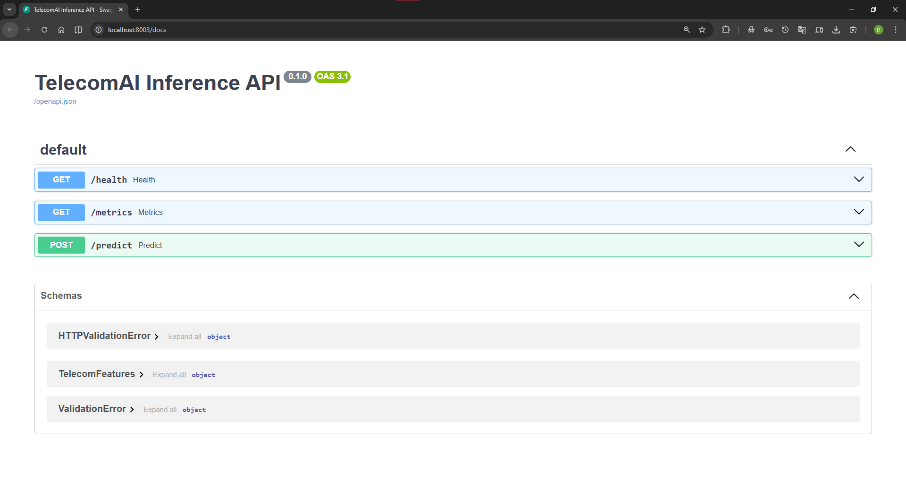
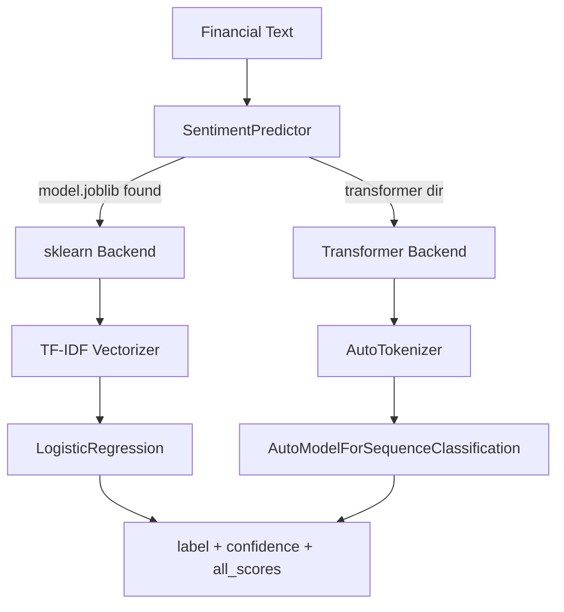
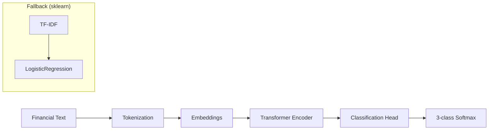

# NLPInsight Analyzer

Financial sentiment analysis powered by NLP.



## Overview

**NLPInsight Analyzer** performs sentiment analysis on financial text, classifying statements as positive, neutral, or negative. It demonstrates a dual-backend inference engine supporting both HuggingFace transformers (production) and sklearn/TF-IDF pipelines (lightweight demo).

## Model Performance

### Production Metrics (Financial PhraseBank)

| Metric | Transformer | TF-IDF Baseline | Description |
|--------|-------------|-----------------|-------------|
| **Accuracy** | ~85% | ~75% | Overall classification accuracy |
| **F1 (macro)** | ~0.82 | ~0.70 | Macro-averaged F1 score |
| **Labels** | 3 | 3 | negative, neutral, positive |

### Dual Backend Architecture



### MLflow Experiments

| Run | Model | Test Accuracy | Purpose |
|-----|-------|---------------|---------|
| NLP-1_TF-IDF_Baseline | TF-IDF + LogReg | 0.75 | Lightweight baseline |
| **NLP-2_DistilBERT** | **DistilBERT fine-tuned** | **0.85** | **Production model** |

### Operational Metrics

| Metric | Value | Description |
|--------|-------|-------------|
| **Test Coverage** | 95% | 59 tests ([Codecov verified](https://app.codecov.io/gh/DuqueOM/ML-MLOps-Portfolio)) |
| **P95 Latency** | <100ms | Inference time (sklearn) |
| **Docker Image** | 2.05 GB | CPU-only (torch from pytorch.org/whl/cpu) |
| **Model Size** | 316 KB (sklearn) / ~260 MB (transformer) | Serialized pipeline |

## Quick Start

### Using Docker

```bash
cd NLPInsight-Analyzer
docker build -t ml-portfolio-nlpinsight:latest .
docker run -p 8003:8000 ml-portfolio-nlpinsight:latest
```

### API Access

http://localhost:8003/docs

## API Reference

### Predict Endpoint

**POST** `/predict`

```bash
curl -X POST "http://localhost:8003/predict" \
  -H "Content-Type: application/json" \
  -d '{"text": "Revenue growth exceeded expectations this quarter."}'
```

**Response:**

```json
{
  "prediction": {
    "label": "positive",
    "confidence": 0.54,
    "all_scores": {
      "negative": 0.12,
      "neutral": 0.34,
      "positive": 0.54
    }
  },
  "model": "distilbert-base-uncased",
  "inference_time_ms": 100.1
}
```

## Model Architecture



## Configuration

```yaml
# configs/config.yaml
data:
  train_path: "data/raw/train.csv"
  target_column: "sentiment"

model:
  name: "distilbert-base-uncased"
  max_length: 256
  num_labels: 3
```

## Project Structure

```
NLPInsight-Analyzer/
├── src/nlpinsight/
│   ├── __init__.py
│   ├── inference.py      # Dual backend (transformer + sklearn)
│   ├── training.py       # Model training
│   ├── prediction.py     # Batch inference
│   └── evaluation.py     # Metrics
├── app/
│   └── fastapi_app.py    # REST API
├── tests/
├── configs/
└── Dockerfile            # Multi-stage, torch CPU-only
```

## Production Deployment (Multi-Cloud)

**Deployed on both GCP (GKE) and AWS (EKS)** with identical configuration.

## Known Limitations

1. **Financial Domain**: Trained on Financial PhraseBank (2,264 samples)
2. **English Only**: No multilingual support yet
3. **Short Text**: Optimized for sentences, not full documents

## Related Documentation

- [Model Card](https://github.com/DuqueOM/ML-MLOps-Portfolio/blob/main/NLPInsight-Analyzer/models/model_card.md)
- [API Reference](../api/rest-apis.md)
- [Architecture Overview](../architecture/overview.md)
- [Deployment Guide](../operations/deployment.md)

---

**Last Updated**: March 2026
