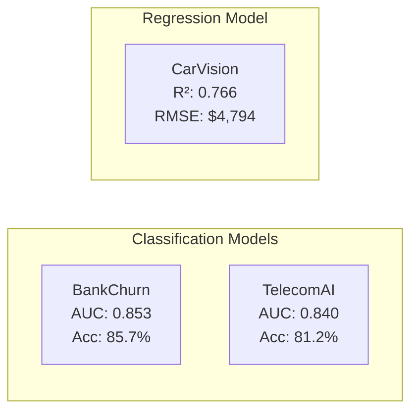

# Projects Overview

The ML-MLOps Portfolio features three production-ready machine learning projects, each demonstrating different aspects of the ML lifecycle.

## Project Comparison

| Aspect | BankChurn | CarVision | TelecomAI |
|--------|-----------|-----------|-----------|
| **Problem Type** | Binary Classification | Regression | Binary Classification |
| **Target** | Customer Churn | Vehicle Price | Plan Upgrade |
| **Model** | VotingClassifier | RandomForest | VotingClassifier |
| **Primary Metric** | AUC-ROC: 0.853 | R²: 0.766 | AUC-ROC: 0.840 |
| **Test Coverage** | 78% | 96% | 96% |
| **Interface** | REST API | REST API + Dashboard | REST API |

## Performance Summary



## Architecture Patterns

All projects follow consistent architectural patterns:

```
project/
├── src/<package>/        # Core Python package
│   ├── __init__.py
│   ├── training.py       # Model training logic
│   ├── prediction.py     # Inference logic
│   ├── evaluation.py     # Metrics computation
│   └── config.py         # Pydantic configuration
├── app/
│   └── fastapi_app.py    # REST API
├── tests/                # Comprehensive test suite
├── configs/              # YAML configuration
├── models/               # Trained model artifacts
└── Dockerfile            # Multi-stage Docker build
```

## Quick Links

- [BankChurn Predictor](bankchurn.md) - Customer churn prediction for banking
- [CarVision Market Intelligence](carvision.md) - Vehicle price prediction with dashboard
- [TelecomAI Customer Intelligence](telecom.md) - Plan recommendation system

---

!!! tip "Which project to explore first?"
    - **For API focus**: Start with BankChurn (cleanest API design)
    - **For visualization**: Start with CarVision (Streamlit dashboard)
    - **For ensemble methods**: Start with TelecomAI (complex voting classifier)
