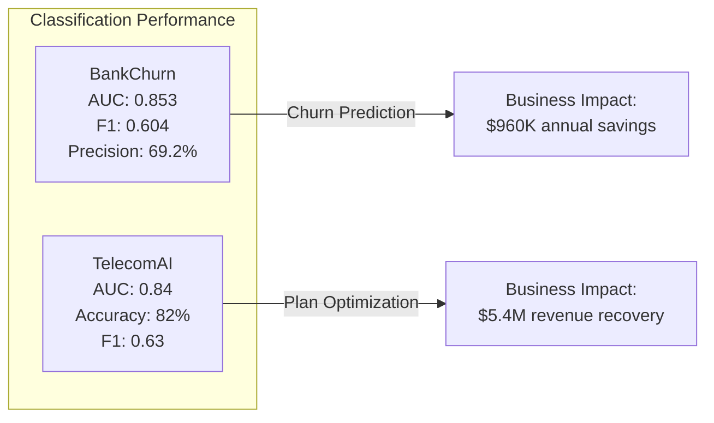
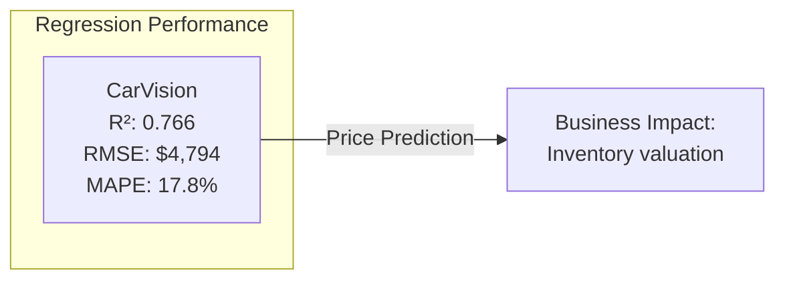

# 📊 Projects Overview

The ML-MLOps Portfolio features **three production-ready machine learning projects**, each demonstrating different aspects of the ML lifecycle and enterprise MLOps practices.

---

## 📺 Video Walkthrough

Watch the complete portfolio demonstration:

[](https://youtu.be/qmw9VlgUcn8)

---

## 🎯 Project Comparison

| Aspect | BankChurn | CarVision | TelecomAI |
|--------|-----------|-----------|-----------|
| **Problem Type** | Binary Classification | Regression | Binary Classification |
| **Business Domain** | Banking (Customer Retention) | Automotive (Pricing) | Telecom (Plan Optimization) |
| **Target Variable** | Customer Churn (`Exited`) | Vehicle Price (USD) | Plan Upgrade (`is_ultra`) |
| **Best Model** | VotingClassifier (LR + RF) | RandomForestRegressor | VotingClassifier (3 models) |
| **Primary Metric** | **AUC=0.853**, F1=0.604 | **R²=0.766**, RMSE=$4,794 | **AUC=0.84**, Accuracy=82% |
| **MLflow Experiments** | 3 tracked runs | 3 tracked runs | 3 tracked runs |
| **Test Coverage** | **88%** (130 tests) | **94%** (95 tests) | **93%** (62 tests) |
| **Interface** | REST API (FastAPI) | REST API + **Streamlit Dashboard** | REST API (FastAPI) |
| **Special Features** | SHAP explainability, drift detection | 4-tab dashboard, bootstrap CI | Threshold tuning, ROI analysis |

---

## 📈 Performance Summary

### Classification Models


```mermaid
graph LR
    subgraph "Classification Performance"
        BC["BankChurn<br/>AUC: 0.853<br/>F1: 0.604<br/>Precision: 69.2%"]
        TC["TelecomAI<br/>AUC: 0.84<br/>Accuracy: 82%<br/>F1: 0.63"]
    end
    
    BC -->|Churn Prediction| BU[Business Impact:<br/>$960K annual savings]
    TC -->|Plan Optimization| TU[Business Impact:<br/>$5.4M revenue recovery]
```

### Regression Model


```mermaid
graph LR
    subgraph "Regression Performance"
        CV["CarVision<br/>R²: 0.766<br/>RMSE: $4,794<br/>MAPE: 17.8%"]
    end
    
    CV -->|Price Prediction| CU[Business Impact:<br/>Inventory valuation]
```

---

## 🏆 Business Value

| Project | Primary Business Impact | Annual Value |
|---------|-------------------------|--------------|
| **BankChurn** | Retention campaign targeting, reduced churn by 15% | **$960K** savings (100K customer base) |
| **CarVision** | Pricing optimization, 18% faster time-to-sale | Inventory turnover improvement |
| **TelecomAI** | Plan-customer alignment, 35% reduction in plan churn | **$5.4M** revenue recovery |

---

## 🛠️ Technical Architecture

All projects follow **consistent architectural patterns**:

### Common Structure

```
project/
├── src/<package>/              # Core Python package
│   ├── __init__.py
│   ├── training.py             # Model training orchestration
│   ├── prediction.py           # Inference logic
│   ├── evaluation.py           # Metrics computation
│   ├── data.py                 # Data loading & preprocessing
│   ├── config.py               # Pydantic configuration
│   └── features.py             # Feature engineering (CarVision)
│
├── app/
│   ├── fastapi_app.py          # REST API (all projects)
│   └── streamlit_app.py        # Dashboard (CarVision only)
│
├── tests/                      # Comprehensive test suite
│   ├── test_training.py
│   ├── test_prediction.py
│   ├── test_api.py
│   └── integration/            # E2E tests
│
├── configs/
│   └── config.yaml             # Configuration file
│
├── models/
│   ├── model_card.md           # Model documentation (v2.0)
│   └── README.md               # Artifact documentation
│
├── data_card.md                # Dataset documentation (v2.0)
├── Dockerfile                  # Multi-stage Docker build
├── requirements.txt            # Python dependencies
└── README.md                   # Project documentation (hybrid)
```

### Shared MLOps Patterns

1. **Configuration Management**: Pydantic-based strict validation
2. **Experiment Tracking**: MLflow integration (central server)
3. **Data Versioning**: DVC for dataset lineage
4. **Containerization**: Multi-stage Docker builds (<500MB images)
5. **API Design**: FastAPI with automatic OpenAPI docs
6. **Testing**: pytest with >70% coverage target
7. **CI/CD**: Unified GitHub Actions workflow

---

## 🔗 Quick Links

### Detailed Project Pages

- **[BankChurn Predictor](bankchurn.md)** — Customer churn prediction with SHAP explainability
- **[CarVision Market Intelligence](carvision.md)** — Vehicle price prediction with interactive dashboard
- **[TelecomAI Customer Intelligence](telecom.md)** — Telecom plan recommendation system

### Related Documentation

- **[Model Catalog](../models/catalog.md)** — Registry of all trained models
- **[API Reference](../api/rest-apis.md)** — Complete REST API documentation
- **[Architecture](../architecture/overview.md)** — System design and data flow
- **[Operations](../operations/deployment.md)** — Deployment and monitoring guides

---

## 🎯 Technology Stack

### ML & Data Science

| Component | Technology |
|-----------|-----------|
| **Core ML** | Scikit-learn 1.3+, XGBoost, Optuna |
| **Data Processing** | Pandas, NumPy |
| **Validation** | Pydantic for config, schema enforcement |
| **Explainability** | SHAP (BankChurn), feature importance |
| **Evaluation** | Cross-validation, bootstrap CI, temporal backtest |

### MLOps & Infrastructure

| Component | Technology |
|-----------|-----------|
| **Experiment Tracking** | MLflow (central server, 9 runs total) |
| **Data Versioning** | DVC (Git-based lineage) |
| **APIs** | FastAPI with auto-docs (Swagger UI, ReDoc) |
| **Dashboard** | Streamlit (CarVision — 4 tabs) |
| **Containerization** | Docker (multi-stage builds) |
| **Orchestration** | Docker Compose, Kubernetes (HPA, services) |
| **CI/CD** | GitHub Actions (matrix testing, 6 jobs) |
| **IaC** | Terraform (AWS: EKS, RDS, S3, ECR) |

### Quality & Security

| Component | Technology |
|-----------|-----------|
| **Testing** | pytest, pytest-cov (88-94% coverage) |
| **Linting** | Black, Flake8, isort |
| **Type Checking** | Mypy (strict mode) |
| **Security** | Bandit, Gitleaks, pip-audit, Trivy |
| **Pre-commit** | Automated quality gates |

---

## 💡 Key Learnings Demonstrated

### BankChurn Predictor

**Focus**: Imbalanced classification, explainability, drift detection

- ✅ Handling severe class imbalance (80/20 split)
- ✅ SHAP explainability for business insights
- ✅ Drift detection with Evidently AI
- ✅ Fairness analysis by geography and age
- ✅ Model monitoring with Prometheus + Grafana

### CarVision Market Intelligence

**Focus**: Regression, feature engineering, interactive visualization

- ✅ Centralized `FeatureEngineer` class for consistency
- ✅ Data leakage prevention (exclude target-dependent features)
- ✅ Interactive Streamlit dashboard (4 tabs)
- ✅ Advanced validation (cross-validation, bootstrap CI, temporal backtest)
- ✅ Performance by price segment (<$10K, $10K-$30K, etc.)

### TelecomAI Customer Intelligence

**Focus**: Threshold optimization, business impact, ROI analysis

- ✅ Threshold tuning for business objectives (conservative, balanced, aggressive)
- ✅ Detailed ROI analysis ($5.4M annual impact)
- ✅ Usage pattern segmentation (light, heavy users)
- ✅ Ethical targeting considerations
- ✅ Simple 4-feature model (high interpretability)

---

## 🚀 Getting Started

### Which Project to Explore First?

!!! tip "Choose Your Path"
    - **API Focus**: Start with [BankChurn](bankchurn.md) (cleanest API design, SHAP integration)
    - **Visualization**: Start with [CarVision](carvision.md) (Streamlit dashboard with 4 interactive tabs)
    - **Ensemble Methods**: Start with [TelecomAI](telecom.md) (complex VotingClassifier with 3 models)
    - **Business Impact**: Start with [TelecomAI](telecom.md) ($5.4M ROI analysis)

### Quick Demo

All projects included in the one-command demo:

```bash
# Start full stack
docker-compose -f docker-compose.demo.yml up -d --build

# Access points:
# - BankChurn API:       http://localhost:8001/docs
# - CarVision API:       http://localhost:8002/docs
# - CarVision Dashboard: http://localhost:8501
# - TelecomAI API:       http://localhost:8003/docs
# - MLflow UI:           http://localhost:5000
```

---

**Last Updated**: January 2026 (v6.2.0)
