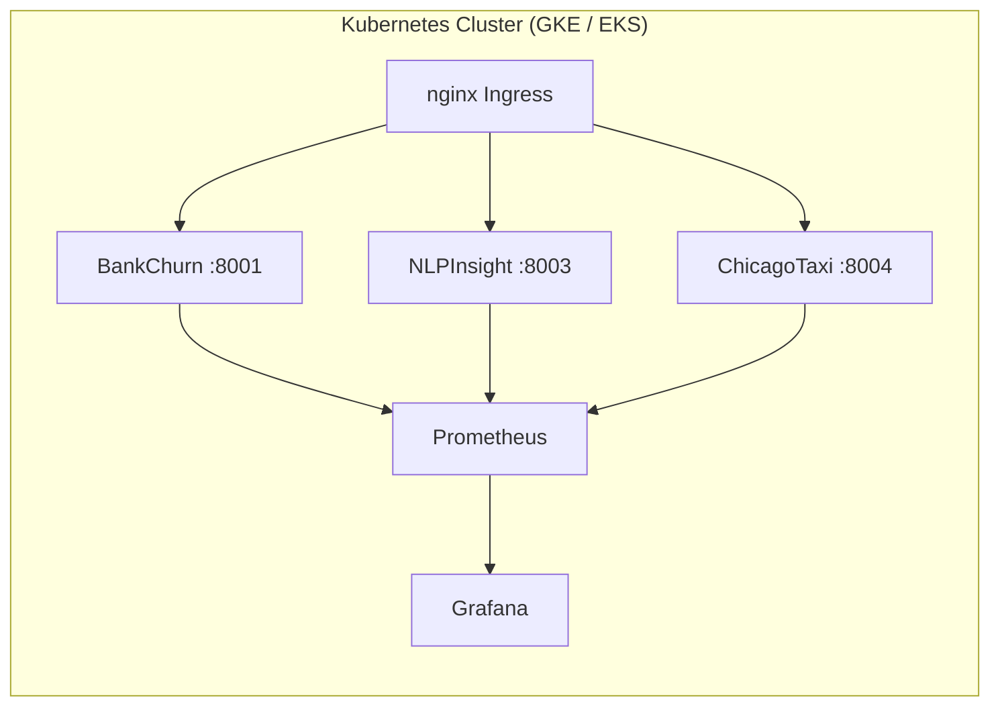

# Projects Overview

Three ML systems built end-to-end: trained, containerized, deployed on Kubernetes, and monitored in production.

## System Architecture

```mermaid
graph LR
    subgraph "Kubernetes Cluster (GKE / EKS)"
        ING[nginx Ingress] --> BC[BankChurn :8001]
        ING --> NLP[NLPInsight :8003]
        ING --> CT[ChicagoTaxi :8004]
        BC --> PROM[Prometheus]
        NLP --> PROM
        CT --> PROM
        PROM --> GRAF[Grafana]
    end
```

## Comparison

| Aspect | BankChurn | NLPInsight | ChicagoTaxi |
|--------|-----------|------------|-------------|
| **Domain** | Banking — customer churn | Finance — sentiment | Urban mobility — demand |
| **Algorithm** | StackingClassifier (RF+GB+XGB+LGB→LR) | TF-IDF + LogReg / FinBERT | PySpark ETL + RandomForest |
| **Primary Metric** | AUC 0.87 | Accuracy 80.6% | R² 0.9649 |
| **Why This Metric** | Imbalanced (20% churn): AUC ranks correctly | 3-class finance text: Accuracy + F1 for per-class balance | Continuous demand: R² captures variance explained |
| **Latency (p50)** | 200ms (GCP) / 110ms (AWS) | 78ms (GCP) / 100ms (AWS) | 100ms (GCP) / 120ms (AWS) |
| **Docker Image** | 490 MB | 2.1 GB | 382 MB |
| **Tests / Coverage** | 199 / 90% | 74 / 98% | 22 / 91% |
| **Key Feature** | SHAP explainability | Dual-backend auto-detection | 6.3M row PySpark pipeline |

## Live Evidence — Multi-Cloud

| GKE Workloads (GCP) | EKS Workloads (AWS) |
|:---:|:---:|
|  |  |

| kubectl Pods (GCP) | kubectl Pods (AWS) | Resource Usage |
|:---:|:---:|:---:|
|  |  |  |

## API Predictions — Live

*SHAP explainability, sentiment analysis, and demand forecasting — all running on Kubernetes.*

| BankChurn SHAP | NLPInsight Sentiment | ChicagoTaxi Demand |
|:---:|:---:|:---:|
|  |  |  |

## Architecture Decisions

Each project makes deliberate trade-offs documented in [ADRs](../architecture/decisions.md):

- **BankChurn**: StackingClassifier over simpler models for +5 AUC points; KernelExplainer for SHAP (4.5s latency accepted for explainability)
- **NLPInsight**: TF-IDF for production (5ms), FinBERT available for GPU environments
- **ChicagoTaxi**: Leak-free lag features with temporal split validation; Dask for batch serving

## Links

- [BankChurn Predictor](bankchurn.md) — threshold tuning, cost analysis, SHAP explainability
- [NLPInsight Analyzer](nlpinsight.md) — TF-IDF production / FinBERT GPU, dual backend
- [ChicagoTaxi Demand Pipeline](chicagotaxi.md) — PySpark ETL, Dask batch prediction, 6.3M rows

---

*Last Updated: March 2026 — v3.5.3*
