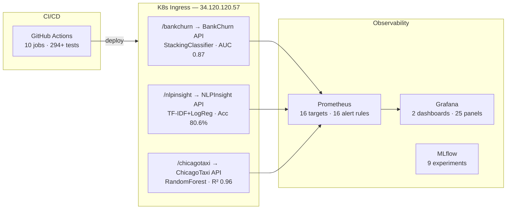

# Projects Overview

Three ML systems built end-to-end: trained, containerized, deployed on Kubernetes, and monitored in production.

## System Architecture

```mermaid
flowchart LR
    subgraph Ingress ["K8s Ingress — 34.120.120.57"]
        direction TB
        BC["/bankchurn → BankChurn API\nStackingClassifier · AUC 0.87"]
        NLP["/nlpinsight → NLPInsight API\nTF-IDF+LogReg · Acc 80.6%"]
        CT["/chicagotaxi → ChicagoTaxi API\nRandomForest · R² 0.96"]
    end

    subgraph Observe ["Observability"]
        PROM[Prometheus\n16 targets · 16 alert rules]
        GRAF[Grafana\n2 dashboards · 25 panels]
        MLF[MLflow\n9 experiments]
    end

    BC & NLP & CT --> PROM
    PROM --> GRAF

    subgraph CI ["CI/CD"]
        GHA[GitHub Actions\n10 jobs · 294+ tests]
    end

    GHA --> |deploy| Ingress
```

## Comparison (v3.5.0)

| Aspect | BankChurn | NLPInsight | ChicagoTaxi |
|--------|-----------|------------|-------------|
| **Domain** | Banking (Retention) | Finance (Sentiment) | Transportation (Demand) |
| **Type** | Binary Classification | Multi-class Classification | Batch Pipeline |
| **Algorithm** | StackingClassifier (RF+GB+XGB+LGB→LR) | TF-IDF + LogReg (prod) / FinBERT (GPU) | PySpark ETL + RandomForest |
| **Primary Metric** | AUC 0.87 | Acc 80.6% | R² 0.96 |
| **Why This Metric** | 20% churn rate makes accuracy deceptive; AUC measures rank-ordering | 3-class on noisy tweets; F1-macro (0.748) guards minority negative class | Hourly demand counts; R² captures temporal periodicity |
| **Tests** | 199 | 74 | 22 |
| **Coverage** | 90% | 98% | 91% |
| **In-Pod Latency** | 103ms p50 | 5ms p50 | 75ms p50 |
| **Docker Image** | 342 MB | 267 MB | 154 MB |

Each project page explains the business problem, metric rationale, and cost of being wrong.

## Live Evidence

| GKE Workloads Running | Grafana ML Dashboard |
|:---:|:---:|
|  |  |
| *6 pods: 3 ML APIs + Prometheus + Grafana + MLflow* | *Request rate, P95 latency, error rate, predictions/hr* |

## Links

- [BankChurn Predictor](bankchurn.md) — threshold tuning, cost analysis, SHAP explainability
- [NLPInsight Analyzer](nlpinsight.md) — TF-IDF production / FinBERT GPU, dual backend
- [ChicagoTaxi Demand Pipeline](chicagotaxi.md) — PySpark ETL, Dask batch prediction, 6.3M rows

---

*Last Updated: March 2026 — v3.5.0*
