# Projects Overview

The ML-MLOps Portfolio features three production-ready machine learning projects, each demonstrating different aspects of the ML lifecycle.

## 📺 Video Demo

[](https://youtu.be/qmw9VlgUcn8)

---

## Project Comparison

| Aspect | BankChurn | CarVision | TelecomAI |
|--------|-----------|-----------|-----------|
| **Problem Type** | Binary Classification | Regression | Binary Classification |
| **Target** | Customer Churn | Vehicle Price | Plan Upgrade |
| **Best Model** | RandomForest (tuned) | RandomForest (tuned) | RandomForest |
| **Primary Metric** | F1=0.64, AUC=0.87 | RMSE=$4,396, R²=0.77 | Acc=0.82, F1=0.63 |
| **MLflow Runs** | 3 experiments | 3 experiments | 3 experiments |
| **Test Coverage** | 79% | 97% | 97% |
| **Interface** | REST API | REST API + Dashboard | REST API |

## Performance Summary

```mermaid
graph LR
    subgraph "Classification Models"
        BC["BankChurn<br/>F1: 0.64<br/>AUC: 0.87"]
        TC["TelecomAI<br/>Acc: 0.82<br/>F1: 0.63"]
    end
    
    subgraph "Regression Model"
        CV["CarVision<br/>R²: 0.77<br/>RMSE: $4,396"]
    end
```



## Architecture Patterns

All projects follow consistent architectural patterns:

```
project/
├── src/<package>/        # Core Python package
│   ├── __init__.py
│   ├── training.py       # Model training logic
│   ├── prediction.py     # Inference logic
│   ├── evaluation.py     # Metrics computation
│   └── config.py         # Pydantic configuration
├── app/
│   └── fastapi_app.py    # REST API
├── tests/                # Comprehensive test suite
├── configs/              # YAML configuration
├── models/               # Trained model artifacts
└── Dockerfile            # Multi-stage Docker build
```

## Quick Links

- [BankChurn Predictor](bankchurn.md) - Customer churn prediction for banking
- [CarVision Market Intelligence](carvision.md) - Vehicle price prediction with dashboard
- [TelecomAI Customer Intelligence](telecom.md) - Plan recommendation system

---

!!! tip "Which project to explore first?"
    - **For API focus**: Start with BankChurn (cleanest API design)
    - **For visualization**: Start with CarVision (Streamlit dashboard)
    - **For ensemble methods**: Start with TelecomAI (complex voting classifier)
